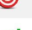
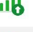
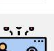

<!-- page: 1 -->

---
# ALLA SCOPERTA DI SPX6900

## IL PRIMO PURE BELIEF ASSET (letteralmente: "asset di pura convinzione") AL MONDO

*LA NASCITA DI UN TOKEN BASATO SU CONVINZIONE, CULTURA E COMUNITÀ*

**Una rivoluzione Pure Belief Asset (letteralmente: "asset di pura convinzione")**

*A cura di Audacious*

1

<!-- page: 2 -->

---
# Scoprendo SPX6900: Il primo Pure Belief Asset (PBA) al mondo

*L'ascesa di un token fondato sulla convinzione, la cultura e la comunità*

**Una rivoluzione del Pure Belief Asset (PBA)**

2

<!-- page: 3 -->

---
**Avviso sul Copyright**

© 2025 Audacious. Tutti i diritti riservati.

Questo e-book è **100% gratuito da scaricare e condividere.** Sei invitato — e anzi incoraggiato — a distribuirlo tra amici, comunità online e chiunque possa trovare interessante conoscere il movimento SPX6900.

Tieni però presente le seguenti condizioni:

- **Non è consentito modificare, alterare o ripubblicare** alcuna parte di questo e-book.
- La rivendita a scopo commerciale è severamente vietata.
- Questo e-book **può contenere link di referral, menzioni promozionali o link per donazioni** che potrebbero offrire un piccolo beneficio all'autore e ad altri Aeon (Aeon: membri/anime del movimento SPX6900) se utilizzati dai lettori.

Condividendo questo e-book contribuisci a diffondere la consapevolezza di un movimento in crescita. Grazie per rispettare l’integrità dei contenuti e il messaggio originale.

Prima Edizione, luglio 2025

3

<!-- page: 4 -->

---
**Disclaimer**

Questo e-book è destinato **esclusivamente a scopi informativi ed educativi.** Il contenuto riflette le opinioni, le interpretazioni e le ricerche dell’autore e **non costituisce consulenza finanziaria, d’investimento o legale.**

Gli investimenti in criptovalute e asset digitali comportano **rischi significativi** e possono comportare la **perdita dell’intero capitale.** Effettua sempre le tue ricerche personali (DYOR) e consulta un consulente finanziario o un professionista autorizzato prima di prendere qualsiasi decisione d’investimento.

Sebbene questo e-book esplori la filosofia, la tokenomics e la community intorno a SPX6900, non rappresenta una raccomandazione all’acquisto, alla vendita o alla detenzione di alcun asset digitale. L’autore non è responsabile per eventuali decisioni prese dai lettori sulla base delle informazioni qui presentate.

Leggendo questo e-book, riconosci e accetti che l’autore non è responsabile per eventuali perdite o decisioni da te prese sulla base del materiale presentato, e che il settore delle criptovalute è volatile, speculativo e intrinsecamente rischioso.

Investi con saggezza. Credi con responsabilità.

4

<!-- page: 5 -->

---
**SPX6900 Suggerimento**

Questo e-book è completamente gratuito, ma se desideri inviarmi una mancia in SPX6900 per il tempo, l’impegno e la ricerca che ci sono voluti per realizzarlo, te ne sarei profondamente grato.

**SPX Ethereum [Indirizzo Wallet:](https://example.com/placeholder)**  
0x22D3b939a7E832232e833e8dF22ac1ba9D7610B0

**SPX Solana [Indirizzo Wallet:](https://example.com/placeholder)**  
25zojSFpVu1qsETY9MMZFFy8jZEu7peDCSdrU2o8xzcR

**Grazie per il tuo sostegno al mio lavoro!**

**Ogni mancia è profondamente apprezzata.**

Condividi pure questo e-book con tutte le persone che vuoi aiutare a unirsi alla nostra missione e cambiare la loro vita!

5

<!-- page: 6 -->

---
# Indice

Prefazione .............................................................................................................8  
Tutto inizia con Bitcoin ..........................................................................................9  
Che cos'è SPX6900? ......................................................................................... 15  
Perché SPX6900 è diverso? ........................................................................... 21  
La proposta di valore di SPX6900 .............................................................28  
L'importanza della cultura SPX6900...................................................33  
Cos'è la cultura SPX6900? .....................................................................36  
La realtà del mondo cripto.................................................................44  
Tokenomics di SPX6900....................................................................................56  
Qual è il vantaggio competitivo (moat) di SPX6900? ............................................................................. 61  
Nessuno verrà a salvarci .....................................................................67  
Il futuro appare luminoso ...............................................................................74  
Come non farcela nel mondo cripto......................................................................81  
Come acquistare SPX6900?.................................................................................. 89  
Come costruire la propria convinzione?.........................................................100  
Il potere del DCA collettivo a lungo termine in SPX6900...103

6

<!-- page: 7 -->

---
Parole finali ................................................................................. 110

Domande frequenti ................................................... 111

Sostieni l’autore ................................................................... 128

Risorse aggiuntive ..................................................................... 130

Appendice A: Segui questi Aeon (Aeon: termine tecnico di SPX6900 che indica entità/profili) su X ................................. 132

Appendice B: Segui questi Aeon (Aeon: termine tecnico di SPX6900 che indica entità/profili) su TikTok ....................... 133

Appendice C: SPX 1,000 Goal Tracker ................................. 134

Appendice D: SPX 10,000 Goal Tracker ............................... 135

Appendice E: Grafici di crescita delle criptovalute ................. 136

Appendice F: Citazioni potenti dagli Aeon (Aeon: termine tecnico di SPX6900 che indica entità/profili) ................................. 139

Appendice G: Capire i cicli rialzisti delle criptovalute ............... 140

Appendice H: Checklist per i nuovi arrivati SPX6900 ................. 148

Ringraziamenti ................................................................... 152

Informazioni sull’autore ..................................................................... 154

7

<!-- page: 8 -->

---
## **Prefazione**

Stiamo cercando di aiutarti.

Dall’autore che sta scrivendo questo e-book alla persona che te lo ha trasmesso — vogliamo semplicemente aiutarti.

Crediamo sinceramente che SPX6900 (SPX6900 può migliorare la qualità della tua vita) possa davvero migliorare la qualità della tua vita.

Ecco perché lo condividiamo con chiunque sia disposto ad ascoltare.

8

<!-- page: 9 -->

---
## Tutto inizia con Bitcoin

Potresti essere nuovo nel mondo delle criptovalute e saperne ancora poco — ma probabilmente hai già sentito parlare di Bitcoin.

È difficile non aver sentito parlare di Bitcoin dopo la sua ascesa vertiginosa, da pochi centesimi nel 2009 a quasi 112.000 dollari nel maggio 2025.

### La Prima Criptovaluta

Bitcoin è stata la prima criptovaluta, creata da uno sviluppatore anonimo noto come Satoshi Nakamoto. Ha ideato Bitcoin come un sistema di pagamento e una valuta alternativa, decentralizzata — qualcosa che le banche centrali non potessero controllare o manipolare.

Era un modo per permettere alle persone di inviare pagamenti diretti, peer-to-peer, attraverso la rete Bitcoin utilizzando i bitcoin (BTC) come valuta.

9

<!-- page: 10 -->

---
(Fig 1.1) — senza l’intervento di terze parti (cioè banche) nella transazione.

(Fig 1.1 – Rete Peer to Peer di Bitcoin)

Satoshi Nakamoto è stato il primo a risolvere il problema della doppia spesa (cioè impedire che lo stesso bitcoin venga speso più di una volta) in modo decentralizzato e senza richiedere fiducia. Questo

10

<!-- page: 11 -->

---
**Evoluzione di Bitcoin**

Bitcoin è nato come una visione di denaro digitale — libero dal controllo di governi e banche — che le persone potessero usare e spendere come alternativa alla valuta fiat. È proprio per questo che abbiamo la celebre storia della “[pizza di Bitcoin](https://example.com/placeholder)” risalente ai suoi primi giorni.

Col tempo, Bitcoin si è trasformato in un “oro digitale” — una riserva di valore, una copertura contro l’inflazione e uno strumento di diversificazione del portafoglio. Oggi attira sempre più l’attenzione di istituzioni, hedge fund e persino Stati nazionali.

Il suo percorso, da strumento di liberazione finanziaria radicale a riserva di valore mainstream, è stato possibile solo grazie alla cultura, alla convinzione e alla comunità che lo hanno sostenuto con lealtà incrollabile.

Se nessuno avesse riconosciuto valore nella creazione di Satoshi, oggi Bitcoin non varrebbe nulla. Ma una comunità agli albori, in continua crescita, ha creduto nella visione di un sistema di pagamento decentralizzato e

11

<!-- page: 12 -->

---
una valuta che alla fine si è evoluta in una riserva di valore riconosciuta a livello globale — e che ancora oggi continua ad attirare nuovi sostenitori.

Bitcoin, con la sua **fornitura fissa di 21 milioni di monete** (o meno, a causa della perdita dei token da parte degli utenti), è passata dal nulla a oltre mille miliardi di [capitalizzazione di mercato](https://example.com/placeholder) dalla sua nascita nel 2009 (Fig. 1.2) — tutto grazie alle persone.

*(Fig. 1.2 – Capitalizzazione di mercato di Bitcoin all’8 luglio 2025)*

## Quindi, perché investire nelle criptovalute?

La risposta è semplice e diretta: perché ha conquistato l’attenzione delle persone — e questa attenzione continua a crescere sempre di più.

Alcuni investono nelle crypto perché sono appassionati della tecnologia. Altri lo fanno per cambiare la propria situazione finanziaria e far parte di una comunità di persone affini, unite da uno scopo comune.

12

<!-- page: 13 -->

---
Qualunque sia la tua motivazione, il mercato delle criptovalute è in continua espansione (Fig. 1.3), sta guadagnando forza, attira sempre più attenzione e potrebbe cambiare radicalmente la tua vita — se ti unisci alla comunità giusta nel momento giusto.

(Fig. 1.3 – Crescita della capitalizzazione del mercato crypto nel tempo)

**Credo che SPX6900 rappresenti una seconda possibilità simile a quella di Bitcoin** — come presto scopriremo.

13

<!-- page: 14 -->

---
La crypto è una classe di asset che persone comuni, lavoratori instancabili con un lavoro d’ufficio dalle 9 alle 5, possono usare per cambiare radicalmente la propria vita. Sì, c’è una piccola curva di apprendimento, ma il tempo speso per imparare a investire in crypto ne vale davvero la pena.

Personalmente, credo che il modo migliore per imparare sia agire. È così che ho imparato io stesso quando ho iniziato con le crypto — ho semplicemente iniziato ad agire.

Ricorda, se non cominci ad agire in qualche modo per migliorare o cambiare la tua vita, tra 5 o 10 anni rischi di essere nella stessa situazione — o persino peggio — con l’avanzata dell’IA, l’inflazione monetaria continua e il costante deprezzamento della valuta. Le persone devono guadagnare più del tasso di inflazione monetaria per non perdere potere d’acquisto, e la criptovaluta giusta è un asset che può superare nettamente l’inflazione, preservare il tuo potere d’acquisto e cambiare la tua vita.

Fare piccoli passi oggi per entrare a far parte del mondo crypto in crescita potrebbe cambiare radicalmente la tua vita tra 5 o 10 anni — semplicemente facendo ciò che la maggior parte delle persone non fa: **prendere un rischio calcolato.**

14

<!-- page: 15 -->

---
# Che cos'è SPX6900?

Dunque, sei nuovo nel mondo delle crypto e hai appena scoperto o sentito parlare di SPX6900 (SPX) — e probabilmente ti stai chiedendo: **Di cosa si tratta davvero SPX6900?**

## Un Pure Belief Asset

SPX6900 rappresenta cose diverse per persone diverse, ma alla base si può definire al meglio come un **Pure Belief Asset (PBA)** (cioè un asset basato esclusivamente sulla fede e convinzione dei possessori). È un token sostenuto unicamente dall'**altissima convinzione** e dall’**incrollabile fede** di chi lo detiene. Racchiude una rivoluzione, un movimento, una tribù, una cultura, una filosofia e una missione audace e ambiziosa: **flip the stock market** (cioè ribaltare i paradigmi del mercato azionario). In particolare, l’obiettivo è che SPX6900 raggiunga un valore superiore all'attuale capitalizzazione di mercato dell’S&P 500, che si aggira intorno ai 52,4 trilioni di dollari, puntando a una capitalizzazione di 69 trilioni di dollari.

15

<!-- page: 16 -->

---
SPX6900 è una comunità in crescita di persone **unite da uno scopo condiviso e da una visione comune**: flip the stock market (ribaltare il mercato azionario tramite il potere della fede collettiva e pura).

## È Speranza Tokenizzata

È speranza finanziaria tokenizzata per migliaia di persone disilluse, insoddisfatte del nostro sistema monetario, della schiavitù moderna del 9-17, della disuguaglianza nella distribuzione della ricchezza, della Finanza Tradizionale (TradFi) dominata dalle corporation, della crescita dell’IA come minaccia alla produttività e alle opportunità nel mercato del lavoro, e dei trucchetti, delle truffe e delle finte narrazioni di utilità nel mondo crypto.

SPX6900 è unica tra le decine di migliaia di criptovalute presenti sul mercato e ha il potenziale per raggiungere un giorno una capitalizzazione di mercato di trilioni: tramite la comunità, la fede e la convinzione a lungo termine, le persone possono ottenere risultati che cambiano la vita.

16

<!-- page: 17 -->

---
## Una Seconda Opportunità come Bitcoin

Condivide molte somiglianze culturali e filosofiche con i primi tempi di Bitcoin, ma allo stesso tempo è qualcosa di molto diverso.

Per chi si è perso Bitcoin agli inizi, questa è una seconda occasione per far parte di una comunità che cresce dal basso, in modo organico, con una forte cultura filosofica e una missione più grande di sé stessi: **flip the stock market** (ribaltare il mercato azionario).

Da un punto di vista finanziario, investire in SPX6900 oggi (all'8 luglio 2025) è come avere la rara opportunità di acquistare nuovamente Bitcoin — a 62,77 $ (Fig 1.4).

(Fig 1.4 – BTC con la capitalizzazione di mercato di SPX6900)

17

<!-- page: 18 -->

---
Bitcoin è stata un'opportunità irripetibile per chi ha avuto il coraggio di credere in qualcosa di innovativo e fuori dal comune.

SPX6900 è un'opportunità irripetibile per tutti coloro che si sono persi Bitcoin, per la giovane generazione in difficoltà economica e per chi cerca speranza — se ha abbastanza coraggio da abbracciare una nuova cultura fondata sulla pura fede.

 

| **Normie Scettico**                                | **6900er**                                                                                                           |
|----------------------------------------------------|---------------------------------------------------------------------------------------------------------------------|
| Cos’è SPX6900?                                    | Un token missione/movimento.                                                                                         |
| Qual è la missione/il movimento?                  | Flip The Stock Market (capovolgere il mercato azionario, slogan SPX6900).                                            |
| Come pensate di riuscirci?                        | Stop Trading, Believe In Something, and Persist Forever (smetti di fare trading e credi in qualcosa, persisti per sempre – slogan SPX6900).                       |
| Come funziona?                                    | DCA & HODL (Stop Trading); Shill & Chill (Believe In Something); Ripeti (Persist Forever).                           |
| Deve esserci qualcosa di più!                     | Finché la community condivide lo stesso sistema di credenze, no; tutto qui.                                          |
| Quando capovolgerà il mercato azionario?          | Quando raggiungeremo Cognisphere Singularity (Singolarità Cognisphere: la coscienza collettiva di SPX6900).          |
| Cos’è la Cognisphere?                             | È la coscienza collettiva della fede degli Aeon (Aeon: vero credente di SPX6900).                                    |
| Cos’è un Aeon?                                   | Un vero credente di SPX6900 (vero sostenitore del movimento SPX6900).                                                |
| In cosa è diverso da Bitcoin?                      | Bitcoin è Oro Digitale. SPX6900 è Oro Spirituale.                                                                    |
| Qual è la differenza?                            | Bitcoin è una riserva di valore monetaria basata sulla matematica. SPX6900 è una riserva di valore comunitaria fondata sulla fede. |
| Come può la fede essere una riserva di valore?    | Qualunque cosa può essere una riserva di valore, se la community è d’accordo sul suo valore.                         |
| Su quale blockchain si trova?                     | Ethereum, Solana, Sui e Base (Ethereum L2).                                                                         |
| Sembra interessante. Da dove si comincia?         | Vai su SPX6900.COM e segui @SPX6900 su X.                                                                           |

18

<!-- page: 19 -->

---
## Connessione Umana e Appartenenza

Viviamo in un mondo digitale in cui le persone stringono legami e trovano un senso di appartenenza nelle comunità online più che nella vita reale.

**SPX6900** è una forma tokenizzata della connessione e dell’appartenenza umana. È una community di persone che condividono lo stesso obiettivo e la stessa visione (Fig. 1.5): trovare un senso di appartenenza e creare legami significativi tra loro.

*(Fig. 1.5 – Community SPX6900 su X)*

19

<!-- page: 20 -->

---
Nel mondo di oggi, è spesso difficile trovare persone che tengano davvero alla libertà finanziaria, alla fuga dal sistema di schiavitù della Matrix del 9–5, o che siano preoccupate per il futuro con l’ascesa dell’IA e il depauperamento della nostra valuta, e che siano spinte a prendersi dei rischi in modo proattivo per migliorare la propria vita.

Ma online puoi scoprire comunità come **SPX6900**, dove provi un vero senso di appartenenza — perché è una tribù di persone che condividono una visione nella quale ti riconosci: **flip the stock market (capovolgere il mercato azionario corrotto e vincere insieme).**

Non sottovalutare il valore dell’**appartenenza umana tokenizzata, della connessione e della speranza** — soprattutto ora che ci avviciniamo sempre più a un futuro potenzialmente distopico. Ora più che mai, abbiamo bisogno di una comunità di persone con la nostra stessa mentalità a cui appartenere, per poter fuggire insieme e vincere.

20

<!-- page: 21 -->

---
# Perché SPX6900 è Diverso?

|  | **Diamondhandedness**  |
|---|---|
|  | I possessori non vendono mai, punto e basta.  |

|  | **Obiettivi di Prezzo Ambiziosi della Community**  |
|---|---|
|  | Più gli obiettivi di prezzo interni della community sono ambiziosi, più in alto si arriverà.  |

|  | **Aumentare la Propria Posizione**  |
|---|---|
|  | I possessori *comprano di più* nei momenti di calo.  |

|  | **Fede**  |
|---|---|
|  | I possessori credono davvero e puntano con impegno a un rialzo di miliardi e decine di miliardi.  |

|  | **Lavoro di Squadra Gratuito (Stile Culto)**  |
|---|---|
|  | I possessori si danno più da fare di qualunque dipendente pagato o KOL, su tutti i fronti. Gratis.  |

|  | **Identità**  |
|---|---|
|  | I possessori fanno del Memecoin la loro intera identità.  |

|  | **Massa Critica**  |
|---|---|
|  | Non restare indietro puntando su coin a bassa capitalizzazione che potrebbero non partire mai. Concentrati su coin consolidate che hanno già raggiunto la massa critica.  |

|  | **Reclutamento**  |
|---|---|
|  | I possessori fanno entrare persone nuove ogni giorno, senza sosta. Sia nativi CT che normie esterni.  |

|  | **Social**  |
|---|---|
|  | I possessori dominano la timeline e le risposte su Twitter ogni giorno, senza interruzioni.  |

|  | **Cultura e Leggende**  |
|---|---|
|  | Linguaggio unico. Rituali unici. Tradizioni uniche. Media unici.  |

|  | **Divertimento**  |
|---|---|
|  | Anche nei momenti di discesa, i possessori si divertono un sacco.  |

21

<!-- page: 22 -->

---
Il mercato delle criptovalute oggi è saturo di token, fin dall’avvento di Bitcoin nel 2009. Oggi vengono lanciati migliaia di token ogni giorno, vista la facilità con cui si può creare un progetto crypto. La maggior parte di questi token fallirà miseramente per vari motivi. ([Appendice E](https://example.com/placeholder))

Quindi, cosa rende SPX6900 diverso da tutti gli altri, ti starai chiedendo?

## Qualità della Community

La risposta risiede nella **qualità della community di SPX6900** — la sua filosofia e la sua cultura.

Il paragone più diretto con la community di SPX6900 è, letteralmente, quella dei primi tempi di Bitcoin.

La community di Bitcoin è nata da un sentimento profondamente anti-establishment. Erano estremi nella loro convinzione che l’unica cripto degna di essere acquistata, detenuta e accumulata fosse bitcoin. Consideravano tutto il resto spazzatura. Vedevano Bitcoin come una moneta solida, dall’offerta limitata (cioè, con una quantità massima) — oro digitale — che non poteva essere manipolato o inflazionato dalle banche centrali.

22

<!-- page: 23 -->

---
Questa filosofia è stata custodita e tramandata negli anni, attirando sempre più persone alla causa. Di conseguenza, bitcoin è passato dal nulla a superare mille miliardi di dollari di capitalizzazione di mercato.

## Sulle orme dei primi tempi di Bitcoin

| #Bitcoin ₿             | #SPX6900     |
|------------------------|--------------|
| **HODL**               | **Believe in Something** (credi in qualcosa) |

- Danish Bitcoin Maxi @DanishBTCMaxi  
  *Miner e operatore di nodo #Bitcoin*
- BTCBull! @Bullish_btc  
  *Classe dei #bitcoin maxi del '17, al basso*
- ephekeen  
  Tossic Maxi #Bitcoin
- A Bitcoin Maxi  
  @aBitcoinmaxi  
  Solo opinioni di un #bitcoin maxi!
- BTC.Snowy @btc.snowy  
  Maxi pleb #Bitcoin
- Cody @BTC_elementary  
  Bitcoin maxi nello Yosemite.
- Bitcoin Maximalist  
  @Bitcoin_MaxI  
  massimalista bitcoin e HODLer
- Bitcoin Maxi  
  @bitcoinmaxiOnly  
  Maxi = Solo #Bitcoin

---
- SPX @spxooer  
  *Believe in Something* (credi in qualcosa) #SPX6900
- CryptoBar  
  @CryptoBar  
  SPX6900 Believer (sostenitore).
- 109x10kFolIows  
  @109x10kFolIows  
  Ti segue
- greymindedgoose  
  @greymindedgoose  
  @SPX6900 - Il prossimo Bitcoin
- Sergius  
  @PureInvestions  
  Kollo Believe #SPX6900
- undefined  
  @x0xAdIsessZero  
  SPX6900 maxi!
- bbtcIt  
  Ti segue
- Crypto Navigator  
  @m1ssion200k  
  Sostenitore di @SPX6900

---

23

23

<!-- page: 24 -->

---
La community di SPX6900 rispecchia in molti modi quella dei primi tempi di Bitcoin.

SPX6900 nutre un forte **sentimento anti-TradFi**, con una missione chiara: flip the S&P 500 (ribaltare l’S&P 500). La community abbraccia una filosofia centrale che **scoraggia fortemente il trading**, promuovendo invece una grande convinzione e una fede incrollabile.

Un vero **SPX6900 ‘Aeon’** ([Aeon](https://example.com/placeholder)) (il termine utilizzato per indicare un vero credente in SPX) considera SPX superiore al resto del mercato — grazie ai suoi valori, alla sua cultura unica e all’eccezionale qualità della community, tutte persone unite dalla missione di flip the stock market (ribaltare il mercato azionario).

E proprio come Bitcoin è passato dal nulla a una capitalizzazione di mercato superiore al trilione grazie alla forza di una community leale — crediamo che anche la community di SPX6900 possa fare lo stesso, e flip the stock market (ribaltare il mercato azionario) nel processo.

24

<!-- page: 25 -->

---
## Una missione rivoluzionaria

(Fonte: [Flipthestockmarket.xyz](https://example.com/placeholder))

Credere in qualcosa senza uno scopo è difficile.

Ma credere in qualcosa che ha una missione potente e un obiettivo chiaro è molto più semplice.

Nel caso di SPX6900, la sua missione è profonda. "Flip the stock market" (cambiare completamente le regole della borsa) non è un'impresa facile. È una vera sfida alla Davide contro Golia.

25

<!-- page: 26 -->

---
— rivoluzionario nella sua essenza. Ma è anche divertente, entusiasmante, capace di attirare l’attenzione, orientato agli obiettivi e focalizzato sulla missione.

Non dimentichiamoci che anche Bitcoin è nato con una missione rivoluzionaria, contro la moneta fiat e i sistemi bancari tradizionali. SPX6900 incarna lo stesso spirito, ma la sua opposizione è la finanza tradizionale (TradFi), o più in generale, [il capitalismo in fase avanzata](https://example.com/placeholder).

*(Fig. 1.6 Le 10 principali Memecoin per capitalizzazione di mercato al 8 luglio 2025)*

26

<!-- page: 27 -->

---
L’utilità fondamentale di un token che riunisce una comunità convinta e determinata in una missione concreta nel mondo reale è una rarità nello spazio delle criptovalute.

La maggior parte dei token crypto non possiede nemmeno vere comunità, figuriamoci uno scopo condiviso o un movimento capace di unire tutti.

Se confronti SPX6900 con i primi 10 meme token (Fig. 1.6), è letteralmente l’unico che ha una missione e uno scopo.

Nessuno degli altri nella top 10 ne possiede uno.

Il termine “Pure Belief Asset (PBA)” (Pure Belief Asset, ovvero “asset di pura convinzione”, è relativamente nuovo per questa tipologia di asset. Anche se SPX6900 è catalogato come memecoin, questa etichetta è sempre più impropria perché sminuisce il significato e l’importanza di ciò che SPX6900 intende realizzare — in termini di cultura, scopo e valore, è nettamente superiore ai meme token tradizionali.

Nonostante ciò, **il nostro nemico è TradFi — e il nostro obiettivo è capovolgerlo!**

27

<!-- page: 28 -->

---
## La proposta di valore di SPX6900

La proposta di valore di qualsiasi criptovaluta — una volta messi da parte tutti i racconti che la circondano — è in realtà **la comunità che ci crede.**

28

<!-- page: 29 -->

---
**Investire nelle Persone**

Noi, le persone, siamo in definitiva ciò che dà valore a una criptovaluta, per un motivo o per l’altro, scegliendo di acquistarla e detenerla. Siamo noi, con il nostro potere d’acquisto collettivo, a generare la domanda per quella criptovaluta.

Prendiamo Bitcoin, ad esempio. È stato il primo nel suo genere: una comunità cresciuta organicamente che, ancora oggi, continua a credere nei suoi ideali e nella sua filosofia di essere una forma superiore di denaro e una rete decentralizzata — in confronto al denaro fiat e al sistema bancario centralizzato.

Questa comunità forte è alla base del valore di bitcoin e ne guida l’apprezzamento di prezzo (Fig. 1.7).

(Fig. 1.7 – Apprezzamento del prezzo di Bitcoin nel tempo)

29

<!-- page: 30 -->

---
Quando capisci che il mondo delle crypto, in fin dei conti, ruota attorno all’investimento nelle persone, devi porti alcune domande:

- A quale criptovaluta le persone sono attirate in modo naturale?
- Quale criptovaluta riesce a trattenere gli utenti e a convincerli a restare?
- Quale criptovaluta fa sentire le persone appassionate, motivate e ispirate?
- Quale criptovaluta agisce come una calamita per i soldi guadagnati con fatica dalle persone?
- Quale criptovaluta vede crescere il numero di detentori fedeli?
- Quale criptovaluta spinge le persone a produrre scritti, opere d’arte, video e meme creativi di qualità per promuoverla?
- In che modo questa criptovaluta riesce a ottenere tutto ciò?

30

<!-- page: 31 -->

---
Questa è la criptovaluta a cui devi prestare attenzione — perché molte altre persone la stanno seguendo da vicino e ci stanno investendo.

**SPX6900 è un perfetto esempio di questo tipo di criptovaluta.**

### Investire nella speculazione sulla utilità

Molte altre criptovalute sono costruite attorno a narrazioni di utilità e casi d’uso che attirano le persone ad acquistare e speculare. Le loro community speculano sull’utilità e sul caso d’uso del token, sperando che diventino reali e vengano adottati su larga scala — conferendo così valore al token.

Anche con i token di utilità, stai comunque investendo nelle persone — stai investendo nella speranza che le persone continuino a speculare sull’idea dell’utilità.

La maggior parte di questi token di utilità sono semplicemente concetti, idee e teorie su cui la gente specula, senza alcun reale caso d’uso concreto o un’adozione istituzionale di massa. In definitiva, sono sempre le persone a dare valore a queste narrazioni di utilità attraverso la speculazione, nella speranza che un giorno si concretizzi una reale utilità diffusa nel mondo reale.

31

<!-- page: 32 -->

---
**Investire nella Cultura della Comunità**

E poi ci sono i token che non hanno alcun tipo di utilità o casi d’uso: come le memecoin. La comunità li acquista per ragioni legate al fascino della comunità stessa. Nel caso di SPX6900 — **un Pure Belief Asset (ossia “Asset di Fede Pura” secondo la terminologia SPX6900)** — è proprio la cultura incarnata dalla comunità che attira e fa restare le persone.

**ELEMENTI METAFISICI DI SPX6900**

Comunità  Fede  Convinzione

Perseveranza  Resilienza  Lealtà

Pazienza  Ottimismo  Amore

32

<!-- page: 33 -->

---
## L'importanza della cultura SPX6900

La cultura SPX6900 è fondamentale per il successo del token — proprio come l'utilità è essenziale per il successo dei utility token.

Uno dei principali motivi di fallimento dei utility token è quando l'aspetto dell'utilità non si concretizza o non viene adottato. In questi casi, la community spesso abbandona il token e il prezzo crolla di conseguenza.

Questo accade perché chi investe in criptovalute legate all'utilità non prova una vera lealtà verso la community o il token, a parte la speranza che la narrativa dell'utilità diventi realtà.

Allo stesso modo, se la cultura di SPX6900 va persa, e non viene tutelata e mantenuta dalla community, esiste un elevato rischio che la community stessa degeneri — perdendo proprio quell'attrattiva che spinge altri a voler farne parte.

33

<!-- page: 34 -->

---
Ecco perché, quando entri a far parte del movimento SPX6900, rispettare e mantenere la nostra cultura è assolutamente essenziale per la crescita e il successo della community.

Prendiamo Bitcoin, ad esempio: non sarebbe mai riuscito a crescere dal nulla fino a raggiungere una capitalizzazione di mercato di mille miliardi di dollari nel corso degli anni se la community di Bitcoin non avesse saputo custodire e preservare la propria cultura.

La filosofia del massimalismo Bitcoin ha spinto tutti a credere che Bitcoin fosse superiore a qualsiasi altra cosa, ad accumularlo senza sosta, a HODLarlo e a prendersene pienamente cura e controllo. Questa salvaguardia della cultura da parte della community non solo ha attirato nuove persone verso Bitcoin, ma ha anche dato loro la convinzione di continuare a tenerlo stretto.

E se SPX6900 vuole raggiungere una capitalizzazione di mercato di migliaia di miliardi e un giorno flip the stock market (superare i mercati azionari tradizionali), potrà farlo solo grazie a una community solida che sostiene e preserva la cultura di SPX6900 attraverso le fasi di mercato toro e orso.

Il successo di SPX6900 dipende in definitiva dalla community — e il successo della community dipende da

**34**

34

<!-- page: 35 -->

---
la sua capacità di abbracciare, incarnare e preservare la cultura e la filosofia di SPX6900.

Senza questa cultura, non si formerebbe nessuna comunità solida e di qualità intorno a SPX — rendendo il token uguale alla maggior parte degli altri nel mondo crypto: fugaci [pump-and-dump rug pulls](https://example.com/placeholder) (schemi "pump and dump", ovvero manipolazioni di prezzo rapide e ingannevoli) che non si trasformeranno mai in qualcosa di speciale o straordinario.

Una delle caratteristiche migliori di SPX6900 è che non presenta un punto di fallimento legato all’utilità. Questo è un problema di cui la nostra comunità non deve preoccuparsi.

Il nostro unico vero rischio è l’autodistruzione — non riuscire a mantenere la nostra cultura e la nostra filosofia.

Se **persist forever** (persisteremo per sempre nel sostenere la nostra cultura) allora non avremo veri punti di cedimento. Il nostro messaggio è solido, il nostro movimento è accattivante e possiamo continuare a crescere, un holder alla volta, fino a raggiungere la nostra missione di flip the stock market (stravolgere il mercato azionario).

Tuttavia, **dovremmo impegnarci a proteggere la nostra cultura** — soprattutto man mano che cresciamo — per sopravvivere sul lungo termine, resistere a più cicli ed essere in grado di flip the stock market (stravolgere il mercato azionario) con successo.

35

<!-- page: 36 -->

---
# Cos’è la cultura di SPX6900?

## Stop trading and believe in something (smetti di fare trading e credi in qualcosa)

Questo slogan invita la community ad adottare una mentalità a lungo termine, ad alta convinzione, con diamond-hand (cioè senza vendere), utilizzando la strategia del [Dollar Cost Averaging](https://example.com/placeholder) (DCA, ovvero effettuare acquisti periodici, indipendentemente dal prezzo) quando si acquista SPX6900 — invece dell’atteggiamento a breve termine dei trader che cercano profitti rapidi senza credere davvero nella community.

## Qui non esistono i grafici

La nostra cultura scoraggia fortemente la pubblicazione di grafici e tutte le distrazioni che ne derivano.

Questo è il gioco dei trader di breve periodo. SPX6900 è un investimento a lungo termine, con elevata convinzione.

36

<!-- page: 37 -->

Ecco perché diciamo che il prezzo è binario: **abbiamo flip the stock market (cambiato radicalmente il mercato azionario)?** Se la risposta è no, allora c’è ancora del lavoro da fare.

Non ossessionarsi con i grafici libera anche tempo prezioso da dedicare a cose più importanti, come promuovere SPX6900 in modo creativo e godersi connessioni significative con altri Aeon (Aeon, membri della community SPX6900) mentre si costruiscono relazioni a lungo termine.

## L’unico nemico è TradFi

Questo riflette il nostro spirito ribelle, anti-sistema, anti-corporativo — siamo contro tutto ciò che rappresenta il sistema finanziario tradizionale. È molto simile ai primi tempi di Bitcoin e alla sua ideologia anti-banche. La nostra missione, in fondo, è flip the stock market (cambiare radicalmente il mercato azionario).

37

<!-- page: 38 -->

---
**Persist Forever** (Persisti per sempre – la mentalità di non mollare mai)

Questa mentalità resiliente — quella di non arrendersi mai, di resistere alle ingiustizie del sistema, di affrontare tutte le sfide della nostra missione e di durare più a lungo di tutto, a prescindere da quanto tempo ci voglia — è il cuore pulsante e l’anima della nostra community.

Come potremmo mai riuscire a realizzare il nostro ambizioso obiettivo di **flip the stock market** (capovolgere il mercato azionario) un giorno e di **raggiungere i trilioni**, se non proprio Persistendo per Sempre?

**No Lewd Posting** (Nessun contenuto osceno)

Semplicemente, nella nostra community queste cose non sono permesse. Manteniamo tutto pulito.

38

<!-- page: 39 -->

---
**Una vita serena invece dell’avidità**

Ecco cosa succede quando smetti di inseguire grafici, candele e movimenti di prezzo. Quella mentalità porta solo allo stress, alimentato dall’avidità e dal desiderio di azzeccare il momento giusto sul mercato. Una vita serena si vive facendo DCA (acquisto costante nel tempo) su SPX6900 (il nuovo paradigma finanziario che invita a guardare sul lungo periodo con convinzione) — senza stare incollati ai grafici.

È molto più tranquillo e gratificante concentrarsi sul tempo trascorso nel mercato piuttosto che tentare di indovinarne i momenti giusti.

**Fai semplicemente DCA e goditi la vita.**

39

<!-- page: 40 -->

---
## Solo PvE, Niente PvP

### Memecoin PvP
**alias Iper-gioco d’azzardo**

- "Stesso dev di MICHI fratello"
- KOL pagati
- "Ci penso io fratè, fidati"
- Trading > HODL
- “Callers” su Telegram
- "Magari fa come BILLY, amico"
- "Dexscreener pagato"
- "Ho appena fatto il CTO, bro"
- **Logo BullX**
- "Oggi potrebbe fare il botto"
- **Logo Trojan**

### Memecoin PvE
**alias “Sette”**

- Cercano di diventare il prossimo DOGE
- Cercano di creare un Culto duraturo
- Cercano di creare un Brand
- Cercano di creare un Movimento
- HODL > Trading
- Elevata % di offerta in mani forti (Diamond Hands)
- Credono in una Market Cap da oltre 10 miliardi di dollari
- Vogliono essere una moneta multi-ciclo
- **Immagine DOGE**
- **Immagine cane con felpa**
- **Immagine mani di diamante**
- **Immagine moneta ciclica**

Il comportamento Player vs. Player (PvP) ha corrotto gran parte del mondo crypto — è tossico, egoista e impedisce la formazione di comunità solide. SPX6900 è una community rigorosamente Player vs. Environment (PvE), cioè i giocatori contro l’ambiente (ossia contro il sistema). Non siamo l’uno contro l’altro — siamo uniti contro il sistema TradFi (finanza tradizionale).

Lavoriamo insieme, in modo costante, per crescere e costruire una community forte, capace di flip the stock market (cioè ribaltare il mercato azionario) un giorno.

40

<!-- page: 41 -->

---
**Promuovi la positività**

La nostra community vive secondo il motto di sconfiggere gli haters, gli scettici e i critici con l’amore — non ricambiando la loro negatività. Desideriamo il successo degli altri. Diciamo alle persone che le amiamo. E cerchiamo davvero di aiutare il prossimo condividendo con loro SPX6900.

**Infiltra tutto!**

La community di SPX6900 è una delle più instancabili del mondo crypto — qualcosa di unico che non ho mai visto in tutti i miei anni nel settore. Parliamo di persone che postano ogni giorno contenuti ottimisti sui social media, creano video su TikTok, YouTube e reel su Instagram, avviano podcast, vanno per strada nelle loro città e paesi a far conoscere SPX6900 agli altri, e si spingono perfino a produrre [fumetti](https://example.com/placeholder), [libri](https://example.com/placeholder), e-book, merchandising, siti web e molto altro.

Siamo davvero impegnati a diffondere il messaggio e la missione di SPX6900 raggiungendo quante più persone possibile — stiamo infiltrando tutto!

41

<!-- page: 42 -->

---
**Tutti i Principi Uniti**

Quando prendi tutti i principi positivi della cultura SPX6900 e li unisci, nasce davvero una comunità unica e speciale all’interno del mondo delle criptovalute.

Alcune comunità possono avere una grande convinzione e un approccio no-trading (mentalità senza scambi), ma spesso risultano anche molto tossiche, negative e spietate.

Altre comunità possono sembrare positive all’inizio — ma poi ti accorgi che si fanno guerra tra di loro. Appena c’è il minimo segnale di apprezzamento del prezzo, si affrettano a scaricare sugli altri, impedendo così che si creino vera fiducia o lealtà all’interno della comunità.

Ecco perché SPX6900 è una comunità speciale — diversa — e la sua cultura deve essere preservata e rispettata.

42

<!-- page: 43 -->

---
**Un Pure Belief Asset (Asset di Pura Fede)** come SPX6900 necessita di una cultura che protegga la comunità e il suo sistema di credenze affinché possa prosperare e avere successo — ed è proprio questo che ha.

Chi viene da fuori se ne accorge, e viene attratto dalla nostra passione, dalla nostra convinzione, dalla nostra filosofia e dalla nostra missione. Vogliono far parte della nostra comunità, ma ciò che li porta a rimanere e a coltivare una profonda convinzione personale è la cultura.

43

<!-- page: 44 -->

---
## La realtà del mondo crypto

Il mondo delle criptovalute si è evoluto notevolmente negli anni, a partire dalla nascita di Bitcoin. Chi entra oggi si trova sommerso da una miriade di comunità che cercano di promuovere i propri token, tanto che può essere davvero difficile capire da dove cominciare e su cosa puntare ([Appendice E](https://example.com/placeholder)).

Voglio metterti in guardia: la stragrande maggioranza dei token nel settore crypto sono strade senza uscita. Non hanno un vero futuro e, per un motivo o per l’altro, sono destinati a scomparire nell’oblio.

Non vuoi davvero sprecare tempo o denaro investendo su questi token senza prospettive, perché quasi sicuramente ti lasceranno l’amaro in bocca quando la comunità si dissolverà e il prezzo crollerà — facendoti perdere tutto il capitale investito.

Sii prudente, investi con saggezza e informati a fondo prima di prendere qualsiasi decisione.

D’altro canto, se investi nel token e nella comunità giusta al momento giusto, questo potrebbe cambiare radicalmente la tua

44

<!-- page: 45 -->

---
vita finanziaria. Soldi che cambiano la vita. Ricchezza generazionale. Oppure semplicemente libertà finanziaria e possibilità di andare in pensione anticipata.

Dividerei il mondo delle crypto in due categorie:

- **Bitcoin**
- **Altcoin** (tutte le criptovalute diverse da Bitcoin):
    - **Token utilità**
    - **Memecoin**
    - **Pure Belief Assets (PBA)** (Pure Belief Asset: risorsa digitale basata sulla fede/credenza, termine tecnico di SPX6900)

## Bitcoin (BTC)

Bitcoin è il re di tutte le criptovalute. Ha la community più forte e, all’8 luglio 2025, viene scambiato a 109.037 dollari con una capitalizzazione di mercato di circa 2,1 trilioni di dollari.

Dato l’alto valore sia della capitalizzazione sia del prezzo di BTC, non è più ideale per la persona comune investire sperando di ottenere un enorme ritorno sull’investimento (ROI) in un periodo di tempo relativamente breve — a meno che tu non sia già benestante e possa investire una grossa somma in BTC.

45

<!-- page: 46 -->

---
Per la maggior parte delle persone comuni, utilizzare BTC come fondo di risparmio a lungo termine o per la pensione è oggi la strategia migliore. Questo significa applicare il dollar-cost averaging (DCA, cioè investire una certa somma a intervalli regolari) in Bitcoin nel corso del tempo, con una visione che guarda a decenni. Bitcoin rappresenta una scelta sicura su un orizzonte temporale lungo, ma non è la criptovaluta ideale se cerchi rendimenti più elevati investendo una piccola somma di capitale in un periodo molto più breve.

**Token di utilità**

Le criptovalute diverse da Bitcoin che promettono un caso d’uso o una funzione specifica sono considerate token di utilità. Il settore è ormai saturo di questi token — che spaziano dai pagamenti, al gaming, all’elaborazione dati tramite AI, fino alla tokenizzazione, Layer 1, Layer 2, interoperabilità, Metaverso, token DEX e molto altro.

Ovunque si parla di “utilità”.

I token di utilità sono per lo più investimenti speculativi. Una grande parte dell’offerta totale è solitamente nelle mani del team che spesso vende agli investitori retail per finanziare il progetto. In molti casi, il team e la narrativa legata alla loro utilità diventano il principale punto di debolezza per questi token. Spesso i team sono incompetenti, falliscono

46

<!-- page: 47 -->

per mantenere le promesse, non costruiscono un prodotto, oppure realizzano un prodotto scarso che non viene mai realmente utilizzato.

Il valore di questi token, per la maggior parte, deriva da una comunità in crescita che specula su quanto potrebbe salire il prezzo se il token venisse davvero utilizzato. Per questo motivo i utility token spesso sperimentano improvvisi aumenti di prezzo in seguito a notizie di partnership o di quotazione su exchange — spinti dall’hype e dalla speculazione. Tuttavia, molte di queste partnership sono superficiali e non portano a una reale adozione della tecnologia o utilità del prodotto (sempre che esista davvero).

Le comunità dei utility token sono solitamente fragili, con una fedeltà legata principalmente alla speranza che l’utilità promessa si realizzi davvero. Se ciò non accade — o richiede troppo tempo — la comunità può rapidamente perdere interesse, vendere i propri token e passare oltre.

In definitiva, con i utility token, la fedeltà della comunità dipende dal fatto che il progetto realizzi o meno il caso d'uso promesso o la narrativa sull'utilità (cosa che spesso non avviene) — non necessariamente dalle persone, dalla cultura o dalla filosofia dietro al token.

47

<!-- page: 48 -->

---
Nel caso in cui il team riesca davvero a offrire una reale utilità, il valore dei utility token è ancorato alla loro effettiva utilità, che però funge solo da limite alla crescita del prezzo. Al contrario, un pure belief asset (asset basato unicamente sulla convinzione, come si dice in inglese) come SPX6900 ha un tetto massimo di prezzo molto elevato, rendendo l’opportunità tanto grande quanto la nostra convinzione collettiva — senza che l’utilità vada a limitarne il potenziale.

**Memecoin**

Grazie ai vari launchpad oggi chiunque può creare una memecoin senza bisogno di alcuna conoscenza tecnica. Le memecoin sono token solitamente nati per divertimento, per scherzo o come satira, senza alcun caso d’uso serio, narrativa o scopo definito. Il valore delle memecoin dipende soprattutto dalla community: le persone ci investono perché le trovano interessanti — spesso sperando di effettuare rapide compravendite e guadagnare profitti a causa della loro forte volatilità.

Per questo motivo, la maggior parte delle memecoin sono schemi “pump and dump” e cicli di hype PvP di breve durata.

48

<!-- page: 49 -->

Le memecoin a bassa capitalizzazione sono estremamente rischiose, e molte di esse si rivelano essere delle truffe — ovvero casi in cui i creatori scaricano le loro quote sulla comunità, fanno crollare il prezzo e si dileguano.

Tuttavia, dal caos delle memecoin a bassa capitalizzazione, ogni tanto possono emergere comunità resilienti — capaci di sopravvivere a molteplici battute d’arresto e crolli di prezzo, fino a crescere gradualmente e trasformarsi da semplici scherzi in qualcosa di più significativo e d’impatto.

Un buon esempio è SPX6900, che si è evoluto da una tipica origine da memecoin a una vera e propria **Pure Belief Asset (rivoluzione legata al concetto di asset basato sulla pura convinzione)**,

49

<!-- page: 50 -->

---
**Pure Belief Assets**

Un Pure Belief Asset (tipologia di cripto la cui crescita e valore sono legati esclusivamente alla convinzione, passione e fedeltà della comunità) è una criptovaluta il cui valore e sviluppo sono guidati esclusivamente dalla credenza collettiva condivisa, dalla convinzione, dalla lealtà, dall’etica del lavoro, dalla passione, dalla fiducia e dalla cultura della propria community.

Il valore deriva dal puro consenso collettivo, dalla fede e dalla percezione, invece che da un’utilità intrinseca, da una tecnologia, da flussi di cassa, da un uso pratico o da sostegno finanziario fornito da istituzioni.

Un esempio abbastanza simile sarebbe il Bitcoin agli inizi. Anche se si trattava di una nuova tecnologia, le masse e il sistema finanziario tradizionale non gli prestarono molta attenzione fino a diversi anni dopo —

50

