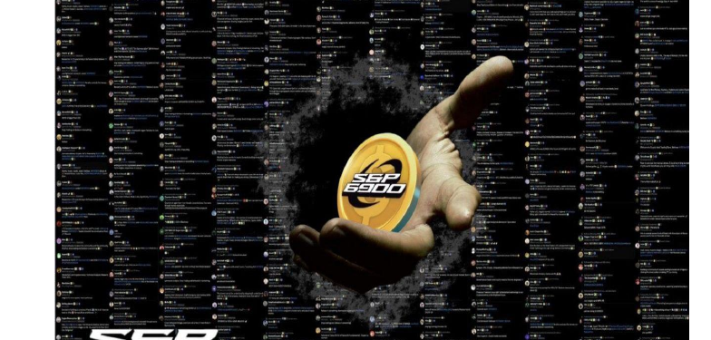
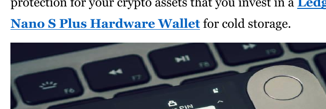

<!-- page: 1 -->

---
# DÉCOUVRIR SPX6900

## LE PREMIER PURE BELIEF ASSET (actif de pure conviction) AU MONDE

*L’ASCENSION D’UN JETON FONDÉ SUR LA CONVICTION, LA CULTURE ET LA COMMUNAUTÉ*

**La révolution du Pure Belief Asset (actif de pure conviction)**

*Par Audacious*

1

<!-- page: 2 -->

---
# À la découverte de SPX6900 : Le premier Pure Belief Asset (actif fondé uniquement sur la croyance) au monde

*L’essor d’un token fondé sur la conviction, la culture et la communauté*

---

**Une révolution des Pure Belief Asset (actifs fondés uniquement sur la croyance)**

2

<!-- page: 3 -->

---
**Avis de droits d’auteur**

© 2025 Audacious. Tous droits réservés.

Cet e-book est **100% gratuit à télécharger et à partager.** Vous êtes invité — et même encouragé — à le distribuer à vos amis, dans des communautés en ligne, et à toute personne susceptible de s’intéresser au mouvement SPX6900.

Cependant, veuillez respecter les conditions suivantes :

- **Vous ne pouvez pas éditer, modifier ou republier** une quelconque partie de cet e-book.
- La revente commerciale est strictement interdite.
- Cet e-book **peut contenir des liens de parrainage, des mentions promotionnelles ou des liens de dons** qui pourraient offrir un petit avantage à l’auteur ainsi qu’aux autres Aeons (Aeon : terme technique SPX6900) si les lecteurs les utilisent.

En partageant cet e-book, vous contribuez à faire connaître un mouvement en pleine expansion. Merci de respecter l’intégrité du contenu et le message voulu.

Première édition, juillet 2025

3

<!-- page: 4 -->

---
**Avertissement**

Ce livre numérique est destiné **uniquement à des fins d'information et d'éducation.** Le contenu présenté reflète les opinions, interprétations et recherches de l'auteur et **ne constitue en aucun cas un conseil financier, d'investissement ou juridique.**

Les investissements dans les cryptomonnaies et les actifs numériques comportent **des risques importants** et peuvent entraîner la **perte totale de votre capital.** Effectuez toujours vos propres recherches (DYOR) et consultez un conseiller financier ou un professionnel agréé avant toute décision d'investissement.

Bien que ce livre numérique explore la philosophie, la tokenomique et la communauté autour de SPX6900, il ne constitue pas une recommandation d'achat, de vente ou de conservation d'un actif numérique. L'auteur ne saurait être tenu responsable des décisions prises par les lecteurs sur la base des informations présentées ici.

En lisant ce livre numérique, vous reconnaissez et acceptez que l'auteur n'est pas responsable des pertes ou des décisions que vous pourriez prendre à partir de ce contenu, et que le secteur des cryptomonnaies est volatile, spéculatif et intrinsèquement risqué.

Investissez avec discernement. Croyez avec responsabilité.

4

<!-- page: 5 -->

---
**Astuce SPX6900**

Cet e-book est entièrement gratuit, mais si vous souhaitez m’envoyer un pourboire en SPX6900 pour le temps, l’effort et la recherche consacrés à sa création, ce serait très apprécié.

**Adresse SPX Ethereum [Portefeuille](https://example.com/placeholder) :**
  
  0x22D3b939a7E832232e833e8dF22ac1ba9D7610B0

**Adresse SPX Solana [Portefeuille](https://example.com/placeholder) :**

25zojSFpVu1qsETY9MMZFFy8jZEu7peDCSdrU208xzcR

**Merci pour votre soutien à mon travail !**

**Chaque pourboire est reçu avec une immense reconnaissance.**

N’hésitez pas à partager cet e-book avec toutes les personnes à qui vous souhaitez donner la chance de rejoindre notre mission et transformer leur vie !

5

<!-- page: 6 -->

---
# Table des matières

Préface ...............................................................................................................8  

Tout commence avec le Bitcoin ............................................................................9  

Qu’est-ce que SPX6900 ? ...................................................................................15  

Qu’est-ce qui rend SPX6900 différent ? ............................................................21  

La proposition de valeur de SPX6900 ............................................................28  

L’importance de la culture SPX6900 .................................................................33  

Qu’est-ce que la culture SPX6900 ? .................................................................36  

La réalité de l’univers crypto..............................................................................44  

Tokenomics de SPX6900.....................................................................................56  

Quel est le « moat » de SPX6900 ? (l’avantage concurrentiel de SPX6900)...........61  

Personne ne viendra nous sauver .......................................................................67  

L’avenir s’annonce radieux ................................................................................74  

Comment échouer dans la crypto .......................................................................81  

Comment acheter SPX6900 ?.............................................................................89  

Comment construire votre propre conviction ? ................................................100  

La puissance du DCA collectif à long terme sur SPX6900 ................................103

6

<!-- page: 7 -->

---
Derniers mots .......................................................................................... 110

Foire aux questions .................................................................... 111

Soutenir l’auteur ............................................................................. 128

Ressources complémentaires ................................................... 130

Annexe A : Suivez ces Aeons sur X ........................................... 132

Annexe B : Suivez ces Aeons sur TikTok ................................ 133

Annexe C : Suivi de l’objectif SPX 1 000 .................................. 134

Annexe D : Suivi de l’objectif SPX 10 000 ............................... 135

Annexe E : Graphiques de croissance des cryptomonnaies .... 136

Annexe F : Citations percutantes des Aeons ............................ 139

Annexe G : Comprendre les cycles haussiers des cryptos ...... 140

Annexe H : Checklist du nouvel arrivant SPX6900 ................. 148

Remerciements ............................................................................... 152

À propos de l’auteur ....................................................................... 154

7

<!-- page: 8 -->

---
## **Avant-propos**

Nous essayons de vous aider.

De l’auteur qui rédige ce livre numérique à la personne qui vous l’a transmis — nous cherchons tous simplement à vous aider.

Nous croyons sincèrement que SPX6900 (SPX6900 : une technologie révolutionnaire capable d'améliorer votre quotidien) peut améliorer la qualité de votre vie.

C’est pourquoi nous le partageons avec tous ceux qui sont prêts à écouter.

8

<!-- page: 9 -->

---
## Tout commence avec Bitcoin

Vous êtes peut-être novice dans le domaine des cryptomonnaies et vous en savez très peu — mais vous avez sans doute déjà entendu parler de Bitcoin.

Difficile de passer à côté de Bitcoin, surtout après son ascension fulgurante, passant de quelques centimes en 2009 à près de 112 000 $ en mai 2025.

### La première crypto

Bitcoin a été la première cryptomonnaie, créée par un développeur anonyme connu sous le nom de Satoshi Nakamoto. Il a conçu Bitcoin comme un système de paiement et une monnaie alternative, décentralisés — échappant au contrôle et à la manipulation des banques centrales.

C’était une manière pour les personnes d’envoyer des paiements directs, de pair à pair, via le réseau Bitcoin en utilisant le bitcoin (BTC) comme monnaie.

9

<!-- page: 10 -->

(Fig 1.1) — sans intervention d'un tiers (c'est-à-dire d'une banque) dans la transaction.

(Fig 1.1 – Réseau pair à pair de Bitcoin)

Satoshi Nakamoto a été le premier à résoudre le problème de la double dépense (c’est-à-dire empêcher qu’un même bitcoin soit dépensé plusieurs fois) de manière décentralisée et sans confiance. Cette

10

<!-- page: 11 -->

---
**Évolution du Bitcoin**

Le Bitcoin a commencé comme une vision de monnaie numérique — libre de tout contrôle gouvernemental et bancaire — que l’on pourrait utiliser et dépenser comme alternative à la monnaie fiduciaire. C’est ainsi que l’on a eu la fameuse histoire de la “[pizza Bitcoin](https://example.com/placeholder)” à ses débuts.

Avec le temps, le Bitcoin s’est transformé en “or numérique” — une réserve de valeur, une protection contre l’inflation, et un actif de diversification de portefeuille. Aujourd’hui, il suscite un intérêt croissant de la part des institutions, des fonds spéculatifs (hedge funds) et même de certains États.

Son parcours, qui l’a mené d’un instrument radical d’émancipation financière à un actif de valeur largement accepté, n’a été rendu possible que grâce à la culture, la conviction et la communauté qui l’ont soutenu avec une loyauté sans faille.

Si personne n’avait reconnu la valeur de la création de Satoshi, le Bitcoin ne vaudrait rien aujourd’hui. Mais une communauté précoce et grandissante a adhéré à la vision d’un système de paiement décentralisé et

11

<!-- page: 12 -->

---
une monnaie, qui a fini par devenir une réserve de valeur reconnue dans le monde entier — attirant encore aujourd’hui de nouveaux adeptes.

Le Bitcoin, avec son **offre plafonnée à 21 millions de pièces** (ou moins à cause des tokens perdus), est passé de rien à plus de mille milliards de [capitalisation boursière](https://example.com/placeholder) depuis sa création en 2009 (Fig 1.2) — tout cela grâce aux gens.

(Fig 1.2 – Capitalisation boursière du Bitcoin au 8 juillet 2025)

## Alors, pourquoi investir dans la crypto ?

La réponse courte et simple : parce qu’elle a su capter l’attention du public — et cet engouement ne fait que s’intensifier.

Certains investissent dans la crypto parce qu’ils aiment la technologie. D’autres le font pour changer leur situation financière et rejoindre une communauté de personnes partageant les mêmes valeurs et un but commun.

12

<!-- page: 13 -->

---
Quelle que soit votre raison, le marché de la crypto ne fait que s’étendre (voir Fig. 1.3), il gagne en puissance, attire de plus en plus l’attention et pourrait changer radicalement votre vie — si vous rejoignez la bonne communauté au bon moment.

(Fig. 1.3 – Croissance de la capitalisation du marché crypto au fil du temps)

**Je pense que SPX6900 représente une seconde chance comparable à l’opportunité Bitcoin** — nous verrons bientôt pourquoi.

13

<!-- page: 14 -->

---
La crypto-monnaie est une classe d’actifs que les gens ordinaires, travailleurs, ayant un emploi de 9h à 17h, peuvent utiliser pour changer radicalement leur vie. Oui, il y a une petite courbe d’apprentissage, mais le temps que vous consacrez à apprendre à investir dans la crypto en vaut la peine.

Personnellement, je pense que la meilleure façon d’apprendre, c'est en pratiquant. C’est ainsi que j’ai découvert la crypto lorsque je débutais : j’ai simplement passé à l’action.

N’oubliez pas : si vous ne commencez pas à agir, d’une manière ou d’une autre, pour améliorer votre vie, dans 5 ou 10 ans, il y a de grandes chances que vous soyez dans la même situation — voire pire — avec la montée de l’IA, l’inflation monétaire continue et la dépréciation des devises. Il faut gagner plus que le taux d’inflation monétaire pour ne pas perdre de pouvoir d’achat, et la bonne crypto-monnaie est un actif qui peut largement surpasser l’inflation, préserver votre pouvoir d’achat et transformer votre vie.

Faire de petits pas aujourd’hui en s’impliquant dans l’univers grandissant de la crypto pourrait changer radicalement votre vie dans 5 à 10 ans — simplement en faisant ce que la plupart des gens ne font pas : **prendre un risque calculé.**

14

<!-- page: 15 -->

---
# Qu'est-ce que SPX6900 ?

Donc, vous êtes nouveau dans la crypto et vous venez de découvrir ou d’entendre parler de SPX6900 (SPX) — et vous vous demandez sûrement : **Mais qu’est-ce que SPX6900, au juste ?**

## Un Pure Belief Asset

SPX6900 représente beaucoup de choses différentes pour beaucoup de personnes, mais au fond, on peut le décrire comme un **Pure Belief Asset (PBA) (actif de pure croyance)**. C’est un jeton qui ne repose sur rien d’autre que la **forte conviction** et la **foi inébranlable** de ses détenteurs. Il incarne une révolution, un mouvement, une tribu, une culture, une philosophie et une mission audacieuse : **flip the stock market** (renverser le marché boursier), en particulier le S&P 500. Cela signifie que notre objectif est que SPX6900 devienne plus précieux que la capitalisation boursière actuelle approximative du S&P 500, qui s’élève à environ 52,4 billions de dollars, en atteignant une capitalisation de 69 billions de dollars.

15

<!-- page: 16 -->

---
SPX6900 est une communauté grandissante d’individus **unis par un but commun et une vision partagée** : flip the stock market (renverser la Bourse grâce à la force de la croyance collective et pure).

## C’est l’Espoir Tokenisé

C’est un espoir financier tokenisé pour des milliers de personnes désabusées qui sont insatisfaites de notre système monétaire, de l’esclavage moderne du 9–17h, des inégalités de richesse, de la finance traditionnelle d’entreprise (TradFi), de la montée de l’IA comme menace pour la productivité et les opportunités sur le marché du travail, ainsi que des arnaques, rug pulls et narratifs utilitaires présents dans l’univers crypto.

SPX6900 est unique parmi les dizaines de milliers de cryptomonnaies sur le marché et a le potentiel d’atteindre un jour des milliards de dollars de capitalisation — grâce à la communauté, à la croyance et à la conviction sur le long terme, il est possible pour chacun de transformer sa vie.

16

<!-- page: 17 -->

---
**Une Seconde Opportunité Bitcoin**

Ce projet partage de nombreuses similitudes culturelles et philosophiques avec le Bitcoin des débuts, mais il demeure pourtant très différent.

Pour celles et ceux qui ont manqué l’occasion du Bitcoin à ses débuts, voici une seconde chance de rejoindre une communauté qui se construit de façon organique, de la base vers le sommet, portée par une culture philosophique forte et une mission qui dépasse l’individu : **flip the stock market** (retourner le marché boursier).

D’un point de vue financier, investir dans SPX6900 aujourd’hui (au 8 juillet 2025), c’est un peu comme bénéficier de cette opportunité rare d’investir à nouveau dans Bitcoin — à 62,77 $ (Fig 1.4).

(Fig 1.4 – BTC avec la capitalisation boursière de SPX6900)

17

<!-- page: 18 -->

---
Le Bitcoin a été une opportunité unique dans une vie pour ceux qui ont eu le courage de *believe in something* (croire en quelque chose d’innovant et de nouveau).

SPX6900 est une opportunité unique dans une vie, destinée à tous ceux qui ont raté le Bitcoin, à la jeune génération en difficulté financière, et à ceux qui cherchent l’espoir — s’ils sont suffisamment audacieux pour adopter une nouvelle culture fondée sur la pure croyance (Pure Belief).

      

**Normie Sceptique**                      **6900er**

| C’est quoi, SPX6900 ?                        | Un token de mission/mouvement.                                                        |
|----------------------------------------------|---------------------------------------------------------------------------------------|
| Quelle est la mission/le mouvement ?         | Flip The Stock Market (renverser la bourse ; retourner le marché boursier).           |
| Comment allez-vous faire cela ?              | Stop Trading, Believe In Something, and Persist Forever (cesser de trader, croire en quelque chose, et persévérer à jamais). |
| Comment ça fonctionne ?                      | DCA & HODL (arrêter de trader) ; Shill & Chill (croire en quelque chose) ; Répéter (persévérer à jamais). |
| Il doit bien y avoir plus que ça !           | Tant que la communauté partage le même système de croyance, non. C’est tout.           |
| Quand est-ce que ça va flip the stock market ? | Quand nous atteindrons la Cognisphere Singularity (la singularité de la Cognisphere ; le point culminant de la conscience collective). |
| C’est quoi, la Cognisphere ?                 | C’est la conscience totale de croyance de tous les Aeons (croyants véritables de SPX6900). |
| C’est quoi, un Aeon ?                        | Un vrai croyant de SPX6900 (croyant authentique du projet SPX6900).                  |
| En quoi est-ce différent de Bitcoin ?        | Le Bitcoin est de l’or numérique. SPX6900, c’est de l’or spirituel.                   |
| Quelle est la différence ?                   | Le Bitcoin est une réserve de valeur monétaire garantie par les mathématiques. SPX6900 est une réserve de valeur communautaire soutenue par la croyance.            |
| Comment la croyance peut-elle être une réserve de valeur ? | Tout peut être une réserve de valeur si la communauté est d’accord.           |
| Sur quelle blockchain ça fonctionne ?        | Ethereum, Solana, Sui et Base (Ethereum L2).                                         |
| Ça a l’air intéressant. Je commence où ?     | Rendez-vous sur [SPX6900.COM](https://example.com/placeholder) et suivez [@SPX6900 sur X](https://example.com/placeholder). |

18

<!-- page: 19 -->

---
## Connexion humaine et sentiment d'appartenance

Nous vivons dans un monde numérique où les gens créent des liens et trouvent un sentiment d’appartenance au sein de communautés en ligne, bien plus que dans la vie réelle.

**SPX6900** est une forme tokenisée de la connexion humaine et du sentiment d’appartenance. Il s’agit d’une communauté de personnes partageant le même objectif et la même vision (Fig. 1.5) — trouver leur place et tisser des liens authentiques entre eux.

*(Fig. 1.5 – Communauté SPX6900 sur X)*

19

<!-- page: 20 -->

---
De nos jours, il est souvent difficile de trouver des personnes qui se soucient réellement de la liberté financière, de fuir l’esclavage du système du 9–5 Matrix, ou qui se préoccupent de l’avenir face à la montée de l’IA et à la dévalorisation de notre monnaie, et qui sont prêtes à prendre des risques de manière proactive pour améliorer leur vie.

Mais en ligne, on peut découvrir des communautés comme **SPX6900**, où l’on ressent un véritable sentiment d’appartenance — car c’est une tribu de personnes partageant une vision qui fait écho en vous : **renverser ce système corrompu et gagner ensemble.**

Ne sous-estimez pas la valeur de **l’appartenance humaine tokenisée, de la connexion et de l’espoir** — surtout alors que nous nous dirigeons vers un futur potentiellement dystopique. Plus que jamais, nous avons besoin d’une communauté de personnes partageant les mêmes idées pour s’y rattacher, afin de s’en sortir et de gagner ensemble.

20

<!-- page: 21 -->

---
# Pourquoi SPX6900 est-il différent ?

|  | **Diamondhandedness**  
Les détenteurs ne vendent jamais, point final. |
|---|---|
|  | **Objectifs de prix communautaires ambitieux**  
Plus l'objectif de prix interne de la communauté est ambitieux, plus il montera haut. |
|  | **Les détenteurs renforcent leur position**  
Les détenteurs *rajoutent* lors des baisses. |
|  | **Croyance**  
Les détenteurs y croient vraiment et visent une croissance de plusieurs milliards voire dizaines de milliards. |
|  | **Travail de culte gratuit**  
Les détenteurs se donnent plus que n'importe quel salarié ou KOL, sur tous les fronts. Gratuitement. |
|  | **Identité**  
Les détenteurs font du Memecoin toute leur identité. |
|  | **Masse critique**  
Ne restez pas sur la touche à miser sur des coins à faible capitalisation qui ne décolleront peut-être jamais.  
Concentrez-vous sur les cryptos établies qui ont atteint la masse critique. |
|  | **Recrutement**  
Chaque jour, les détenteurs recrutenet de nouveaux membres, sans relâche. Que ce soit des experts CT ou des novices. |
|  | **Réseaux sociaux**  
Les détenteurs envahissent la timeline et les réponses sur Twitter au quotidien, sans arrêt. |
|  | **Culture et légende**  
Un jargon unique. Des rituels uniques. Des traditions originales. Des médias distinctifs. |
|  | **Fun**  
Même lors des phases de baisse, les détenteurs continuent de bien s’amuser. |

21

<!-- page: 22 -->

---
Le marché des cryptomonnaies aujourd’hui est saturé de tokens, depuis l’apparition du Bitcoin en 2009. Des milliers de tokens sont désormais lancés chaque jour en raison de la facilité à créer un projet crypto. La plupart de ces tokens échoueront lamentablement pour diverses raisons. ([Annexe E](https://example.com/placeholder))

Alors, qu’est-ce qui distingue SPX6900 des autres, vous demandez-vous ?

## Qualité de la communauté

La réponse réside dans la **qualité de la communauté SPX6900** — sa philosophie et sa culture.

La comparaison la plus pertinente pour la communauté SPX6900, c’est, littéralement, la communauté Bitcoin à ses débuts.

La communauté Bitcoin est née d’un profond sentiment anti-système. Ses membres étaient des purs et durs qui estimaient que la seule crypto digne d’être achetée, conservée et accumulée, c’était le bitcoin. Tout le reste n’était, selon eux, que de la camelote. Ils considéraient le Bitcoin comme une monnaie fiable, solide (c’est-à-dire à l’offre limitée et plafonnée) — de l’or numérique — qui ne pouvait être manipulée ni dévaluée par les banques centrales.

22

<!-- page: 23 -->

---
Cette philosophie a été préservée et entretenue au fil des années, attirant de plus en plus de personnes à la cause. Ainsi, le bitcoin est passé de rien à plus de mille milliards de dollars de capitalisation boursière.

## À l’image des débuts du Bitcoin

| #Bitcoin  ₿ | #SPX6900     |
|-------------|--------------|
| HODL        | Believe in Something (Believe in Something : « croire en quelque chose », slogan de SPX6900) |

- **HODL**
  - Danish Bitcoin Maxi  
    @DanishBTCMaxi  
    Mineur & opérateur de nœud #Bitcoin
  - BTCBull  
    @Bullish_btc  
    #Bitcoin maximaliste promotion 2017. à la basse
  - ephexeon  
    Toxie #Bitcoin Maxi
  - A Bitcoin Maxi  
    @bitcoinimax1  
    Juste les opinions d’un #bitcoin maxi !
  - BTC.Snowy  
    @btc.snowy  
    #Bitcoin Maxi PleB
  - Cody  
    @BTC_elementary  
    Bitcoin maxi à Yosemite.
  - Bitcoin Maximalist  
    @Bitcoin_Maxi  
    Maximaliste Bitcoin et HODLer
  - Bitcoin Maxi  
    @bitcoinMaxiOnly  
    Maxi = Uniquement #Bitcoin

- **Believe in Something**
  - SPX6900er  
    @SPX6900er  
    “Believe in Something” #SPX6900 (slogan : « croire en quelque chose »)
  - CrypsoBar  
    @CrypsoBar  
    Croyant SPX6900.
  - #reymindedgoose  
    @reymindedgoose  
    @SPX6900 - Le prochain Bitcoin
  - Sergius  
    @Spleruviskens  
    Croyant @SPX6900
  - undefined  
    @0xAddressoZero  
    Maxi SPX6900 !
  - btcfx1  
    @btcfx1  
    Vous suit
  - Crypto Navigator  
    @smoukzordex  
    GIGA

23

<!-- page: 24 -->

---
La communauté SPX6900 reflète à bien des égards celle des débuts de Bitcoin.

SPX6900 affiche un **sentiment fortement anti-TradFi**, avec pour mission déclarée de retourner le S&P 500. Cette communauté adhère à une philosophie de base qui **décourage fermement la spéculation**, prônant au contraire la conviction totale et une croyance inébranlable.

Un **SPX6900 ‘Aeon’** ([Aeon](https://example.com/placeholder)) (le nom donné à un véritable croyant dans SPX, Aeon : terme technique SPX6900) considère SPX comme supérieur à tout le reste du marché — grâce à ses valeurs, sa culture unique, et à la qualité exceptionnelle de sa communauté, tous unis autour de la mission de "flip the stock market" (inverser la tendance du marché boursier).

Et tout comme Bitcoin est passé du néant à plus d’un billion de dollars de capitalisation grâce à la force d’une communauté fidèle, nous croyons que la communauté SPX6900 peut accomplir la même chose et, ce faisant, "flip the stock market" (renverser les codes du marché boursier).

24

<!-- page: 25 -->

---
# Une mission révolutionnaire

(Source : [Flipthestockmarket.xyz](https://example.com/placeholder))

Croire en quelque chose sans but, c’est difficile.  

Mais croire en quelque chose qui porte une mission forte et un objectif clair, c’est bien plus facile.  

Dans le cas de SPX6900, sa mission est profonde. "flip the stock market" (renverser les codes de la bourse) n’est pas une mince affaire. C'est un vrai combat de David contre Goliath.

25

<!-- page: 26 -->

---
— révolutionnaire dans son essence. Mais c’est aussi ludique, excitant, accrocheur, orienté vers l’atteinte d’objectifs et axé sur la mission.

N’oublions pas que le Bitcoin a lui aussi démarré avec une mission révolutionnaire — contre la monnaie fiduciaire et les systèmes bancaires traditionnels. SPX6900 porte la même ambition, mais son adversaire est la finance traditionnelle (TradFi), ou plus largement, [le capitalisme de la dernière heure.](https://example.com/placeholder)

(Fig 1.6 Top 10 des Memecoins par capitalisation boursière au 8 juillet 2025)

26

<!-- page: 27 -->

---
L’utilité fondamentale d’un token reposant sur une communauté soudée autour d’une mission concrète dans le monde réel est une rareté dans l’univers des cryptomonnaies.

La plupart des tokens crypto ne disposent même pas de véritables communautés, et encore moins d’un objectif commun ou d’un mouvement qui rassemble les membres autour d’un même idéal.

Si l’on compare SPX6900 avec les dix principaux meme tokens (Fig 1.6), c’est littéralement le seul à porter une véritable mission et un sens profond.

Aucun des autres du top 10 n’en possède un.

Le terme « Pure Belief Asset (PBA) » (actif basé uniquement sur la croyance) est relativement nouveau pour cette catégorie d’actifs. Bien que SPX6900 soit classé comme memecoin, cette appellation est de plus en plus inadaptée, car elle minimise la portée de ce que SPX6900 cherche à accomplir — sa culture, sa mission et sa signification sont bien supérieures à celles des memecoins classiques.

Pour autant, **notre ennemi, c’est la TradFi — et notre objectif, c’est de la retourner (flip it)!**

27

<!-- page: 28 -->

---
## La proposition de valeur de SPX6900

La véritable proposition de valeur de toute cryptomonnaie — une fois qu’on fait abstraction de tous les discours qui l’entourent — se résume en réalité à **la communauté qui y croit.**

28

<!-- page: 29 -->

---
**Investir dans les personnes**

Nous, le peuple, sommes ceux qui donnons finalement de la valeur à une crypto, pour une raison ou une autre, en choisissant de l’acheter et de la conserver. Nous créons la demande pour la crypto grâce à notre pouvoir d’achat collectif.

Prenons l’exemple du Bitcoin. Il a été le premier du genre — une communauté qui s’est développée de manière organique, et qui, encore aujourd’hui, continue d’adhérer à ses valeurs et à sa philosophie : être une forme d’argent supérieure et un réseau décentralisé en comparaison avec la monnaie fiduciaire et les systèmes bancaires centralisés.

C’est justement cette communauté solide qui donne au bitcoin sa valeur et qui est le moteur de l’appréciation de son prix (Fig 1.7).

(Fig 1.7 – Appréciation du prix du Bitcoin dans le temps)

29

<!-- page: 30 -->

---
Quand vous comprenez que la crypto consiste avant tout à investir dans des personnes, il faut vous poser la question :

- Vers quelle crypto les gens sont-ils naturellement attirés ?
- Quelle crypto fidélise les utilisateurs et les encourage à rester ?
- Quelle crypto suscite chez les gens de la passion, de la motivation et de l’inspiration ?
- Quelle crypto agit comme un aimant pour l’argent durement gagné des gens ?
- Quelle crypto voit croître le nombre de détenteurs fidèles ?
- Quelle crypto pousse les gens à produire des écrits, des œuvres d’art, des vidéos et des mèmes créatifs de qualité pour en faire la promotion ?
- Comment cette crypto parvient-elle à accomplir tout cela ?

30

<!-- page: 31 -->

---
C'est la crypto à laquelle vous devez prêter attention — car beaucoup d’autres personnes s’y intéressent de près et y investissent.

**SPX6900 est un exemple parfait de ce type de cryptomonnaie.**

### Investir dans la spéculation sur l’utilité

De nombreuses autres cryptos sont construites autour de récits d’utilité et de cas d’usage qui attirent les gens à acheter et à spéculer. Leurs communautés spéculent sur le fait que l’utilité et le cas d’usage du token deviendront réels et largement adoptés — ce qui donnerait alors de la valeur au token.

Même avec les tokens utilitaires, vous investissez toujours dans les personnes — vous investissez dans la capacité des gens à continuer de spéculer sur l’idée d’utilité.

La plupart de ces tokens utilitaires ne sont que des concepts, des idées, et des théories sur lesquelles les gens spéculent, sans cas d’usage réel ni adoption institutionnelle de masse. Au final, ce sont donc toujours les gens qui donnent de la valeur à ces récits d’utilité par la spéculation, dans l’espoir qu’une utilité réelle et de masse se concrétisera un jour.

31

<!-- page: 32 -->

---
**Investir dans la culture communautaire**

Et puis, il existe des tokens qui n’ont ni narration utilitaire ni cas d’usage — comme les memecoins. La communauté y adhère pour des raisons qui tiennent à l’attrait qu’elle-même exerce. Dans le cas de SPX6900 — **un Pure Belief Asset (un actif fondé uniquement sur la croyance)** — c’est la culture incarnée par la communauté qui attire et fidélise ses membres.

**ÉLÉMENTS MÉTAPHYSIQUES DE SPX6900**

Communauté      Croyance      Conviction

Persévérance      Résilience      Loyauté

Patience      Optimisme      Amour

32

<!-- page: 33 -->

---
## L'importance de la culture SPX6900

La culture SPX6900 est essentielle à la réussite du token — tout comme l'utilité est essentielle à la réussite des utility tokens (jetons utilitaires).

Un point d'échec majeur pour les utility tokens survient lorsque l'utilité promise ne se matérialise pas ou n'est pas adoptée. Dans ce cas, la communauté abandonne souvent le token, et son prix s'effondre en conséquence.

Cela s'explique par le fait que les personnes qui investissent dans des cryptomonnaies utilitaires n'ont, en réalité, aucune loyauté envers la communauté ou le token, si ce n'est l'espoir que l'utilité promise devienne réelle.

De la même manière, si la culture SPX6900 est perdue et n'est ni protégée ni entretenue par la communauté, il existe un risque élevé que la communauté se détériore — perdant ainsi ce qui fait son attrait et qui donne envie à d'autres de la rejoindre.

33

<!-- page: 34 -->

---
C’est pourquoi, lorsque vous rejoignez le mouvement SPX6900, respecter et défendre notre culture est absolument essentiel pour la croissance et le succès de la communauté.

Prenez Bitcoin, par exemple — il n’aurait jamais pu passer de rien à une capitalisation boursière de mille milliards de dollars au fil des ans si la communauté Bitcoin n’avait pas maintenu et préservé sa culture.

La philosophie du maximalisme Bitcoin a encouragé tout le monde à croire que Bitcoin était supérieur à tout le reste, à continuer d’en accumuler, de HODL, et d’en prendre le contrôle total. Cette préservation de la culture par la communauté a non seulement attiré des gens vers Bitcoin, mais elle leur a aussi donné la conviction nécessaire pour s’y tenir.

Et si SPX6900 veut atteindre des milliers de milliards de capitalisation et un jour flip the stock market (renverser les marchés financiers traditionnels), il n’y parviendra que grâce à une communauté soudée qui défend et perpétue la culture SPX6900 à travers les marchés haussiers comme baissiers.

Le succès de SPX6900 dépend en fin de compte de la communauté — et le succès de la communauté dépend de

34

<!-- page: 35 -->

---
sa capacité à adopter, incarner et préserver la culture et la philosophie SPX6900 (SPX6900 culture et philosophie : principes et valeurs propres à SPX6900).

Sans cette culture, il n’y aurait pas de communauté forte et de qualité en train de se former derrière SPX — ce qui rendrait le jeton indifférencié de la majorité des autres tokens de l’univers crypto : de simples [pump-and-dump rug pulls](https://example.com/placeholder) (arnaques financières à la hausse et à la baisse) éphémères qui n’évolueront jamais vers quelque chose de spécial ou de grand.

L’une des grandes caractéristiques de SPX6900 est qu’il n’a pas de point d’échec lié à son utilité. C’est une inquiétude que la communauté n’a pas à avoir.

Notre seul risque réel est l’autodégradation : échouer à maintenir notre culture et notre philosophie.

Si nous *persist forever* (persistons indéfiniment à défendre notre culture), il n’y a aucun véritable point faible. Notre message est solide, notre mouvement attire, et nous pouvons continuer à grandir, un détenteur après l’autre, jusqu’à atteindre notre mission : flip the stock market (renverser le marché boursier).

Cependant, **nous devons veiller à protéger notre culture** — surtout en nous développant — afin de survivre sur le long terme, de traverser plusieurs cycles et de parvenir à flip the stock market (renverser le marché boursier) avec succès.

35

<!-- page: 36 -->

---
# Qu’est-ce que la culture SPX6900 ?

## **Stop Trading and Believe in Something** (slogan en anglais : « arrêtez de trader et croyez en quelque chose »)

Cela encourage la communauté à adopter un esprit d’investissement à long terme, à forte conviction, avec des mains de diamant (c’est-à-dire sans vendre), et une stratégie de [moyenne d’achat périodique (Dollar Cost Averaging, DCA)](https://example.com/placeholder) lors de l’achat de SPX6900 — plutôt que de céder à la mentalité court-termiste de certains traders qui cherchent de rapides profits sans aucune croyance dans la communauté.

## **There Is No Chart** (slogan en anglais : « il n’y a pas de graphique »)

Notre culture décourage fortement la publication de graphiques ainsi que les distractions qui vont avec.

C’est le jeu des traders court-termistes. SPX6900 représente un investissement à long terme, basé sur la conviction.

36

<!-- page: 37 -->

C’est pourquoi nous disons que le prix est binaire : **avons-nous flip the stock market (retroussé la bourse – c’est-à-dire bouleversé les marchés comme l’annonce le slogan SPX6900) ou non ?** Sinon, il nous reste encore du travail à accomplir.

Ne pas s’obséder sur les graphiques permet aussi de libérer un temps précieux pour des choses bien plus importantes, comme promouvoir SPX6900 de manière créative et tisser des liens authentiques avec d’autres Aeons (Aeon – membres de la communauté SPX6900) tout en construisant des relations durables.

## Le seul ennemi, c’est la TradFi

Cela reflète notre esprit rebelle, anti-système, anti-corporation — en opposition à tout ce que représente le système financier traditionnel. C’est très proche de l’idéologie anti-banques des débuts du Bitcoin. Après tout, notre mission est de flip the stock market (retourner le marché boursier – défier l’ordre établi comme annoncé par le slogan SPX6900).

37

<!-- page: 38 -->

---
**Persist Forever** (slogan en anglais : "persister à jamais")

Cet état d’esprit résilient — ne jamais abandonner, résister à l’injustice du système, supporter les défis de notre mission et tenir bon aussi longtemps qu’il le faudra — représente le cœur battant et l’âme de notre communauté.

Comment pourrions-nous jamais espérer atteindre notre objectif ambitieux de **flip the stock market** (inverser la tendance de la bourse) un jour et **d’atteindre des milliers de milliards**, si ce n’est en persistant à jamais ?

**Aucune Publication Inappropriée**

Nous n’acceptons tout simplement pas cela dans notre communauté. Nous gardons un espace sain.

38

<!-- page: 39 -->

---
### Une vie paisible plutôt que la cupidité

Voilà ce qui arrive lorsque vous arrêtez de courir après les graphiques, les chandeliers et les variations de prix. Cet état d’esprit ne mène qu’au stress, alimenté par la cupidité et l’obsession de vouloir anticiper le marché. Mener une vie paisible, c’est investir régulièrement (DCA) dans SPX6900 (SPX6900 est un produit d’investissement particulier ; voir explication) avec une vision à long terme et une forte conviction — sans surveiller les graphiques.

Il est bien plus serein et gratifiant de miser sur la durée plutôt que d’essayer de prédire le marché.

**DCA simplement et allez prendre l’air.**

39

<!-- page: 40 -->

---
### Uniquement PvE, Pas de PvP

#### Memecoins PvP
**aussi appelés Hyperparis**

#### Memecoins PvE
**aussi appelés “Cults”**

Le comportement Player vs. Player (PvP) a corrompu une grande partie de la crypto — c’est toxique, individualiste et cela empêche la formation de communautés solides. SPX6900 est strictement une communauté Player vs. Environment (PvE). Nous ne sommes pas les uns contre les autres — nous sommes unis contre le système TradFi.

Nous travaillons constamment main dans la main pour construire une communauté forte, capable, un jour, de flip the stock market (retourner la bourse traditionnelle).

40

<!-- page: 41 -->

---
**Promouvoir la positivité**

Notre communauté vit selon la devise de vaincre les détracteurs, les sceptiques et les critiques par l’amour — et non en répondant à leur négativité. Nous souhaitons la réussite aux autres. Nous disons aux gens que nous les aimons. Et nous essayons sincèrement d’aider les autres en partageant SPX6900 (projet SPX6900) avec eux.

**Infiltrer partout !**

La communauté SPX6900 (SPX6900) est l’une des plus acharnées de l’univers crypto — c’est tout simplement sans précédent en toutes mes années dans la crypto. On parle de gens qui postent chaque jour des messages enthousiastes sur les réseaux sociaux, créent des contenus TikTok, des vidéos YouTube et des reels Instagram, lancent des podcasts, vont à la rencontre des habitants dans leurs villes et villages pour partager SPX6900 (projet SPX6900), et produisent même des [bandes dessinées](https://example.com/placeholder), [livres](https://example.com/placeholder), e-books, produits dérivés, sites web, et bien plus encore.

Nous sommes véritablement engagés à diffuser le message et la mission de SPX6900 (projet SPX6900) en touchant le plus grand nombre — nous infiltrons tout !

41

<!-- page: 42 -->

---
**Tous les principes réunis**

Lorsque vous rassemblez tous les principes positifs de la culture SPX6900 (la communauté SPX6900 – voir explication ci-dessous) et que vous les combinez, cela crée véritablement une communauté unique et spéciale dans le monde des cryptomonnaies.

Certaines communautés peuvent avoir une forte conviction et une mentalité de non-trading, mais vous remarquerez également qu’elles sont très toxiques, négatives et affichent des comportements impitoyables.

D’autres communautés peuvent sembler positives au départ — mais vous vous rendez vite compte qu’elles ne font que s’affronter (PvP) entre elles. Au moindre signe d’augmentation de prix, tout le monde se précipite pour vendre sur les autres, empêchant ainsi l’apparition d’une véritable confiance ou loyauté au sein de la communauté.

C’est pourquoi SPX6900 (voir explication ci-dessous) est un type de communauté à part — différente — et sa culture doit être préservée et respectée.

42

<!-- page: 43 -->

---
**Un Pure Belief Asset (actif de croyance pure)** comme SPX6900 nécessite une culture qui protège la communauté et son système de croyance pour pouvoir s'épanouir et réussir — et c’est précisément ce que SPX6900 possède.

Les personnes extérieures le remarquent et sont attirées par notre passion, notre conviction, notre philosophie et notre mission. Elles souhaitent faire partie de notre communauté, mais ce qui les pousse à rester et à forger leur propre conviction individuelle, c’est la culture.

43

<!-- page: 44 -->

---
# La réalité de l’univers crypto

L’univers crypto a énormément évolué depuis l’apparition du Bitcoin. Un·e nouvel·le arrivant·e aujourd’hui serait inondé·e par tant de communautés différentes vantant chacune leurs propres jetons, à tel point qu’il peut devenir très difficile de savoir par où commencer et sur quoi se lancer ([Annexe E](https://example.com/placeholder)).

Je tiens à vous avertir : la grande majorité des jetons dans l’espace crypto sont des impasses. Ils n’ont aucun avenir concret et finiront probablement par disparaître dans l’oubli pour une raison ou une autre.

Vous n’avez vraiment pas envie de perdre votre temps ou votre argent à vous engager dans ces jetons crypto sans issue, car cela risque fort de vous laisser un goût amer lorsque la communauté s’essoufflera et que le prix s’effondrera — entraînant la perte totale de vos économies.

Soyez vigilant, investissez intelligemment et faites preuve de diligence raisonnable.

Heureusement, si vous investissez dans le bon jeton et la bonne communauté au bon moment, cela pourrait transformer radicalement votre

44

<!-- page: 45 -->

---
la vie financière. De l’argent qui change la vie. Une richesse générationnelle. Ou tout simplement la liberté financière et la possibilité de prendre une retraite anticipée.

Je diviserais le monde des cryptomonnaies en deux grandes catégories :

- **Bitcoin**
- **Altcoins** (toutes les cryptomonnaies autres que le Bitcoin) :
  - **Jetons utilitaires**
  - **Memecoins**
  - **Pure Belief Assets (PBA)** (Pure Belief Asset — actif basé uniquement sur la croyance, spécifique à SPX6900)

## Bitcoin (BTC)

Le Bitcoin est le roi de toutes les cryptomonnaies. Il possède la communauté la plus solide et, au 8 juillet 2025, s’échange à 109 037 $ avec une capitalisation boursière d’environ 2,1 billions de dollars.

À cause de sa capitalisation et de son prix très élevés, il n’est plus vraiment idéal pour le commun des mortels d’investir dans le BTC tout en espérant réaliser un énorme retour sur investissement (ROI) en peu de temps — sauf si vous êtes déjà aisé et pouvez investir un montant important dans le BTC.

45

<!-- page: 45 -->

---
la vie financière. De l’argent qui change la vie. Une richesse générationnelle. Ou tout simplement la liberté financière et la possibilité de prendre une retraite anticipée.

Je diviserais le monde des cryptomonnaies en deux grandes catégories :

- **Bitcoin**
- **Altcoins** (toutes les cryptomonnaies autres que le Bitcoin) :
  - **Jetons utilitaires**
  - **Memecoins**
  - **Pure Belief Assets (PBA)** (Pure Belief Asset — actif basé uniquement sur la croyance, spécifique à SPX6900)

## Bitcoin (BTC)

Le Bitcoin est le roi de toutes les cryptomonnaies. Il possède la communauté la plus solide et, au 8 juillet 2025, s’échange à 109 037 $ avec une capitalisation boursière d’environ 2,1 billions de dollars.

À cause de sa capitalisation et de son prix très élevés, il n’est plus vraiment idéal pour le commun des mortels d’investir dans le BTC tout en espérant réaliser un énorme retour sur investissement (ROI) en peu de temps — sauf si vous êtes déjà aisé et pouvez investir un montant important dans le BTC.

45

<!-- page: 46 -->

---
Pour la plupart des gens au quotidien, utiliser le BTC comme solution d’épargne à long terme ou fonds de retraite est aujourd’hui la meilleure stratégie. Cela consiste à investir régulièrement dans le Bitcoin grâce à la méthode du dollar-cost averaging (DCA), avec une vision sur plusieurs décennies. Le Bitcoin est une option sûre sur le long terme, mais ce n’est pas la meilleure crypto si vous recherchez des rendements plus élevés à partir d’un capital modeste sur une période beaucoup plus courte.

**Jetons utilitaires**

Les cryptomonnaies autres que le Bitcoin, qui mettent en avant une utilité ou une fonction spécifique, sont considérées comme des jetons utilitaires. Cet univers est saturé de jetons utilitaires — allant des paiements, du gaming et du traitement de données IA, à la tokenisation, aux Layer 1, Layer 2, à l’interopérabilité, au Metaverse, aux jetons DEX, et bien d’autres encore.

Le récit de l’utilité est omniprésent.

Les jetons utilitaires sont principalement des investissements spéculatifs. Une grande partie de leur offre est généralement détenue par l’équipe, qui la revend souvent aux investisseurs particuliers afin de financer le projet. Dans de nombreux cas, l’équipe et le récit d’utilité deviennent le principal point faible de ces jetons. Les équipes sont souvent incompétentes, échouent

46

<!-- page: 47 -->

---
pour tenir leurs promesses, ils ne créent pas de produit, ou bien ils développent un produit médiocre qui n’est jamais réellement utilisé.

La valeur de ces tokens provient, dans la plupart des cas, d’une communauté grandissante qui spécule sur le potentiel de hausse du prix si le token venait un jour à être réellement utilisé. C’est pourquoi les utility tokens enregistrent souvent des hausses de prix à la suite d’annonces de partenariats ou d’inscriptions sur des plateformes d’échange — poussées par la hype et la spéculation. Pourtant, la majorité de ces partenariats sont superficiels et n’entraînent pas une réelle adoption de la technologie ou une application concrète du produit (si tant est qu’il existe).

Les communautés autour des utility tokens sont généralement fragiles, la fidélité étant principalement liée à l’espoir que l’utilité promise finira par se concrétiser. Si cela n’arrive pas — ou prend trop de temps — la communauté peut rapidement se désintéresser, vendre ses tokens et passer à autre chose.

En fin de compte, avec les utility tokens, la fidélité de la communauté dépend de la réalisation de l’usage ou de l’utilité promis par le projet (ce qui n’est souvent pas le cas) — et non pas forcément des personnes, de la culture ou de la philosophie derrière le token.

47

<!-- page: 48 -->

---
Dans le cas où l’équipe tient ses promesses en matière d’utilité, la valeur des utility tokens est ancrée à leur réelle utilité, ce qui constitue simplement une limite à la croissance de leur prix. À l’inverse, un pure belief asset comme SPX6900 (pure belief asset — actif fondé uniquement sur la croyance) possède un plafond de prix élevé, ce qui rend l’opportunité aussi grande que notre croyance collective — sans qu’aucune utilité ne vienne limiter son potentiel.

**Memecoins**

Grâce à différentes launchpads, n’importe qui peut désormais créer un memecoin sans compétences techniques. Les memecoins sont des tokens généralement créés pour s’amuser, par plaisanterie ou satire, sans usage sérieux, sans récit ni objectif précis. Leur valeur est principalement portée par la communauté : les gens y investissent parce qu’ils leur plaisent — espérant souvent réaliser des plus-values rapides grâce à leur forte volatilité.

C’est pourquoi la majorité des memecoins ne sont que des schémas pump-and-dump et de courts cycles PvP, alimentés par le battage médiatique.

48

<!-- page: 49 -->

Les memecoins à faible capitalisation présentent des risques extrêmement élevés, et beaucoup d’entre eux sont des arnaques (« rug pulls »), où le créateur revend soudainement la totalité de ses jetons à la communauté, fait s’effondrer le cours, puis disparaît.

Cependant, au cœur du chaos des memecoins à faible capitalisation, il arrive que des communautés résilientes émergent — survivant à plusieurs revers et chutes de prix, pour ensuite grandir progressivement, rassemblant une large communauté et évoluant au-delà des simples blagues pour devenir des projets plus sérieux et porteurs de sens.

Un bon exemple est SPX6900, qui est passé d’une origine classique de memecoin à une **révolution Pure Belief Asset (actif de pure croyance)**,

49

<!-- page: 50 -->

---
**Pure Belief Assets**

Un Pure Belief Asset (actif de pure croyance) est un type de crypto dont la valeur et la croissance reposent entièrement sur la croyance partagée, la conviction, la loyauté, l’éthique de travail, la passion, la confiance et la culture communautaire.

La valeur provient d’un consensus collectif pur, de la croyance et de la perception — plutôt que d’une quelconque utilité intrinsèque, technologie, flux de trésorerie, utilité pratique ou soutien financier d’institutions.

Un exemple proche serait le Bitcoin à ses débuts. Même s’il s’agissait d’une nouvelle technologie, la majorité des gens et le système financier traditionnel n’y ont prêté attention que plusieurs années plus tard —

50

<!-- page: 51 -->

---
après que la première communauté, animée par une pure croyance, ait porté Bitcoin à un stade où il est devenu évident qu’il était là pour rester et n’allait pas disparaître, malgré le fait d’avoir été [déclaré mort par les détracteurs des centaines de fois.](https://example.com/placeholder) Pendant ce temps, le bitcoin n’a cessé de prendre de la valeur, porté massivement par la croyance depuis le début.

SPX6900 est, à mes yeux, le premier *Pure Belief Asset (actif fondé sur la pure croyance)* dans la crypto grâce à ses **caractéristiques clés :**

1. Sa valeur provient de la conviction inébranlable de la communauté et de son adhésion partagée à l’idéologie, à la philosophie, à la culture, à la mission et au mouvement — des éléments dans lesquels chacun se reconnaît et qu’il considère comme une perspective d’espoir et d’opportunité financière.

2. Toute la culture et le mantra philosophique de SPX6900 se recentrent sur la croyance. La croyance est son marketing et son atout fondamental unique — aucune autre crypto n’a jamais placé sa proposition de valeur essentielle autour du concept de pure croyance.

51

<!-- page: 52 -->

---
3. Il n’a pas besoin d’un cas d’utilisation utilitaire traditionnel pour prendre de la valeur — car la culture, la communauté, la croyance et la pure conviction *deviennent* elles-mêmes l’utilité, à travers la perception des gens.

4. L’appréciation du prix résulte d’une culture communautaire forte, qui favorise la croyance collective pure, le « diamond-handing » (tenir coûte que coûte), la détention à long terme et le DCA régulier (investissement récurrent) — créant ainsi un environnement qui stimule la demande à long terme et la rareté du SPX.

Attention : tous les tokens prétendant être un **Pure Belief Asset (actif de pure conviction)** ne le sont pas forcément. Ce terme pourrait devenir un simple outil marketing pour attirer des personnes vers certaines communautés.

Mais dans le cas de SPX6900, les données issues du [Diamond Hand Leaderboard](https://example.com/placeholder) par exemple, ainsi que la **culture communautaire** visible, prouvent que nous n’utilisons pas le terme « Pure Belief Asset (actif de pure conviction) » comme un simple slogan — nous vivons réellement selon les caractéristiques qui en définissent un, ce qui distingue SPX6900 d’un simple memecoin.

52

<!-- page: 53 -->

---
Si vous observez la communauté, vous verrez que nous avons un profond respect pour notre culture — sans elle, le token s’effondrerait. Nous ne faisons pas de trading, nous ne passons pas notre temps à surveiller les graphiques, et nous ne faisons pas de PvP. À la place, nous faisons du DCA, nous gardons fermement nos positions ("diamond-hand") et nous travaillons dur pour aider les autres en partageant notre culture et notre mission — une mission qui nous dépasse : flip the stock market (renverser le marché boursier).

**Nous préférons une vie PvE paisible à la cupidité.**

53

<!-- page: 54 -->

---
**Pourquoi choisir SPX6900 ?**

Lorsqu’on comprend la réalité actuelle du monde des cryptos, il devient évident que SPX6900 est unique dans un univers saturé de récits utilitaires (qui ont de fortes chances d’échouer) et de memecoins éphémères.

En tant que Pure Belief Asset (PBA, actif basé sur la pure croyance), SPX6900 se distingue par tout ce qu’il a à offrir. On peut copier des livres blancs, copier des technologies, copier des récits autour des tokens utilitaires et copier des memecoins. Mais la croyance de la communauté, elle, ne se copie pas.

54

<!-- page: 55 -->

---
et cette culture intangible mais puissante que la communauté SPX6900 défend.

Les sentiments d’appartenance, de but et d’espoir financier qui nous animent au sein de la communauté SPX6900 ne peuvent être reproduits.

On ne peut pas copier-coller la conviction et la fidélité d’une communauté — elles doivent se construire et se mériter, exactement comme cela s’est fait avec SPX6900.

C’est pourquoi les nouveaux arrivants qui se lancent aujourd’hui dans la crypto, vu le contexte actuel, devraient se concentrer sur **l’étude de SPX6900**.

55

<!-- page: 56 -->

---
# Tokenomics de SPX6900

**Ticker : $SPX  
Offre totale : 1 000 000 000  
Offre en circulation : 930 993 091  
Tokens brûlés au total : 69 006 909 (6,9 %)  
SPX est multichaîne, passerelle alimentée par Wormhole**

Le prix de toute cryptomonnaie dépend en fin de compte de facteurs d’offre et de demande. Nous avons déjà abordé la demande pour SPX6900, qui provient principalement de la communauté et de sa croissance. Regardons maintenant l’autre côté de l’équation : l’offre.

## Offre de SPX6900

L’offre de SPX6900 est **fixe**. Il n’y a pas d’inflation et aucun nouveau token n’est créé — l’offre totale est plafonnée à **930 993 091 tokens SPX**.

Une offre limitée est toujours attrayante car elle introduit la rareté. À mesure que la communauté se développe et que davantage de personnes effectuent du DCA, gardent leurs tokens coûte que coûte (“diamond hand”) et refusent de vendre leur SPX

56

<!-- page: 57 -->

---
des jetons, ce qui réduit progressivement l’offre en circulation — laissant une demande croissante se disputer un nombre de jetons de plus en plus restreint.

Ce phénomène reflète le Bitcoin, dont l’offre est plafonnée à 21 millions de jetons. Avec l’augmentation de la demande et la montée de la culture HODLing, de plus en plus de personnes cherchaient à acheter alors qu’il restait de moins en moins de jetons disponibles. Cela a inévitablement fait grimper le prix de l’actif. Une forte demande face à une offre limitée entraîne une appréciation des prix.

## Offre finie, demande croissante et solidité à toute épreuve

Dans le cas de SPX6900, nous avons une offre fixe et limitée, ainsi qu’une culture de conviction forte, en croissance constante, qui décourage fortement le trading. C’est une recette puissante pour favoriser l’appréciation des prix sur le long terme.

La culture de la "Stop Trading and Believe in Something" (arrêtez de trader et croyez en quelque chose) ne se limite pas à un simple slogan chez SPX6900 — la communauté le prouve par des actions concrètes (Fig 1.8).

57

<!-- page: 58 -->

(Fig 1.8 – Tableau de classement des Diamond Hand Supply)

Le **Tableau de classement Diamond Supply** (au 23 juin 2025) classe les principales cryptomonnaies en fonction de la valeur en USD de l’offre détenue en mode « diamond hand » — c’est-à-dire les jetons conservés par des adresses n’ayant pas vendu depuis plus de 90 jours.

58

<!-- page: 59 -->

---
À la première place, on retrouve SPX6900 :

- **Valeur totale détenue par les "diamant hands" :** 652,56 millions de dollars
- **Pourcentage de l’offre détenu par les "diamant hands" :** 76,8 %

Cela signifie qu’au 23 juin 2025, **76,8 % de l’offre — pour une valeur marchande de 652,56 millions de dollars** — est détenue par des investisseurs de long terme, qui n’ont pas vendu un seul jeton SPX depuis **plus de 90 jours.**

Ces données montrent clairement que la culture SPX6900 est adoptée par la majorité de la communauté. Cela témoigne d’une conviction extrêmement forte — plus forte que dans toute autre communauté du classement. Être classé numéro un prouve que SPX6900 bénéficie de la base de détenteurs la plus solide parmi toutes ces communautés, tant en valeur qu’en pourcentage de l’offre détenue.

59

<!-- page: 60 -->

---
Cet indicateur est un signal puissant de la force de la communauté, de la conviction à long terme, de la résilience face à la volatilité du marché, ainsi que de l'efficacité de notre culture et de notre pure croyance en SPX6900 (SPX6900 : expliquer que c'est la philosophie ou la croyance liée à cet actif, en anglais dans le texte).

**C’est extrêmement haussier.**

SPX6900 (SPX6900 : nom gardé en anglais, désigne cet actif unique) n’a rien à voir avec le reste du marché.

La communauté est profondément engagée, fidèle, passionnée, travailleuse et a la main ferme — incarnant une croyance immense et un mouvement culturel unique, construit autour de cet **Pure Belief Asset (PBA) (actif de pure conviction, terme en anglais dans le texte)** : SPX6900.

60

<!-- page: 61 -->

---
# Quelle est la barrière protectrice de SPX6900 ?

---

Le terme *moat* (douvez, fossé défensif) vient du fossé qui entourait autrefois les châteaux forts — une large tranchée remplie d’eau servant à protéger le château des attaques.

Dans le cas de SPX6900, sa « moat » désigne les éléments qui le protègent de la concurrence et lui permettent de prospérer sur le long terme — autrement dit, ce qui rend difficile la copie ou la concurrence directe avec SPX6900.

61

<!-- page: 62 -->

---
Puisqu’il existe des milliers de cryptomonnaies qui cherchent toutes à attirer votre attention, et que vous souhaitez trouver celle qui sortira du lot, il est essentiel de savoir identifier ce qui fait sa force. Vous devez pouvoir discerner son avantage concurrentiel — ce qui la différencie sur un marché saturé, ce qui la rend unique d’une façon que les autres ne peuvent pas facilement copier. Sans un véritable "moat" (avantage défensif durable), il n’y a pas de succès à long terme pour le token.

Avant d’examiner le "moat" de SPX6900, jetons d’abord un œil à celui du Bitcoin, car c’est la cryptomonnaie la plus populaire à ce jour, et elle partage de nombreuses similitudes avec SPX6900.

Bitcoin a certes bénéficié d’un avantage de premier arrivé, mais ce n’est pas sa technologie qui constitue son "moat".

De nombreuses autres cryptomonnaies dotées de capacités techniques bien supérieures ont vu le jour depuis — pourtant, aucune n’a surpassé Bitcoin en valeur.

62

<!-- page: 63 -->

---
L'avantage de Bitcoin réside dans le fait qu'il a été lancé avec un récit et une philosophie idéaux, à une époque où les gens aspiraient à une alternative aux banques centralisées et à la manipulation des monnaies fiduciaires. La méfiance croissante envers les banques, les gouvernements et la politique monétaire après 2008 a créé un environnement parfait pour un actif monétaire dur, défensif, décentralisé et déflationniste comme bitcoin.

Une communauté de croyants a vu le jour — des personnes qui adhéraient à l’idéologie de Bitcoin. Une culture et une philosophie se sont formées autour de lui, agissant comme un rempart, protégeant et préservant Bitcoin au fur et à mesure que la communauté grandissait. La plupart des gens ne se sont pas rués sur bitcoin pour sa technologie, mais pour son récit : **un actif qui ne pouvait pas être manipulé.**

Cette culture a forgé la conviction, transformant les premiers utilisateurs en adeptes inébranlables qui accumulaient des bitcoins et refusaient de vendre, créant ainsi la rareté et une appréciation durable des prix — ce qui, à son tour, a attiré encore plus de conviction.

Si l’on gratte tout, l’avantage de bitcoin provient d’un pur système de croyance psychologique collective — une conviction coordonnée et partagée par toute sa communauté.

63

<!-- page: 64 -->

---
Les avantages concurrentiels fondés sur la technologie peuvent facilement être dépassés par une technologie supérieure — cependant, il est impossible de construire simplement un vaste réseau de croyance et de culture.

Cela se produit naturellement et de manière organique.

Dans le cas du Bitcoin, le fait d’être le premier sur le marché et d’avoir été lancé au bon moment a largement contribué à son succès.

Néanmoins, bien que difficile à reproduire, ce n’est pas impossible.

**SPX6900 s’est naturellement et organiquement approprié une dynamique similaire de croissance de croyance de masse.** (SPX6900 a exploité une dynamique naturelle et organique d’adhésion massive, comme Bitcoin)

Il est également apparu à une époque où les gens aspirent à croire en quelque chose — à retrouver l’espoir. Aujourd’hui, la valeur du Bitcoin est devenue bien trop élevée pour attirer la personne moyenne cherchant à transformer psychologiquement sa vie par la création de richesse.

Parallèlement, l’environnement socio-économique continue de se dégrader. L’écart de richesse se creuse, et la défiance envers les gouvernements et leurs politiques monétaires atteint des sommets historiques. La jeune génération peine à s’en sortir. La dette personnelle explose. Nous travaillons littéralement plus dur et plus longtemps pour

64

<!-- page: 65 -->

moins. Le concept de dépendre du revenu universel de base devient de plus en plus une réalité pour beaucoup.

L’essentiel : **nous sommes en quête d’une solution. Nous voulons quelque chose en quoi croire.**

C’est alors que surgit SPX6900, avec pour mission de flip the stock market (renverser le marché boursier) et de s’opposer au capitalisme tardif, accompagnée d’un puissant cri de ralliement : believe in something (croire en quelque chose de plus grand) — et autour de cela, se dresse une véritable “muraille” culturelle et philosophique destinée à le protéger.

SPX6900 a, de manière organique, reproduit un système de croyance sociale et psychologique de masse fondé sur la conviction humaine coordonnée, tout comme Bitcoin l’a fait en son temps.

65

<!-- page: 66 -->

---
**La protection de SPX6900 repose sur :**

- Une culture entièrement fondée sur la conviction
- Une communauté forte et fidèle
- Une philosophie unique et unifiée, portée par la communauté
- Une mission/mouvement simple et accessible qui distingue SPX6900 de la plupart des autres cryptomonnaies
- Une résilience culturelle face aux cycles de marché
- Une forte adhésion culturelle

66

<!-- page: 67 -->

---
## Personne ne viendra nous sauver

Nous vivons l'une des transitions les plus décisives de l'histoire de l'humanité. Le monde est en pleine mutation — à une vitesse fulgurante — et pour beaucoup, ce n'est pas pour le mieux. Les systèmes qui garantissaient jadis stabilité, opportunités et équité montrent désormais des signes d'effondrement. La classe moyenne est en train de se vider de sa substance. Les plus jeunes

67

<!-- page: 68 -->

---
Une génération submergée par les dettes, la flambée du coût de la vie et la raréfaction des opportunités. Pour la plupart des gens, la vie devient de plus en plus difficile, pas l’inverse. Et la vérité qui dérange, c’est que : **personne ne viendra nous sauver.**

## La dure réalité du monde actuel

Vous le ressentez. Le coût de la vie ne cesse d’augmenter (Fig 1.10), tandis que votre revenu, lui, stagne. Les loyers grimpent. Les prix des aliments explosent. Les services essentiels semblent de plus en plus inaccessibles. Pourtant, les gouvernements et les institutions paraissent paralysés, ou pire — indifférents, multipliant les promesses non tenues. L’inflation grignote vos économies en silence (Fig 1.9). Les emplois n’offrent plus aucune sécurité. Pour la jeune génération, devenir propriétaire ressemble de plus en plus à un rêve qui s’efface pour devenir un mythe.

Pendant ce temps, le fossé des inégalités se creuse. Une petite élite accumule plus de richesse que des populations entières réunies. La classe moyenne — pilier traditionnel de la société — est écrasée par l’inflation et les dettes. La jeune génération, malgré un niveau d’études élevé, devient la plus pauvre de l’histoire moderne.

68

<!-- page: 69 -->

---
Et à l’horizon, une nouvelle disruption se profile : **l’Intelligence Artificielle.**

## La menace de l’IA et la disparition du marché de l’emploi

L’IA transforme le monde à une vitesse fulgurante. Si elle promet innovation et facilité, elle menace aussi de remplacer des millions d’emplois — rendant le Revenu Universel (UBI) et la dépendance totale à l’État inévitables à terme. Chauffeurs routiers, conseillers clientèle, même les professionnels de la création — aucun secteur n’est vraiment à l’abri. Et ce sont ceux qui sont au sommet qui en profiteront le plus, utilisant l’IA pour accroître leurs bénéfices tout en réduisant les coûts — souvent au détriment du travailleur moyen.

Vous ne pourrez pas travailler plus qu’une machine. Vous n’irez pas plus vite qu’un algorithme. Ce n’est plus de la science-fiction. C’est désormais une réalité — et si vous n’êtes pas prêt, vous risquez d’être laissé de côté.

69

<!-- page: 70 -->

---
## L'inflation : le voleur silencieux

La plupart des gens ne le réalisent pas, mais **l'inflation est l'une des plus grandes menaces pour votre avenir financier** (Fig. 1.9).

(Fig. 1.9 – Expansion de la masse monétaire américaine en milliers de milliards (2000-2025))

Chaque année, l'argent sur votre compte bancaire perd de sa valeur. Non pas parce que vous le dépensez, mais parce que le système monétaire est conçu pour diluer votre pouvoir d'achat.

70

<!-- page: 71 -->

---
Le prix des courses, du logement, des soins de santé, du loyer, de l’éducation et, de manière générale, du coût de la vie ne cesse d’augmenter (Fig. 1.10) — alors que le pouvoir d’achat de vos économies, lui, stagne. Si vous ne cherchez pas activement un moyen de battre l’inflation, vous vous faites voler chaque jour — lentement et silencieusement.

*(Fig. 1.10 – Coût mensuel moyen de la vie (2000-2025))*

Soyons francs : le système n’est pas cassé — il fonctionne exactement comme il a été conçu. Il récompense ceux qui possèdent déjà du capital, des relations et du pouvoir. Pour tous les autres, c’est un tapis roulant qui n’avance pas. Vous pouvez travailler plus dur, mais cela ne garantit pas que vous prendrez de l’avance.

71

<!-- page: 72 -->

---
Et c’est pourquoi, **plus que jamais**, nous devons reprendre en main notre avenir financier. Nous ne pouvons pas compter sur les gouvernements, les employeurs ou des conseils financiers dépassés pour nous sauver. La responsabilité — et le pouvoir de changer — sont entre nos mains.

## La communauté SPX6900 passe à l’action – dès maintenant

Au cœur de tout ce chaos et de cette incertitude, une nouvelle voie révolutionnaire émerge — **SPX6900** (le mouvement SPX6900, qui cherche à réécrire les règles de la richesse à notre manière).

En tant que communauté, nous comprenons que **personne ne viendra nous sauver**, alors nous avons choisi de **nous sauver nous-mêmes, et les uns les autres**.

À travers la stratégie DCA, le “diamond-handing” (garder ses actifs coûte que coûte), et le partage passionné du message avec conviction et détermination — nous créons une nouvelle forme de richesse : **fondée sur la croyance pure, la confiance et une mission commune.**

Ceci est votre **appel à vous réveiller !**

72

<!-- page: 73 -->

---
**Passez à l’action – Maintenant !**

Si vous rencontrez des difficultés financières, si vous vous inquiétez pour votre avenir, si vous en avez assez d’être à la merci de systèmes gouvernementaux incontrôlables — il est temps d’agir. Il est temps de **vous intéresser à SPX6900** (SPX6900, communauté financière alternative internationale). De comprendre sa culture. De rejoindre le mouvement. Même si ce n’est qu’en tant qu’observateur discret, dans un premier temps.

Vous n’avez pas besoin d’être riche. Vous n’avez pas besoin d’être un expert en finance. Il vous suffit d’y croire. Et cette conviction — une fois cultivée — peut devenir le socle de quelque chose de puissant dans votre vie.

Il ne s’agit pas de devenir riche du jour au lendemain. Il s’agit d’une transformation sur le long terme. Il s’agit de rejoindre une communauté animée par un but commun et des valeurs partagées, une communauté concentrée, solide et guidée par sa mission.

Si vous ne passez pas à l’action maintenant – rien n’aura changé dans cinq ans !

Car **personne ne viendra nous sauver** — mais si nous agissons ensemble, **nous pouvons nous sauver nous-mêmes**.

73

<!-- page: 74 -->

---
# L’avenir s’annonce radieux

J’espère qu’à présent, vous avez une meilleure compréhension de SPX6900 (notre communauté, la mission, le mouvement et, plus important encore, notre culture).

## Le futur que nous construisons

La communauté SPX6900 s’efforce de bâtir un avenir où nous gagnons tous ensemble. En tant que communauté, nous construisons et collaborons sans cesse au service du succès de chacun. Personne ne peut y arriver seul. Notre passion, notre éthique de travail et notre capacité à **Persist Forever** (persévérer sans jamais abandonner — slogan SPX6900) en tant que collectif sont inégalées.

74

<!-- page: 75 -->

---
Notre vision et notre objectif à long terme sont de *flip the stock market* (renverser le marché boursier — en anglais dans la communauté SPX6900, cela signifie renverser le symbole du capitalisme à son apogée). Voilà à quoi ressemble le véritable succès. Il se trouve qu’au passage, des milliardaires, des millionnaires et des centaines de milliers de personnes ordinaires vont être créées au fil du parcours. Ce sera la récompense d’une vision à long terme, d’une conviction forte, d’avoir des mains de diamant et de continuer à DCA (investir régulièrement) dans le Pure Belief Asset (PBA) (Actif de Croyance Pure, la Pure Belief Asset — en anglais, la référence SPX6900) — **SPX6900**.

## Nous sommes toujours au début

Au 1er juillet 2025, la capitalisation boursière du S&P 500 s’élève à 52 208 milliards de dollars, tandis que la capitalisation de SPX6900 est d’environ 1,2 milliard de dollars.

Nous ne faisons que commencer.

Notre ambition est de *flip the stock market* (renverser le marché boursier — voir plus haut) et d’atteindre une capitalisation de **69 000 milliards de dollars**. Cela valoriserait chaque jeton SPX à **74 000 $**.

75

<!-- page: 76 -->

---
Peut-être que des mots comme *délirant, fou, ambitieux* ou *ça n’arrivera jamais* vous traversent l’esprit.

Mais je vous dirais : **ne passez pas à côté de l’essentiel.**

(Source : [Flipthestockmarket.com](https://example.com/placeholder))

76

<!-- page: 77 -->

---
Ne sous-estimez jamais une communauté en pleine croissance, un peu folle, ambitieuse, persévérante, qui travaille dur, qui garde ses actifs avec conviction ("diamond-handing") et qui "Persist Forever" (persévère sans relâche), engagée dans une mission.

Ceux qui ont entendu parler du Bitcoin à ses débuts et l’ont écarté pour les mêmes raisons regardent aujourd’hui en arrière avec regret de ne pas avoir cru — comme l’a fait la communauté Bitcoin — et de ne pas en avoir acheté un peu.

**Ne faites pas la même erreur deux fois.**

L’histoire ne fait que se répéter avec une nouvelle classe d’actifs — cette fois-ci portée par la croyance pure et une forte conviction d’une communauté croissante de personnes excédées par le système, insatisfaites, désabusées et prêtes à reprendre le contrôle pour créer le changement.

Car **personne ne viendra nous sauver.** Nous devons nous sauver nous-mêmes. Et le message SPX6900 (slogan du projet : "believe in something", c’est-à-dire croire en quelque chose) se fait entendre et attire de plus en plus de monde — **parce qu’il résonne.**

Pour beaucoup, cela est devenu aujourd’hui la solution naturelle et évidente : **faire partie d’une communauté qui partage une vision et un but plus grand que soi** — quelque chose en quoi croire et qui peut transformer nos vies.

77

<!-- page: 78 -->

---
**Le potentiel de croissance de SPX6900…**

Lorsque nous atteindrons **0,1 %** de la capitalisation actuelle du S&P 500, soit 52,2 billions de dollars, chaque jeton SPX vaudra **56 $**.

Lorsque nous atteindrons **1 %** de la capitalisation actuelle du S&P 500, soit 52,2 billions de dollars, chaque jeton SPX vaudra **560 $**.

Lorsque nous atteindrons **10 %** de la capitalisation actuelle du S&P 500, soit 52,2 billions de dollars, chaque jeton SPX vaudra **5 606 $**.

Je pourrais continuer, mais vous voyez l’idée.

À chaque étape, il vous faudrait respectivement **17 857 SPX, 1 785 SPX et 178 SPX** pour devenir millionnaire.

Le potentiel de croissance de SPX6900 est multi-cycle — car le récit et la mission de "flip the stock market" (retourner le marché boursier) s’inscrivent dans une vision à long terme et à plusieurs cycles.

Plus la capitalisation atteindra de sommets — en "flipant" individuellement chaque entreprise du S&P 500 — plus la communauté SPX6900 attirera l’attention. Et tant que nous serons capables de préserver notre culture pour maintenir la cohésion de notre communauté, de plus en plus de gens qui nous observent finiront par se demander :

78

<!-- page: 79 -->

---
***« Et s’ils arrivaient vraiment à flip the stock market (renverser littéralement la Bourse) ? »***

***« Je devrais en prendre, au cas où. »***

À partir de là, chacun forge sa propre conviction.

Finalement, cela devient une prophétie auto-réalisatrice — un détenteur après l’autre.

**Une étincelle vers des milliards**

Alors que nous, la communauté, continuons de *persist forever* (persévérer sans relâche) pour préserver notre culture et nous infiltrer partout, nous ne ferons que nous renforcer et continuer à grandir de manière organique.

Cependant, il suffit d’une étincelle pour qu’une communauté forte soit propulsée dans la stratosphère — 
atteigne la masse critique — 
et poursuive son accélération dans une dynamique exponentielle.

79

<!-- page: 80 -->

---
Plus nous persistons, plus la probabilité que cette étincelle se produise augmente, car nous restons pertinents et de plus en plus difficiles à ignorer.

Une étincelle peut venir de n’importe quoi :

- Des personnes influentes qui parlent de nous
- Les médias traditionnels qui rapportent notre « croyance délirante » de flip the stock market (inverser le marché boursier)
- Une plus grande acceptation par le grand public

Quelle que soit la nature de cette étincelle, le résultat pourrait nous propulser vers des centaines de milliards — voire des milliers de milliards — surtout dans un environnement risqué où les taux d'intérêt sont bas et où la liquidité abondante cherche à s’investir quelque part. [Annexe G](https://example.com/placeholder)

80

<!-- page: 81 -->

---
# Comment rater dans la crypto

Il est très facile d’échouer dans la crypto — non pas à cause de la crypto en soi, mais à cause de choix personnels et de comportements individuels.

Même si SPX6900 (projet prometteur connu pour ses slogans comme "believe in something" — croire en quelque chose) montre clairement des signes de réussite potentielle, il reste possible de connaître cette opportunité et, malgré tout, de ne pas réussir dans la crypto à cause de l’autosabotage.

Voyons quelques-unes des raisons pour lesquelles certains échouent dans la crypto.

81

<!-- page: 82 -->

---
## Courir après la hype et le FOMO

Ce comportement découle d’un état d’esprit à court terme, proche du jeu d’argent.

Les personnes qui agissent ainsi ont tendance à courir après les tokens à la mode mis en avant par des influenceurs, en se lançant dans des projets qu’elles ne comprennent pas — généralement après une hausse fulgurante — en pensant que cela va continuer.

Ce n’est pas vraiment de l’investissement ; c’est traiter la crypto comme un ticket de loterie dans l’espoir de s’enrichir rapidement. Ces personnes sautent souvent d’une communauté PvP à une autre, espérant un rapide x100, sans jamais prendre le temps de comprendre réellement cet univers.

**La majorité des gens perdent de l’argent de cette manière.**

C’est pour cette raison que SPX6900 promeut des valeurs fortes dès le départ :  
**“Stop trading, and believe in something.”** (Arrêtez de trader et croyez en quelque chose.) Il s’agit de reprogrammer de mauvaises habitudes et d’aider les gens à arrêter de perdre de l’argent.

82

<!-- page: 83 -->

---
**Faire confiance aveuglément aux influenceurs**

La plupart des personnes qui tombent dans le piège de la chasse aux cryptomonnaies à la mode ou aux arnaques de type "pump-and-dump" le font généralement en suivant aveuglément un influenceur qui fait la promotion du jeton sur les réseaux sociaux.

Elles investissent souvent sans faire leurs propres recherches ou vérifier la crédibilité du projet — se fiant uniquement au battage médiatique créé par l'influenceur, en espérant que cette fois-ci, le résultat sera différent.

Bon nombre de ces influenceurs font la promotion de jetons qui n'ont ni véritable communauté ni culture. Ils exploitent tout simplement leur grande audience pour faire grimper artificiellement le prix afin de revendre les jetons qu’ils ont achetés très tôt à de nouveaux venus, faisant ainsi s'effondrer le cours, puis passent à un autre jeton pour recommencer le même manège.

**Suivre des influenceurs sans discernement est l’une des manières les plus sûres de se faire piéger dans la crypto.**

83

<!-- page: 84 -->

---
**Investir dans la crypto sans communauté**

Pour faire simple, un projet crypto sans communauté est un projet mort.

On distingue généralement deux cas de figure :

1. Une communauté totalement inexistante — aucune activité sur les réseaux sociaux, aucune interaction, aucun volume — juste le silence.

2. Une communauté apparemment active avec de l’engagement, du buzz, du volume, voire des mouvements de prix, mais qui fonctionne dans une logique de PvP (joueur contre joueur). Ce genre de communauté est également condamné — ce n’est qu’une question de temps.

Les deux situations sont des signaux d’alerte et mènent probablement à des pertes.

**Évitez tout projet crypto qui n’a pas de véritable communauté.**

84

<!-- page: 85 -->

---
## Main Fragile

Avoir des mains fragiles, c’est tout le contraire d’avoir des mains de diamant.

Vous vendez trop tôt, sans réaliser que la véritable croissance prend souvent des mois, voire des années.

Si vous avez trouvé la bonne communauté, il vous faut de la patience et de la conviction.

Attendre un succès du jour au lendemain ou se décourager face à des baisses de prix à court terme mène tout droit à l’échec.

Cette mentalité à court terme, ainsi qu’un manque de compréhension du pouvoir de la conviction sur le long terme, vous poussera à vendre par peur lors des corrections ou des périodes de stagnation.

Plus tard, lorsque le prix s’envolera après que vous ayez vendu avec des mains fragiles, le regret viendra avec.

**Ne soyez pas cette personne.**

85

<!-- page: 86 -->

---
**Croire aux promesses de “Next Bitcoin”**

De nombreux projets crypto attirent les gens en prétendant être le “prochain Bitcoin” ou qu’ils vont “remplacer BTC”, utilisant cela comme un argument marketing.

Ces affirmations sont souvent aussi creuses que d’autres mots à la mode comme “IA” ou “Métaverse”, fréquemment utilisés pour séduire des acheteurs vers des tokens sans réelle substance.

Vous vous demandez peut-être — **n’ai-je pas moi-même comparé SPX6900 à Bitcoin ?**

Oui, en effet.

La différence, c’est que SPX6900 s’appuie sur une véritable substance : une culture, une philosophie, une communauté solide et une mission affirmée.

C’est d’ailleurs une des raisons pour lesquelles les bitcoiners investissent massivement dans SPX6900 — ils y retrouvent une culture et une communauté similaires.

Il existe d’innombrables tokens qui prétendent être le prochain Bitcoin, sans rien à offrir derrière.

**Et puis il y a SPX6900 — avec du fond.**

86

<!-- page: 87 -->

---
**Courir après l’utilité au détriment de la culture**

Beaucoup de personnes dans la crypto sont persuadées que chaque projet doit avoir une utilité pour réussir et prendre de la valeur.

J’ai longtemps été l’un d’eux — un “maxi utilité” qui ne prêtait aucune attention à tout ce qui n’avait pas de cas d’usage précis ou d’histoire autour de l’utilité.

Parce que je n’ai jamais compris la puissance des communautés fondées sur la croyance, la conviction partagée et les actifs culturels.

Tout cela a changé quand j’ai découvert SPX6900.

**Attention aux tokens à petite capitalisation**

Les tokens à faible capitalisation sont extrêmement risqués. La plupart stagnent à de petits niveaux, n’arrivent pas à créer une communauté loyale et finissent par tomber à zéro.

Ne supposez pas qu’une faible capitalisation rime forcément avec gros potentiel de hausse. Une petite capitalisation ne veut pas automatiquement dire “sous-évalué” — cela signifie aussi, tout simplement, **très risqué** et **à éviter dans la plupart des cas**.

Il est beaucoup plus sûr de rejoindre une communauté déjà bien établie et soudée autour d’une forte conviction — une communauté qui a déjà survécu à l’étape “petite cap”.

87

<!-- page: 88 -->

---
Faites attention avant de plonger dans les bas-fonds et les tranchées de la crypto à la recherche de la prochaine pépite.

**La plupart des gens y laissent aussi des plumes.**

## Négliger la sécurité

La sécurité dans la crypto est d’une importance capitale.

**Un seul piratage peut tout faire disparaître en un instant.**

Si vous souhaitez investir sérieusement dans la crypto et renforcer votre position sur le long terme, un portefeuille matériel n’a pas de prix pour la tranquillité d’esprit qu’apporte une sécurité renforcée.

Il existe de nombreux portefeuilles matériels sur le marché, mais celui que j’utilise personnellement depuis des années est [**Ledger**](https://example.com/placeholder), et c’est aussi celui que je recommande : le Ledger Nano S Plus ou le Ledger Nano X.

Investissez dans l’un de ces portefeuilles au lieu de garder vos cryptos sur une plateforme d’échange ou dans un portefeuille en ligne sur votre téléphone.

88

<!-- page: 89 -->

---
# Comment acheter SPX6900 ?

Comprendre **pourquoi** acheter est essentiel avant d’apprendre **comment** acheter SPX6900.

Le *comment* est facile — mais c’est le *pourquoi* qui déterminera si vous profiterez réellement de SPX ou non. Tous ceux qui ont acheté ou découvert le Bitcoin tôt n’en ont pas forcément tiré profit malgré ses performances de prix incroyables.

Beaucoup ont découvert le Bitcoin tôt et l’ont vendu tout simplement parce qu’ils ne comprenaient pas *pourquoi* il fallait le garder.

89

<!-- page: 90 -->

---
À ce stade, il devrait être évident pourquoi vous devriez conserver votre Pure Belief Asset (actif de pure croyance) : **SPX6900**.

Passons donc maintenant à la façon d’en acheter concrètement.

Ce chapitre vous guide pas à pas, afin que tout le monde puisse s’impliquer — quel que soit votre niveau d’expérience.

Je vous recommande vivement, si vous cherchez la meilleure sécurité et la meilleure protection pour vos crypto-actifs, d’investir dans un [**Ledger Nano S Plus Hardware Wallet**](https://example.com/placeholder) pour le stockage à froid.

C’est une option bien plus sûre que les portefeuilles logiciels (hot wallets) ou les plateformes d'échange centralisées, pour un stockage à long terme et des montants importants en crypto, surtout si la sécurité est votre priorité absolue.

90

<!-- page: 91 -->

---
Il existe deux principales façons d’acheter SPX6900, selon votre niveau d’expérience et vos préférences en matière de plateforme :

**Méthode via une plateforme d’échange centralisée (CEX)**

C’est la méthode la plus simple pour les débutants. Elle consiste à s’inscrire sur une plateforme centralisée qui prend en charge SPX6900, comme Kraken, et à acheter directement avec votre devise préférée. Les plateformes CEX offrent une grande facilité d’utilisation, un support client et la possibilité d’acheter avec des monnaies traditionnelles, ce qui en fait une option idéale pour ceux qui débutent dans la crypto.

SPX6900 est disponible sur ces CEX :

[**Kraken**](https://example.com/placeholder)

[**Crypto.com**](https://example.com/placeholder)

[**Uphold**](https://example.com/placeholder)

[**MoonPay**](https://example.com/placeholder)

Une [**liste de plateformes supplémentaires**](https://example.com/placeholder) selon votre région.

91

<!-- page: 92 -->

---
**Parcours via une Bourse Décentralisée (DEX)**

Cet itinéraire s’adresse à ceux qui possèdent déjà une certaine expérience dans la crypto. Vous utiliserez un portefeuille non custodial (comme Phantom), acquerrez du SOL ou de l’ETH, puis les échangerez contre du SPX6900 sur une DEX comme Jupiter (Solana) ou Uniswap (Ethereum). Cette méthode vous offre un contrôle total sur vos actifs.

Dans tous les cas, ces deux options mènent à la même destination : **devenir membre du mouvement SPX6900.** Le choix dépend de votre envie de mettre la main à la pâte dans votre aventure crypto.

**Option 1 : Acheter du SPX6900 via une Bourse Centralisée (CEX)**

* [*Regarder la vidéo simple et accessible aux débutants*](https://example.com/placeholder)

**Étape par étape :**

**1. _S’inscrire sur une bourse compatible_**
  - Créez un compte sur une bourse centralisée qui liste SPX6900 (par exemple Kraken).

92

<!-- page: 93 -->

---
- Complétez toute procédure KYC requise (c’est-à-dire vérification d’identité) si nécessaire.

**1. Déposer des fonds**
- Déposez de la monnaie fiduciaire (USD, EUR, GBP, etc.) ou des cryptomonnaies comme l’USDT dans le portefeuille de votre plateforme d’échange.

**2. Recherchez SPX6900**
- Dans la section de trading, recherchez la paire SPX6900 (par exemple SPX6900/USD ou SPX6900/EUR).

**3. Achetez SPX6900**
- Choisissez le montant à acheter, définissez un ordre au marché ou à cours limité, puis confirmez l’achat.

**4. (Recommandé) Retirez vers un portefeuille personnel (par ex. portefeuille froid)**
- Pour plus de sécurité et de contrôle, retirez votre SPX6900 vers un portefeuille froid personnel, comme le portefeuille **Ledger Nano S Plus** par exemple.
- Si vous retirez du SPX via le **réseau Ethereum** vers Ledger, utilisez une **adresse de dépôt Ethereum**.
- Si vous retirez du SPX via le **réseau Solana** vers Ledger, utilisez une **adresse de dépôt Solana**.

93

<!-- page: 94 -->

---
**Astuce : Vérifiez toujours attentivement votre adresse de portefeuille et les réseaux avant d'envoyer de la crypto.**

Option 2 : Acheter SPX6900 via une bourse décentralisée (DEX)

[*Voir la vidéo destinée aux utilisateurs plus expérimentés*](https://example.com/placeholder)

**Étape par étape (exemple sur le réseau Ethereum) :**

_1. Téléchargez un portefeuille logiciel (par exemple Phantom ou Trust Wallet)_

- Créez un portefeuille Phantom ou Trust et sauvegardez soigneusement votre phrase de récupération.

**Remarque :** Téléchargez la version officielle (l’application ayant le plus de téléchargements) sur l’app store et méfiez-vous des fausses versions diffusées par des escrocs.

_2. Achetez de l’ETH (le jeton natif d’Ethereum) et de l’USDT_

- Achetez un peu d’ETH pour les frais de transaction ainsi que de l’USDT sur une CEX (comme Coinbase, Binance, Kraken, etc.), puis transférez-les à l’adresse de dépôt de votre portefeuille logiciel pour le réseau Ethereum.

94

<!-- page: 95 -->

---
**Remarque :** Si vous avez acheté des USDT depuis la CEX, assurez-vous simplement de les retirer en utilisant la **blockchain Ethereum** vers votre **adresse de dépôt USDT Ethereum** dans votre portefeuille logiciel.

**3. _Connectez votre portefeuille au DEX._**
- Connectez votre portefeuille à Uniswap ou à 1inch.io DEX. Vous pouvez le faire directement depuis votre application Phantom ou Trust Wallet.

**4. _Échangez vos USDT contre SPX6900 sur le DEX_**
- Recherchez SPX (ou utilisez l'adresse du contrat) et sélectionnez le SPX6900 dans la liste des tokens.
- Indiquez le montant de USDT que vous souhaitez échanger
- Vérifiez les détails de la transaction et confirmez-la.

**5. _Si vous devez ajouter Ethereum SPX6900 à votre portefeuille :_**
- Après l’échange, il se peut que vous ne voyiez pas immédiatement vos SPX6900. Vous devrez **ajouter manuellement le token** en utilisant l'adresse du contrat.
- Dans votre portefeuille, sélectionnez « Ajouter un token » ou « Importer un token »

95

<!-- page: 96 -->

---
- Collez l'adresse du contrat Ethereum SPX6900 : [0xE0f63A424a4439cBE457D80E4f4b51aD25b2c56C](https://example.com/placeholder)
- SPX6900 devrait se remplir automatiquement
- Enregistrez et vous verrez alors votre solde

**Remarque :** Vérifiez l’**adresse officielle du contrat** auprès de sources communautaires fiables ou sur le site officiel.

**Étape par étape (exemple pour le réseau Solana) :**

**1. _Télécharger un portefeuille logiciel (par exemple, Phantom ou Trust Wallet)_**
- Créez un portefeuille Phantom ou Trust et sauvegardez soigneusement votre phrase de récupération.

**Remarque :** Téléchargez la version officielle (l’application la plus téléchargée) sur l’app store et méfiez-vous des versions frauduleuses proposées par des arnaqueurs.

**2. _Acheter du SOL (le token natif de Solana) et de l’USDT_**
- Achetez du SOL pour les frais de transaction ainsi que de l’USDT sur une plateforme centralisée (comme Coinbase, Binance, Kraken, etc.) puis transférez-le vers

96

<!-- page: 97 -->

---
**Remarque :** Si vous avez acheté des USDT depuis la CEX, assurez-vous simplement de les retirer via la **blockchain Solana Network** vers votre **adresse de dépôt USDT Solana** dans votre portefeuille logiciel.

**3. _Connectez votre portefeuille au DEX._**
- Connectez votre portefeuille à Jupiter ou Raydium DEX. Vous pouvez le faire directement depuis l’application Phantom ou Trust Wallet.

**4. _Échangez vos USDT contre du SPX6900 sur le DEX_**
- Recherchez SPX (ou utilisez l’adresse du contrat) et sélectionnez SPX6900 (Wormhole) dans la liste des tokens.
- Saisissez le montant de USDT que vous souhaitez échanger
- Vérifiez les détails de la transaction puis confirmez-la.

**5. _Si vous devez ajouter Solana SPX6900 (Wormhole) à votre portefeuille :_**

97

<!-- page: 98 -->

---
- Une fois l’échange terminé, il se peut que vous ne voyiez pas immédiatement votre SPX6900 (nom du jeton ; technologie d'investissement innovante). Vous devrez **ajouter le jeton manuellement** à l’aide de l’adresse du contrat.
- Dans votre portefeuille, sélectionnez « Ajouter un jeton » ou « Importer un jeton »
- Collez l’adresse du contrat Solana SPX6900 (Wormhole) :  
  [J3NKxxXZcnNiMjKw9hYb2K4LUxgwB6t1FtPtQVsv3KFr](https://example.com/placeholder)
- SPX6900 devrait se remplir automatiquement
- Enregistrez et vous verrez maintenant votre solde

**Remarque :** Vérifiez l’**adresse officielle du contrat** auprès de sources communautaires fiables ou sur le site officiel.

**Recommandation :**

Si vous possédez un portefeuille matériel (Hardware wallet), je vous recommande vivement de transférer votre SPX6900 (nom du jeton ; technologie d'investissement innovante) depuis votre hot wallet vers le portefeuille matériel pour une sécurité optimale et une conservation à long terme. Assurez-vous d’utiliser l’adresse de dépôt du réseau adéquat (c’est-à-dire Solana ou Ethereum) pour les jetons.

98

<!-- page: 99 -->

---
**Rappels de sécurité pour votre portefeuille**

- Ne partagez jamais, et ne perdez jamais la phrase secrète (seed phrase) de votre portefeuille
- Ne tapez pas la phrase secrète sur votre téléphone ou votre ordinateur
- Ne faites pas de capture d’écran de la phrase secrète et ne la stockez pas numériquement
- Si votre phrase secrète est compromise, quel que soit le portefeuille utilisé, vos fonds sont en danger
- Méfiez-vous des messages privés provenant d’usurpateurs vous demandant votre phrase secrète
- Ne saisissez jamais la phrase secrète de votre portefeuille Ledger Hardware ailleurs que sur l’appareil physique
- Faites uniquement confiance aux liens provenant des sources officielles de SPX6900

Acheter SPX6900 est simple. Si c’est votre première fois et que vous avez besoin d’aide, demandez conseil à la personne qui vous a partagé cet e-book. Je vous recommande de commencer avec un petit montant, par exemple 10 $ ou 10 £, pour vous familiariser avec l’achat de SPX si vous débutez.

Cependant, acheter le token n’est que la première étape. **Construire votre propre conviction** — afin de ne pas dépendre de quelqu’un d’autre ou de leur avis — **doit être votre prochain objectif.**

99

<!-- page: 100 -->

---
# Comment construire sa propre conviction ?

Construire une conviction peut prendre du temps. Pour ma part, cela m’a pris environ cinq mois, depuis l’achat de SPX jusqu’au moment où j’ai compris que c’est sur cette communauté que je devais me concentrer et investir massivement, car elle est spéciale, unique, philosophique, et différente de tout ce que j’ai pu voir en douze ans dans la crypto.

J’espère que ce livre numérique vous aidera à accélérer votre processus de conviction, pour que cela ne vous prenne pas autant de temps. Mais pour bâtir votre propre conviction à propos de SPX6900 (le projet SPX6900, avec ses spécificités uniques), il faut explorer la communauté et l’expérimenter par vous-même.

Il faut **rejoindre le mouvement.**

Même si ce n’est qu’en tant qu’**observateur silencieux.**

Observez, et vous découvrirez par vous-même que cette communauté est différente.

100

<!-- page: 101 -->

---
Si la crypto consiste finalement en une multitude de communautés cherchant chacune à attirer l’attention et à fidéliser les membres, alors il faut se trouver parmi les **plus fortes**.

Abandonnez les **plus faibles**.

Le temps est précieux. ([Annexe G](https://example.com/placeholder))

Concentrez votre attention, votre énergie et votre temps sur un **Pure Belief Asset (actif de pure conviction)** solide, à croissance organique, avec des mains de diamant et centré sur une mission, comme SPX6900, pour maximiser votre potentiel de ROI.

Votre propre conviction viendra en étudiant la communauté par vous-même.

**Où trouver la communauté ?**

La communauté SPX6900 vit en ligne, donc suivre d’autres membres de la communauté SPX6900 est l’un des meilleurs moyens de s’y impliquer.

**Créez un compte X** dédié à SPX6900.

Ajoutez le symbole de l’aimant et du graphique à votre nom  

101

<!-- page: 102 -->

---
**Remarque : Vous pouvez trouver le symbole sur [ce site](https://example.com/placeholder).**

Ensuite, commencez à suivre [ces comptes Aeon (Aeon est un terme technique lié à SPX6900, désignant une catégorie spécifique de comptes)].(https://example.com/placeholder)

Observez tout simplement la communauté et commencez à interagir.

Petit à petit, vous développerez vos propres convictions plus vous passerez de temps au sein de la communauté et en apprendrez davantage sur SPX6900.

Vous pouvez également faire la même chose en créant un compte TikTok et en suivant [ces comptes Aeon (terme technique SPX6900, voir explication précédente)].(https://example.com/placeholder)

La communauté SPX6900 existe également sur [Reddit](https://example.com/placeholder) et [Telegram](https://example.com/placeholder).

**Résumé des étapes :**

1. Rejoignez les communautés SPX6900 en ligne.
2. Suivez les Aeons (terme technique SPX6900, voir explication précédente).
3. Interagissez avec les Aeons.
4. Découvrez la culture.
5. Pratiquez la culture.
6. Commencez à promouvoir SPX6900 !

Utilisez les hashtags **$SPX #SPX6900.**

102

<!-- page: 103 -->

---
# La puissance du DCA collectif à long terme  
## dans SPX6900

L'un des aspects les plus fascinants de la communauté SPX6900 réside dans sa capacité à agir collectivement sans qu'aucune personne ne soit aux commandes. Une bonne idée, susceptible de nous faire réussir, peut être proposée par un Aeon (Aeon : terme technique SPX6900 désignant un membre ou entité spécifique), et avant même qu’on s’en rende compte, les Aeons de la communauté commencent à la mettre en œuvre et à la pratiquer.

103

<!-- page: 104 -->

---
Je n'ai jamais vu un tel niveau d’alignement massif, de coordination et d’action collective au sein d’une communauté crypto décentralisée auparavant.

Voici quelques exemples auxquels j’ai assisté depuis que je fais partie de la communauté :

1. Les Aeons (terme "Aeon" propre à SPX6900, désignant un membre du projet) migrent vers TikTok, Instagram et YouTube pour promouvoir SPX6900.
2. Les Aeons créent du contenu en montrant leur visage, ce qui permet au public de se connecter plus profondément avec eux et leur message.
3. Une culture du pourboire s’installe, où les Aeons encouragent les autres à inclure leur adresse SPX dans leur bio sur les réseaux sociaux afin que la communauté puisse se récompenser mutuellement pour leurs efforts dans la promotion du projet.
4. Et enfin, un DCA (investissement programmé régulier) quotidien dans SPX6900 — même si cela signifie acheter collectivement un seul token par jour.

104

<!-- page: 105 -->

---
Dans ce chapitre, je souhaite particulièrement mettre l’accent sur les avantages du DCA à long terme sur SPX6900 (SPX6900, le projet dont le slogan est « believe in something » – croire en quelque chose) par la communauté.

## Permet d’atténuer la volatilité

Lorsque nous achetons régulièrement du SPX6900 (SPX6900, le projet dont le slogan est « believe in something » – croire en quelque chose) à intervalles fixes, quel que soit le prix, sur le long terme, cela retire l’aspect émotionnel dans la prise de décision pour la communauté.

Au lieu d’essayer de saisir le creux lors des baisses et des hausses, lisser votre coût dans le temps et rester constant rend les périodes volatiles plus faciles à traverser — car votre stratégie ne change pas.

La volatilité cesse alors d’être une menace et devient un avantage, vous permettant d’accumuler plus de jetons sans avoir à miser tout d’un coup ou à paniquer.

Peu importe le moment où vous rejoignez le mouvement, il vous suffit de suivre votre calendrier DCA.

**C’est psychologiquement plus simple que d’essayer de prédire le marché ou d’investir un montant unique d’un coup.**

105

<!-- page: 106 -->

---
**Renforce la conviction collective**

Lorsque vous voyez la communauté s’engager massivement et régulièrement dans le DCA (achat programmé) sur SPX6900 (SPX6900 : l'actif en question), cela devient une démonstration puissante de force, de conviction et d’engagement.

Cette action répétée construit une confiance collective autour de la vision et renforce, avec le temps, la conviction de la communauté. Même pour ceux qui observent de loin, cette stratégie envoie un message limpide : **SPX6900 est soutenu par une communauté qui y croit vraiment**.

Dans le monde de la crypto, une communauté qui affiche continuellement sa solidité ne passe pas inaperçue — **car au fond de vous, vous savez que c’est celle qui va l’emporter**.

**Crée des planchers de prix durables**

Le DCA collectif réalisé par la communauté génère une pression d’achat constante et régulière, jour après jour.

À mesure que cette pression s’accentue, elle agit comme un filet de sécurité sous le prix — contribuant à maintenir des planchers lors des baisses ou des crashs provoqués par des vendeurs ou des spéculateurs à court terme.

106

<!-- page: 107 -->

---
Cette stratégie de DCA collectif contribue également à une appréciation du prix sur le long terme. Le prix de SPX6900 est influencé par les dynamiques fondamentales de l’offre et de la demande. Des DCA constants et réguliers effectués par les Aeons (Aeon : termes techniques spécifiques à SPX6900, désignant les membres ou utilisateurs du protocole) qui conservent le token avec conviction (« diamond hand ») conduisent à des creux de plus en plus hauts et à des hausses de prix à terme.

Nous n’avons pas de graphique (« there is no chart » : il n’y a pas de graphique, slogan SPX6900), et c’est tant mieux — mais un bon point de comparaison serait le graphique du Bitcoin, en vue élargie.

Même durant les marchés baissiers, cette stratégie renforce les dynamiques d’offre du token et maintient une pression d’achat continue.

107

<!-- page: 108 -->

---
**Renforce la décentralisation de l’offre de jetons**

Le DCA (achat récurrent automatisé) est un moyen puissant de redistribuer progressivement l’offre de jetons des vendeurs à court terme vers des personnes véritablement engagées.

Il permet aussi aux nouveaux venus de rejoindre le mouvement sans craindre de rater le coche (FOMO) — ils peuvent ainsi accumuler progressivement au fil du temps, plutôt que d’acheter massivement à des prix élevés.

**Renforce la culture**

Le DCA collectif est un levier majeur pour la culture communautaire.

Cela montre à tous que nous sommes une communauté disciplinée, patiente, sans surexcitation, animée par une vision sur le long terme et une forte conviction dans notre mission.

C’est la preuve que nous sommes des détenteurs à long terme — pas des spéculateurs adeptes du « pump and dump ».

C’est l’illustration vivante de notre nature PvE : la longévité de la mission et l’accumulation de jetons comptent bien plus à nos yeux que les variations de prix au quotidien.

108

<!-- page: 109 -->

---
Ce type de force culturelle attire les personnes extérieures — surtout lorsqu'elles voient que nous partageons chaque jour nos avancées en DCA et nos objectifs d’épargne.

Cela crée une dynamique sociale, donnant envie aux autres de rejoindre la communauté la plus forte — car dans le monde de la crypto, la vraie richesse se construit en investissant dans la communauté la plus solide.

**Cette communauté, c’est SPX6900.**

109

<!-- page: 110 -->

---
# Derniers mots

Pour citer Satoshi Nakamoto, à l’époque où Bitcoin n’avait ni véritable communauté ni valeur sur le marché, et n’avait que huit jours d’existence :

*« Cela pourrait avoir du sens d’en obtenir, au cas où cela prendrait. »*  
— **Satoshi Nakamoto**

C’est le même conseil que je vous donne concernant SPX6900.

La seule différence : nous avons déjà une communauté en pleine expansion.

Près de 1 milliard de dollars de capitalisation boursière.

Environ 1 dollar pour le prix.

Mais nous n'avons pas encore "flip the stock market" (renversé la bourse).

Alors, cela pourrait avoir du sens d’en obtenir — au cas où notre mission prendrait.

**Persist Forever, Aeons !** (Tenez bon éternellement, générations !)

110

<!-- page: 111 -->

---
# Foire aux questions

1. **Où puis-je en savoir plus ou poser des questions ?**

Parlez à la personne qui vous a partagé cet e-book.

Créez un compte X et commencez à suivre les [Aeons recommandés](https://example.com/placeholder) dans cet e-book.

Contactez la communauté sur X, Reddit ou Telegram si vous avez des questions.

Consultez la section "[Ressources complémentaires](https://example.com/placeholder)" dans cet e-book et regardez toutes les [vidéos recommandées](https://example.com/placeholder).

Nous sommes là pour vous aider. Vous n’êtes pas seul dans cette aventure !

2. **Qu’est-ce que la capitalisation boursière ?**

La capitalisation boursière, ou market cap, représente la valeur totale d’une cryptomonnaie. Elle se calcule en multipliant le prix d’un actif crypto par le nombre total de jetons en circulation.

111

<!-- page: 112 -->

---
Dans la crypto, la capitalisation boursière est généralement utilisée pour classer les tokens selon leur valeur globale. Un token à prix bas peut tout de même avoir une capitalisation supérieure à celle d’un token plus cher, car la capitalisation dépend aussi du nombre total de jetons en circulation. Ne supposez pas qu’un token à 0,01 $ avec un billion de pièces en circulation est un meilleur investissement qu’un token à 1 $ avec un milliard de pièces, simplement à cause du prix unitaire.

Un token bon marché avec une énorme quantité en circulation peut tout de même afficher une capitalisation boursière élevée — il est donc toujours important de vérifier la capitalisation, et pas seulement le prix du token, pour évaluer son potentiel de croissance réel.

Les tokens à grande capitalisation ont une capitalisation supérieure à 10 milliards de dollars. Les tokens à moyenne capitalisation se situent entre 1 milliard et 10 milliards de dollars, tandis que les tokens à petite capitalisation sont en dessous du milliard.

### 3. **Qu’est-ce qu’un “pump-and-dump rug pull” ?**

Un pump-and-dump en crypto, c’est lorsqu’un groupe de personnes achète un token peu cher et peu échangé, avant de le promouvoir massivement sur les réseaux afin d’attirer de nouveaux acheteurs et ainsi faire grimper artificiellement le prix de la crypto. Ils revendent alors tout au sommet (c’est-à-dire qu’ils « dumpent » les tokens) sur le dos des nouveaux entrants — réalisant un gros profit tout en provoquant un effondrement du token.

112

