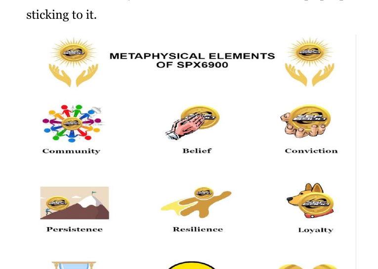
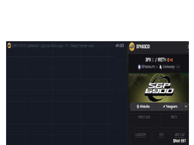
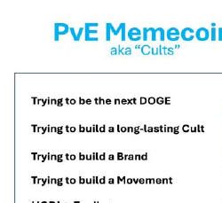

<!-- page: 1 -->

---
# DÉCOUVRIR SPX6900

## LE PREMIER PURE BELIEF ASSET (actif de pure conviction) AU MONDE

*L’ASCENSION D’UN JETON FONDÉ SUR LA CONVICTION, LA CULTURE ET LA COMMUNAUTÉ*

**La révolution du Pure Belief Asset (actif de pure conviction)**

*Par Audacious*

1

<!-- page: 2 -->

---
# À la découverte de SPX6900 : Le premier Pure Belief Asset (actif fondé uniquement sur la croyance) au monde

*L’essor d’un token fondé sur la conviction, la culture et la communauté*

---

**Une révolution des Pure Belief Asset (actifs fondés uniquement sur la croyance)**

2

<!-- page: 3 -->

---
**Avis de droits d’auteur**

© 2025 Audacious. Tous droits réservés.

Cet e-book est **100% gratuit à télécharger et à partager.** Vous êtes invité — et même encouragé — à le distribuer à vos amis, dans des communautés en ligne, et à toute personne susceptible de s’intéresser au mouvement SPX6900.

Cependant, veuillez respecter les conditions suivantes :

- **Vous ne pouvez pas éditer, modifier ou republier** une quelconque partie de cet e-book.
- La revente commerciale est strictement interdite.
- Cet e-book **peut contenir des liens de parrainage, des mentions promotionnelles ou des liens de dons** qui pourraient offrir un petit avantage à l’auteur ainsi qu’aux autres Aeons (Aeon : terme technique SPX6900) si les lecteurs les utilisent.

En partageant cet e-book, vous contribuez à faire connaître un mouvement en pleine expansion. Merci de respecter l’intégrité du contenu et le message voulu.

Première édition, juillet 2025

3

<!-- page: 4 -->

---
**Avertissement**

Ce livre numérique est destiné **uniquement à des fins d'information et d'éducation.** Le contenu présenté reflète les opinions, interprétations et recherches de l'auteur et **ne constitue en aucun cas un conseil financier, d'investissement ou juridique.**

Les investissements dans les cryptomonnaies et les actifs numériques comportent **des risques importants** et peuvent entraîner la **perte totale de votre capital.** Effectuez toujours vos propres recherches (DYOR) et consultez un conseiller financier ou un professionnel agréé avant toute décision d'investissement.

Bien que ce livre numérique explore la philosophie, la tokenomique et la communauté autour de SPX6900, il ne constitue pas une recommandation d'achat, de vente ou de conservation d'un actif numérique. L'auteur ne saurait être tenu responsable des décisions prises par les lecteurs sur la base des informations présentées ici.

En lisant ce livre numérique, vous reconnaissez et acceptez que l'auteur n'est pas responsable des pertes ou des décisions que vous pourriez prendre à partir de ce contenu, et que le secteur des cryptomonnaies est volatile, spéculatif et intrinsèquement risqué.

Investissez avec discernement. Croyez avec responsabilité.

4

<!-- page: 5 -->

---
**Astuce SPX6900**

Cet e-book est entièrement gratuit, mais si vous souhaitez m’envoyer un pourboire en SPX6900 pour le temps, l’effort et la recherche consacrés à sa création, ce serait très apprécié.

**Adresse SPX Ethereum [Portefeuille](https://example.com/placeholder) :**
  
  0x22D3b939a7E832232e833e8dF22ac1ba9D7610B0

**Adresse SPX Solana [Portefeuille](https://example.com/placeholder) :**

25zojSFpVu1qsETY9MMZFFy8jZEu7peDCSdrU208xzcR

**Merci pour votre soutien à mon travail !**

**Chaque pourboire est reçu avec une immense reconnaissance.**

N’hésitez pas à partager cet e-book avec toutes les personnes à qui vous souhaitez donner la chance de rejoindre notre mission et transformer leur vie !

5

<!-- page: 6 -->

---
# Table des matières

Préface ...............................................................................................................8  

Tout commence avec le Bitcoin ............................................................................9  

Qu’est-ce que SPX6900 ? ...................................................................................15  

Qu’est-ce qui rend SPX6900 différent ? ............................................................21  

La proposition de valeur de SPX6900 ............................................................28  

L’importance de la culture SPX6900 .................................................................33  

Qu’est-ce que la culture SPX6900 ? .................................................................36  

La réalité de l’univers crypto..............................................................................44  

Tokenomics de SPX6900.....................................................................................56  

Quel est le « moat » de SPX6900 ? (l’avantage concurrentiel de SPX6900)...........61  

Personne ne viendra nous sauver .......................................................................67  

L’avenir s’annonce radieux ................................................................................74  

Comment échouer dans la crypto .......................................................................81  

Comment acheter SPX6900 ?.............................................................................89  

Comment construire votre propre conviction ? ................................................100  

La puissance du DCA collectif à long terme sur SPX6900 ................................103

6

<!-- page: 7 -->

---
Derniers mots .......................................................................................... 110

Foire aux questions .................................................................... 111

Soutenir l’auteur ............................................................................. 128

Ressources complémentaires ................................................... 130

Annexe A : Suivez ces Aeons sur X ........................................... 132

Annexe B : Suivez ces Aeons sur TikTok ................................ 133

Annexe C : Suivi de l’objectif SPX 1 000 .................................. 134

Annexe D : Suivi de l’objectif SPX 10 000 ............................... 135

Annexe E : Graphiques de croissance des cryptomonnaies .... 136

Annexe F : Citations percutantes des Aeons ............................ 139

Annexe G : Comprendre les cycles haussiers des cryptos ...... 140

Annexe H : Checklist du nouvel arrivant SPX6900 ................. 148

Remerciements ............................................................................... 152

À propos de l’auteur ....................................................................... 154

7

<!-- page: 8 -->

---
## **Avant-propos**

Nous essayons de vous aider.

De l’auteur qui rédige ce livre numérique à la personne qui vous l’a transmis — nous cherchons tous simplement à vous aider.

Nous croyons sincèrement que SPX6900 (SPX6900 : une technologie révolutionnaire capable d'améliorer votre quotidien) peut améliorer la qualité de votre vie.

C’est pourquoi nous le partageons avec tous ceux qui sont prêts à écouter.

8

<!-- page: 9 -->

---
## Tout commence avec Bitcoin

Vous êtes peut-être novice dans le domaine des cryptomonnaies et vous en savez très peu — mais vous avez sans doute déjà entendu parler de Bitcoin.

Difficile de passer à côté de Bitcoin, surtout après son ascension fulgurante, passant de quelques centimes en 2009 à près de 112 000 $ en mai 2025.

### La première crypto

Bitcoin a été la première cryptomonnaie, créée par un développeur anonyme connu sous le nom de Satoshi Nakamoto. Il a conçu Bitcoin comme un système de paiement et une monnaie alternative, décentralisés — échappant au contrôle et à la manipulation des banques centrales.

C’était une manière pour les personnes d’envoyer des paiements directs, de pair à pair, via le réseau Bitcoin en utilisant le bitcoin (BTC) comme monnaie.

9

<!-- page: 10 -->

(Fig 1.1) — sans intervention d'un tiers (c'est-à-dire d'une banque) dans la transaction.

(Fig 1.1 – Réseau pair à pair de Bitcoin)

Satoshi Nakamoto a été le premier à résoudre le problème de la double dépense (c’est-à-dire empêcher qu’un même bitcoin soit dépensé plusieurs fois) de manière décentralisée et sans confiance. Cette

10

<!-- page: 11 -->

---
**Évolution du Bitcoin**

Le Bitcoin a commencé comme une vision de monnaie numérique — libre de tout contrôle gouvernemental et bancaire — que l’on pourrait utiliser et dépenser comme alternative à la monnaie fiduciaire. C’est ainsi que l’on a eu la fameuse histoire de la “[pizza Bitcoin](https://example.com/placeholder)” à ses débuts.

Avec le temps, le Bitcoin s’est transformé en “or numérique” — une réserve de valeur, une protection contre l’inflation, et un actif de diversification de portefeuille. Aujourd’hui, il suscite un intérêt croissant de la part des institutions, des fonds spéculatifs (hedge funds) et même de certains États.

Son parcours, qui l’a mené d’un instrument radical d’émancipation financière à un actif de valeur largement accepté, n’a été rendu possible que grâce à la culture, la conviction et la communauté qui l’ont soutenu avec une loyauté sans faille.

Si personne n’avait reconnu la valeur de la création de Satoshi, le Bitcoin ne vaudrait rien aujourd’hui. Mais une communauté précoce et grandissante a adhéré à la vision d’un système de paiement décentralisé et

11

<!-- page: 12 -->

---
une monnaie, qui a fini par devenir une réserve de valeur reconnue dans le monde entier — attirant encore aujourd’hui de nouveaux adeptes.

Le Bitcoin, avec son **offre plafonnée à 21 millions de pièces** (ou moins à cause des tokens perdus), est passé de rien à plus de mille milliards de [capitalisation boursière](https://example.com/placeholder) depuis sa création en 2009 (Fig 1.2) — tout cela grâce aux gens.

(Fig 1.2 – Capitalisation boursière du Bitcoin au 8 juillet 2025)

## Alors, pourquoi investir dans la crypto ?

La réponse courte et simple : parce qu’elle a su capter l’attention du public — et cet engouement ne fait que s’intensifier.

Certains investissent dans la crypto parce qu’ils aiment la technologie. D’autres le font pour changer leur situation financière et rejoindre une communauté de personnes partageant les mêmes valeurs et un but commun.

12

<!-- page: 13 -->

---
Quelle que soit votre raison, le marché de la crypto ne fait que s’étendre (voir Fig. 1.3), il gagne en puissance, attire de plus en plus l’attention et pourrait changer radicalement votre vie — si vous rejoignez la bonne communauté au bon moment.

(Fig. 1.3 – Croissance de la capitalisation du marché crypto au fil du temps)

**Je pense que SPX6900 représente une seconde chance comparable à l’opportunité Bitcoin** — nous verrons bientôt pourquoi.

13

<!-- page: 14 -->

---
La crypto-monnaie est une classe d’actifs que les gens ordinaires, travailleurs, ayant un emploi de 9h à 17h, peuvent utiliser pour changer radicalement leur vie. Oui, il y a une petite courbe d’apprentissage, mais le temps que vous consacrez à apprendre à investir dans la crypto en vaut la peine.

Personnellement, je pense que la meilleure façon d’apprendre, c'est en pratiquant. C’est ainsi que j’ai découvert la crypto lorsque je débutais : j’ai simplement passé à l’action.

N’oubliez pas : si vous ne commencez pas à agir, d’une manière ou d’une autre, pour améliorer votre vie, dans 5 ou 10 ans, il y a de grandes chances que vous soyez dans la même situation — voire pire — avec la montée de l’IA, l’inflation monétaire continue et la dépréciation des devises. Il faut gagner plus que le taux d’inflation monétaire pour ne pas perdre de pouvoir d’achat, et la bonne crypto-monnaie est un actif qui peut largement surpasser l’inflation, préserver votre pouvoir d’achat et transformer votre vie.

Faire de petits pas aujourd’hui en s’impliquant dans l’univers grandissant de la crypto pourrait changer radicalement votre vie dans 5 à 10 ans — simplement en faisant ce que la plupart des gens ne font pas : **prendre un risque calculé.**

14

<!-- page: 15 -->

---
# Qu'est-ce que SPX6900 ?

Donc, vous êtes nouveau dans la crypto et vous venez de découvrir ou d’entendre parler de SPX6900 (SPX) — et vous vous demandez sûrement : **Mais qu’est-ce que SPX6900, au juste ?**

## Un Pure Belief Asset

SPX6900 représente beaucoup de choses différentes pour beaucoup de personnes, mais au fond, on peut le décrire comme un **Pure Belief Asset (PBA) (actif de pure croyance)**. C’est un jeton qui ne repose sur rien d’autre que la **forte conviction** et la **foi inébranlable** de ses détenteurs. Il incarne une révolution, un mouvement, une tribu, une culture, une philosophie et une mission audacieuse : **flip the stock market** (renverser le marché boursier), en particulier le S&P 500. Cela signifie que notre objectif est que SPX6900 devienne plus précieux que la capitalisation boursière actuelle approximative du S&P 500, qui s’élève à environ 52,4 billions de dollars, en atteignant une capitalisation de 69 billions de dollars.

15

<!-- page: 16 -->

---
SPX6900 est une communauté grandissante d’individus **unis par un but commun et une vision partagée** : flip the stock market (renverser la Bourse grâce à la force de la croyance collective et pure).

## C’est l’Espoir Tokenisé

C’est un espoir financier tokenisé pour des milliers de personnes désabusées qui sont insatisfaites de notre système monétaire, de l’esclavage moderne du 9–17h, des inégalités de richesse, de la finance traditionnelle d’entreprise (TradFi), de la montée de l’IA comme menace pour la productivité et les opportunités sur le marché du travail, ainsi que des arnaques, rug pulls et narratifs utilitaires présents dans l’univers crypto.

SPX6900 est unique parmi les dizaines de milliers de cryptomonnaies sur le marché et a le potentiel d’atteindre un jour des milliards de dollars de capitalisation — grâce à la communauté, à la croyance et à la conviction sur le long terme, il est possible pour chacun de transformer sa vie.

16

<!-- page: 17 -->

---
**Une Seconde Opportunité Bitcoin**

Ce projet partage de nombreuses similitudes culturelles et philosophiques avec le Bitcoin des débuts, mais il demeure pourtant très différent.

Pour celles et ceux qui ont manqué l’occasion du Bitcoin à ses débuts, voici une seconde chance de rejoindre une communauté qui se construit de façon organique, de la base vers le sommet, portée par une culture philosophique forte et une mission qui dépasse l’individu : **flip the stock market** (retourner le marché boursier).

D’un point de vue financier, investir dans SPX6900 aujourd’hui (au 8 juillet 2025), c’est un peu comme bénéficier de cette opportunité rare d’investir à nouveau dans Bitcoin — à 62,77 $ (Fig 1.4).

(Fig 1.4 – BTC avec la capitalisation boursière de SPX6900)

17

<!-- page: 18 -->

---
Le Bitcoin a été une opportunité unique dans une vie pour ceux qui ont eu le courage de *believe in something* (croire en quelque chose d’innovant et de nouveau).

SPX6900 est une opportunité unique dans une vie, destinée à tous ceux qui ont raté le Bitcoin, à la jeune génération en difficulté financière, et à ceux qui cherchent l’espoir — s’ils sont suffisamment audacieux pour adopter une nouvelle culture fondée sur la pure croyance (Pure Belief).

      

**Normie Sceptique**                      **6900er**

| C’est quoi, SPX6900 ?                        | Un token de mission/mouvement.                                                        |
|----------------------------------------------|---------------------------------------------------------------------------------------|
| Quelle est la mission/le mouvement ?         | Flip The Stock Market (renverser la bourse ; retourner le marché boursier).           |
| Comment allez-vous faire cela ?              | Stop Trading, Believe In Something, and Persist Forever (cesser de trader, croire en quelque chose, et persévérer à jamais). |
| Comment ça fonctionne ?                      | DCA & HODL (arrêter de trader) ; Shill & Chill (croire en quelque chose) ; Répéter (persévérer à jamais). |
| Il doit bien y avoir plus que ça !           | Tant que la communauté partage le même système de croyance, non. C’est tout.           |
| Quand est-ce que ça va flip the stock market ? | Quand nous atteindrons la Cognisphere Singularity (la singularité de la Cognisphere ; le point culminant de la conscience collective). |
| C’est quoi, la Cognisphere ?                 | C’est la conscience totale de croyance de tous les Aeons (croyants véritables de SPX6900). |
| C’est quoi, un Aeon ?                        | Un vrai croyant de SPX6900 (croyant authentique du projet SPX6900).                  |
| En quoi est-ce différent de Bitcoin ?        | Le Bitcoin est de l’or numérique. SPX6900, c’est de l’or spirituel.                   |
| Quelle est la différence ?                   | Le Bitcoin est une réserve de valeur monétaire garantie par les mathématiques. SPX6900 est une réserve de valeur communautaire soutenue par la croyance.            |
| Comment la croyance peut-elle être une réserve de valeur ? | Tout peut être une réserve de valeur si la communauté est d’accord.           |
| Sur quelle blockchain ça fonctionne ?        | Ethereum, Solana, Sui et Base (Ethereum L2).                                         |
| Ça a l’air intéressant. Je commence où ?     | Rendez-vous sur [SPX6900.COM](https://example.com/placeholder) et suivez [@SPX6900 sur X](https://example.com/placeholder). |

18

<!-- page: 19 -->

---
## Connexion humaine et sentiment d'appartenance

Nous vivons dans un monde numérique où les gens créent des liens et trouvent un sentiment d’appartenance au sein de communautés en ligne, bien plus que dans la vie réelle.

**SPX6900** est une forme tokenisée de la connexion humaine et du sentiment d’appartenance. Il s’agit d’une communauté de personnes partageant le même objectif et la même vision (Fig. 1.5) — trouver leur place et tisser des liens authentiques entre eux.

*(Fig. 1.5 – Communauté SPX6900 sur X)*

19

<!-- page: 20 -->

---
De nos jours, il est souvent difficile de trouver des personnes qui se soucient réellement de la liberté financière, de fuir l’esclavage du système du 9–5 Matrix, ou qui se préoccupent de l’avenir face à la montée de l’IA et à la dévalorisation de notre monnaie, et qui sont prêtes à prendre des risques de manière proactive pour améliorer leur vie.

Mais en ligne, on peut découvrir des communautés comme **SPX6900**, où l’on ressent un véritable sentiment d’appartenance — car c’est une tribu de personnes partageant une vision qui fait écho en vous : **renverser ce système corrompu et gagner ensemble.**

Ne sous-estimez pas la valeur de **l’appartenance humaine tokenisée, de la connexion et de l’espoir** — surtout alors que nous nous dirigeons vers un futur potentiellement dystopique. Plus que jamais, nous avons besoin d’une communauté de personnes partageant les mêmes idées pour s’y rattacher, afin de s’en sortir et de gagner ensemble.

20

<!-- page: 21 -->

---
# Pourquoi SPX6900 est-il différent ?

|  | **Diamondhandedness**  
Les détenteurs ne vendent jamais, point final. |
|---|---|
|  | **Objectifs de prix communautaires ambitieux**  
Plus l'objectif de prix interne de la communauté est ambitieux, plus il montera haut. |
|  | **Les détenteurs renforcent leur position**  
Les détenteurs *rajoutent* lors des baisses. |
|  | **Croyance**  
Les détenteurs y croient vraiment et visent une croissance de plusieurs milliards voire dizaines de milliards. |
|  | **Travail de culte gratuit**  
Les détenteurs se donnent plus que n'importe quel salarié ou KOL, sur tous les fronts. Gratuitement. |
|  | **Identité**  
Les détenteurs font du Memecoin toute leur identité. |
|  | **Masse critique**  
Ne restez pas sur la touche à miser sur des coins à faible capitalisation qui ne décolleront peut-être jamais.  
Concentrez-vous sur les cryptos établies qui ont atteint la masse critique. |
|  | **Recrutement**  
Chaque jour, les détenteurs recrutenet de nouveaux membres, sans relâche. Que ce soit des experts CT ou des novices. |
|  | **Réseaux sociaux**  
Les détenteurs envahissent la timeline et les réponses sur Twitter au quotidien, sans arrêt. |
|  | **Culture et légende**  
Un jargon unique. Des rituels uniques. Des traditions originales. Des médias distinctifs. |
|  | **Fun**  
Même lors des phases de baisse, les détenteurs continuent de bien s’amuser. |

21

<!-- page: 22 -->

---
Le marché des cryptomonnaies aujourd’hui est saturé de tokens, depuis l’apparition du Bitcoin en 2009. Des milliers de tokens sont désormais lancés chaque jour en raison de la facilité à créer un projet crypto. La plupart de ces tokens échoueront lamentablement pour diverses raisons. ([Annexe E](https://example.com/placeholder))

Alors, qu’est-ce qui distingue SPX6900 des autres, vous demandez-vous ?

## Qualité de la communauté

La réponse réside dans la **qualité de la communauté SPX6900** — sa philosophie et sa culture.

La comparaison la plus pertinente pour la communauté SPX6900, c’est, littéralement, la communauté Bitcoin à ses débuts.

La communauté Bitcoin est née d’un profond sentiment anti-système. Ses membres étaient des purs et durs qui estimaient que la seule crypto digne d’être achetée, conservée et accumulée, c’était le bitcoin. Tout le reste n’était, selon eux, que de la camelote. Ils considéraient le Bitcoin comme une monnaie fiable, solide (c’est-à-dire à l’offre limitée et plafonnée) — de l’or numérique — qui ne pouvait être manipulée ni dévaluée par les banques centrales.

22

<!-- page: 23 -->

---
Cette philosophie a été préservée et entretenue au fil des années, attirant de plus en plus de personnes à la cause. Ainsi, le bitcoin est passé de rien à plus de mille milliards de dollars de capitalisation boursière.

## À l’image des débuts du Bitcoin

| #Bitcoin  ₿ | #SPX6900     |
|-------------|--------------|
| HODL        | Believe in Something (Believe in Something : « croire en quelque chose », slogan de SPX6900) |

- **HODL**
  - Danish Bitcoin Maxi  
    @DanishBTCMaxi  
    Mineur & opérateur de nœud #Bitcoin
  - BTCBull  
    @Bullish_btc  
    #Bitcoin maximaliste promotion 2017. à la basse
  - ephexeon  
    Toxie #Bitcoin Maxi
  - A Bitcoin Maxi  
    @bitcoinimax1  
    Juste les opinions d’un #bitcoin maxi !
  - BTC.Snowy  
    @btc.snowy  
    #Bitcoin Maxi PleB
  - Cody  
    @BTC_elementary  
    Bitcoin maxi à Yosemite.
  - Bitcoin Maximalist  
    @Bitcoin_Maxi  
    Maximaliste Bitcoin et HODLer
  - Bitcoin Maxi  
    @bitcoinMaxiOnly  
    Maxi = Uniquement #Bitcoin

- **Believe in Something**
  - SPX6900er  
    @SPX6900er  
    “Believe in Something” #SPX6900 (slogan : « croire en quelque chose »)
  - CrypsoBar  
    @CrypsoBar  
    Croyant SPX6900.
  - #reymindedgoose  
    @reymindedgoose  
    @SPX6900 - Le prochain Bitcoin
  - Sergius  
    @Spleruviskens  
    Croyant @SPX6900
  - undefined  
    @0xAddressoZero  
    Maxi SPX6900 !
  - btcfx1  
    @btcfx1  
    Vous suit
  - Crypto Navigator  
    @smoukzordex  
    GIGA

23

<!-- page: 24 -->

---
La communauté SPX6900 reflète à bien des égards celle des débuts de Bitcoin.

SPX6900 affiche un **sentiment fortement anti-TradFi**, avec pour mission déclarée de retourner le S&P 500. Cette communauté adhère à une philosophie de base qui **décourage fermement la spéculation**, prônant au contraire la conviction totale et une croyance inébranlable.

Un **SPX6900 ‘Aeon’** ([Aeon](https://example.com/placeholder)) (le nom donné à un véritable croyant dans SPX, Aeon : terme technique SPX6900) considère SPX comme supérieur à tout le reste du marché — grâce à ses valeurs, sa culture unique, et à la qualité exceptionnelle de sa communauté, tous unis autour de la mission de "flip the stock market" (inverser la tendance du marché boursier).

Et tout comme Bitcoin est passé du néant à plus d’un billion de dollars de capitalisation grâce à la force d’une communauté fidèle, nous croyons que la communauté SPX6900 peut accomplir la même chose et, ce faisant, "flip the stock market" (renverser les codes du marché boursier).

24

<!-- page: 25 -->

---
# Une mission révolutionnaire

(Source : [Flipthestockmarket.xyz](https://example.com/placeholder))

Croire en quelque chose sans but, c’est difficile.  

Mais croire en quelque chose qui porte une mission forte et un objectif clair, c’est bien plus facile.  

Dans le cas de SPX6900, sa mission est profonde. "flip the stock market" (renverser les codes de la bourse) n’est pas une mince affaire. C'est un vrai combat de David contre Goliath.

25

<!-- page: 26 -->

---
— révolutionnaire dans son essence. Mais c’est aussi ludique, excitant, accrocheur, orienté vers l’atteinte d’objectifs et axé sur la mission.

N’oublions pas que le Bitcoin a lui aussi démarré avec une mission révolutionnaire — contre la monnaie fiduciaire et les systèmes bancaires traditionnels. SPX6900 porte la même ambition, mais son adversaire est la finance traditionnelle (TradFi), ou plus largement, [le capitalisme de la dernière heure.](https://example.com/placeholder)

(Fig 1.6 Top 10 des Memecoins par capitalisation boursière au 8 juillet 2025)

26

<!-- page: 27 -->

---
L’utilité fondamentale d’un token reposant sur une communauté soudée autour d’une mission concrète dans le monde réel est une rareté dans l’univers des cryptomonnaies.

La plupart des tokens crypto ne disposent même pas de véritables communautés, et encore moins d’un objectif commun ou d’un mouvement qui rassemble les membres autour d’un même idéal.

Si l’on compare SPX6900 avec les dix principaux meme tokens (Fig 1.6), c’est littéralement le seul à porter une véritable mission et un sens profond.

Aucun des autres du top 10 n’en possède un.

Le terme « Pure Belief Asset (PBA) » (actif basé uniquement sur la croyance) est relativement nouveau pour cette catégorie d’actifs. Bien que SPX6900 soit classé comme memecoin, cette appellation est de plus en plus inadaptée, car elle minimise la portée de ce que SPX6900 cherche à accomplir — sa culture, sa mission et sa signification sont bien supérieures à celles des memecoins classiques.

Pour autant, **notre ennemi, c’est la TradFi — et notre objectif, c’est de la retourner (flip it)!**

27

<!-- page: 28 -->

---
## La proposition de valeur de SPX6900

La véritable proposition de valeur de toute cryptomonnaie — une fois qu’on fait abstraction de tous les discours qui l’entourent — se résume en réalité à **la communauté qui y croit.**

28

<!-- page: 29 -->

---
**Investir dans les personnes**

Nous, le peuple, sommes ceux qui donnons finalement de la valeur à une crypto, pour une raison ou une autre, en choisissant de l’acheter et de la conserver. Nous créons la demande pour la crypto grâce à notre pouvoir d’achat collectif.

Prenons l’exemple du Bitcoin. Il a été le premier du genre — une communauté qui s’est développée de manière organique, et qui, encore aujourd’hui, continue d’adhérer à ses valeurs et à sa philosophie : être une forme d’argent supérieure et un réseau décentralisé en comparaison avec la monnaie fiduciaire et les systèmes bancaires centralisés.

C’est justement cette communauté solide qui donne au bitcoin sa valeur et qui est le moteur de l’appréciation de son prix (Fig 1.7).

(Fig 1.7 – Appréciation du prix du Bitcoin dans le temps)

29

<!-- page: 30 -->

---
Quand vous comprenez que la crypto consiste avant tout à investir dans des personnes, il faut vous poser la question :

- Vers quelle crypto les gens sont-ils naturellement attirés ?
- Quelle crypto fidélise les utilisateurs et les encourage à rester ?
- Quelle crypto suscite chez les gens de la passion, de la motivation et de l’inspiration ?
- Quelle crypto agit comme un aimant pour l’argent durement gagné des gens ?
- Quelle crypto voit croître le nombre de détenteurs fidèles ?
- Quelle crypto pousse les gens à produire des écrits, des œuvres d’art, des vidéos et des mèmes créatifs de qualité pour en faire la promotion ?
- Comment cette crypto parvient-elle à accomplir tout cela ?

30

<!-- page: 31 -->

---
C'est la crypto à laquelle vous devez prêter attention — car beaucoup d’autres personnes s’y intéressent de près et y investissent.

**SPX6900 est un exemple parfait de ce type de cryptomonnaie.**

### Investir dans la spéculation sur l’utilité

De nombreuses autres cryptos sont construites autour de récits d’utilité et de cas d’usage qui attirent les gens à acheter et à spéculer. Leurs communautés spéculent sur le fait que l’utilité et le cas d’usage du token deviendront réels et largement adoptés — ce qui donnerait alors de la valeur au token.

Même avec les tokens utilitaires, vous investissez toujours dans les personnes — vous investissez dans la capacité des gens à continuer de spéculer sur l’idée d’utilité.

La plupart de ces tokens utilitaires ne sont que des concepts, des idées, et des théories sur lesquelles les gens spéculent, sans cas d’usage réel ni adoption institutionnelle de masse. Au final, ce sont donc toujours les gens qui donnent de la valeur à ces récits d’utilité par la spéculation, dans l’espoir qu’une utilité réelle et de masse se concrétisera un jour.

31

<!-- page: 32 -->

---
**Investir dans la culture communautaire**

Et puis, il existe des tokens qui n’ont ni narration utilitaire ni cas d’usage — comme les memecoins. La communauté y adhère pour des raisons qui tiennent à l’attrait qu’elle-même exerce. Dans le cas de SPX6900 — **un Pure Belief Asset (un actif fondé uniquement sur la croyance)** — c’est la culture incarnée par la communauté qui attire et fidélise ses membres.

**ÉLÉMENTS MÉTAPHYSIQUES DE SPX6900**

Communauté      Croyance      Conviction

Persévérance      Résilience      Loyauté

Patience      Optimisme      Amour

32

<!-- page: 33 -->

---
## L'importance de la culture SPX6900

La culture SPX6900 est essentielle à la réussite du token — tout comme l'utilité est essentielle à la réussite des utility tokens (jetons utilitaires).

Un point d'échec majeur pour les utility tokens survient lorsque l'utilité promise ne se matérialise pas ou n'est pas adoptée. Dans ce cas, la communauté abandonne souvent le token, et son prix s'effondre en conséquence.

Cela s'explique par le fait que les personnes qui investissent dans des cryptomonnaies utilitaires n'ont, en réalité, aucune loyauté envers la communauté ou le token, si ce n'est l'espoir que l'utilité promise devienne réelle.

De la même manière, si la culture SPX6900 est perdue et n'est ni protégée ni entretenue par la communauté, il existe un risque élevé que la communauté se détériore — perdant ainsi ce qui fait son attrait et qui donne envie à d'autres de la rejoindre.

33

<!-- page: 34 -->

---
C’est pourquoi, lorsque vous rejoignez le mouvement SPX6900, respecter et défendre notre culture est absolument essentiel pour la croissance et le succès de la communauté.

Prenez Bitcoin, par exemple — il n’aurait jamais pu passer de rien à une capitalisation boursière de mille milliards de dollars au fil des ans si la communauté Bitcoin n’avait pas maintenu et préservé sa culture.

La philosophie du maximalisme Bitcoin a encouragé tout le monde à croire que Bitcoin était supérieur à tout le reste, à continuer d’en accumuler, de HODL, et d’en prendre le contrôle total. Cette préservation de la culture par la communauté a non seulement attiré des gens vers Bitcoin, mais elle leur a aussi donné la conviction nécessaire pour s’y tenir.

Et si SPX6900 veut atteindre des milliers de milliards de capitalisation et un jour flip the stock market (renverser les marchés financiers traditionnels), il n’y parviendra que grâce à une communauté soudée qui défend et perpétue la culture SPX6900 à travers les marchés haussiers comme baissiers.

Le succès de SPX6900 dépend en fin de compte de la communauté — et le succès de la communauté dépend de

34

<!-- page: 35 -->

---
sa capacité à adopter, incarner et préserver la culture et la philosophie SPX6900 (SPX6900 culture et philosophie : principes et valeurs propres à SPX6900).

Sans cette culture, il n’y aurait pas de communauté forte et de qualité en train de se former derrière SPX — ce qui rendrait le jeton indifférencié de la majorité des autres tokens de l’univers crypto : de simples [pump-and-dump rug pulls](https://example.com/placeholder) (arnaques financières à la hausse et à la baisse) éphémères qui n’évolueront jamais vers quelque chose de spécial ou de grand.

L’une des grandes caractéristiques de SPX6900 est qu’il n’a pas de point d’échec lié à son utilité. C’est une inquiétude que la communauté n’a pas à avoir.

Notre seul risque réel est l’autodégradation : échouer à maintenir notre culture et notre philosophie.

Si nous *persist forever* (persistons indéfiniment à défendre notre culture), il n’y a aucun véritable point faible. Notre message est solide, notre mouvement attire, et nous pouvons continuer à grandir, un détenteur après l’autre, jusqu’à atteindre notre mission : flip the stock market (renverser le marché boursier).

Cependant, **nous devons veiller à protéger notre culture** — surtout en nous développant — afin de survivre sur le long terme, de traverser plusieurs cycles et de parvenir à flip the stock market (renverser le marché boursier) avec succès.

35

<!-- page: 36 -->

---
# Qu’est-ce que la culture SPX6900 ?

## **Stop Trading and Believe in Something** (slogan en anglais : « arrêtez de trader et croyez en quelque chose »)

Cela encourage la communauté à adopter un esprit d’investissement à long terme, à forte conviction, avec des mains de diamant (c’est-à-dire sans vendre), et une stratégie de [moyenne d’achat périodique (Dollar Cost Averaging, DCA)](https://example.com/placeholder) lors de l’achat de SPX6900 — plutôt que de céder à la mentalité court-termiste de certains traders qui cherchent de rapides profits sans aucune croyance dans la communauté.

## **There Is No Chart** (slogan en anglais : « il n’y a pas de graphique »)

Notre culture décourage fortement la publication de graphiques ainsi que les distractions qui vont avec.

C’est le jeu des traders court-termistes. SPX6900 représente un investissement à long terme, basé sur la conviction.

36

<!-- page: 37 -->

C’est pourquoi nous disons que le prix est binaire : **avons-nous flip the stock market (retroussé la bourse – c’est-à-dire bouleversé les marchés comme l’annonce le slogan SPX6900) ou non ?** Sinon, il nous reste encore du travail à accomplir.

Ne pas s’obséder sur les graphiques permet aussi de libérer un temps précieux pour des choses bien plus importantes, comme promouvoir SPX6900 de manière créative et tisser des liens authentiques avec d’autres Aeons (Aeon – membres de la communauté SPX6900) tout en construisant des relations durables.

## Le seul ennemi, c’est la TradFi

Cela reflète notre esprit rebelle, anti-système, anti-corporation — en opposition à tout ce que représente le système financier traditionnel. C’est très proche de l’idéologie anti-banques des débuts du Bitcoin. Après tout, notre mission est de flip the stock market (retourner le marché boursier – défier l’ordre établi comme annoncé par le slogan SPX6900).

37

<!-- page: 38 -->

---
**Persist Forever** (slogan en anglais : "persister à jamais")

Cet état d’esprit résilient — ne jamais abandonner, résister à l’injustice du système, supporter les défis de notre mission et tenir bon aussi longtemps qu’il le faudra — représente le cœur battant et l’âme de notre communauté.

Comment pourrions-nous jamais espérer atteindre notre objectif ambitieux de **flip the stock market** (inverser la tendance de la bourse) un jour et **d’atteindre des milliers de milliards**, si ce n’est en persistant à jamais ?

**Aucune Publication Inappropriée**

Nous n’acceptons tout simplement pas cela dans notre communauté. Nous gardons un espace sain.

38

<!-- page: 39 -->

---
### Une vie paisible plutôt que la cupidité

Voilà ce qui arrive lorsque vous arrêtez de courir après les graphiques, les chandeliers et les variations de prix. Cet état d’esprit ne mène qu’au stress, alimenté par la cupidité et l’obsession de vouloir anticiper le marché. Mener une vie paisible, c’est investir régulièrement (DCA) dans SPX6900 (SPX6900 est un produit d’investissement particulier ; voir explication) avec une vision à long terme et une forte conviction — sans surveiller les graphiques.

Il est bien plus serein et gratifiant de miser sur la durée plutôt que d’essayer de prédire le marché.

**DCA simplement et allez prendre l’air.**

39

<!-- page: 40 -->

---
### Uniquement PvE, Pas de PvP

#### Memecoins PvP
**aussi appelés Hyperparis**

#### Memecoins PvE
**aussi appelés “Cults”**

Le comportement Player vs. Player (PvP) a corrompu une grande partie de la crypto — c’est toxique, individualiste et cela empêche la formation de communautés solides. SPX6900 est strictement une communauté Player vs. Environment (PvE). Nous ne sommes pas les uns contre les autres — nous sommes unis contre le système TradFi.

Nous travaillons constamment main dans la main pour construire une communauté forte, capable, un jour, de flip the stock market (retourner la bourse traditionnelle).

40

<!-- page: 41 -->

---
**Promouvoir la positivité**

Notre communauté vit selon la devise de vaincre les détracteurs, les sceptiques et les critiques par l’amour — et non en répondant à leur négativité. Nous souhaitons la réussite aux autres. Nous disons aux gens que nous les aimons. Et nous essayons sincèrement d’aider les autres en partageant SPX6900 (projet SPX6900) avec eux.

**Infiltrer partout !**

La communauté SPX6900 (SPX6900) est l’une des plus acharnées de l’univers crypto — c’est tout simplement sans précédent en toutes mes années dans la crypto. On parle de gens qui postent chaque jour des messages enthousiastes sur les réseaux sociaux, créent des contenus TikTok, des vidéos YouTube et des reels Instagram, lancent des podcasts, vont à la rencontre des habitants dans leurs villes et villages pour partager SPX6900 (projet SPX6900), et produisent même des [bandes dessinées](https://example.com/placeholder), [livres](https://example.com/placeholder), e-books, produits dérivés, sites web, et bien plus encore.

Nous sommes véritablement engagés à diffuser le message et la mission de SPX6900 (projet SPX6900) en touchant le plus grand nombre — nous infiltrons tout !

41

<!-- page: 42 -->

---
**Tous les principes réunis**

Lorsque vous rassemblez tous les principes positifs de la culture SPX6900 (la communauté SPX6900 – voir explication ci-dessous) et que vous les combinez, cela crée véritablement une communauté unique et spéciale dans le monde des cryptomonnaies.

Certaines communautés peuvent avoir une forte conviction et une mentalité de non-trading, mais vous remarquerez également qu’elles sont très toxiques, négatives et affichent des comportements impitoyables.

D’autres communautés peuvent sembler positives au départ — mais vous vous rendez vite compte qu’elles ne font que s’affronter (PvP) entre elles. Au moindre signe d’augmentation de prix, tout le monde se précipite pour vendre sur les autres, empêchant ainsi l’apparition d’une véritable confiance ou loyauté au sein de la communauté.

C’est pourquoi SPX6900 (voir explication ci-dessous) est un type de communauté à part — différente — et sa culture doit être préservée et respectée.

42

<!-- page: 43 -->

---
**Un Pure Belief Asset (actif de croyance pure)** comme SPX6900 nécessite une culture qui protège la communauté et son système de croyance pour pouvoir s'épanouir et réussir — et c’est précisément ce que SPX6900 possède.

Les personnes extérieures le remarquent et sont attirées par notre passion, notre conviction, notre philosophie et notre mission. Elles souhaitent faire partie de notre communauté, mais ce qui les pousse à rester et à forger leur propre conviction individuelle, c’est la culture.

43

<!-- page: 44 -->

---
# La réalité de l’univers crypto

L’univers crypto a énormément évolué depuis l’apparition du Bitcoin. Un·e nouvel·le arrivant·e aujourd’hui serait inondé·e par tant de communautés différentes vantant chacune leurs propres jetons, à tel point qu’il peut devenir très difficile de savoir par où commencer et sur quoi se lancer ([Annexe E](https://example.com/placeholder)).

Je tiens à vous avertir : la grande majorité des jetons dans l’espace crypto sont des impasses. Ils n’ont aucun avenir concret et finiront probablement par disparaître dans l’oubli pour une raison ou une autre.

Vous n’avez vraiment pas envie de perdre votre temps ou votre argent à vous engager dans ces jetons crypto sans issue, car cela risque fort de vous laisser un goût amer lorsque la communauté s’essoufflera et que le prix s’effondrera — entraînant la perte totale de vos économies.

Soyez vigilant, investissez intelligemment et faites preuve de diligence raisonnable.

Heureusement, si vous investissez dans le bon jeton et la bonne communauté au bon moment, cela pourrait transformer radicalement votre

44

<!-- page: 45 -->

---
la vie financière. De l’argent qui change la vie. Une richesse générationnelle. Ou tout simplement la liberté financière et la possibilité de prendre une retraite anticipée.

Je diviserais le monde des cryptomonnaies en deux grandes catégories :

- **Bitcoin**
- **Altcoins** (toutes les cryptomonnaies autres que le Bitcoin) :
  - **Jetons utilitaires**
  - **Memecoins**
  - **Pure Belief Assets (PBA)** (Pure Belief Asset — actif basé uniquement sur la croyance, spécifique à SPX6900)

## Bitcoin (BTC)

Le Bitcoin est le roi de toutes les cryptomonnaies. Il possède la communauté la plus solide et, au 8 juillet 2025, s’échange à 109 037 $ avec une capitalisation boursière d’environ 2,1 billions de dollars.

À cause de sa capitalisation et de son prix très élevés, il n’est plus vraiment idéal pour le commun des mortels d’investir dans le BTC tout en espérant réaliser un énorme retour sur investissement (ROI) en peu de temps — sauf si vous êtes déjà aisé et pouvez investir un montant important dans le BTC.

45

<!-- page: 45 -->

---
la vie financière. De l’argent qui change la vie. Une richesse générationnelle. Ou tout simplement la liberté financière et la possibilité de prendre une retraite anticipée.

Je diviserais le monde des cryptomonnaies en deux grandes catégories :

- **Bitcoin**
- **Altcoins** (toutes les cryptomonnaies autres que le Bitcoin) :
  - **Jetons utilitaires**
  - **Memecoins**
  - **Pure Belief Assets (PBA)** (Pure Belief Asset — actif basé uniquement sur la croyance, spécifique à SPX6900)

## Bitcoin (BTC)

Le Bitcoin est le roi de toutes les cryptomonnaies. Il possède la communauté la plus solide et, au 8 juillet 2025, s’échange à 109 037 $ avec une capitalisation boursière d’environ 2,1 billions de dollars.

À cause de sa capitalisation et de son prix très élevés, il n’est plus vraiment idéal pour le commun des mortels d’investir dans le BTC tout en espérant réaliser un énorme retour sur investissement (ROI) en peu de temps — sauf si vous êtes déjà aisé et pouvez investir un montant important dans le BTC.

45

<!-- page: 46 -->

---
Pour la plupart des gens au quotidien, utiliser le BTC comme solution d’épargne à long terme ou fonds de retraite est aujourd’hui la meilleure stratégie. Cela consiste à investir régulièrement dans le Bitcoin grâce à la méthode du dollar-cost averaging (DCA), avec une vision sur plusieurs décennies. Le Bitcoin est une option sûre sur le long terme, mais ce n’est pas la meilleure crypto si vous recherchez des rendements plus élevés à partir d’un capital modeste sur une période beaucoup plus courte.

**Jetons utilitaires**

Les cryptomonnaies autres que le Bitcoin, qui mettent en avant une utilité ou une fonction spécifique, sont considérées comme des jetons utilitaires. Cet univers est saturé de jetons utilitaires — allant des paiements, du gaming et du traitement de données IA, à la tokenisation, aux Layer 1, Layer 2, à l’interopérabilité, au Metaverse, aux jetons DEX, et bien d’autres encore.

Le récit de l’utilité est omniprésent.

Les jetons utilitaires sont principalement des investissements spéculatifs. Une grande partie de leur offre est généralement détenue par l’équipe, qui la revend souvent aux investisseurs particuliers afin de financer le projet. Dans de nombreux cas, l’équipe et le récit d’utilité deviennent le principal point faible de ces jetons. Les équipes sont souvent incompétentes, échouent

46

