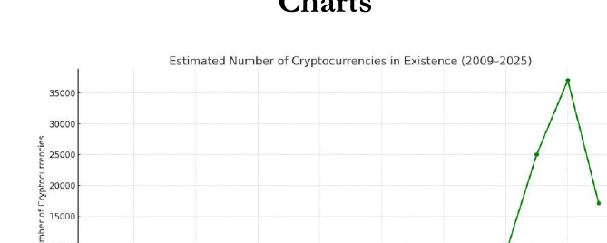

<!-- page: 1 -->

---
# ALLA SCOPERTA DI SPX6900

## IL PRIMO PURE BELIEF ASSET (letteralmente: "asset di pura convinzione") AL MONDO

*LA NASCITA DI UN TOKEN BASATO SU CONVINZIONE, CULTURA E COMUNITÀ*

**Una rivoluzione Pure Belief Asset (letteralmente: "asset di pura convinzione")**

*A cura di Audacious*

1

<!-- page: 2 -->

---
# Scoprendo SPX6900: Il primo Pure Belief Asset (PBA) al mondo

*L'ascesa di un token fondato sulla convinzione, la cultura e la comunità*

**Una rivoluzione del Pure Belief Asset (PBA)**

2

<!-- page: 3 -->

---
**Avviso sul Copyright**

© 2025 Audacious. Tutti i diritti riservati.

Questo e-book è **100% gratuito da scaricare e condividere.** Sei invitato — e anzi incoraggiato — a distribuirlo tra amici, comunità online e chiunque possa trovare interessante conoscere il movimento SPX6900.

Tieni però presente le seguenti condizioni:

- **Non è consentito modificare, alterare o ripubblicare** alcuna parte di questo e-book.
- La rivendita a scopo commerciale è severamente vietata.
- Questo e-book **può contenere link di referral, menzioni promozionali o link per donazioni** che potrebbero offrire un piccolo beneficio all'autore e ad altri Aeon (Aeon: membri/anime del movimento SPX6900) se utilizzati dai lettori.

Condividendo questo e-book contribuisci a diffondere la consapevolezza di un movimento in crescita. Grazie per rispettare l’integrità dei contenuti e il messaggio originale.

Prima Edizione, luglio 2025

3

<!-- page: 4 -->

---
**Disclaimer**

Questo e-book è destinato **esclusivamente a scopi informativi ed educativi.** Il contenuto riflette le opinioni, le interpretazioni e le ricerche dell’autore e **non costituisce consulenza finanziaria, d’investimento o legale.**

Gli investimenti in criptovalute e asset digitali comportano **rischi significativi** e possono comportare la **perdita dell’intero capitale.** Effettua sempre le tue ricerche personali (DYOR) e consulta un consulente finanziario o un professionista autorizzato prima di prendere qualsiasi decisione d’investimento.

Sebbene questo e-book esplori la filosofia, la tokenomics e la community intorno a SPX6900, non rappresenta una raccomandazione all’acquisto, alla vendita o alla detenzione di alcun asset digitale. L’autore non è responsabile per eventuali decisioni prese dai lettori sulla base delle informazioni qui presentate.

Leggendo questo e-book, riconosci e accetti che l’autore non è responsabile per eventuali perdite o decisioni da te prese sulla base del materiale presentato, e che il settore delle criptovalute è volatile, speculativo e intrinsecamente rischioso.

Investi con saggezza. Credi con responsabilità.

4

<!-- page: 5 -->

---
**SPX6900 Suggerimento**

Questo e-book è completamente gratuito, ma se desideri inviarmi una mancia in SPX6900 per il tempo, l’impegno e la ricerca che ci sono voluti per realizzarlo, te ne sarei profondamente grato.

**SPX Ethereum [Indirizzo Wallet:](https://example.com/placeholder)**  
0x22D3b939a7E832232e833e8dF22ac1ba9D7610B0

**SPX Solana [Indirizzo Wallet:](https://example.com/placeholder)**  
25zojSFpVu1qsETY9MMZFFy8jZEu7peDCSdrU2o8xzcR

**Grazie per il tuo sostegno al mio lavoro!**

**Ogni mancia è profondamente apprezzata.**

Condividi pure questo e-book con tutte le persone che vuoi aiutare a unirsi alla nostra missione e cambiare la loro vita!

5

<!-- page: 6 -->

---
# Indice

Prefazione .............................................................................................................8  
Tutto inizia con Bitcoin ..........................................................................................9  
Che cos'è SPX6900? ......................................................................................... 15  
Perché SPX6900 è diverso? ........................................................................... 21  
La proposta di valore di SPX6900 .............................................................28  
L'importanza della cultura SPX6900...................................................33  
Cos'è la cultura SPX6900? .....................................................................36  
La realtà del mondo cripto.................................................................44  
Tokenomics di SPX6900....................................................................................56  
Qual è il vantaggio competitivo (moat) di SPX6900? ............................................................................. 61  
Nessuno verrà a salvarci .....................................................................67  
Il futuro appare luminoso ...............................................................................74  
Come non farcela nel mondo cripto......................................................................81  
Come acquistare SPX6900?.................................................................................. 89  
Come costruire la propria convinzione?.........................................................100  
Il potere del DCA collettivo a lungo termine in SPX6900...103

6

<!-- page: 7 -->

---
Parole finali ................................................................................. 110

Domande frequenti ................................................... 111

Sostieni l’autore ................................................................... 128

Risorse aggiuntive ..................................................................... 130

Appendice A: Segui questi Aeon (Aeon: termine tecnico di SPX6900 che indica entità/profili) su X ................................. 132

Appendice B: Segui questi Aeon (Aeon: termine tecnico di SPX6900 che indica entità/profili) su TikTok ....................... 133

Appendice C: SPX 1,000 Goal Tracker ................................. 134

Appendice D: SPX 10,000 Goal Tracker ............................... 135

Appendice E: Grafici di crescita delle criptovalute ................. 136

Appendice F: Citazioni potenti dagli Aeon (Aeon: termine tecnico di SPX6900 che indica entità/profili) ................................. 139

Appendice G: Capire i cicli rialzisti delle criptovalute ............... 140

Appendice H: Checklist per i nuovi arrivati SPX6900 ................. 148

Ringraziamenti ................................................................... 152

Informazioni sull’autore ..................................................................... 154

7

<!-- page: 8 -->

---
## **Prefazione**

Stiamo cercando di aiutarti.

Dall’autore che sta scrivendo questo e-book alla persona che te lo ha trasmesso — vogliamo semplicemente aiutarti.

Crediamo sinceramente che SPX6900 (SPX6900 può migliorare la qualità della tua vita) possa davvero migliorare la qualità della tua vita.

Ecco perché lo condividiamo con chiunque sia disposto ad ascoltare.

8

<!-- page: 9 -->

---
## Tutto inizia con Bitcoin

Potresti essere nuovo nel mondo delle criptovalute e saperne ancora poco — ma probabilmente hai già sentito parlare di Bitcoin.

È difficile non aver sentito parlare di Bitcoin dopo la sua ascesa vertiginosa, da pochi centesimi nel 2009 a quasi 112.000 dollari nel maggio 2025.

### La Prima Criptovaluta

Bitcoin è stata la prima criptovaluta, creata da uno sviluppatore anonimo noto come Satoshi Nakamoto. Ha ideato Bitcoin come un sistema di pagamento e una valuta alternativa, decentralizzata — qualcosa che le banche centrali non potessero controllare o manipolare.

Era un modo per permettere alle persone di inviare pagamenti diretti, peer-to-peer, attraverso la rete Bitcoin utilizzando i bitcoin (BTC) come valuta.

9

<!-- page: 10 -->

---
(Fig 1.1) — senza l’intervento di terze parti (cioè banche) nella transazione.

(Fig 1.1 – Rete Peer to Peer di Bitcoin)

Satoshi Nakamoto è stato il primo a risolvere il problema della doppia spesa (cioè impedire che lo stesso bitcoin venga speso più di una volta) in modo decentralizzato e senza richiedere fiducia. Questo

10

<!-- page: 11 -->

---
**Evoluzione di Bitcoin**

Bitcoin è nato come una visione di denaro digitale — libero dal controllo di governi e banche — che le persone potessero usare e spendere come alternativa alla valuta fiat. È proprio per questo che abbiamo la celebre storia della “[pizza di Bitcoin](https://example.com/placeholder)” risalente ai suoi primi giorni.

Col tempo, Bitcoin si è trasformato in un “oro digitale” — una riserva di valore, una copertura contro l’inflazione e uno strumento di diversificazione del portafoglio. Oggi attira sempre più l’attenzione di istituzioni, hedge fund e persino Stati nazionali.

Il suo percorso, da strumento di liberazione finanziaria radicale a riserva di valore mainstream, è stato possibile solo grazie alla cultura, alla convinzione e alla comunità che lo hanno sostenuto con lealtà incrollabile.

Se nessuno avesse riconosciuto valore nella creazione di Satoshi, oggi Bitcoin non varrebbe nulla. Ma una comunità agli albori, in continua crescita, ha creduto nella visione di un sistema di pagamento decentralizzato e

11

<!-- page: 12 -->

---
una valuta che alla fine si è evoluta in una riserva di valore riconosciuta a livello globale — e che ancora oggi continua ad attirare nuovi sostenitori.

Bitcoin, con la sua **fornitura fissa di 21 milioni di monete** (o meno, a causa della perdita dei token da parte degli utenti), è passata dal nulla a oltre mille miliardi di [capitalizzazione di mercato](https://example.com/placeholder) dalla sua nascita nel 2009 (Fig. 1.2) — tutto grazie alle persone.

*(Fig. 1.2 – Capitalizzazione di mercato di Bitcoin all’8 luglio 2025)*

## Quindi, perché investire nelle criptovalute?

La risposta è semplice e diretta: perché ha conquistato l’attenzione delle persone — e questa attenzione continua a crescere sempre di più.

Alcuni investono nelle crypto perché sono appassionati della tecnologia. Altri lo fanno per cambiare la propria situazione finanziaria e far parte di una comunità di persone affini, unite da uno scopo comune.

12

<!-- page: 13 -->

---
Qualunque sia la tua motivazione, il mercato delle criptovalute è in continua espansione (Fig. 1.3), sta guadagnando forza, attira sempre più attenzione e potrebbe cambiare radicalmente la tua vita — se ti unisci alla comunità giusta nel momento giusto.

(Fig. 1.3 – Crescita della capitalizzazione del mercato crypto nel tempo)

**Credo che SPX6900 rappresenti una seconda possibilità simile a quella di Bitcoin** — come presto scopriremo.

13

<!-- page: 14 -->

---
La crypto è una classe di asset che persone comuni, lavoratori instancabili con un lavoro d’ufficio dalle 9 alle 5, possono usare per cambiare radicalmente la propria vita. Sì, c’è una piccola curva di apprendimento, ma il tempo speso per imparare a investire in crypto ne vale davvero la pena.

Personalmente, credo che il modo migliore per imparare sia agire. È così che ho imparato io stesso quando ho iniziato con le crypto — ho semplicemente iniziato ad agire.

Ricorda, se non cominci ad agire in qualche modo per migliorare o cambiare la tua vita, tra 5 o 10 anni rischi di essere nella stessa situazione — o persino peggio — con l’avanzata dell’IA, l’inflazione monetaria continua e il costante deprezzamento della valuta. Le persone devono guadagnare più del tasso di inflazione monetaria per non perdere potere d’acquisto, e la criptovaluta giusta è un asset che può superare nettamente l’inflazione, preservare il tuo potere d’acquisto e cambiare la tua vita.

Fare piccoli passi oggi per entrare a far parte del mondo crypto in crescita potrebbe cambiare radicalmente la tua vita tra 5 o 10 anni — semplicemente facendo ciò che la maggior parte delle persone non fa: **prendere un rischio calcolato.**

14

<!-- page: 15 -->

---
# Che cos'è SPX6900?

Dunque, sei nuovo nel mondo delle crypto e hai appena scoperto o sentito parlare di SPX6900 (SPX) — e probabilmente ti stai chiedendo: **Di cosa si tratta davvero SPX6900?**

## Un Pure Belief Asset

SPX6900 rappresenta cose diverse per persone diverse, ma alla base si può definire al meglio come un **Pure Belief Asset (PBA)** (cioè un asset basato esclusivamente sulla fede e convinzione dei possessori). È un token sostenuto unicamente dall'**altissima convinzione** e dall’**incrollabile fede** di chi lo detiene. Racchiude una rivoluzione, un movimento, una tribù, una cultura, una filosofia e una missione audace e ambiziosa: **flip the stock market** (cioè ribaltare i paradigmi del mercato azionario). In particolare, l’obiettivo è che SPX6900 raggiunga un valore superiore all'attuale capitalizzazione di mercato dell’S&P 500, che si aggira intorno ai 52,4 trilioni di dollari, puntando a una capitalizzazione di 69 trilioni di dollari.

15

<!-- page: 16 -->

---
SPX6900 è una comunità in crescita di persone **unite da uno scopo condiviso e da una visione comune**: flip the stock market (ribaltare il mercato azionario tramite il potere della fede collettiva e pura).

## È Speranza Tokenizzata

È speranza finanziaria tokenizzata per migliaia di persone disilluse, insoddisfatte del nostro sistema monetario, della schiavitù moderna del 9-17, della disuguaglianza nella distribuzione della ricchezza, della Finanza Tradizionale (TradFi) dominata dalle corporation, della crescita dell’IA come minaccia alla produttività e alle opportunità nel mercato del lavoro, e dei trucchetti, delle truffe e delle finte narrazioni di utilità nel mondo crypto.

SPX6900 è unica tra le decine di migliaia di criptovalute presenti sul mercato e ha il potenziale per raggiungere un giorno una capitalizzazione di mercato di trilioni: tramite la comunità, la fede e la convinzione a lungo termine, le persone possono ottenere risultati che cambiano la vita.

16

<!-- page: 17 -->

---
## Una Seconda Opportunità come Bitcoin

Condivide molte somiglianze culturali e filosofiche con i primi tempi di Bitcoin, ma allo stesso tempo è qualcosa di molto diverso.

Per chi si è perso Bitcoin agli inizi, questa è una seconda occasione per far parte di una comunità che cresce dal basso, in modo organico, con una forte cultura filosofica e una missione più grande di sé stessi: **flip the stock market** (ribaltare il mercato azionario).

Da un punto di vista finanziario, investire in SPX6900 oggi (all'8 luglio 2025) è come avere la rara opportunità di acquistare nuovamente Bitcoin — a 62,77 $ (Fig 1.4).

(Fig 1.4 – BTC con la capitalizzazione di mercato di SPX6900)

17

<!-- page: 18 -->

---
Bitcoin è stata un'opportunità irripetibile per chi ha avuto il coraggio di credere in qualcosa di innovativo e fuori dal comune.

SPX6900 è un'opportunità irripetibile per tutti coloro che si sono persi Bitcoin, per la giovane generazione in difficoltà economica e per chi cerca speranza — se ha abbastanza coraggio da abbracciare una nuova cultura fondata sulla pura fede.

 

| **Normie Scettico**                                | **6900er**                                                                                                           |
|----------------------------------------------------|---------------------------------------------------------------------------------------------------------------------|
| Cos’è SPX6900?                                    | Un token missione/movimento.                                                                                         |
| Qual è la missione/il movimento?                  | Flip The Stock Market (capovolgere il mercato azionario, slogan SPX6900).                                            |
| Come pensate di riuscirci?                        | Stop Trading, Believe In Something, and Persist Forever (smetti di fare trading e credi in qualcosa, persisti per sempre – slogan SPX6900).                       |
| Come funziona?                                    | DCA & HODL (Stop Trading); Shill & Chill (Believe In Something); Ripeti (Persist Forever).                           |
| Deve esserci qualcosa di più!                     | Finché la community condivide lo stesso sistema di credenze, no; tutto qui.                                          |
| Quando capovolgerà il mercato azionario?          | Quando raggiungeremo Cognisphere Singularity (Singolarità Cognisphere: la coscienza collettiva di SPX6900).          |
| Cos’è la Cognisphere?                             | È la coscienza collettiva della fede degli Aeon (Aeon: vero credente di SPX6900).                                    |
| Cos’è un Aeon?                                   | Un vero credente di SPX6900 (vero sostenitore del movimento SPX6900).                                                |
| In cosa è diverso da Bitcoin?                      | Bitcoin è Oro Digitale. SPX6900 è Oro Spirituale.                                                                    |
| Qual è la differenza?                            | Bitcoin è una riserva di valore monetaria basata sulla matematica. SPX6900 è una riserva di valore comunitaria fondata sulla fede. |
| Come può la fede essere una riserva di valore?    | Qualunque cosa può essere una riserva di valore, se la community è d’accordo sul suo valore.                         |
| Su quale blockchain si trova?                     | Ethereum, Solana, Sui e Base (Ethereum L2).                                                                         |
| Sembra interessante. Da dove si comincia?         | Vai su SPX6900.COM e segui @SPX6900 su X.                                                                           |

18

<!-- page: 19 -->

---
## Connessione Umana e Appartenenza

Viviamo in un mondo digitale in cui le persone stringono legami e trovano un senso di appartenenza nelle comunità online più che nella vita reale.

**SPX6900** è una forma tokenizzata della connessione e dell’appartenenza umana. È una community di persone che condividono lo stesso obiettivo e la stessa visione (Fig. 1.5): trovare un senso di appartenenza e creare legami significativi tra loro.

*(Fig. 1.5 – Community SPX6900 su X)*

19

<!-- page: 20 -->

---
Nel mondo di oggi, è spesso difficile trovare persone che tengano davvero alla libertà finanziaria, alla fuga dal sistema di schiavitù della Matrix del 9–5, o che siano preoccupate per il futuro con l’ascesa dell’IA e il depauperamento della nostra valuta, e che siano spinte a prendersi dei rischi in modo proattivo per migliorare la propria vita.

Ma online puoi scoprire comunità come **SPX6900**, dove provi un vero senso di appartenenza — perché è una tribù di persone che condividono una visione nella quale ti riconosci: **flip the stock market (capovolgere il mercato azionario corrotto e vincere insieme).**

Non sottovalutare il valore dell’**appartenenza umana tokenizzata, della connessione e della speranza** — soprattutto ora che ci avviciniamo sempre più a un futuro potenzialmente distopico. Ora più che mai, abbiamo bisogno di una comunità di persone con la nostra stessa mentalità a cui appartenere, per poter fuggire insieme e vincere.

20

<!-- page: 21 -->

---
# Perché SPX6900 è Diverso?

|  | **Diamondhandedness**  |
|---|---|
|  | I possessori non vendono mai, punto e basta.  |

|  | **Obiettivi di Prezzo Ambiziosi della Community**  |
|---|---|
|  | Più gli obiettivi di prezzo interni della community sono ambiziosi, più in alto si arriverà.  |

|  | **Aumentare la Propria Posizione**  |
|---|---|
|  | I possessori *comprano di più* nei momenti di calo.  |

|  | **Fede**  |
|---|---|
|  | I possessori credono davvero e puntano con impegno a un rialzo di miliardi e decine di miliardi.  |

|  | **Lavoro di Squadra Gratuito (Stile Culto)**  |
|---|---|
|  | I possessori si danno più da fare di qualunque dipendente pagato o KOL, su tutti i fronti. Gratis.  |

|  | **Identità**  |
|---|---|
|  | I possessori fanno del Memecoin la loro intera identità.  |

|  | **Massa Critica**  |
|---|---|
|  | Non restare indietro puntando su coin a bassa capitalizzazione che potrebbero non partire mai. Concentrati su coin consolidate che hanno già raggiunto la massa critica.  |

|  | **Reclutamento**  |
|---|---|
|  | I possessori fanno entrare persone nuove ogni giorno, senza sosta. Sia nativi CT che normie esterni.  |

|  | **Social**  |
|---|---|
|  | I possessori dominano la timeline e le risposte su Twitter ogni giorno, senza interruzioni.  |

|  | **Cultura e Leggende**  |
|---|---|
|  | Linguaggio unico. Rituali unici. Tradizioni uniche. Media unici.  |

|  | **Divertimento**  |
|---|---|
|  | Anche nei momenti di discesa, i possessori si divertono un sacco.  |

21

<!-- page: 22 -->

---
Il mercato delle criptovalute oggi è saturo di token, fin dall’avvento di Bitcoin nel 2009. Oggi vengono lanciati migliaia di token ogni giorno, vista la facilità con cui si può creare un progetto crypto. La maggior parte di questi token fallirà miseramente per vari motivi. ([Appendice E](https://example.com/placeholder))

Quindi, cosa rende SPX6900 diverso da tutti gli altri, ti starai chiedendo?

## Qualità della Community

La risposta risiede nella **qualità della community di SPX6900** — la sua filosofia e la sua cultura.

Il paragone più diretto con la community di SPX6900 è, letteralmente, quella dei primi tempi di Bitcoin.

La community di Bitcoin è nata da un sentimento profondamente anti-establishment. Erano estremi nella loro convinzione che l’unica cripto degna di essere acquistata, detenuta e accumulata fosse bitcoin. Consideravano tutto il resto spazzatura. Vedevano Bitcoin come una moneta solida, dall’offerta limitata (cioè, con una quantità massima) — oro digitale — che non poteva essere manipolato o inflazionato dalle banche centrali.

22

<!-- page: 23 -->

---
Questa filosofia è stata custodita e tramandata negli anni, attirando sempre più persone alla causa. Di conseguenza, bitcoin è passato dal nulla a superare mille miliardi di dollari di capitalizzazione di mercato.

## Sulle orme dei primi tempi di Bitcoin

| #Bitcoin ₿             | #SPX6900     |
|------------------------|--------------|
| **HODL**               | **Believe in Something** (credi in qualcosa) |

- Danish Bitcoin Maxi @DanishBTCMaxi  
  *Miner e operatore di nodo #Bitcoin*
- BTCBull! @Bullish_btc  
  *Classe dei #bitcoin maxi del '17, al basso*
- ephekeen  
  Tossic Maxi #Bitcoin
- A Bitcoin Maxi  
  @aBitcoinmaxi  
  Solo opinioni di un #bitcoin maxi!
- BTC.Snowy @btc.snowy  
  Maxi pleb #Bitcoin
- Cody @BTC_elementary  
  Bitcoin maxi nello Yosemite.
- Bitcoin Maximalist  
  @Bitcoin_MaxI  
  massimalista bitcoin e HODLer
- Bitcoin Maxi  
  @bitcoinmaxiOnly  
  Maxi = Solo #Bitcoin

---
- SPX @spxooer  
  *Believe in Something* (credi in qualcosa) #SPX6900
- CryptoBar  
  @CryptoBar  
  SPX6900 Believer (sostenitore).
- 109x10kFolIows  
  @109x10kFolIows  
  Ti segue
- greymindedgoose  
  @greymindedgoose  
  @SPX6900 - Il prossimo Bitcoin
- Sergius  
  @PureInvestions  
  Kollo Believe #SPX6900
- undefined  
  @x0xAdIsessZero  
  SPX6900 maxi!
- bbtcIt  
  Ti segue
- Crypto Navigator  
  @m1ssion200k  
  Sostenitore di @SPX6900

---

23

23

<!-- page: 24 -->

---
La community di SPX6900 rispecchia in molti modi quella dei primi tempi di Bitcoin.

SPX6900 nutre un forte **sentimento anti-TradFi**, con una missione chiara: flip the S&P 500 (ribaltare l’S&P 500). La community abbraccia una filosofia centrale che **scoraggia fortemente il trading**, promuovendo invece una grande convinzione e una fede incrollabile.

Un vero **SPX6900 ‘Aeon’** ([Aeon](https://example.com/placeholder)) (il termine utilizzato per indicare un vero credente in SPX) considera SPX superiore al resto del mercato — grazie ai suoi valori, alla sua cultura unica e all’eccezionale qualità della community, tutte persone unite dalla missione di flip the stock market (ribaltare il mercato azionario).

E proprio come Bitcoin è passato dal nulla a una capitalizzazione di mercato superiore al trilione grazie alla forza di una community leale — crediamo che anche la community di SPX6900 possa fare lo stesso, e flip the stock market (ribaltare il mercato azionario) nel processo.

24

<!-- page: 25 -->

---
## Una missione rivoluzionaria

(Fonte: [Flipthestockmarket.xyz](https://example.com/placeholder))

Credere in qualcosa senza uno scopo è difficile.

Ma credere in qualcosa che ha una missione potente e un obiettivo chiaro è molto più semplice.

Nel caso di SPX6900, la sua missione è profonda. "Flip the stock market" (cambiare completamente le regole della borsa) non è un'impresa facile. È una vera sfida alla Davide contro Golia.

25

<!-- page: 26 -->

---
— rivoluzionario nella sua essenza. Ma è anche divertente, entusiasmante, capace di attirare l’attenzione, orientato agli obiettivi e focalizzato sulla missione.

Non dimentichiamoci che anche Bitcoin è nato con una missione rivoluzionaria, contro la moneta fiat e i sistemi bancari tradizionali. SPX6900 incarna lo stesso spirito, ma la sua opposizione è la finanza tradizionale (TradFi), o più in generale, [il capitalismo in fase avanzata](https://example.com/placeholder).

*(Fig. 1.6 Le 10 principali Memecoin per capitalizzazione di mercato al 8 luglio 2025)*

26

<!-- page: 27 -->

---
L’utilità fondamentale di un token che riunisce una comunità convinta e determinata in una missione concreta nel mondo reale è una rarità nello spazio delle criptovalute.

La maggior parte dei token crypto non possiede nemmeno vere comunità, figuriamoci uno scopo condiviso o un movimento capace di unire tutti.

Se confronti SPX6900 con i primi 10 meme token (Fig. 1.6), è letteralmente l’unico che ha una missione e uno scopo.

Nessuno degli altri nella top 10 ne possiede uno.

Il termine “Pure Belief Asset (PBA)” (Pure Belief Asset, ovvero “asset di pura convinzione”, è relativamente nuovo per questa tipologia di asset. Anche se SPX6900 è catalogato come memecoin, questa etichetta è sempre più impropria perché sminuisce il significato e l’importanza di ciò che SPX6900 intende realizzare — in termini di cultura, scopo e valore, è nettamente superiore ai meme token tradizionali.

Nonostante ciò, **il nostro nemico è TradFi — e il nostro obiettivo è capovolgerlo!**

27

<!-- page: 28 -->

---
## La proposta di valore di SPX6900

La proposta di valore di qualsiasi criptovaluta — una volta messi da parte tutti i racconti che la circondano — è in realtà **la comunità che ci crede.**

28

<!-- page: 29 -->

---
**Investire nelle Persone**

Noi, le persone, siamo in definitiva ciò che dà valore a una criptovaluta, per un motivo o per l’altro, scegliendo di acquistarla e detenerla. Siamo noi, con il nostro potere d’acquisto collettivo, a generare la domanda per quella criptovaluta.

Prendiamo Bitcoin, ad esempio. È stato il primo nel suo genere: una comunità cresciuta organicamente che, ancora oggi, continua a credere nei suoi ideali e nella sua filosofia di essere una forma superiore di denaro e una rete decentralizzata — in confronto al denaro fiat e al sistema bancario centralizzato.

Questa comunità forte è alla base del valore di bitcoin e ne guida l’apprezzamento di prezzo (Fig. 1.7).

(Fig. 1.7 – Apprezzamento del prezzo di Bitcoin nel tempo)

29

<!-- page: 30 -->

---
Quando capisci che il mondo delle crypto, in fin dei conti, ruota attorno all’investimento nelle persone, devi porti alcune domande:

- A quale criptovaluta le persone sono attirate in modo naturale?
- Quale criptovaluta riesce a trattenere gli utenti e a convincerli a restare?
- Quale criptovaluta fa sentire le persone appassionate, motivate e ispirate?
- Quale criptovaluta agisce come una calamita per i soldi guadagnati con fatica dalle persone?
- Quale criptovaluta vede crescere il numero di detentori fedeli?
- Quale criptovaluta spinge le persone a produrre scritti, opere d’arte, video e meme creativi di qualità per promuoverla?
- In che modo questa criptovaluta riesce a ottenere tutto ciò?

30

<!-- page: 31 -->

---
Questa è la criptovaluta a cui devi prestare attenzione — perché molte altre persone la stanno seguendo da vicino e ci stanno investendo.

**SPX6900 è un perfetto esempio di questo tipo di criptovaluta.**

### Investire nella speculazione sulla utilità

Molte altre criptovalute sono costruite attorno a narrazioni di utilità e casi d’uso che attirano le persone ad acquistare e speculare. Le loro community speculano sull’utilità e sul caso d’uso del token, sperando che diventino reali e vengano adottati su larga scala — conferendo così valore al token.

Anche con i token di utilità, stai comunque investendo nelle persone — stai investendo nella speranza che le persone continuino a speculare sull’idea dell’utilità.

La maggior parte di questi token di utilità sono semplicemente concetti, idee e teorie su cui la gente specula, senza alcun reale caso d’uso concreto o un’adozione istituzionale di massa. In definitiva, sono sempre le persone a dare valore a queste narrazioni di utilità attraverso la speculazione, nella speranza che un giorno si concretizzi una reale utilità diffusa nel mondo reale.

31

<!-- page: 32 -->

---
**Investire nella Cultura della Comunità**

E poi ci sono i token che non hanno alcun tipo di utilità o casi d’uso: come le memecoin. La comunità li acquista per ragioni legate al fascino della comunità stessa. Nel caso di SPX6900 — **un Pure Belief Asset (ossia “Asset di Fede Pura” secondo la terminologia SPX6900)** — è proprio la cultura incarnata dalla comunità che attira e fa restare le persone.

**ELEMENTI METAFISICI DI SPX6900**

Comunità  Fede  Convinzione

Perseveranza  Resilienza  Lealtà

Pazienza  Ottimismo  Amore

32

<!-- page: 33 -->

---
## L'importanza della cultura SPX6900

La cultura SPX6900 è fondamentale per il successo del token — proprio come l'utilità è essenziale per il successo dei utility token.

Uno dei principali motivi di fallimento dei utility token è quando l'aspetto dell'utilità non si concretizza o non viene adottato. In questi casi, la community spesso abbandona il token e il prezzo crolla di conseguenza.

Questo accade perché chi investe in criptovalute legate all'utilità non prova una vera lealtà verso la community o il token, a parte la speranza che la narrativa dell'utilità diventi realtà.

Allo stesso modo, se la cultura di SPX6900 va persa, e non viene tutelata e mantenuta dalla community, esiste un elevato rischio che la community stessa degeneri — perdendo proprio quell'attrattiva che spinge altri a voler farne parte.

33

<!-- page: 34 -->

---
Ecco perché, quando entri a far parte del movimento SPX6900, rispettare e mantenere la nostra cultura è assolutamente essenziale per la crescita e il successo della community.

Prendiamo Bitcoin, ad esempio: non sarebbe mai riuscito a crescere dal nulla fino a raggiungere una capitalizzazione di mercato di mille miliardi di dollari nel corso degli anni se la community di Bitcoin non avesse saputo custodire e preservare la propria cultura.

La filosofia del massimalismo Bitcoin ha spinto tutti a credere che Bitcoin fosse superiore a qualsiasi altra cosa, ad accumularlo senza sosta, a HODLarlo e a prendersene pienamente cura e controllo. Questa salvaguardia della cultura da parte della community non solo ha attirato nuove persone verso Bitcoin, ma ha anche dato loro la convinzione di continuare a tenerlo stretto.

E se SPX6900 vuole raggiungere una capitalizzazione di mercato di migliaia di miliardi e un giorno flip the stock market (superare i mercati azionari tradizionali), potrà farlo solo grazie a una community solida che sostiene e preserva la cultura di SPX6900 attraverso le fasi di mercato toro e orso.

Il successo di SPX6900 dipende in definitiva dalla community — e il successo della community dipende da

**34**

34

<!-- page: 35 -->

---
la sua capacità di abbracciare, incarnare e preservare la cultura e la filosofia di SPX6900.

Senza questa cultura, non si formerebbe nessuna comunità solida e di qualità intorno a SPX — rendendo il token uguale alla maggior parte degli altri nel mondo crypto: fugaci [pump-and-dump rug pulls](https://example.com/placeholder) (schemi "pump and dump", ovvero manipolazioni di prezzo rapide e ingannevoli) che non si trasformeranno mai in qualcosa di speciale o straordinario.

Una delle caratteristiche migliori di SPX6900 è che non presenta un punto di fallimento legato all’utilità. Questo è un problema di cui la nostra comunità non deve preoccuparsi.

Il nostro unico vero rischio è l’autodistruzione — non riuscire a mantenere la nostra cultura e la nostra filosofia.

Se **persist forever** (persisteremo per sempre nel sostenere la nostra cultura) allora non avremo veri punti di cedimento. Il nostro messaggio è solido, il nostro movimento è accattivante e possiamo continuare a crescere, un holder alla volta, fino a raggiungere la nostra missione di flip the stock market (stravolgere il mercato azionario).

Tuttavia, **dovremmo impegnarci a proteggere la nostra cultura** — soprattutto man mano che cresciamo — per sopravvivere sul lungo termine, resistere a più cicli ed essere in grado di flip the stock market (stravolgere il mercato azionario) con successo.

35

<!-- page: 36 -->

---
# Cos’è la cultura di SPX6900?

## Stop trading and believe in something (smetti di fare trading e credi in qualcosa)

Questo slogan invita la community ad adottare una mentalità a lungo termine, ad alta convinzione, con diamond-hand (cioè senza vendere), utilizzando la strategia del [Dollar Cost Averaging](https://example.com/placeholder) (DCA, ovvero effettuare acquisti periodici, indipendentemente dal prezzo) quando si acquista SPX6900 — invece dell’atteggiamento a breve termine dei trader che cercano profitti rapidi senza credere davvero nella community.

## Qui non esistono i grafici

La nostra cultura scoraggia fortemente la pubblicazione di grafici e tutte le distrazioni che ne derivano.

Questo è il gioco dei trader di breve periodo. SPX6900 è un investimento a lungo termine, con elevata convinzione.

36

<!-- page: 37 -->

Ecco perché diciamo che il prezzo è binario: **abbiamo flip the stock market (cambiato radicalmente il mercato azionario)?** Se la risposta è no, allora c’è ancora del lavoro da fare.

Non ossessionarsi con i grafici libera anche tempo prezioso da dedicare a cose più importanti, come promuovere SPX6900 in modo creativo e godersi connessioni significative con altri Aeon (Aeon, membri della community SPX6900) mentre si costruiscono relazioni a lungo termine.

## L’unico nemico è TradFi

Questo riflette il nostro spirito ribelle, anti-sistema, anti-corporativo — siamo contro tutto ciò che rappresenta il sistema finanziario tradizionale. È molto simile ai primi tempi di Bitcoin e alla sua ideologia anti-banche. La nostra missione, in fondo, è flip the stock market (cambiare radicalmente il mercato azionario).

37

<!-- page: 38 -->

---
**Persist Forever** (Persisti per sempre – la mentalità di non mollare mai)

Questa mentalità resiliente — quella di non arrendersi mai, di resistere alle ingiustizie del sistema, di affrontare tutte le sfide della nostra missione e di durare più a lungo di tutto, a prescindere da quanto tempo ci voglia — è il cuore pulsante e l’anima della nostra community.

Come potremmo mai riuscire a realizzare il nostro ambizioso obiettivo di **flip the stock market** (capovolgere il mercato azionario) un giorno e di **raggiungere i trilioni**, se non proprio Persistendo per Sempre?

**No Lewd Posting** (Nessun contenuto osceno)

Semplicemente, nella nostra community queste cose non sono permesse. Manteniamo tutto pulito.

38

<!-- page: 39 -->

---
**Una vita serena invece dell’avidità**

Ecco cosa succede quando smetti di inseguire grafici, candele e movimenti di prezzo. Quella mentalità porta solo allo stress, alimentato dall’avidità e dal desiderio di azzeccare il momento giusto sul mercato. Una vita serena si vive facendo DCA (acquisto costante nel tempo) su SPX6900 (il nuovo paradigma finanziario che invita a guardare sul lungo periodo con convinzione) — senza stare incollati ai grafici.

È molto più tranquillo e gratificante concentrarsi sul tempo trascorso nel mercato piuttosto che tentare di indovinarne i momenti giusti.

**Fai semplicemente DCA e goditi la vita.**

39

<!-- page: 40 -->

---
## Solo PvE, Niente PvP

### Memecoin PvP
**alias Iper-gioco d’azzardo**

- "Stesso dev di MICHI fratello"
- KOL pagati
- "Ci penso io fratè, fidati"
- Trading > HODL
- “Callers” su Telegram
- "Magari fa come BILLY, amico"
- "Dexscreener pagato"
- "Ho appena fatto il CTO, bro"
- **Logo BullX**
- "Oggi potrebbe fare il botto"
- **Logo Trojan**

### Memecoin PvE
**alias “Sette”**

- Cercano di diventare il prossimo DOGE
- Cercano di creare un Culto duraturo
- Cercano di creare un Brand
- Cercano di creare un Movimento
- HODL > Trading
- Elevata % di offerta in mani forti (Diamond Hands)
- Credono in una Market Cap da oltre 10 miliardi di dollari
- Vogliono essere una moneta multi-ciclo
- **Immagine DOGE**
- **Immagine cane con felpa**
- **Immagine mani di diamante**
- **Immagine moneta ciclica**

Il comportamento Player vs. Player (PvP) ha corrotto gran parte del mondo crypto — è tossico, egoista e impedisce la formazione di comunità solide. SPX6900 è una community rigorosamente Player vs. Environment (PvE), cioè i giocatori contro l’ambiente (ossia contro il sistema). Non siamo l’uno contro l’altro — siamo uniti contro il sistema TradFi (finanza tradizionale).

Lavoriamo insieme, in modo costante, per crescere e costruire una community forte, capace di flip the stock market (cioè ribaltare il mercato azionario) un giorno.

40

<!-- page: 41 -->

---
**Promuovi la positività**

La nostra community vive secondo il motto di sconfiggere gli haters, gli scettici e i critici con l’amore — non ricambiando la loro negatività. Desideriamo il successo degli altri. Diciamo alle persone che le amiamo. E cerchiamo davvero di aiutare il prossimo condividendo con loro SPX6900.

**Infiltra tutto!**

La community di SPX6900 è una delle più instancabili del mondo crypto — qualcosa di unico che non ho mai visto in tutti i miei anni nel settore. Parliamo di persone che postano ogni giorno contenuti ottimisti sui social media, creano video su TikTok, YouTube e reel su Instagram, avviano podcast, vanno per strada nelle loro città e paesi a far conoscere SPX6900 agli altri, e si spingono perfino a produrre [fumetti](https://example.com/placeholder), [libri](https://example.com/placeholder), e-book, merchandising, siti web e molto altro.

Siamo davvero impegnati a diffondere il messaggio e la missione di SPX6900 raggiungendo quante più persone possibile — stiamo infiltrando tutto!

41

<!-- page: 42 -->

---
**Tutti i Principi Uniti**

Quando prendi tutti i principi positivi della cultura SPX6900 e li unisci, nasce davvero una comunità unica e speciale all’interno del mondo delle criptovalute.

Alcune comunità possono avere una grande convinzione e un approccio no-trading (mentalità senza scambi), ma spesso risultano anche molto tossiche, negative e spietate.

Altre comunità possono sembrare positive all’inizio — ma poi ti accorgi che si fanno guerra tra di loro. Appena c’è il minimo segnale di apprezzamento del prezzo, si affrettano a scaricare sugli altri, impedendo così che si creino vera fiducia o lealtà all’interno della comunità.

Ecco perché SPX6900 è una comunità speciale — diversa — e la sua cultura deve essere preservata e rispettata.

42

<!-- page: 43 -->

---
**Un Pure Belief Asset (Asset di Pura Fede)** come SPX6900 necessita di una cultura che protegga la comunità e il suo sistema di credenze affinché possa prosperare e avere successo — ed è proprio questo che ha.

Chi viene da fuori se ne accorge, e viene attratto dalla nostra passione, dalla nostra convinzione, dalla nostra filosofia e dalla nostra missione. Vogliono far parte della nostra comunità, ma ciò che li porta a rimanere e a coltivare una profonda convinzione personale è la cultura.

43

<!-- page: 44 -->

---
## La realtà del mondo crypto

Il mondo delle criptovalute si è evoluto notevolmente negli anni, a partire dalla nascita di Bitcoin. Chi entra oggi si trova sommerso da una miriade di comunità che cercano di promuovere i propri token, tanto che può essere davvero difficile capire da dove cominciare e su cosa puntare ([Appendice E](https://example.com/placeholder)).

Voglio metterti in guardia: la stragrande maggioranza dei token nel settore crypto sono strade senza uscita. Non hanno un vero futuro e, per un motivo o per l’altro, sono destinati a scomparire nell’oblio.

Non vuoi davvero sprecare tempo o denaro investendo su questi token senza prospettive, perché quasi sicuramente ti lasceranno l’amaro in bocca quando la comunità si dissolverà e il prezzo crollerà — facendoti perdere tutto il capitale investito.

Sii prudente, investi con saggezza e informati a fondo prima di prendere qualsiasi decisione.

D’altro canto, se investi nel token e nella comunità giusta al momento giusto, questo potrebbe cambiare radicalmente la tua

44

<!-- page: 45 -->

---
vita finanziaria. Soldi che cambiano la vita. Ricchezza generazionale. Oppure semplicemente libertà finanziaria e possibilità di andare in pensione anticipata.

Dividerei il mondo delle crypto in due categorie:

- **Bitcoin**
- **Altcoin** (tutte le criptovalute diverse da Bitcoin):
    - **Token utilità**
    - **Memecoin**
    - **Pure Belief Assets (PBA)** (Pure Belief Asset: risorsa digitale basata sulla fede/credenza, termine tecnico di SPX6900)

## Bitcoin (BTC)

Bitcoin è il re di tutte le criptovalute. Ha la community più forte e, all’8 luglio 2025, viene scambiato a 109.037 dollari con una capitalizzazione di mercato di circa 2,1 trilioni di dollari.

Dato l’alto valore sia della capitalizzazione sia del prezzo di BTC, non è più ideale per la persona comune investire sperando di ottenere un enorme ritorno sull’investimento (ROI) in un periodo di tempo relativamente breve — a meno che tu non sia già benestante e possa investire una grossa somma in BTC.

45

<!-- page: 46 -->

---
Per la maggior parte delle persone comuni, utilizzare BTC come fondo di risparmio a lungo termine o per la pensione è oggi la strategia migliore. Questo significa applicare il dollar-cost averaging (DCA, cioè investire una certa somma a intervalli regolari) in Bitcoin nel corso del tempo, con una visione che guarda a decenni. Bitcoin rappresenta una scelta sicura su un orizzonte temporale lungo, ma non è la criptovaluta ideale se cerchi rendimenti più elevati investendo una piccola somma di capitale in un periodo molto più breve.

**Token di utilità**

Le criptovalute diverse da Bitcoin che promettono un caso d’uso o una funzione specifica sono considerate token di utilità. Il settore è ormai saturo di questi token — che spaziano dai pagamenti, al gaming, all’elaborazione dati tramite AI, fino alla tokenizzazione, Layer 1, Layer 2, interoperabilità, Metaverso, token DEX e molto altro.

Ovunque si parla di “utilità”.

I token di utilità sono per lo più investimenti speculativi. Una grande parte dell’offerta totale è solitamente nelle mani del team che spesso vende agli investitori retail per finanziare il progetto. In molti casi, il team e la narrativa legata alla loro utilità diventano il principale punto di debolezza per questi token. Spesso i team sono incompetenti, falliscono

46

<!-- page: 47 -->

per mantenere le promesse, non costruiscono un prodotto, oppure realizzano un prodotto scarso che non viene mai realmente utilizzato.

Il valore di questi token, per la maggior parte, deriva da una comunità in crescita che specula su quanto potrebbe salire il prezzo se il token venisse davvero utilizzato. Per questo motivo i utility token spesso sperimentano improvvisi aumenti di prezzo in seguito a notizie di partnership o di quotazione su exchange — spinti dall’hype e dalla speculazione. Tuttavia, molte di queste partnership sono superficiali e non portano a una reale adozione della tecnologia o utilità del prodotto (sempre che esista davvero).

Le comunità dei utility token sono solitamente fragili, con una fedeltà legata principalmente alla speranza che l’utilità promessa si realizzi davvero. Se ciò non accade — o richiede troppo tempo — la comunità può rapidamente perdere interesse, vendere i propri token e passare oltre.

In definitiva, con i utility token, la fedeltà della comunità dipende dal fatto che il progetto realizzi o meno il caso d'uso promesso o la narrativa sull'utilità (cosa che spesso non avviene) — non necessariamente dalle persone, dalla cultura o dalla filosofia dietro al token.

47

<!-- page: 48 -->

---
Nel caso in cui il team riesca davvero a offrire una reale utilità, il valore dei utility token è ancorato alla loro effettiva utilità, che però funge solo da limite alla crescita del prezzo. Al contrario, un pure belief asset (asset basato unicamente sulla convinzione, come si dice in inglese) come SPX6900 ha un tetto massimo di prezzo molto elevato, rendendo l’opportunità tanto grande quanto la nostra convinzione collettiva — senza che l’utilità vada a limitarne il potenziale.

**Memecoin**

Grazie ai vari launchpad oggi chiunque può creare una memecoin senza bisogno di alcuna conoscenza tecnica. Le memecoin sono token solitamente nati per divertimento, per scherzo o come satira, senza alcun caso d’uso serio, narrativa o scopo definito. Il valore delle memecoin dipende soprattutto dalla community: le persone ci investono perché le trovano interessanti — spesso sperando di effettuare rapide compravendite e guadagnare profitti a causa della loro forte volatilità.

Per questo motivo, la maggior parte delle memecoin sono schemi “pump and dump” e cicli di hype PvP di breve durata.

48

<!-- page: 49 -->

Le memecoin a bassa capitalizzazione sono estremamente rischiose, e molte di esse si rivelano essere delle truffe — ovvero casi in cui i creatori scaricano le loro quote sulla comunità, fanno crollare il prezzo e si dileguano.

Tuttavia, dal caos delle memecoin a bassa capitalizzazione, ogni tanto possono emergere comunità resilienti — capaci di sopravvivere a molteplici battute d’arresto e crolli di prezzo, fino a crescere gradualmente e trasformarsi da semplici scherzi in qualcosa di più significativo e d’impatto.

Un buon esempio è SPX6900, che si è evoluto da una tipica origine da memecoin a una vera e propria **Pure Belief Asset (rivoluzione legata al concetto di asset basato sulla pura convinzione)**,

49

<!-- page: 50 -->

---
**Pure Belief Assets**

Un Pure Belief Asset (tipologia di cripto la cui crescita e valore sono legati esclusivamente alla convinzione, passione e fedeltà della comunità) è una criptovaluta il cui valore e sviluppo sono guidati esclusivamente dalla credenza collettiva condivisa, dalla convinzione, dalla lealtà, dall’etica del lavoro, dalla passione, dalla fiducia e dalla cultura della propria community.

Il valore deriva dal puro consenso collettivo, dalla fede e dalla percezione, invece che da un’utilità intrinseca, da una tecnologia, da flussi di cassa, da un uso pratico o da sostegno finanziario fornito da istituzioni.

Un esempio abbastanza simile sarebbe il Bitcoin agli inizi. Anche se si trattava di una nuova tecnologia, le masse e il sistema finanziario tradizionale non gli prestarono molta attenzione fino a diversi anni dopo —

50

<!-- page: 51 -->

---
dopo che la prima comunità, attraverso la pura fede, ha portato Bitcoin a un punto in cui era evidente che fosse destinato a restare e che non sarebbe scomparso, nonostante sia stato [dichiarato morto dai critici centinaia di volte](https://example.com/placeholder). Nel frattempo, bitcoin ha solo continuato ad aumentare di valore, alimentato fin dall’inizio enormemente dalla convinzione collettiva.

SPX6900 è quello che considero il primo *Pure Belief Asset (bene di pura fede)* nel mondo cripto grazie alle sue **caratteristiche chiave:**

1. Il suo valore deriva dall’incrollabile fiducia della community e dalla convinzione condivisa nell’ideologia, filosofia, cultura, missione e movimento — elementi in cui le persone si riconoscono e che vedono come fonte di speranza e opportunità finanziaria.

2. Tutta la cultura e il mantra filosofico di SPX6900 ruotano attorno al concetto di fede. La fede è il suo marketing e il suo punto di forza unico — nessun’altra criptovaluta ha mai fondato la propria proposta di valore centrale sul concetto di pura fede.

51

<!-- page: 52 -->

---
3. Non è necessario che abbia un tradizionale caso d’uso "utility" per crescere di valore — perché la cultura, la comunità, la fede e la convinzione pura *diventano* loro stesse la utility, attraverso la percezione delle persone.

4. L’apprezzamento del prezzo nasce da una solida cultura comunitaria che promuove la fede collettiva pura, il diamond-handing (tenere saldamente senza vendere), il holding a lungo termine e una DCA costante (piano di acquisto periodico) — creando un ambiente che favorisce una domanda duratura e scarsità di SPX nel lungo periodo.

Fai attenzione: non tutti i token che si definiscono **Pure Belief Asset (PBA)** (Asset di Pura Fede) sono veramente tali. Il termine potrebbe diventare uno strumento di marketing usato per attirare persone verso certe community.

Ma nel caso di SPX6900, i dati del [Diamond Hand Leaderboard](https://example.com/placeholder), ad esempio, e la **cultura comunitaria** osservabile mostrano che non usiamo semplicemente la dicitura ‘Pure Belief Asset’ solo per apparenza — stiamo realmente vivendo secondo le caratteristiche che la definiscono, distinguendo così SPX6900 da un semplice memecoin.

52

<!-- page: 53 -->

---
Se osservi la nostra community, noterai quanto rispettiamo profondamente la nostra cultura — senza la quale il token crollerebbe. Non facciamo trading, non guardiamo i grafici, non facciamo PvP. Preferiamo invece il DCA, manteniamo le posizioni a lungo termine (diamond-hand) e ci impegniamo a fondo per aiutare gli altri condividendo la nostra cultura e la nostra missione — una missione che è più grande di noi stessi: flip the stock market (ribaltare il mercato azionario).

**Preferiamo una vita PvE, serena e lontana dall’avidità.**

53

<!-- page: 54 -->

---
**Perché scegliere SPX6900?**

Quando si comprende la realtà dell’attuale mondo crypto, diventa subito evidente quanto SPX6900 sia unico in un settore inondato da narrazioni sulla “utilità” (che hanno un'alta probabilità di fallire) e memecoin dalla vita breve.

In quanto Pure Belief Asset (asset basato esclusivamente sulla credenza, senza fondamentali tecnici), SPX6900 si distingue per tutto ciò che ha da offrire. Le persone possono copiare white paper, tecnologia, narrazioni su utility token e perfino memecoin. Tuttavia, non si può replicare la fede della community.

54

<!-- page: 55 -->

---
e l’intangibile, ma potente cultura che la community di SPX6900 (la comunità di SPX6900) sostiene con orgoglio.

Le sensazioni di appartenenza, scopo e speranza finanziaria che ci motivano all’interno della community di SPX6900 (nella comunità di SPX6900) non possono essere replicate.

Non si può fare copia e incolla della convinzione e della lealtà della community: vanno costruite e guadagnate, proprio come è successo con SPX6900.

Ecco perché chi si avvicina oggi al mondo delle crypto, considerando il contesto attuale, dovrebbe concentrarsi sullo **studio di SPX6900**.

55

<!-- page: 56 -->

---
# SPX6900 Tokenomics

---
**Ticker: $SPX  
Offerta totale: 1.000.000.000  
Offerta circolante: 930.993.091  
Totale bruciato: 69.006.909 (6,9%)  
SPX è multichain, con bridge alimentato da Wormhole**

---

Il prezzo di qualsiasi criptovaluta dipende in ultima analisi da fattori di domanda e offerta. Abbiamo già parlato della domanda di SPX6900, che in fin dei conti nasce dalla community e dalla sua crescita. Ora diamo un’occhiata all’altro lato dell’equazione — l’offerta.

## Offerta di SPX6900

L’offerta di SPX6900 è **fissa**. Non c’è inflazione e non vengono creati nuovi token — l’offerta totale è limitata a **930.993.091 token SPX**.

Un’offerta fissa è sempre interessante perché introduce una componente di scarsità. Quando la community cresce e sempre più persone fanno DCA regolarmente, hanno mani di diamante e rifiutano di vendere i propri SPX

56

<!-- page: 57 -->

---
token, che riduce gradualmente l’offerta circolante — lasciando una domanda crescente a contendersi sempre meno token disponibili.

Questo fenomeno ricorda quello di Bitcoin, la cui offerta è limitata a 21 milioni di token. Man mano che la domanda è aumentata e la cultura HODLing ha preso piede, sempre più persone hanno cercato di acquistare da un bacino di token in continuo restringimento. Questo ha inevitabilmente portato all’aumento del prezzo dell’asset. Una domanda elevata contro una bassa offerta porta infatti all’apprezzamento del prezzo.

## Offerta Finita, Domanda in Crescita e Diamond Hands

Nel caso di SPX6900, abbiamo un’offerta fissa e finita e una cultura di crescente convinzione che scoraggia fortemente il trading. Questa è una potente ricetta per l’apprezzamento del prezzo nel lungo periodo.

La cultura delle diamond hands (mani di diamante) di **"Stop Trading and Believe in Something"** (smetti di fare trading e credi in qualcosa) non è solo uno slogan all’interno di SPX6900 — la community lo mette in pratica con azioni concrete (Fig. 1.8).

57

<!-- page: 58 -->

(Fig 1.8 – Classifica dei detentori Diamond Hand Supply)

La **Classifica Diamond Supply** (aggiornata al 23 giugno 2025) ordina le principali criptovalute in base al valore in USD dell’offerta che è in modalità “diamond held” — ovvero i token detenuti da indirizzi che non hanno venduto da oltre 90 giorni.

58

<!-- page: 59 -->

---
Al primo posto troviamo SPX6900:

- **Valore totale detenuto in modalità Diamond:** 652,56 milioni di dollari
- **Percentuale dell’offerta detenuta in modalità Diamond:** 76,8%

Questo significa che, al 23 giugno 2025, **il 76,8% dell’offerta** — con un **valore di mercato di 652,56 milioni di dollari** — è detenuto da investitori di lungo periodo che non hanno venduto nemmeno un token SPX da **oltre 90 giorni**.

Questi dati dimostrano chiaramente che la cultura SPX6900 viene abbracciata dalla maggior parte della community. Riflette una convinzione fortissima — addirittura più forte che in qualsiasi altra community presente in classifica. Essere al primo posto dimostra che SPX6900 possiede la base di detentori più forte tra tutte le community, sia in termini di valore sia come percentuale dell’offerta detenuta.

59

<!-- page: 60 -->

---
Questo indicatore è un segnale potente della forza della comunità, della convinzione a lungo termine, della resilienza alla volatilità del mercato e dell’efficacia della nostra cultura e della fede pura in SPX6900.

**È estremamente rialzista.**

SPX6900 non è come nient’altro sul mercato.

La community è profondamente impegnata, leale, appassionata, laboriosa e con mani di diamante — incarnando una convinzione massiccia e un movimento culturale unico costruito attorno a questo **Pure Belief Asset (asset di pura convinzione):** SPX6900.

60

<!-- page: 61 -->

---
# Qual è il vantaggio competitivo di SPX6900?

---

Il termine *moat* (fossato) deriva dal fossato di un castello — un profondo e largo fossato pieno d’acqua che circonda un castello per proteggerlo dagli attacchi.

Nel caso di SPX6900, il suo moat (vantaggio competitivo) si riferisce ai fattori che lo proteggono dai concorrenti e lo aiutano a prosperare nel lungo periodo — ovvero, ciò che rende difficile copiarlo o competere con esso.

61

<!-- page: 62 -->

---
Dato che esistono migliaia di criptovalute tutte in competizione per attirare la tua attenzione, e tu vuoi trovare quella vincente, è fondamentale saper individuare il suo “moat” (vantaggio difensivo). Devi essere in grado di riconoscere qual è il suo vantaggio competitivo — cosa la distingue in un mercato affollato, cosa la rende unica in modo che gli altri non possano facilmente copiarla. Senza un moat, non c’è un vero successo duraturo per il token.

Prima di analizzare il moat di SPX6900 (moat = vantaggio difensivo), diamo prima un’occhiata a quello di Bitcoin, poiché è la criptovaluta di maggior successo finora e condivide molte somiglianze con SPX6900.

Bitcoin ha avuto il vantaggio del “first-mover” (essere stato il primo), ma la sua tecnologia non è il suo vero moat.

Molte altre criptovalute sono state lanciate successivamente, con capacità tecniche di gran lunga superiori — eppure nessuna ha superato Bitcoin in valore.

62

<!-- page: 63 -->

---
Il vero vantaggio competitivo di Bitcoin sta nel fatto che è stato lanciato con una narrazione e una filosofia ideali proprio nel momento in cui le persone desideravano ardentemente un’alternativa alle banche centralizzate e alla manipolazione delle valute fiat. La crescente sfiducia verso banche, governi e politiche monetarie dopo il 2008 ha creato l’ambiente perfetto per un asset solido, senza fiducia, decentralizzato e deflazionistico come bitcoin.

È nata così una comunità di credenti — persone che hanno abbracciato l’ideologia di Bitcoin. Su questa base si è formata una vera e propria cultura e filosofia, che ha fatto da muro di cinta difendendo e rafforzando il progetto man mano che la comunità cresceva. La maggior parte delle persone non si è avvicinata a bitcoin per la sua tecnologia, ma per la sua narrazione: **un asset che non poteva essere manipolato.**

La cultura ha generato convinzione, trasformando i primi adottanti in sostenitori irriducibili che hanno accumulato bitcoin senza venderlo, creando scarsità e apprezzamento di prezzo nel lungo termine — e questo, a sua volta, ha attirato ancora più convinzione.

Andando all’essenza, il vantaggio di bitcoin deriva da un sistema di credenze collettivo, puramente psicologico e sociale — una convinzione coordinata e condivisa dalla sua comunità.

63

<!-- page: 64 -->

---
I fossati basati sulla tecnologia possono essere facilmente scavalcati da tecnologie superiori, ma non puoi semplicemente costruire una rete di massa fondata sulla fede e sulla cultura.

Questo avviene in modo naturale e organico.

Nel caso di Bitcoin, aver avuto il vantaggio del primo arrivato e lanciare al momento giusto ha aiutato enormemente.

Tuttavia, anche se difficile da replicare, non è impossibile.

**SPX6900 ha sfruttato in modo naturale e organico una dinamica simile di crescita della fede di massa.**

È emerso anche in un momento in cui le persone hanno un forte bisogno di credere in qualcosa — qualcosa che possa ridare speranza. Bitcoin, oggi, ha un valore troppo elevato per attrarre la persona comune che cerca un cambiamento di vita dal punto di vista della creazione di ricchezza psicologicamente dirompente.

Nel frattempo, l’ambiente socio-economico continua a deteriorarsi. Il divario di ricchezza si sta ampliando e la sfiducia nei governi e nelle loro politiche monetarie è ai massimi storici. Le nuove generazioni fanno sempre più fatica. Il debito personale è alle stelle. Letteralmente lavoriamo più duro e più a lungo per

64

<!-- page: 65 -->

meno. L’idea di dipendere dal Reddito Universale di Base sta diventando una realtà per molti.

Il punto è: **stiamo cercando una soluzione. Vogliamo qualcosa in cui credere.**

Ed ecco che emerge SPX6900, con la missione di flip the stock market (rivoluzionare i mercati finanziari) e opporsi al capitalismo in fase avanzata, accompagnata da un potente grido d’incoraggiamento: believe in something (credi in qualcosa di più grande) — attorno al progetto si erge una “mura del castello” culturale e filosofica costruita per proteggerlo.

SPX6900 ha creato organicamente un sistema di convinzione collettiva sociale-psicologica, coordinata dalla convinzione umana, proprio come fece Bitcoin all’epoca.

65

<!-- page: 66 -->

---
**Il vantaggio competitivo di SPX6900 consiste in:**

- Una cultura guidata esclusivamente dalla fede (pure belief)
- Una comunità forte e leale
- Una filosofia unica e condivisa, guidata dalla comunità
- Una missione/movimento semplice e vicino alle persone, che la distingue dalla maggior parte delle altre criptovalute
- Resilienza culturale contro i cicli di mercato
- Forte attaccamento culturale

66

<!-- page: 67 -->

---
# Nessuno Verrà a Salvarci

Stiamo vivendo una delle transizioni più cruciali della storia dell’umanità. Il mondo sta cambiando — rapidamente — e per molti, non in meglio. I sistemi che un tempo promettevano stabilità, opportunità ed equità ora stanno cedendo ai margini. La classe media si sta svuotando. I giovani

67

<!-- page: 68 -->

---
La nostra generazione sta affogando nei debiti, tra il costo della vita che continua a salire e opportunità sempre più scarse. Per la maggior parte delle persone, la vita sta diventando più dura, non più facile. E la scomoda verità è: **nessuno verrà a salvarci.**

## La dura realtà del mondo di oggi

Lo percepisci. Il costo della vita continua a salire (Fig. 1.10), ma il tuo stipendio resta fermo. L'affitto aumenta. I prezzi degli alimentari schizzano alle stelle. I servizi essenziali sono sempre più fuori portata. Eppure, governi e istituzioni sembrano paralizzati, o peggio, indifferenti, a fare promesse che non mantengono. L’inflazione erode silenziosamente i tuoi risparmi (Fig. 1.9). Il lavoro non offre più sicurezza. Possedere una casa, per le nuove generazioni, sembra un sogno che sfuma nella leggenda.

Nel frattempo, il divario di ricchezza si allarga. Una piccola élite accumula più di intere popolazioni messe insieme. La classe media — quella che tradizionalmente reggeva la società — viene schiacciata dall’inflazione e dai debiti. Le nuove generazioni, nonostante la loro formazione universitaria, stanno diventando le più povere della storia moderna.

68

<!-- page: 69 -->

---
E all’orizzonte si profila una nuova, grande rivoluzione: **l’Intelligenza Artificiale.**

## La minaccia dell’IA e il mercato del lavoro che scompare

L’IA sta trasformando il mondo a una velocità impressionante. Se da una parte promette innovazione e comodità, dall’altra rischia di mandare in fumo milioni di posti di lavoro – rendendo il Reddito Universale di Base (UBI) e la completa dipendenza dal governo una realtà sempre più vicina. Autotrasportatori, operatori di customer service, persino i professionisti della creatività — nessun settore può sentirsi davvero al sicuro. E chi sta ai vertici sarà quello che ne trarrà i maggiori benefici, sfruttando l’IA per aumentare i profitti e tagliare i costi — spesso a danno del lavoratore medio.

Non potrai lavorare più di una macchina. Non batterai un algoritmo sul tempo. Questa non è più fantascienza. È realtà — e se non sei pronto, rischi davvero di restare indietro.

69

<!-- page: 70 -->

---
### Inflazione: il ladro silenzioso

La maggior parte delle persone non se ne rende conto, ma **l’inflazione è una delle minacce più grandi per il tuo futuro finanziario** (Fig. 1.9).

(Fig. 1.9 – Espansione dell’offerta di moneta negli Stati Uniti in trilioni (2000-2025))

Ogni anno, il denaro che hai sul conto in banca vale di meno. Non perché lo stai spendendo, ma perché il sistema monetario è progettato per erodere il tuo potere d’acquisto.

70

<!-- page: 71 -->

---
Il prezzo degli alimentari, delle abitazioni, dell’assistenza sanitaria, dell’affitto, dell’istruzione e del costo della vita in generale continua a salire (Fig. 1.10) — ma il potere d’acquisto dei tuoi risparmi no. Se non trovi attivamente un modo per battere l’inflazione, vieni derubato ogni giorno — lentamente e silenziosamente.

(Fig. 1.10 – Costo Medio Mensile della Vita (2000-2025))

Diciamocelo con sincerità: il sistema non è rotto — sta funzionando esattamente come doveva. Premia chi già possiede capitale, conoscenze e potere. Per tutti gli altri, è come correre su un tapis roulant senza andare da nessuna parte. Puoi lavorare duro, ma non significa che ti porterà avanti.

71

<!-- page: 72 -->

---
Ed è proprio per questo che ora, **più che mai**, dobbiamo riprendere il controllo del nostro futuro finanziario. Non possiamo affidarci ai governi, ai datori di lavoro o ai consigli finanziari ormai superati per salvarci. La responsabilità — e il potere di cambiare — sono nelle nostre mani.

## La community di SPX6900 sta agendo in modo massiccio – Adesso

Nel mezzo di tutto questo caos e incertezza, sta emergendo un nuovo percorso rivoluzionario — **SPX6900** (community e protocollo innovativo per riscrivere le regole della ricchezza con le nostre mani).

Noi, come comunità, abbiamo capito che **nessuno verrà a salvarci**, quindi abbiamo scelto di **salvare noi stessi e gli altri**.

Attraverso DCA, diamond-handing e la diffusione appassionata del messaggio con scopo e convinzione – stiamo creando un nuovo tipo di ricchezza: **una basata sulla pura fiducia, sulla credenza e su una missione condivisa.**

Questo è il tuo **segnale di sveglia!**

72

<!-- page: 73 -->

---
**Agisci con Decisione** – Adesso!

Se stai vivendo difficoltà economiche, se ti preoccupi per il tuo futuro, se sei stanco di essere in balìa di sistemi governativi che non puoi controllare — è il momento di agire. È il momento di **studiare SPX6900** (SPX6900: piattaforma e movimento di investimento alternativo). Di comprenderne la cultura. Di unirti al movimento. Anche solo come semplice osservatore silenzioso, all’inizio.

Non devi essere ricco. Non devi essere un esperto di finanza. Ti serve solo la convinzione. E quella convinzione — una volta coltivata — può diventare la base di qualcosa di potente nella tua vita.

Non si tratta di arricchirsi dall’oggi al domani. Si tratta di una trasformazione a lungo termine. Si tratta di allinearsi a una comunità con valori e obiettivi condivisi, che sia focalizzata, concreta, e guidata da una missione.

Se non agisci ora – fra cinque anni nulla sarà cambiato in meglio!

Perché **nessuno verrà a salvarci** — ma se lavoriamo insieme, **possiamo salvarci da soli**.

73

<!-- page: 74 -->

---
# Il futuro è luminoso

Spero che a questo punto tu abbia una comprensione più chiara di SPX6900 — la nostra community, la missione, il movimento e soprattutto la nostra cultura.

**Il futuro che stiamo costruendo**

La community di SPX6900 sta lavorando per costruire un futuro in cui tutti vinciamo insieme. Come comunità, costruiamo e collaboriamo costantemente per il successo di ognuno di noi. Nessuno può farcela da solo. La nostra passione, l’etica del lavoro e la capacità di **Persist Forever** (persistere per sempre) come collettivo sono impareggiabili.

74

<!-- page: 75 -->

---
La nostra visione e il nostro obiettivo principale a lungo termine è flip the stock market (capovolgere il mercato azionario - simbolo del capitalismo nella sua fase avanzata). Questo è ciò che rappresenta il vero successo finale. Nel frattempo, lungo il percorso, succederà che miliardari, milionari e centinaia di migliaia di persone comuni nasceranno grazie a questo viaggio. Questo sarà il premio per chi avrà avuto una visione di lungo periodo, forte convinzione, mani di diamante e sarà stato costante nel DCAing nel Pure Belief Asset (PBA, asset della pura convinzione) — **SPX6900**.

 

### Siamo Ancora agli Inizi

Al 1° luglio 2025, la capitalizzazione di mercato dell’S&P 500 è di 52.208 miliardi di dollari, mentre quella di SPX6900 si aggira intorno a 1,2 miliardi di dollari.

Siamo solo all’inizio.

Il nostro obiettivo è flip the stock market (capovolgere il mercato azionario) e raggiungere una capitalizzazione di mercato di **69.000 miliardi di dollari**. Questo porterebbe il valore di ogni token SPX a **74.000 dollari**.

75

<!-- page: 76 -->

---
Ora forse nella tua mente stanno passando parole come *illuso, pazzo, ambizioso* o *non succederà mai*.

Ma io ti direi: **non perdere di vista il punto.**

(Fonte: [Flipthestockmarket.com](https://example.com/placeholder))

76

<!-- page: 77 -->

---
Mai sottovalutare una community in crescita, apparentemente delirante, folle, ambiziosa, che lavora duro, forte di una presa diamantina e che incarna lo spirito di "Persist Forever" (insistere per sempre) in missione.

Chi ha sentito parlare di Bitcoin agli inizi e lo ha liquidato per le stesse ragioni, ora si guarda indietro con rimpianto per non averci creduto — come invece ha fatto la community del Bitcoin — e per non averne acquistato almeno un po’.

**Non commettere due volte lo stesso errore.**

La storia non fa che ripetersi, con una nuova classe di asset — questa volta sostenuta da pura convinzione (Pure Belief) e dalla determinazione di una community in crescita, composta da persone stanche del sistema, insoddisfatte, disilluse e pronte a riprendere il controllo e a generare cambiamento.

Perché **nessuno verrà a salvarci.** Dobbiamo salvarci da soli. E le persone stanno sentendo il messaggio di SPX6900 (la community SPX6900 promuove una nuova visione) e ne sono attratte — **perché risuona davvero.**

Per molti è diventata la soluzione naturale e più evidente dei nostri tempi: **far parte di una community che condivide una visione e uno scopo più grande di sé stessi** — qualcosa in cui credere e che può davvero rivoluzionare le nostre vite.

77

<!-- page: 78 -->

---
**Il potenziale di crescita di SPX6900…**

Quando raggiungiamo lo **0,1%** dell’attuale market cap di 52,2 trilioni di dollari dell’S&P 500, ogni token SPX varrebbe **56 dollari**.

Quando raggiungiamo l’**1%** dell’attuale market cap di 52,2 trilioni di dollari dell’S&P 500, ogni token SPX varrebbe **560 dollari**.

Quando raggiungiamo il **10%** dell’attuale market cap di 52,2 trilioni di dollari dell’S&P 500, ogni token SPX varrebbe **5.606 dollari**.

Potrei continuare, ma il senso è chiaro.

A ogni livello, il numero di token necessario per diventare milionario sarebbe il seguente: **17.857 SPX, 1.785 SPX e 178 SPX**, rispettivamente.

Il potenziale di crescita per SPX6900 è multicyclo — perché la narrativa e la missione di flip the stock market (ribaltare il mercato azionario) è una visione di lungo termine, che attraversa vari cicli.

Più ci alziamo come market cap — flip di ogni singola azienda dell’S&P 500 — più attenzione attirerà la community SPX6900. E finché saremo in grado di mantenere viva la nostra cultura per preservare la comunità, nuove persone che ci osservano cominceranno a chiedersi:

78

<!-- page: 79 -->

---
***«E se davvero riuscissero a flip the stock market (capovolgere il mercato azionario)?»***

***«Forse dovrei prenderne qualcuno — non si sa mai.»***

Da lì, iniziano a costruire la loro convinzione.

Alla fine, diventa una profezia che si autoavvera — un possessore alla volta.

**Una scintilla verso trilioni**

Mentre noi, la community, continuiamo a *persist forever* (resistere per sempre) nel preservare la nostra cultura e infiltrare tutto, diventeremo sempre più forti e continueremo a crescere in modo organico.

Tuttavia, basta davvero solo una scintilla perché una community forte venga catapultata nella stratosfera —

raggiunga la massa critica —

e continui ad accumulare slancio con l’accelerazione di una valanga.

79

<!-- page: 80 -->

---
Più a lungo resistiamo, maggiore sarà la probabilità che si accenda quella scintilla, perché siamo rimasti rilevanti e sempre più difficili da ignorare.

Una scintilla può arrivare da qualsiasi cosa:

- Persone influenti che parlano di noi
- I media tradizionali che riportano sulla nostra “fede folle” nel flip the stock market (capovolgere il mercato azionario)
- Una maggiore accettazione da parte della massa

Qualunque sia la scintilla, il risultato potrebbe lanciarci verso centinaia di miliardi — o addirittura trilioni — soprattutto in un contesto di rischio elevato, con tassi di interesse bassi e liquidità abbondante in cerca di una destinazione. [Appendice G](https://example.com/placeholder)

80

<!-- page: 81 -->

---
# Come Fallire nel Crypto

È molto facile fallire nel mondo delle criptovalute — non per colpa delle cripto in sé, ma a causa delle proprie decisioni e comportamenti.

Anche se SPX6900 sta mostrando chiaramente i segni di poter essere un vincitore (SPX6900: possibile vincitore), è comunque possibile esserne consapevoli e comunque non riuscire ad avere successo nel crypto a causa dell'autosabotaggio.

Vediamo insieme alcuni dei modi in cui le persone falliscono nelle criptovalute.

81

<!-- page: 82 -->

---
**Inseguire l’Hype e la FOMO**

Questo comportamento nasce da una mentalità a breve termine, simile al gioco d’azzardo.

Chi si comporta così tende a rincorrere i token di tendenza promossi dagli influencer, entrando in progetti che non conoscono — di solito dopo un enorme rialzo — pensando che continueranno a salire.  

Questa non è davvero un’attività di investimento; significa trattare le crypto come un biglietto della lotteria, sperando di arricchirsi in fretta. Queste persone spesso saltano da una community PvP all’altra, alla ricerca veloce di un 100x, senza mai prendersi il tempo di comprendere veramente questo mondo.

**La maggior parte delle persone perde soldi in questo modo.**

Ecco perché SPX6900 promuove valori forti fin dall’inizio:  
**"Stop trading and believe in something."** (Smetti di fare trading e credi davvero in qualcosa) Si tratta di cambiare le cattive abitudini, aiutando le persone a smettere di perdere denaro.

82

<!-- page: 83 -->

---
**Fidarsi Ciecamente degli Influencer**

La maggior parte delle persone che cade nella trappola di seguire il clamore e i token crypto da pump-and-dump di solito lo fa affidandosi ciecamente a un influencer che sponsorizza il token sui social media.

Spesso investono senza fare alcuna ricerca o una minima verifica personale—dipendono unicamente dall’entusiasmo creato dall’influencer, sperando che questa volta l’esito sia diverso.

Molti di questi influencer promuovono token che non hanno una vera community o cultura. Sfruttano semplicemente il loro ampio pubblico per far salire il prezzo, così possono vendere i propri token acquistati per primi ai nuovi arrivati, far crollare il grafico, e poi ripetere tutto da capo con un altro token.

**Seguire ciecamente gli influencer è uno dei modi più facili per rimetterci nel mondo crypto.**

83

<!-- page: 84 -->

---
**Investire in Crypto senza una Community**

In poche parole, un progetto crypto senza community è un progetto morto.

Esistono due tipi comuni:

1. Una community completamente morta — nessun coinvolgimento sui social, nessuna interazione, nessun volume — solo silenzio.

2. Una community apparentemente attiva, con coinvolgimento, hype, volume e persino movimento di prezzo, ma con un ambiente fortemente PvP (player vs. player, cioè giocatore contro giocatore). Anche questo tipo di community è destinato a fallire — è solo questione di tempo.

Entrambi gli scenari sono segnali d’allarme e molto probabilmente porteranno a perdite.

**Evita qualsiasi progetto crypto che non abbia una vera community.**

84

<!-- page: 85 -->

---
## Mani di Carta

Avere le mani di carta è, in sostanza, l’opposto di avere le mani di diamante.

Vendi troppo presto, senza renderti conto che la vera crescita spesso richiede mesi o persino anni.

Se hai trovato la community giusta, serve pazienza e convinzione.

Aspettarsi il successo da un giorno all’altro o scoraggiarsi davanti ai cali di prezzo a breve termine è la ricetta perfetta per il fallimento.

Questo modo di pensare a breve termine, unito alla mancanza di comprensione del potere della convinzione a lungo termine, ti porterà a vendere per paura durante i ribassi o i periodi di stallo.

In seguito, quando il prezzo schizza alle stelle dopo che hai venduto con mani di carta, il rimpianto sarà inevitabile.

**Non essere quella persona.**

85

<!-- page: 86 -->

---
**Credere nelle promesse del “nuovo Bitcoin”**

Molti progetti crypto attirano le persone sostenendo di essere il “nuovo Bitcoin” o che “sostituiranno BTC”, usando questi slogan solo come strategie di marketing.

Queste affermazioni sono spesso vuote, proprio come altre parole di moda come “AI” o “Metaverso”, spesso usate per attirare acquirenti verso token senza alcun reale valore.

Ti starai chiedendo — **non ho forse paragonato anche io SPX6900 a Bitcoin?**

Sì, lo ammetto.

La differenza è che SPX6900 ha davvero qualcosa di concreto alle spalle: cultura, filosofia, una community forte e una missione chiara.

Ecco perché anche molti Bitcoiner acquistano in grande SPX6900: riconoscono le affinità culturali e comunitarie.

Ci sono innumerevoli token che dichiarano di essere il nuovo Bitcoin senza alcun fondamento.

**E poi c’è SPX6900 — con sostanza reale.**

86

<!-- page: 87 -->

---
**Inseguire l’Utilità a Tutti i Costi, Dimenticando la Cultura**

Molte persone nel mondo crypto credono fermamente che ogni progetto debba avere una sua utilità per poter avere successo e acquisire valore.

Anch’io ero così: un vero estremista dell’utilità che ignorava tutto ciò che non aveva un chiaro caso d’uso o una narrazione basata sulla sua utilità.

Perché non avevo mai compreso il potere delle community fondate sulla convinzione, la forza della fede condivisa e degli asset culturali.

Tutto è cambiato quando ho scoperto SPX6900 (nome del progetto; vedi oltre).

**Attenzione ai Token a Bassa Capitalizzazione**

I token a bassa capitalizzazione sono estremamente rischiosi. La maggior parte rimane bloccata su questi livelli, non riesce a costruire community fedeli e alla fine arriva a valere zero.

Non dare per scontato che una bassa capitalizzazione significhi grandi potenzialità di crescita. Una capitalizzazione bassa non equivale automaticamente a un valore nascosto: molto spesso vuol dire soltanto **alto rischio** e che è **meglio starne alla larga**.

È molto più sicuro entrare in una community già consolidata, con una forte convinzione e che ha già superato la fase delle basse capitalizzazioni.

87

<!-- page: 88 -->

---
affrontare diverse fasi e sopravvivere a vari drawdown, piuttosto che puntare su sconosciute low cap sperando in un 1000x.

Fai attenzione a immergerti nei bassifondi e nelle trincee del mondo crypto alla ricerca della prossima grande occasione.

**La maggior parte delle persone si rovina anche così.**

### Trascurare la sicurezza

La sicurezza nelle criptovalute è estremamente importante.

**Un solo attacco informatico può azzerare tutto quello che possiedi.**

Se fai sul serio con gli investimenti in crypto e vuoi costruire la tua posizione nel tempo, un wallet hardware vale il suo peso in oro per la tranquillità che offre grazie alla sicurezza avanzata.

Ci sono molti hardware wallet sul mercato, ma quello che personalmente uso da anni è [**Ledger**](https://example.com/placeholder), e consiglio il Ledger Nano S Plus o Ledger Nano X.

Investi in uno di questi invece di lasciare le tue crypto su un exchange o in un hot wallet sul telefono.

88

<!-- page: 89 -->

---
## Come acquistare SPX6900?

Capire **perché** acquistare è fondamentale prima di imparare **come** acquistare SPX6900.

Il *come* è semplice — ma è il *perché* che determinerà se davvero trarrai beneficio da SPX oppure no. Non tutti quelli che hanno comprato o scoperto Bitcoin agli inizi hanno realmente beneficiato del suo incredibile rendimento.

Molti hanno scoperto Bitcoin presto e l’hanno venduto semplicemente perché non hanno capito *perché* avrebbero dovuto tenerlo.

89

<!-- page: 90 -->

---

A questo punto dovrebbe essere chiaro perché dovresti mantenere il tuo Pure Belief Asset (asset della fede pura): **SPX6900**.

Vediamo ora come acquistarlo concretamente.

Questo capitolo ti guida passo dopo passo, in modo che chiunque possa partecipare — indipendentemente dal livello di esperienza.

Consiglio vivamente, se desideri la massima sicurezza e protezione per i tuoi asset crypto, di investire in un [Ledger Nano S Plus Hardware Wallet](https://example.com/placeholder) (portafoglio hardware Ledger Nano S Plus) per la custodia a freddo.

Si tratta di un’opzione decisamente più sicura rispetto ai portafogli hot software o agli exchange centralizzati, soprattutto per la detenzione a lungo termine e per grandi somme di criptovalute, in particolare se la sicurezza è la tua priorità.

90

<!-- page: 91 -->

---
Ci sono due modi principali per acquistare SPX6900, a seconda del tuo livello di esperienza e delle tue preferenze di piattaforma:

**Percorso tramite Exchange Centralizzato (CEX)**

Questo è il metodo più semplice per i principianti. Consiste nell’iscriversi su una piattaforma centralizzata che supporta SPX6900, come Kraken, e acquistare direttamente utilizzando la valuta che preferisci. Le piattaforme CEX offrono facilità d’uso, assistenza clienti e la possibilità di acquistare con valute fiat, rendendole ideali per chi è nuovo nel mondo delle criptovalute.

SPX6900 è disponibile su questi CEX:

[**Kraken**](https://example.com/placeholder)

[**Crypto.com**](https://example.com/placeholder)

[**Uphold**](https://example.com/placeholder)

[**MoonPay**](https://example.com/placeholder)

Una [**lista di altri exchange**](https://example.com/placeholder) a seconda della tua regione.

91

<!-- page: 92 -->

---
**Percorso tramite Exchange Decentralizzato (DEX)**

Questo percorso è indicato per chi ha già una certa esperienza con le criptovalute. Utilizzerai un wallet non-custodial (come Phantom), acquisterai un po' di SOL o ETH, e poi li scambierai per SPX6900 su un DEX come Jupiter (Solana) o Uniswap (Ethereum). Questo metodo ti offre il pieno controllo sui tuoi asset.

Entrambe le opzioni ti porteranno comunque allo stesso traguardo: **diventare parte del movimento SPX6900** (SPX6900 movement - partecipazione alla community di SPX6900). La scelta dipende solo da quanto vuoi essere coinvolto direttamente nel tuo percorso crypto.

**Opzione 1: Acquistare SPX6900 tramite Exchange Centralizzato (CEX)**

*[_Guarda il video intuitivo e adatto ai principianti_](https://example.com/placeholder)*

**Passo dopo passo:**

**1. _Registrati su un Exchange Supportato_**  
  ○ Crea un account su un exchange centralizzato che abbia SPX6900 in lista (ad esempio Kraken).

92

<!-- page: 93 -->

---
- Completa eventuali procedure di Know Your Customer (KYC) (ovvero verifica dell’identità) se necessario.

**1. _Deposita Fondi_**
- Deposita valuta fiat (USD, EUR, GBP, ecc.) o criptovalute come USDT nel wallet del tuo exchange.

**2. _Cerca SPX6900_**
- Nella sezione di trading, cerca la coppia SPX6900 (ad esempio, SPX6900/USD o SPX6900/EUR).

**3. _Acquista SPX6900_**
- Scegli quanto acquistare, imposta un ordine di mercato o limite e conferma l’acquisto.

**4. _(Consigliato) Preleva su un Wallet Personale (ad es. Cold Wallet)_**
- Per una maggiore sicurezza e il pieno controllo sui tuoi fondi, preleva il tuo SPX6900 su un wallet personale cold, come ad esempio il wallet **Ledger Nano S Plus**.
- Se prelevi SPX tramite la **Rete Ethereum** su Ledger, utilizza un **indirizzo di deposito Ethereum**.
- Se prelevi SPX tramite la **Rete Solana** su Ledger, utilizza un **indirizzo di deposito Solana**.

93

<!-- page: 94 -->

---
**Suggerimento: Controlla sempre attentamente che l’indirizzo del tuo wallet e le reti siano corretti prima di inviare criptovalute.**

Opzione 2: Acquisto di SPX6900 tramite Decentralised Exchange (DEX)

[*Guarda il video per utenti più esperti*](https://example.com/placeholder)

**Passo dopo passo (Esempio su rete Ethereum):**

1. _Scarica un wallet software (ad es. Phantom o Trust Wallet)_
   - Crea un wallet Phantom o Trust e salva in modo sicuro la frase di recupero.

**Nota:** Scarica la versione ufficiale (quella con il maggior numero di download) dallo store delle app e fai attenzione alle versioni false create da truffatori.

2. _Acquista ETH (il token nativo di Ethereum) e USDT_
   - Acquista un po' di ETH per le commissioni (gas) e USDT su un CEX (come Coinbase, Binance, Kraken ecc.) e trasferiscili all’indirizzo di deposito del tuo wallet software per la rete Ethereum.

94

<!-- page: 95 -->

---
**Nota:** Se hai acquistato USDT dal CEX, assicurati semplicemente di prelevarlo utilizzando la **rete Ethereum** verso il tuo **indirizzo di deposito USDT Ethereum** all'interno del tuo Software Wallet.

**3. _Collega il tuo wallet al DEX._**
- Collega il tuo wallet a Uniswap oppure a 1inch.io DEX. Puoi farlo direttamente dall'app di Phantom o Trust Wallet.

**4. _Scambia USDT per SPX6900 all'interno del DEX_**
- Cerca SPX (o utilizza l’indirizzo del contratto) e seleziona SPX6900 dall’elenco dei token.
- Inserisci la quantità di USDT che desideri scambiare.
- Controlla i dettagli della transazione e conferma l’operazione.

**5. _Se devi aggiungere Ethereum SPX6900 al tuo wallet:_**
- Dopo aver completato lo swap, potresti non vedere subito SPX6900. Dovrai **aggiungere manualmente il token** utilizzando l’indirizzo del contratto.
- Nel tuo wallet, seleziona “Aggiungi Token” o “Importa Token”.

95

<!-- page: 96 -->

---
- Incolla l’indirizzo del contratto Ethereum SPX6900: [0xE0f63A424a4439cBE457D80E4f4b51aD25b2c56C](https://example.com/placeholder)
- SPX6900 si dovrebbe caricare automaticamente
- Salvalo e potrai ora vedere il tuo saldo

**Nota:** Verifica **l’indirizzo ufficiale del contratto** tramite fonti affidabili della community o il sito ufficiale.

**Guida passo dopo passo (Esempio Rete Solana):**

**1. _Scarica un wallet software (es. Phantom o Trust Wallet)_**

- Crea un wallet Phantom o Trust e salva in modo sicuro la tua frase di recupero.

**Nota:** Scarica la versione ufficiale (l’app con più download) dallo store e fai attenzione alle versioni false di truffatori.

**2. _Acquista SOL (il token nativo di Solana) e USDT_**
- Acquista un po’ di SOL per le commissioni e USDT su un CEX (come Coinbase, Binance, Kraken ecc.) e trasferiscili su

96

<!-- page: 97 -->

---
**Nota:** Se hai acquistato USDT dal CEX, assicurati semplicemente di trasferirli utilizzando la **rete Solana** verso il tuo **indirizzo di deposito USDT Solana** all’interno del tuo Wallet Software.

**3. _Collega il tuo wallet al DEX._**
- Collega il tuo wallet a Jupiter o Raydium DEX. Puoi farlo direttamente dall’app Phantom o Trust Wallet.

**4. _Effettua lo swap da USDT a SPX6900 all’interno del DEX_**
- Cerca SPX (o usa l’indirizzo del contratto) e seleziona SPX6900 (Wormhole) nell’elenco dei token.
- Inserisci la quantità di USDT che desideri scambiare
- Controlla i dettagli della transazione e conferma l’operazione.

**5. _Se hai bisogno di aggiungere Solana SPX6900 (Wormhole) al tuo wallet:_**

97

<!-- page: 98 -->

---
- Dopo aver completato lo swap, potresti non vedere subito il tuo SPX6900. Dovrai **aggiungere manualmente il token** utilizzando l’indirizzo del contratto.
- Nel tuo wallet, seleziona “Aggiungi Token” o “Importa Token”
- Incolla l’indirizzo del contratto Solana SPX6900 (Wormhole):  
  [**J3NKxxXZcnNiMjKw9hYb2K4LUxgwB6t1FtPtQVsv3KFr**](https://example.com/placeholder)
- SPX6900 dovrebbe compilarsi automaticamente
- Salvalo e ora vedrai il tuo saldo

**Nota:** Verifica l’**indirizzo ufficiale del contratto** tramite fonti affidabili della community o il sito ufficiale.

**Raccomandazione:**

Se possiedi un Hardware wallet, ti consiglio vivamente di inviare il tuo SPX6900 dal tuo Hot wallet al tuo Hardware wallet per la massima sicurezza e conservazione a lungo termine. Assicurati di utilizzare l’indirizzo di deposito della rete corretta (es. Solana o Ethereum) per i token.

98

<!-- page: 99 -->

---
**Promemoria sulla sicurezza del wallet**

- Non condividere mai né perdere la tua frase seed del wallet
- Non digitare la frase seed sul telefono o sul computer
- Non fare screenshot della frase seed né conservarla in formato digitale
- Se la tua frase seed viene compromessa, indipendentemente dal wallet, i tuoi fondi sono a rischio
- Evita i messaggi privati da parte di impostori che ti chiedono la frase seed
- Non digitare mai la frase seed del tuo wallet hardware Ledger su nulla che non sia il dispositivo fisico stesso
- Fidati solo dei link provenienti da fonti ufficiali SPX6900

Comprare SPX6900 è semplice. Se sei nuovo al processo e hai bisogno di ulteriore aiuto, chiedi supporto alla persona che ti ha condiviso questo e-book. Ti consiglio di iniziare con una piccola somma, come 10$ o 10£, per prendere confidenza con il processo di acquisto di SPX, se è la tua prima volta.

Tuttavia, comprare il token è solo il primo passo. **Costruire la tua convinzione personale** — in modo da non dipendere mai da qualcun altro — **dovrebbe essere il prossimo passo.**

99

<!-- page: 100 -->

---
# Come Costruire la Tua Conviction?

Costruire la propria conviction può richiedere tempo. Personalmente, mi ci sono voluti circa cinque mesi, dall’acquisto di SPX fino a capire che questa è la community su cui dovevo concentrare tutte le mie energie e investire seriamente, perché è speciale, unica, filosofica e diversa da tutto ciò che ho visto nei miei 12 anni nel mondo crypto.

Spero che questo e-book possa accelerare il tuo percorso verso la conviction, così da non farlo durare così a lungo. Ma per costruire la tua personale conviction in SPX6900, devi studiare la community e vederla con i tuoi occhi.

Devi **entrare a far parte del movimento**.

Anche solo come **osservatore silenzioso**.

Osserva, e capirai da solo che questa community è diversa dalle altre.

100

<!-- page: 101 -->

---
Se il mondo crypto, in fin dei conti, è fatto di tante comunità diverse che lottano tutte per attirare attenzione e fedeltà, allora devi puntare su quelle **più forti**.

Abbandona quelle **più deboli**.

Il tempo è fondamentale. ([Appendice G](https://example.com/placeholder))

Concentra la tua attenzione, energia e tempo su un **Pure Belief Asset (asset basato su pura convinzione)** forte, in crescita organica, con membri dalle "mani di diamante" e una chiara missione come SPX6900 (per il massimo potenziale di ROI).

La tua convinzione personale nascerà dallo studio diretto della comunità con i tuoi occhi.

**Dove trovare la community?**

La community di SPX6900 vive online, quindi seguire altri membri SPX6900 è uno dei modi migliori per farne parte.

**Crea un account X** dedicato a SPX6900.

Aggiungi il simbolo della calamita e quello del grafico al tuo nome .

101

<!-- page: 102 -->

---
**Nota: puoi trovare il simbolo su [questo](https://example.com/placeholder) sito.**

Poi inizia a seguire [questi account Aeon](https://example.com/placeholder) (Aeon è un termine tecnico di SPX6900, asset fondamentale della community).

Poi semplicemente osserva la community e partecipa.

Col tempo, man mano che trascorrerai più tempo nella community e conoscerai meglio SPX6900, inizierai a costruire la tua convinzione personale.

Puoi fare la stessa cosa anche creando un account TikTok e seguendo [questi account Aeon](https://example.com/placeholder) (Aeon è un termine tecnico di SPX6900, asset fondamentale della community).

La community di SPX6900 esiste anche su [Reddit](https://example.com/placeholder) e [Telegram](https://example.com/placeholder).

**Riepilogo dei passaggi:**
1. Unisciti alle community online di SPX6900.
2. Segui gli Aeon (Aeon è un termine tecnico di SPX6900, asset fondamentale della community).
3. Interagisci con gli Aeon.
4. Impara la cultura.
5. Vivi la cultura.
6. Inizia a promuovere SPX6900!

Usa gli hashtag **$SPX #SPX6900.**

102

<!-- page: 103 -->

---
## La forza del DCA collettivo a lungo termine  
## su SPX6900

Uno degli aspetti più affascinanti della community di SPX6900 è la sua capacità di agire collettivamente senza che nessuno sia davvero al comando. Un’idea interessante che potrebbe favorire il nostro successo può essere proposta da un Aeon (termine tecnico della community di SPX6900 che indica un membro o partecipante attivo), e prima che te ne accorga, gli Aeon nella community iniziano già a metterla in pratica e a diffonderla.

103

<!-- page: 104 -->

---
Non ho mai visto prima d'ora un tale livello di allineamento di massa, coordinazione e azione collettiva all’interno di una comunità crypto decentralizzata.

Alcuni esempi che ho osservato da quando sono entrato a far parte della community includono:

1. Gli Aeon (Aeon, membri della community SPX6900) che migrano su TikTok, Instagram e YouTube per promuovere SPX6900.
2. Gli Aeon che creano contenuti mostrando il proprio volto, permettendo al pubblico di entrare in connessione più profonda con loro e con il messaggio.
3. Una cultura del tipping in cui gli Aeon invitano gli altri a inserire il proprio indirizzo SPX nella bio dei social, in modo che la community possa ricompensarsi a vicenda per gli sforzi nella promozione del progetto.
4. Ultimo, ma non meno importante, un DCA quotidiano su SPX6900 — anche se significa acquistare collettivamente solo un token al giorno.

104

<!-- page: 105 -->

---
In questo capitolo voglio concentrarmi in modo specifico sui vantaggi del DCA a lungo termine in SPX6900 da parte della community.

## Riduce la volatilità

Quando acquistiamo regolarmente SPX6900 a intervalli fissi indipendentemente dal prezzo, come strategia a lungo termine, eliminiamo le decisioni emotive dalla community.

Invece di cercare di indovinare il momento giusto per comprare nei cali o nei rally, il fatto di mediare il prezzo d'acquisto nel tempo e rimanere coerenti rende i periodi di alta volatilità più facili da superare—perché la tua strategia non cambia.

La volatilità non è più una minaccia ma diventa un vantaggio, permettendoti di assicurarti più token senza dover investire tutto in una volta o farti prendere dal panico.

Non importa quando entri nel movimento: tutto quello che devi fare è rispettare il tuo piano DCA.

**Questo è psicologicamente più facile che cercare di prevedere il mercato o investire tutto in un'unica soluzione.**

105

<!-- page: 106 -->

---
**Costruisce una Convinzione che si Compone nel Tempo**

Quando vedi la community impegnarsi regolarmente nel DCA su SPX6900 (ovvero investimenti ricorrenti su SPX6900) su larga scala, diventa una potente dimostrazione di forza, convinzione e impegno.

Questa azione costante costruisce fiducia collettiva nella visione e approfondisce la convinzione della community col passare del tempo. Perfino agli occhi degli esterni, questa strategia lancia un messaggio chiaro: **SPX6900 è supportato da una community che ci crede davvero.**

Nel mondo crypto, una community che continua a mostrare forza è difficile da ignorare — **perché, in fondo, sai che è quella che vince.**

**Crea Solidi Livelli di Prezzo Sostenibili**

Il DCA collettivo della community genera una pressione d’acquisto costante e regolare ogni giorno.

Man mano che questa pressione aumenta, agisce come una rete di sicurezza sotto il prezzo — aiutando a mantenere livelli di supporto durante cali o crolli causati da trader e venditori di breve periodo.

106

<!-- page: 107 -->

---
Questa strategia collettiva di DCA contribuisce anche all’apprezzamento del prezzo nel lungo periodo. Il prezzo di SPX6900 è influenzato dalle classiche dinamiche di domanda e offerta. Un DCA costante e sostenuto da parte degli Aeon (Aeon: membri della comunità SPX6900) che mantengono il token con mani di diamante, porta a minimi sempre più alti e a un progressivo aumento del prezzo.

Non abbiamo un grafico (fortunately, cioè fortunatamente, come recita lo slogan di SPX6900 "there is no chart" - non c’è nessun grafico), quindi non posso mostrarvelo — ma un buon punto di riferimento per capire cosa intendo è osservare il grafico di Bitcoin visto su una scala temporale ampia.

Persino durante i bear market, questa strategia rafforza la dinamica dell’offerta del token e mantiene alta la pressione d’acquisto.

107

<!-- page: 108 -->

---
**Favorisce la Decentralizzazione dell’Offerta dei Token**

Il DCA è un metodo potente per ridistribuire gradualmente l’offerta di token dai venditori a breve termine agli individui più convinti e impegnati nel lungo periodo.

Offre anche ai nuovi arrivati l’opportunità di unirsi al movimento senza la paura di perdere l’occasione (FOMO) — permettendo loro di accumulare token nel tempo invece di entrare pesantemente a prezzi elevati.

**Rafforza la Cultura**

Il DCA collettivo è fondamentale per la cultura della community.

Dimostra agli osservatori che siamo una community disciplinata, paziente, anti-hype, con una visione di lungo periodo e una forte convinzione nella nostra missione.

Mostra che siamo holder di lungo periodo — non speculatori da “pump and dump”.

È un esempio concreto della nostra natura PvE: ci interessa di più la durata della missione e l’accumulo dei token che i movimenti di prezzo quotidiani.

108

<!-- page: 109 -->

---
Questo tipo di forza culturale attrae chi sta fuori — soprattutto quando ci vedono condividere ogni giorno i nostri progressi con il DCA e gli obiettivi di risparmio.

Crea un effetto trascinante, spingendo gli altri a voler entrare nella comunità più solida — perché nel mondo cripto, la vera ricchezza si costruisce investendo nella community più forte.

**Quella comunità è SPX6900.**

109

<!-- page: 110 -->

---
# Parole Finali

Nelle parole di Satoshi Nakamoto, quando Bitcoin non aveva ancora una vera comunità né un valore di mercato ed era solo all’ottavo giorno di vita:

*“Potrebbe aver senso prenderne un po’, nel caso prenda piede.”*  
— **Satoshi Nakamoto**

Questo è il mio consiglio per te con SPX6900.

L’unica differenza è che noi abbiamo già una comunità in crescita.

Circa 1 miliardo di dollari di capitalizzazione di mercato.

Circa 1 dollaro di prezzo.

Ma non abbiamo ancora “flipped the stock market” (“ribaltato il mercato azionario”, l’obiettivo di SPX6900).

Quindi, potrebbe aver senso prenderne qualcuna — nel caso la nostra missione prenda piede.

**Persist Forever, Aeons!** (resistete per sempre, Aeons! Aeons è la comunità di SPX6900)

110

<!-- page: 111 -->

---
## Domande Frequenti

1. **Dove posso saperne di più o fare domande?**

Parla con la persona che ti ha condiviso questo e-book.

Crea un account X e inizia a seguire gli [Aeons consigliati](https://example.com/placeholder) in questo e-book (Aeon — termine tecnico SPX6900, universo digitale/entità).

Contatta la community su X, Reddit o Telegram per qualsiasi domanda.

Consulta la sezione ["Risorse aggiuntive"](https://example.com/placeholder) in questo e-book e guarda tutti i [video consigliati](https://example.com/placeholder).

Siamo qui per aiutarti. Non sei solo in questo percorso!

2. **Che cos’è la market cap?**

"Market cap" è l’abbreviazione di capitalizzazione di mercato — rappresenta il valore totale di una criptovaluta. Si calcola moltiplicando il prezzo di un asset crypto per il numero totale di monete in circolazione.

111

<!-- page: 112 -->

---
Nel mondo delle criptovalute, la capitalizzazione di mercato viene solitamente utilizzata per classificare i token in base al loro valore complessivo. Un token dal prezzo basso può comunque avere una capitalizzazione di mercato maggiore rispetto a uno dal prezzo più alto, poiché la capitalizzazione dipende anche dalla quantità totale di monete in circolazione. Non dare per scontato che un token dal prezzo di $0,01 con un trilione di monete in circolazione sia un investimento migliore rispetto a un token da $1 con un miliardo di monete, solo per via del prezzo unitario.

Un token dal prezzo basso ma con una fornitura enorme può comunque avere una capitalizzazione elevata, quindi controlla sempre la capitalizzazione di mercato, non solo il prezzo del token, per valutare il reale potenziale di crescita.

I token a grande capitalizzazione hanno una market cap superiore ai 10 miliardi di dollari. Quelli a media capitalizzazione vanno da 1 a 10 miliardi di dollari, mentre i token a piccola capitalizzazione sono sotto il miliardo.

3. **Che cos'è un pump-and-dump rug pull?**

Un pump-and-dump nel mondo crypto si verifica quando un gruppo di persone acquista un token a basso prezzo e con poco volume, per poi farlo salire di valore artificialmente pubblicizzandolo sui social, attirando così nuovi compratori. Successivamente rivendono tutto al massimo del prezzo (cioè scaricano i token) ai nuovi acquirenti, realizzando grandi profitti e facendo crollare il valore del token.

112

<!-- page: 113 -->

---
prezzo e lasciando tutti gli altri bloccati a tenere token senza valore, perdendo i loro soldi.

Un rug pull è simile a uno schema pump-and-dump, ma viene messo in atto dai creatori di un progetto crypto. Creano un token e trattengono la maggior parte della fornitura, poi lo pubblicizzano a dismisura. Quando le persone iniziano ad acquistare e il prezzo sale, i creatori vendono improvvisamente tutti i loro token sul mercato, facendo crollare il prezzo, rendendo i token inutili e sparendo con tutti i soldi.

4. **Che cos’è il capitalismo nella sua fase avanzata?**

Per capitalismo nella sua fase avanzata si intende una critica culturale a quello che il capitalismo è diventato: ossessionato dal profitto a discapito delle persone. Questo ha portato a conseguenze negative come l’estrema disuguaglianza della ricchezza, il dominio delle grandi aziende, lo sfruttamento dei lavoratori, l’iper-consumismo e la mercificazione di tutto.

L’economia è ormai guidata solo dal profitto, mentre la gente comune soffre e si sente lasciata indietro. Gli esempi includono amministratori delegati che guadagnano centinaia di milioni mentre i loro lavoratori non hanno

113

<!-- page: 114 -->

---
sussidi, impossibilità di pagare l'affitto, necessità di fare più lavori e ancora difficoltà finanziarie.

5. **C'è uno scopo o un'utilità reale dietro SPX6900?**

L'utilità è la cultura e la comunità. Il nostro scopo, obiettivo e missione sono semplici: flip the stock market (cambiare il mercato azionario completamente, ribaltando le regole) un detentore alla volta attraverso la convinzione collettiva e la fede. Ecco perché SPX6900 è un Pure Belief Asset (PBA) (asset basato esclusivamente sulla convinzione e la fede collettiva).

6. **È solo un altro memecoin?**

No, si è evoluto dalle sue origini di memecoin in qualcosa di molto più significativo e con uno scopo preciso. SPX6900 ora viene preso più seriamente ogni giorno da un numero crescente di persone come un vero e proprio movimento. Si è lasciato alle spalle l'etichetta di memecoin per diventare un Pure Belief Asset (PBA) (asset basato esclusivamente sulla convinzione e la fede collettiva), grazie alla community che ci investe.

114

<!-- page: 115 -->

---
7. **Chi c'è dietro SPX6900?**

La community.

Il dev ha abbandonato il progetto all’inizio, e da allora è stata la community a tenerlo in vita. Ora è un movimento decentralizzato, guidato dalla community, senza che nessun singolo individuo abbia il potere di rovinare o distruggere la missione.

Non esiste un singolo punto di fallimento con SPX6900.

8. **Come posso contribuire al movimento?**

Chiunque creda in SPX6900 può dare il proprio contributo in qualche modo. Non è necessario essere sviluppatori o influencer. Se ci credi, fai parte del gruppo.

Anche se non vuoi avere un ruolo attivo, puoi comunque contribuire:

- Acquistando regolarmente SPX6900 (DCA costante)
- Rispettando la cultura e la filosofia della community
- Condividendo questo e-book e altri materiali promozionali di SPX6900 con le persone a cui vuoi dare una mano

115

<!-- page: 116 -->

---
**Modi proattivi per contribuire:**

- Condividi la tua storia: Perché credi in SPX6900?
- Crea post, contenuti o video sui social media
- Aiuta i nuovi membri a entrare nella community
- Diffondi la filosofia e la cultura di SPX6900
- Più valore porti, più rafforzi la rete.

9. **Cosa significa il numero 6900?**

6900 è semplicemente una battuta e una variante giocosa rispetto al 500. Nella community si scherza dicendo che l’indice SPX6900 ha 6.400 S&P in più rispetto all’S&P 500.

In definitiva — e matematicamente — significa che **6900 > 500**.

Quindi, quando flip the stock market (capovolgiamo il mercato azionario), non sarà una sorpresa — perché è solo matematica: **6900 è maggiore di 500.**

116

<!-- page: 117 -->

---
10. **Non è rischioso tutto questo?**

Ogni investimento comporta una certa dose di rischio.

SPX6900 non fa eccezione. Non esiste alcuna garanzia al 100% che continuerà ad avere buoni risultati. Possiamo però fare la nostra due diligence, studiandolo, valutando pro e contro, analizzando la probabilità di successo o fallimento e considerando il rapporto rischio/ricompensa — cioè ciò che puoi guadagnare o perdere in ogni caso.

Tuttavia, una cosa che so per certo è che senza rischio calcolato non c’è ricompensa. Devi assumerti un rischio calcolato su qualcosa nella vita, e “believe in something” (credere davvero in qualcosa) se vuoi cambiare radicalmente la tua esistenza.

Nessuno verrà a salvarci. Siamo noi che dobbiamo salvarci da soli!

11. **Cosa significa essere un Aeon?**

Un Aeon (nella community SPX6900, un Aeon è colui che crede veramente nel progetto SPX6900) per me è un vero credente in SPX6900 — qualcuno che ne incarna e protegge la cultura.

Proprio come nel mondo Bitcoin esistono i “Bitcoin Maxis”, che promuovono e difendono la sua ideologia con fermezza, SPX6900 ha i suoi Aeons.

117

<!-- page: 118 -->

---
Quando ho acquistato SPX per la prima volta, non ero ancora un Aeon (membro convinto della community SPX6900) — ero solo un detentore. Mi ci sono voluti circa cinque mesi per costruire la mia auto-convinzione e diventare davvero un Aeon (membro convinto della community SPX6900).

**Non tutti coloro che detengono SPX sono Aeon (convinti seguaci di SPX6900), ma ogni Aeon è un detentore di SPX.**

12. **Come faccio a sapere che non è una truffa?**

Dal punto di vista della struttura del token, non c’è nulla di cui preoccuparsi. Il contratto del token non può essere modificato, e non possono essere creati nuovi token.

Lo sviluppatore ha abbandonato il progetto all’inizio e da allora è stato portato avanti interamente dalla community.

Dal punto di vista tecnico, non esiste una persona, un team o uno sviluppatore che possa truffarti. Tutti i token sono già in circolazione e completamente decentralizzati.

La comunità crescente e la sua cultura sono ciò che dà valore a SPX6900.

Alla fine, tutto si riduce al fatto se ti riconosci nella cultura e vedi valore nel farne parte — oppure no.

118

<!-- page: 119 -->

---
Ma non c’è nessuna truffa coinvolta.

Se acquisti SPX, riceverai i token al valore di mercato corrente.

### 13. **Quanti SPX6900 sono sufficienti?**

Non mettere un limite a quanti SPX6900 puoi possedere.

Invece di fissare un tetto massimo, stabilisci un obiettivo minimo che desideri raggiungere e continua con il DCA (Dollar Cost Average — media del costo d’acquisto) partendo da lì.

Un buon punto di partenza è fissare un obiettivo minimo di **1.000 token SPX.** Sentiti libero di utilizzare il [SPX Token Saving Tracker](https://example.com/placeholder) per raggiungere questa tappa in modo divertente.

Limitare le tue partecipazioni di SPX riduce il tuo potenziale a lungo termine.

Se continui semplicemente a fare DCA, potresti sorprenderti di quanto SPX riuscirai ad accumulare nel tempo.

**Fissa un obiettivo minimo. Raggiungilo. Poi continua costantemente con il DCA.**

119

<!-- page: 120 -->

---
14. **Qual è il punto di fallimento di SPX6900?**

Secondo me, l’unico vero punto di fallimento sarebbe se la community, su larga scala, perdesse convinzione, smettesse di credere (“believe in something” - cioè avere fede in un ideale) e si arrendesse definitivamente.

Sembra improbabile, considerando quanto sia solida la community.

Ciò che impedisce che ciò accada è la conservazione della cultura di SPX6900. Questa cultura è pensata per proteggere e far crescere la community, sostenere il valore del token e favorire una crescita a lungo termine.

Se non abbandoniamo la cultura in modo massivo, il progetto non si auto-distruggerà né si eroderà nel tempo.

Non c’è nessun incentivo ad abbandonare questa cultura: è proprio ciò che garantisce la prosperità della community. E questo, a sua volta, si traduce in un apprezzamento del prezzo nel lungo periodo.

120

<!-- page: 121 -->

---
15. **Posso vendere i miei token quando voglio?**

Sì, puoi.

Anche se la nostra cultura incoraggia l’acquisto, il mantenimento e il DCA (acquisto periodico) — perché la ricchezza si crea restando nel mercato, non cercando di indovinarne i tempi — e sconsigliamo fortemente di guardare i grafici e fare trading.

Tuttavia, sei libero di vendere i tuoi token in qualsiasi momento.

Ognuno ha obiettivi e situazioni di vita diversi.

Tieni solo presente: se pubblichi di aver venduto mentre siamo in missione per flip the stock market (ribaltare il mercato azionario), potrebbe non essere visto di buon occhio.
Inoltre, c’è un alto rischio che, se vendi tutto, potresti pentirtene – visto che il nostro valore continua ad aumentare.

16. **Posso perdere i miei SPX6900?**

Sì — se vieni hackerato o hai una scarsa sicurezza.

Nel mondo crypto, se perdi i tuoi token, è improbabile che tu possa recuperarli.

Ecco perché è importante imparare a proteggere i tuoi asset.

121

<!-- page: 122 -->

---
Se scegli di lasciare i tuoi fondi su un exchange, assicurati di utilizzare tutte le funzionalità di sicurezza disponibili per evitare che il tuo account venga compromesso.

Se opti per l’auto-custodia (che a mio avviso è la scelta migliore), impara a configurare correttamente il tuo wallet e a proteggere le tue chiavi private.

Se le tue chiavi vengono compromesse, i tuoi token possono essere rubati — e non c’è modo di recuperarli.

Per questo è fondamentale capire come proteggere il wallet dell’exchange o le proprie chiavi private.

 

### 17. **Il prezzo crollerebbe quando le persone alla fine venderanno?**

Bitcoin non ha raggiunto una capitalizzazione di mercato da mille miliardi di dollari passando direttamente da pochi centesimi.

C’è stata molta volatilità nel tempo, e per centinaia di volte si è dichiarata la “morte” di Bitcoin.

Bitcoin non è salito in linea retta perché le persone vendono — e a volte, la pressione di vendita supera quella di acquisto, causando

122

<!-- page: 123 -->

---
i prezzi scendono. Ma, col tempo, Bitcoin ha smesso di tornare ai suoi minimi precedenti. C’è stato un momento in cui è salito senza mai più tornare a $0,10, $1, $10, $100, $1.000 o persino $10.000.

Ha continuato a raggiungere nuovi massimi e minimi sempre più alti.

Se guardi dall’alto, vedrai che, nonostante la volatilità, la traiettoria di lungo termine di Bitcoin è stata al rialzo.

***Credo che SPX6900 seguirà uno schema simile.***

Ci saranno persone che venderanno — per qualsiasi motivo — anche se questo va contro la cultura.

Durante i mercati ribassisti, il prezzo potrebbe subire dei contraccolpi. Ma è la cultura della comunità che proteggerà il token dall’azzerarsi, aiutandolo a raggiungere nuovi massimi e minimi sempre più alti.

Anche se le whale dovessero scaricare i loro token, la comunità li assorbirà tramite DCA (acquisto costante nel tempo).

Questo, in realtà, favorisce la decentralizzazione nel lungo periodo. Nessun individuo può distruggere il progetto vendendo — finché la cultura resta.

123

<!-- page: 124 -->

---
La cultura è ciò che permette a SPX6900 di prosperare nei mercati rialzisti e di sopravvivere nei mercati ribassisti.

18. **Qual è la strategia migliore per investire in SPX6900?**

Secondo me, la strategia migliore è investire solo soldi che puoi permetterti di perdere, dopo aver coperto tutte le tue spese.

La maggior parte di noi spreca soldi ogni mese. Reindirizza quei soldi verso gli investimenti, oppure prendi in considerazione l’idea di fare un secondo lavoro dedicato esclusivamente all’investimento.

Investi in SPX6900 utilizzando il metodo del Dollar Cost Averaging (DCA) (ovvero investire una somma fissa a intervalli regolari).

Il DCA consiste nell’investire una cifra fissa regolarmente (settimanale, mensile, ecc.) indipendentemente dal prezzo del token.

Questa strategia consente di mediare il costo di acquisto dei token e riduce il rischio di investire una grossa somma nel momento sbagliato. Il DCA è ideale per investimenti a lungo termine — e SPX6900 è una missione multi-ciclo di lungo periodo.

124

<!-- page: 125 -->

---
19. **La volatilità mi spaventa – cosa dovrei fare?**

È proprio per questo che non guardiamo i grafici — ci concentriamo invece sulla convinzione.

Per prima cosa, smetti di guardare i grafici.

Poi, studia SPX6900 e costruisci una solida convinzione a lungo termine nella tesi e nella cultura.

Infine, fai DCA (acquisti ricorrenti) dentro la volatilità.

---

20. **La missione di SPX6900 non è un’illusione?**

Sì — è tremendamente folle.

Come possiamo anche solo pensare che il nostro piccolo token, SPX6900, possa flip the stock market (superare il mercato azionario tradizionale - ribaltare il mercato come dicono gli anglofoni)?!

Eppure ci crediamo.

Non c’è nulla di sbagliato nell’avere una convinzione forte e una fede “illusoria” quando si investe in un Pure Belief Asset (PBA, ovvero asset basato sulla pura convinzione) con una missione grande quanto una montagna.

L’illusione è il nostro patrimonio.

E per gli scettici sarà sempre uno scherzo — finché non lo sarà più.

125

<!-- page: 126 -->

---
## 21. **Sono arrivato troppo tardi, ormai?**

Le persone sentiranno parlare di SPX6900 (nome del progetto; "credi in qualcosa" – ovvero, credi in un'idea rivoluzionaria) e si uniranno al movimento in momenti diversi lungo il nostro percorso per "flip the stock market" (cioè, rivoluzionare completamente il mercato azionario).

Lo stesso fenomeno è successo con Bitcoin. Non tutti sono entrati quando valeva meno di 1$, 10$, 100$, 1.000$ o 10.000$; ma in fin dei conti, non erano in ritardo, visto che Bitcoin ha superato tutti quei valori.

Con SPX6900 ("stop trading and believe in something" – smetti di fare trading e credi davvero in qualcosa), è molto semplice capire se sei in ritardo o meno: abbiamo già "flipped the stock market" e raggiunto una capitalizzazione di mercato di 69 trilioni di dollari? Se la risposta è no, allora non sei in ritardo.

Fai DCA su quelle piccole monete e inizia ad accumulare.

126

<!-- page: 127 -->

---
22. **Non riesco proprio a capire SPX6900, perché?**

Personalmente, ne comprerei un po' — nel caso tu lo capisca più avanti.

Non ho capito Bitcoin quando l'ho scoperto nel 2013, ma l’ho compreso nel 2019. Se ne avessi acquistati allora, avrei tratto enormi benefici da quell’acquisto anticipato.

Il motivo per cui non comprendevo Bitcoin nel 2013 era perché non l’avevo studiato — almeno fino al 2019.

Per questo motivo, in tutto questo e-book, sottolineo l’importanza di **studiare SPX6900**. È l’unico modo per comprenderlo davvero e costruirsi una propria convinzione, invece di affidarsi a quella altrui.

Questo e-book è una guida per aiutarti e farti risparmiare tempo nel processo di apprendimento, ma l’unico vero modo per studiare SPX6900 e maturare la tua convinzione è osservare la community — la loro determinazione e come mettono in pratica la cultura.

Ricorda, SPX è solo un token. Ciò che dà valore al token è la community — quindi studia le persone all’interno della community e la loro convinzione per capire veramente SPX6900.

**Studia SPX6900.**

127

<!-- page: 128 -->

---
# Sostieni l’Autore

**SPX6900 Tip**

Se hai trovato utile questo e-book gratuito e vuoi mostrare il tuo apprezzamento per il tempo, l’impegno e la ricerca che sono stati dedicati alla sua realizzazione, sei invitato a inviare una mancia in SPX6900.

**SPX Ethereum [Indirizzo Wallet](https://example.com/placeholder):**

0x22D3b939a7E832232e833e8dF22ac1ba9D7610B0

**SPX Solana [Indirizzo Wallet](https://example.com/placeholder):**

25zojSFpVu1qsETY9MMZFFy8jZEu7peDCSD rU2o8xzcR

**Grazie per il tuo sostegno al mio lavoro!  
Ogni mancia è sinceramente apprezzata.**

128

<!-- page: 129 -->

---
# Acquista il libro in formato cartaceo su Amazon

Puoi acquistare il mio libro in formato cartaceo Stop Trading, Start Believing! che completa questo e-book su Amazon.

[Amazon US](https://example.com/placeholder)  [Amazon Singapore](https://example.com/placeholder)  [Amazon Italia](https://example.com/placeholder)  
[Amazon UK](https://example.com/placeholder)  [Amazon Spagna](https://example.com/placeholder)  [Amazon Polonia](https://example.com/placeholder)  
[Amazon Canada](https://example.com/placeholder)  [Amazon Svezia](https://example.com/placeholder)  [Amazon Francia](https://example.com/placeholder)  
[Amazon Irlanda](https://example.com/placeholder)  [Amazon Paesi Bassi](https://example.com/placeholder)  [Amazon Germania](https://example.com/placeholder)

129

<!-- page: 130 -->

---
# Ulteriori Risorse

## **Siti Informativi su SPX6900:**

[SPX6900resources.com](https://example.com/placeholder) (Risorse su SPX)  
[SPX6900.com](https://example.com/placeholder) (Sito Ufficiale)  
[Aeons6900.com](https://example.com/placeholder) (Risorse su SPX6900)  

## **Siti Vari su SPX6900:**

[Flipthestockmarket.xyz](https://example.com/placeholder) (Flip the Stock Market Tracker — "flip the stock market" (cambiare le sorti della borsa))  
[Flipthestockmarket.com](https://example.com/placeholder) (Flip the Stock Market Tracker — "flip the stock market" (cambiare le sorti della borsa))  
[SPX6900mosaic.com](https://example.com/placeholder) (Aggiungi il tuo Account X al Mosaico)  

## **Video Imperdibili su SPX6900:**

[Murad The Memecoin Super-cycle TOKEN2049](https://example.com/placeholder)

[150 Ragioni per cui SPX6900 Raggiungerà 1 Trilione di Capitalizzazione di Mercato! | Il Potere della Fiducia secondo Murad](https://example.com/placeholder)

130

<!-- page: 131 -->

---
## **Podcast imperdibili su SPX6900:**

[Flip The Stock Market](https://example.com/placeholder) (rovescia il mercato azionario)

[Persist Forever](https://example.com/placeholder) (persevera per sempre)

## **Articoli da leggere assolutamente su SPX6900:**

[SPX6900 potrebbe essere la prossima Game Stop?](https://example.com/placeholder)

[Il potere dei credenti: come le comunità sopravvivono ai loro creatori](https://example.com/placeholder)

[SPX6900: Cosa sapere prima di unirsi al movimento-culto](https://example.com/placeholder)

[Crypto di culto/Memecoin: comprendere utilità, valore e impatto culturale](https://example.com/placeholder)

[La guida definitiva ai memecoin: purezza, classificazione e potenziale](https://example.com/placeholder)

[Le 7 meraviglie del mondo digitale — SPX6900 potrebbe diventare l’ottava leggenda?](https://example.com/placeholder)

[SPX6900: all’incrocio tra Bitcoin, Dogecoin e GameStop](https://example.com/placeholder)

[Cultura SPX6900: la prospettiva privilegiata di un insider](https://example.com/placeholder)

## **Merchandising SPX6900:**

[SPX6900gear.com](https://example.com/placeholder) (Merchandising creato da [Jordan Riz](https://example.com/placeholder))

131

<!-- page: 132 -->

## Appendice A: Segui questi Aeon su X

[@MustStopMurad](https://example.com/placeholder) [@crypticheds](https://example.com/placeholder) [@Plutermes](https://example.com/placeholder)  
[@GhostOfTanzCho](https://example.com/placeholder) [@EbMD](https://example.com/placeholder) [@1d34h4z4rd](https://example.com/placeholder)  
[@maddoxooooo](https://example.com/placeholder) [@AeonGeneral](https://example.com/placeholder) [@fugohyojun](https://example.com/placeholder)  
[@CowellCrypto](https://example.com/placeholder) [@realcryptocow](https://example.com/placeholder) [@Dubs_dog](https://example.com/placeholder)  
[@user_azkarah](https://example.com/placeholder) [@AeonReborn](https://example.com/placeholder) [@nolongerviabl](https://example.com/placeholder)  
[@unclemungy](https://example.com/placeholder) [@user_baproll](https://example.com/placeholder) [@_LRSN](https://example.com/placeholder)  
[@x_demigod](https://example.com/placeholder) [@arcane_vault](https://example.com/placeholder) [@MTEX95](https://example.com/placeholder)  
[@munchies1337](https://example.com/placeholder) [@user_aeon_one](https://example.com/placeholder) [@100xsrm](https://example.com/placeholder)  
[@yosocaz](https://example.com/placeholder) [@BlueLightCapit1](https://example.com/placeholder) [@_ilyaeon_](https://example.com/placeholder)  
[@MikeFlipthe500](https://example.com/placeholder) [@Matthew_C_Beck](https://example.com/placeholder) [@rootsie143](https://example.com/placeholder)  
[@AEON2092](https://example.com/placeholder) [@ClayBuilder76](https://example.com/placeholder) [@archm1chael](https://example.com/placeholder)  
[@Cashfire88](https://example.com/placeholder) [@Tokenomico90239](https://example.com/placeholder) [@aeontrux](https://example.com/placeholder)  
[@ayooocousin](https://example.com/placeholder) [@electronfarmer3](https://example.com/placeholder) [@ianszcze](https://example.com/placeholder)  
[@Bai323370623552](https://example.com/placeholder) [@orvalous](https://example.com/placeholder) [@Chiron5555](https://example.com/placeholder)  
[@TechFocused](https://example.com/placeholder) [@CountryBitcoin](https://example.com/placeholder) [@0xRS7](https://example.com/placeholder)

132

<!-- page: 133 -->

---
## Appendice B: Segui questi Aeon (Aeon: termine tecnico SPX6900) su TikTok

[@Muststopmurad](https://example.com/placeholder)  
[@tanzcho](https://example.com/placeholder)  
[@realcryptocow](https://example.com/placeholder)  
[@millionairenormie](https://example.com/placeholder)  
[@meme_coin_lord](https://example.com/placeholder)  
[@Cryptic_Mang](https://example.com/placeholder)  
[@twanny2c](https://example.com/placeholder)  
[@countrybitcoin](https://example.com/placeholder)  
[@aeon_trux](https://example.com/placeholder)  
[@ebbie_md](https://example.com/placeholder)  
[@aeonreborn](https://example.com/placeholder)  
[@aeon.broadcast](https://example.com/placeholder)

133

<!-- page: 134 -->

---
## Appendice C: Tracciatore Obiettivo SPX 1.000

### Tracciatore Risparmio Token SPX6900 - Obiettivo 1.000 Token

Obiettivo: Accumulare 1.000 token SPX6900 completando tutte le caselle

| [ ] 49 SPX | [ ] 34 SPX | [ ] 16 SPX | [ ] 19 SPX |
|------------|------------|------------|------------|
| [ ] 14 SPX | [ ] 31 SPX | [ ] 51 SPX | [ ] 39 SPX |
| [ ] 30 SPX | [ ] 13 SPX | [ ] 19 SPX | [ ] 34 SPX |
| [ ] 59 SPX | [ ] 36 SPX | [ ] 36 SPX | [ ] 49 SPX |
| [ ] 27 SPX | [ ] 60 SPX | [ ] 55 SPX | [ ] 15 SPX |
| [ ] 58 SPX | [ ] 36 SPX | [ ] 17 SPX | [ ] 34 SPX |
| [ ] 46 SPX | [ ] 11 SPX | [ ] 22 SPX | [ ] 19 SPX |
| [ ] 20 SPX | [ ] 36 SPX | [ ] 14 SPX | [ ]  1 SPX |

134

<!-- page: 135 -->

---
# Appendice D: Tracciatore Obiettivo SPX 10.000

## Tracciatore risparmio SPX6900 Token - Obiettivo 10.000 token
*Obiettivo: accumulare 10.000 token SPX6900 completando tutte le caselle*

135

<!-- page: 136 -->

---
## Appendice E: Grafici della Crescita delle Criptovalute

(Fig. 1.11 – Crescita stimata delle criptovalute dal 2009)

Il numero di criptovalute create è in realtà molto superiore a quanto mostrato nella Fig. 1.11, poiché essa si basa solo su una stima delle criptovalute elencate su siti di monitoraggio come [CoinMarketCap](https://example.com/placeholder) e [CoinGecko](https://example.com/placeholder). Non tiene conto delle migliaia di token creati ogni giorno tramite launchpad — spesso senza alcuna competenza di programmazione richiesta — che vengono scambiati su exchange decentralizzati (DEX).

136

<!-- page: 137 -->

---
Il motivo per cui il numero di criptovalute sembra scendere da oltre 35.000 a 17.000 non è che si creino meno token, ma piuttosto perché molti vengono rimossi da questi siti di monitoraggio dopo essere stati considerati inattivi.

Questa diminuzione è di solito dovuta al fatto che molti token "muoiono" — sia per rug pull, progetti abbandonati (situazione comune con molti utility token), truffe o altre ragioni — il che porta inevitabilmente a un volume di scambi pari a zero.

Ricorda, questi dati non includono nemmeno tutti quei token crypto morti che non sono mai stati inseriti nei siti di monitoraggio e che sono esistiti solo sulle DEX.

Questo calo mette semplicemente in evidenza l’elevato tasso di mortalità dei progetti crypto e mostra quanto sia facile creare un token — ma quanto sia difficile replicare una comunità. Di conseguenza, molti token non sopravvivono nemmeno a un singolo ciclo di mercato.

Ecco perché la forza e la cultura di una community sono qualità rare, e perché una comunità come SPX6900 è così speciale, unica e importante nel panorama crypto.

137

<!-- page: 138 -->

(Fig. 1.12 – Criptovalute Totali Create vs Attive dal 2009)

La Fig. 1.12 è un grafico a doppia linea che illustra il numero totale di criptovalute create rispetto a quelle che rimangono effettivamente attive e quotate sui siti di monitoraggio. La linea blu rappresenta il totale delle criptovalute create, mentre la linea arancione mostra quelle attivamente quotate.

Il numero totale di lanci di criptovalute continua a crescere, mentre il numero di monete effettivamente quotate cresce più lentamente e può diminuire man mano che i progetti “morti” vengono rimossi dagli elenchi.

138

<!-- page: 139 -->

---
## Appendice F: Citazioni infuocate dagli Aeon (Aeon: termine tecnico SPX6900)

139

<!-- page: 140 -->

---
## Appendice G: Comprendere i cicli rialzisti delle criptovalute

*(Fig. 2.1 – Prezzi massimi di Bitcoin durante i cicli rialzisti)*

Dalla nascita di Bitcoin nel 2009, ci sono stati diversi grandi cicli rialzisti nel mondo delle criptovalute. I cicli rialzisti sono periodi in cui il mercato diventa parabolico, con Bitcoin che raggiunge nuovi massimi storici, seguito dal mercato degli altcoin.

140

<!-- page: 141 -->

---
I cicli di mercato di solito seguono questo schema:

**Halving di Bitcoin → Mercato toro → Picco → Crollo → Mercato orso → Era di accumulazione → Ripetizione**

Circa ogni quattro anni, le ricompense che i miner di Bitcoin guadagnano per far funzionare l’hardware che verifica le transazioni vengono dimezzate. Questo evento è noto come l’halving di Bitcoin.

Storicamente, il mercato toro ha seguito l’evento dell’halving di Bitcoin (Fig. 2.1):

- L’halving di Bitcoin è avvenuto nel 2012, seguito da un mercato toro nel 2013 in cui Bitcoin ha superato i $1.000, seguito da un crollo dell’85%.

- L’halving di Bitcoin è avvenuto nel 2016, seguito da un mercato toro nel 2017 in cui Bitcoin ha raggiunto il picco vicino ai $20.000, seguito da un crollo fino a $3.000.

- L’halving di Bitcoin è avvenuto nel 2020, seguito da un mercato toro nel 2021 in cui Bitcoin ha raggiunto un massimo storico vicino a $69.000, seguito da un crollo fino a circa $17.000.

141

<!-- page: 142 -->

---
- Anche Bitcoin ha subito un halving nel 2024, e ora siamo nel 2025, dove Bitcoin (al 10 luglio 2025) ha raggiunto finora un nuovo massimo storico di $113.804, con il ciclo rialzista ancora in corso (Fig. 2.2).

(Fig 2.2 – Michael Saylor prevede $440.000 per Bitcoin nel 2025)

142

<!-- page: 143 -->

---
Il principale catalizzatore dietro questi cicli rialzisti non è l’evento dell’halving di Bitcoin in sé, ma piuttosto i bassi tassi d’interesse e l’alta liquidità derivanti da una politica monetaria accomodante, che determinano l’appetito per il rischio di tutto il mercato (Fig. 2.3).

(Fig 2.3 – Prezzo di Bitcoin vs Tassi d’Interesse della Fed)

Nella Fig. 2.3 puoi vedere che i tassi d’interesse della Fed erano vicini allo 0% sia nel 2013 che nel 2021, periodi durante i quali il prezzo di Bitcoin ha superato rispettivamente $1.000 e $69.000. Nel 2017, i tassi erano ancora relativamente bassi, nonostante fossero saliti dallo 0,5% all’1,5%, con

143

<!-- page: 144 -->

---
Bitcoin si sta avvicinando ai $20.000. Anche se attualmente i tassi della Fed sono alti — circa il 4,50% — cresce la speculazione su un possibile allentamento e su una svolta verso il taglio dei tassi. L’aspettativa di riduzione dei tassi può comunque spingere le criptovalute verso l’alto, il che potrebbe spiegare perché Bitcoin sta ancora performando bene.

Bitcoin e le criptovalute in generale sono asset sensibili alla liquidità. Prosperano durante periodi di tassi d’interesse bassi o in calo, perché gli investitori cercano alternative più rischiose per proteggersi dalla svalutazione delle valute fiat.

Questi capitali tendono a confluire in Bitcoin, facendone aumentare il valore, e poi ruotano verso il mercato degli altcoin — offrendo rendimenti sugli investimenti molto più elevati. Questo fenomeno è noto come “altseason” (Fig. 2.4).

144

<!-- page: 145 -->

(Fig 2.4 – Bull run delle Altseason)

Nel ciclo rialzista delle criptovalute del 2025, si prevede che le memecoin sovraperformeranno drasticamente tutte le altre criptovalute (Fig. 2.5). Questo fenomeno è noto come memecoin supercycle, ovvero un superciclo delle memecoin, in cui liquidità, hype, FOMO e speculazione spingono i prezzi delle memecoin molto più in alto, portandole a ottenere risultati migliori rispetto al resto del mercato. Tuttavia, solo poche selezionate

145

<!-- page: 146 -->

---
Si prevede che le memecoin registreranno guadagni significativi — ma non tutte.

(Fig 2.5 – Previsione del Superciclo delle Memecoin)

146

<!-- page: 147 -->

---
SPX6900 è un Pure Belief Asset (bene basato sulla pura convinzione) classificato come memecoin, che ci si aspetta possa ottenere risultati eccezionali durante un superciclo delle memecoin. Questo grazie alla sua cultura, alla forza della community e a una missione chiara. Tuttavia, il 99% delle memecoin finirà prima o poi per crollare o diventare senza valore.

Questo non significa che SPX6900 non possa subire una brusca correzione dopo un blow-off top, soprattutto se il mercato nel suo complesso, inclusi Bitcoin, dovesse invertire la tendenza. Anche SPX6900 dovrebbe correggere insieme al mercato. Tuttavia, è probabile che resista meglio del 99% delle memecoin nel caso si entri in un bear market pluriennale.

Questa resilienza è data dal fatto che SPX6900 è un asset multi-ciclo sostenuto da una missione e da una forte cultura di community. Quindi, durante il ciclo ribassista — mentre la maggior parte delle memecoin smetteranno di esistere e svaniranno — SPX6900 probabilmente toccherà minimi più alti e consoliderà, poiché la community continuerà ad accumularlo nel lungo termine, preparandosi per il prossimo blow-off top. Questo è simile a quanto fatto da Bitcoin nella Figura 2.1, raggiungendo massimi sempre più alti nel tempo.

Mi aspetto una performance simile da SPX6900, il pure belief asset, sul lungo periodo — **prosperando nei bull market e sopravvivendo ai bear market.**

147

<!-- page: 148 -->

---
# Appendice H: Checklist per i Nuovi Arrivati SPX6900

---

**Checklist per i Nuovi Arrivati SPX6900**

*“Nessuno verrà a salvarci. Dobbiamo salvarci da soli.”*

---

### 1. Orientati

- ☐ 🔍 Leggi attentamente tutto questo e-book.
- ☐ Comprendi cos’è SPX6900: **A Pure Belief Asset (asset di pura convinzione)** basato su comunità, convinzione e cultura.
- ☐ Conosci la missione: **Flip the stock market, one holder at a time.** (Ribalta il mercato azionario, una persona alla volta)

148

<!-- page: 149 -->

---
**2. Unisciti al Movimento**

- 🗨 Parla con la persona che ti ha condiviso questo e-book.
- 🕊 Crea un account **X (Twitter)** e segui gli [Aeon consigliati in questo e-book](https://example.com/placeholder) (Aeon significa entità/spinta chiave di SPX6900).
- 🏢 Unisciti alla community su **Telegram, Reddit** e **X**.  
  Fai domande. Partecipa. Impara.

**3. Fai le Tue Ricerche (DYOR)**

- 📖 Guarda tutti i video consigliati nella sezione [“Altre Risorse”](https://example.com/placeholder).
- 📈 Comprendi rischi e opportunità. Studia la tokenomics, la convinzione della community e la cultura.
- ⚠ Accetta la volatilità, abbraccia la visione a lungo termine.

149

<!-- page: 150 -->

---
#### 4. Proteggi te stesso

- 🛡️ Impara le basi della sicurezza nel mondo crypto.
- Decidi se lasciare le tue crypto in custodia a un exchange o se gestirle in autonomia (consigliato).
- 🗝️ Se scegli l’auto-custodia: configura un wallet sicuro, effettua il backup della tua seed phrase e proteggi le tue chiavi private.

#### 5. Inizia ad accumulare

- 🪙 Comincia a fare **Dollar Cost Averaging (DCA)** su SPX6900 (inizia a comprare SPX6900 regolarmente a intervalli prestabiliti) utilizzando solo denaro che puoi permetterti di perdere.
- 🎯 Stabilisci un **obiettivo minimo** (ad es. 1.000 SPX) e usa lo [SPX Token Saving Tracker](https://example.com/placeholder) per raggiungerlo.
- 🏕️ Sii costante. Il tempo passato nel mercato conta più che cercare di prevedere i migliori momenti per entrare o uscire.

#### 6. Diventa un contributore

- 🔊 Condividi la tua convinzione, la tua storia o il motivo per cui SPX6900 è importante per te.

150

<!-- page: 151 -->

---
- 🎥 Crea contenuti, post o video per diffondere il messaggio.
- Aiuta a far entrare nuovi membri e rispondi alle domande.
- 🦯 Rispetta e promuovi la cultura — è ciò che sostiene e fa crescere il movimento.

### 7. **Rimani concentrato**

- ⭕ Evita di guardare i grafici e fare trading.
- 🛖 Abbi fiducia nella cultura e nella comunità.
- 🗓️ Pensa a lungo termine. La convinzione cresce con il tempo.

### 8. **Ricorda la filosofia**

- 💬 “stop trading and believe in something” (smetti di fare trading e credi in qualcosa)
- 🔁 L’utilità è nella cultura della comunità e nella convinzione dei possessori.
- 🔥 SPX6900 sopravvive e prospera grazie a **te**, non grazie a uno sviluppatore o a un team.

151

<!-- page: 152 -->

---
## Ringraziamenti

Voglio esprimere la mia gratitudine alle persone e alla community che hanno contribuito a plasmare non solo questo e-book, ma anche la mia convinzione in ciò che SPX6900 rappresenta davvero.

**A Chiron** e **Raiden**, grazie per il vostro aiuto nella revisione di questo e-book e per i preziosissimi feedback.

**A Murad**, i tuoi spunti e la tua chiarezza sull’investimento in meme token sono stati una rivelazione. La tua capacità di andare dritto al punto e spiegare il vero valore sottostante dei memecoin mi ha dato la prospettiva che mi era mancata per tutti questi anni. Il tuo lavoro mi ha aiutato a capire che, a volte, gli investimenti più potenti non si costruiscono su prodotti, ma sulle persone e sulla convinzione.

**A tutti gli Aeons** (membri della community di SPX6900) — grazie. La vostra energia instancabile, creatività e coerenza nel diffondere il messaggio sui social e persino nella vita reale sono stati fonte d’ispirazione. Vedervi impegnarvi senza sosta “for your bag” (per portare valore al vostro investimento) non riguarda solo i guadagni — è

152

<!-- page: 153 -->

---
riguarda la convinzione popolare e un movimento alimentato dalla fede.

Questo e-book è solo un piccolo contributo alla grande onda che state costruendo ogni singolo giorno.

Con rispetto,

— *Audacious*

153

<!-- page: 154 -->

---
## Chi è l’autore

Non sono un consulente finanziario. Non sono un influencer. Sono solo una persona che ha vissuto due cicli crypto, ha commesso errori e ha imparato, a proprie spese, come muoversi in questo mercato.

Ho scoperto Bitcoin nel 2013 ma, per ignoranza, l’ho ignorato in favore degli altcoin. Pensavo di essere arrivato troppo tardi — Bitcoin era già a tre cifre — così ho inseguito quelle che ritenevo essere alternative “sottovalutate”. Ho passato anni a scommettere sulla mia convinzione in progetti altcoin a lungo termine, incentrati su narrative di utilità che dipendevano dal fatto che team o aziende mantenessero le promesse fatte nei whitepaper, con la speranza che il mercato li adottasse in seguito.

Anche se in qualche caso ho avuto successo con alcune scelte, la stragrande maggioranza è stata un fallimento. La maggior parte dei team non ha rispettato le roadmap e, anche quando lo faceva, i progetti raramente ottenevano un’adozione significativa. Ho capito che l’unica vera forza che sosteneva il prezzo di questi token era la speculazione — comunità che speravano che, un giorno, l’utilità sarebbe davvero contata.

**154**

154

<!-- page: 155 -->

---
Col tempo, ho assistito in prima persona all’ascesa e al crollo di questi utility token. Ho visto comunità dissolversi, grafici crollare e portafogli affondare con loro, mentre diventava chiaro che il prodotto non sarebbe mai arrivato o preso piede. Ho persino scovato SHIB agli inizi, ma l’ho ignorato, liquidandolo come una memecoin senza utilità. Un altro errore.

Quello che non avevo compreso in buona parte del mio percorso era questo: il valore non era l’utilità. Era la comunità.

Nel 2024, ho rivolto la mia attenzione alle memecoin — non come una barzelletta o una moda passeggera, ma come una forza seria e in continua evoluzione nel mondo crypto. Come tanti, ho iniziato facendo “trenching” — acquistando token a bassa capitalizzazione nella speranza di guadagni lampo. Per lo più, però, ci ho solo rimesso soldi.

Poi mi sono imbattuto nella tesi di Murad sulle memecoin, e mi ha colpito profondamente. Anni di esperienza con utility altcoin e speculazione su memecoin a bassa capitalizzazione mi avevano preparato a questa chiarezza: il futuro appartiene alle comunità in crescita e ad alta convinzione. Questa chiarezza mi ha portato a SPX6900.

SPX6900 aveva qualcosa di diverso. Dopo ore passate a ricercare, riflettere e ascoltare le voci della community, ho scorto qualcosa di unico. Qualcosa di potente. Qualcosa

155

<!-- page: 156 -->

---
mi ha ricordato i primi giorni di Bitcoin — solo che questa volta ho fatto attenzione.

Questo e-book è il frutto di innumerevoli ore trascorse all’interno della community di SPX6900. Non è un consiglio finanziario — è un progetto filosofico in cui **la convinzione è il valore** e **la community è l’utilità**.

Questo e-book non serve a promuovere un token. Parla di qualcosa di più profondo: il potere delle persone che si uniscono spinte da una convinzione comune. E in questo momento, SPX6900 è una delle espressioni più importanti di questa energia.

L’ho scritto come un manifesto — per coloro che hanno smesso di fare trading, che hanno smesso di aspettare che i team portino utilità, e che sono finalmente pronti a **iniziare a credere**.

156

<!-- page: 157 -->

---
NESSUNO VERRÀ A SALVARTI.

STIAMO CERCANDO DI AIUTARTI.

# STUDIA SPX6900.

IL TEMPO È PREZIOSO!

LA BORSA HA AVUTO IL SUO MOMENTO.  
ORA TOCCA A NOI.

157

