<!-- page: 1 -->

---
# DESCOBRINDO SPX6900

## O PRIMEIRO PURE BELIEF ASSET DO MUNDO (ativo de pura crença)

*O SURGIMENTO DE UM TOKEN BASEADO NA CONVICÇÃO, CULTURA E COMUNIDADE*

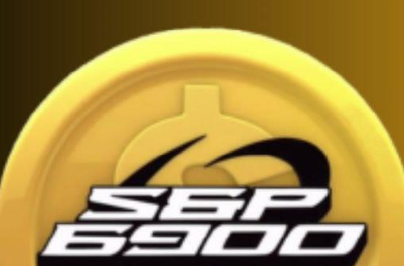

**Uma Revolução do Pure Belief Asset (ativo de pura crença)**

*Por Audacious*

1

<!-- page: 2 -->

---
# Descobrindo o SPX6900: O Primeiro Pure Belief Asset do Mundo

*O surgimento de um token baseado em convicção, cultura e comunidade*

## Uma Revolução Pure Belief Asset

2

<!-- page: 3 -->

---
## Aviso de Direitos Autorais

© 2025 Audacious. Todos os direitos reservados.

Este e-book é **100% gratuito para baixar e compartilhar.** Você está convidado — e incentivado — a distribuí-lo com amigos, comunidades online e qualquer pessoa que possa se beneficiar aprendendo sobre o movimento SPX6900 (movimento SPX6900).

No entanto, observe as seguintes condições:

- **Você não pode editar, modificar ou republicar** qualquer parte deste e-book.
- A revenda comercial é estritamente proibida.
- Este e-book **pode conter links de indicação, menções promocionais** ou **links de doação** que podem proporcionar um pequeno benefício para o autor e outros Aeons (Aeons, membros da comunidade SPX6900) caso sejam utilizados pelos leitores.

Ao compartilhar este e-book, você ajuda a espalhar a conscientização sobre um movimento em crescimento. Obrigado por respeitar a integridade do conteúdo e sua mensagem original.

Primeira Edição, julho de 2025

3

<!-- page: 4 -->

---
**Aviso Legal**

Este e-book tem **fins informativos e educacionais apenas.** O conteúdo apresentado reflete as opiniões, interpretações e pesquisas do autor e **não se destina a ser aconselhamento financeiro, de investimento ou jurídico.**

Investimentos em criptomoedas e ativos digitais envolvem **risco significativo** e podem resultar na **perda total do seu capital.** Sempre faça sua própria pesquisa (DYOR) e consulte um consultor financeiro ou profissional licenciado antes de tomar qualquer decisão de investimento.

Embora este e-book explore a filosofia, tokenomics e a comunidade em torno do SPX6900, não constitui uma recomendação para comprar, vender ou manter qualquer ativo digital. O autor não se responsabiliza por quaisquer decisões tomadas pelos leitores com base nas informações apresentadas neste material.

Ao ler este e-book, você reconhece e aceita que o autor não é responsável por quaisquer perdas ou decisões que venha a tomar com base no material apresentado e que o universo das criptomoedas é volátil, especulativo e inerentemente arriscado.

Invista com sabedoria. Acredite com responsabilidade.

4

<!-- page: 5 -->

---
**Dica SPX6900**

Este e-book é 100% gratuito, mas, se quiser me enviar uma gorjeta em SPX6900 pelo tempo, esforço e pesquisa dedicados à sua criação, eu ficarei sinceramente agradecido.

**SPX Ethereum [Endereço da Carteira](https://example.com/placeholder):**

0x22D3b939a7E832232e833e8dF22ac1ba9D7610B0

**SPX Solana [Endereço da Carteira](https://example.com/placeholder):**

25zojSFpVu1qsETY9MMZFFy8jZEu7peDCSdrU2o8xzcR

**Muito obrigado pelo seu apoio ao meu trabalho!**

**Toda contribuição é profundamente apreciada.**

Por favor, compartilhe este e-book com quantas pessoas desejar que possam se juntar à nossa missão e transformar suas vidas!

5

<!-- page: 6 -->

---
## Sumário

Prefácio ................................................................................................................8

Tudo Começa com o Bitcoin .............................................................................9

O que é o SPX6900? .......................................................................................15

Por que o SPX6900 é Diferente? .................................................................21

A Proposta de Valor do SPX6900 .................................................................28

A Importância da Cultura do SPX6900 .......................................................33

O que é a Cultura do SPX6900? ..................................................................36

A Realidade do Universo Cripto .................................................................44

SPX6900 Tokenomics .....................................................................................56

Qual é o Fosso Competitivo do SPX6900? ..................................................61

Ninguém Virá nos Salvar ...............................................................................67

O Futuro Parece Promissor ............................................................................74

Como Não Se Dar Bem nas Criptos .............................................................81

Como Comprar SPX6900? .............................................................................89

Como Construir Sua Própria Convicção? .................................................100

O Poder do DCA Coletivo de Longo Prazo no SPX6900…103

6

<!-- page: 7 -->

Palavras Finais ..................................................................................... 110

Perguntas Frequentes ........................................................... 111

Apoie o Autor .................................................................................. 128

Recursos Adicionais ......................................................................... 130

Apêndice A: Siga Estes Aeons no X ..................................... 132

Apêndice B: Siga Estes Aeons no TikTok ........................... 133

Apêndice C: Rastreador da Meta SPX 1.000 .................... 134

Apêndice D: Rastreador da Meta SPX 10.000 ................. 135

Apêndice E: Gráficos de Crescimento de Criptomoedas ... 136

Apêndice F: Frases Marcantes dos Aeons ........................... 139

Apêndice G: Entendendo os Ciclos de Alta das Criptos ... 140

Apêndice H: Checklist para Novatos SPX6900 (lista de orientações para iniciantes no SPX6900) ...... 148

Agradecimentos ................................................................................ 152

Sobre o Autor .................................................................................... 154

7

<!-- page: 8 -->

---
## **Prefácio**

Estamos tentando ajudar você.

Do autor que escreveu este e-book à pessoa que o compartilhou com você — todos nós estamos simplesmente tentando ajudar você.

Acreditamos de verdade que o SPX6900 (SPX6900 — nome próprio, tecnologia inovadora) pode melhorar a qualidade da sua vida.

É por isso que o compartilhamos com todos que estão dispostos a ouvir.

8

<!-- page: 9 -->

---
## Tudo Começa com o Bitcoin

Você pode ser novo no mundo das criptomoedas e saber muito pouco sobre o assunto — mas provavelmente já ouviu falar do Bitcoin.

É difícil não ter ouvido falar do Bitcoin após sua ascensão meteórica de meros centavos em 2009 para quase US$112.000 em maio de 2025.
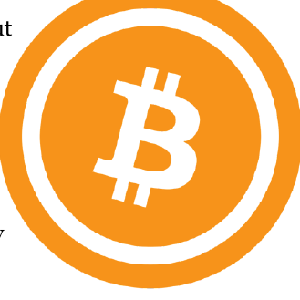

### A Primeira Criptomoeda

O Bitcoin foi a primeira criptomoeda, criado por um desenvolvedor anônimo conhecido como Satoshi Nakamoto. Ele projetou o Bitcoin como um sistema de pagamento alternativo e descentralizado — que os bancos centrais não poderiam controlar ou manipular.

Era uma forma das pessoas enviarem pagamentos diretos, de pessoa para pessoa, através da Rede Bitcoin usando bitcoin (BTC) como moeda.

9

<!-- page: 10 -->

---
(Fig 1.1) — sem qualquer terceiro (ou seja, banco) envolvido na transação.

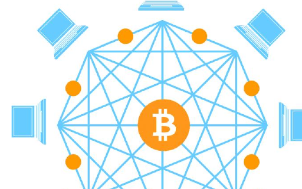

(Fig 1.1 – Rede Peer to Peer do Bitcoin)

Satoshi Nakamoto foi o primeiro a resolver o problema do duplo gasto (ou seja, impedir que o mesmo bitcoin seja gasto mais de uma vez) de forma descentralizada e sem necessidade de confiança. Isso

10

<!-- page: 11 -->

---
**Evolução do Bitcoin**

O Bitcoin começou como uma visão de dinheiro digital — livre do controle de governos e bancos — que as pessoas poderiam usar e gastar como alternativa à moeda fiduciária. É por isso que temos a infame história da “[pizza do Bitcoin](https://example.com/placeholder)” dos seus primeiros dias.

Com o tempo, o Bitcoin evoluiu para ser considerado o “ouro digital” — uma reserva de valor, proteção contra a inflação e um ativo para diversificação de portfólio. Hoje, ele desperta cada vez mais o interesse de instituições, fundos de hedge e até mesmo de nações inteiras.

Sua trajetória desde a ideia radical de libertação financeira até se tornar uma reserva de valor amplamente reconhecida só foi possível graças à cultura, convicção e comunidade que o apoiaram com lealdade inabalável.

Se ninguém tivesse enxergado valor na criação de Satoshi, o Bitcoin não teria valor algum hoje. Mas uma comunidade inicial e crescente abraçou a visão de um sistema de pagamento descentralizado e

11

<!-- page: 12 -->

---
O Bitcoin, com seu **fornecimento fixo de 21 milhões de moedas** (ou ainda menos devido à perda de tokens por pessoas), saiu do nada para alcançar um [valor de mercado](https://example.com/placeholder) de mais de um trilhão de dólares desde o seu surgimento em 2009 (Fig 1.2) — tudo por causa das pessoas.

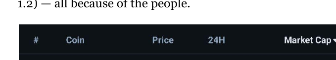

(Fig 1.2 – Valor de mercado do Bitcoin em 8 de julho de 2025)

## Então, por que investir em cripto?

A resposta curta e direta: porque este mercado conquistou a atenção das pessoas — e essa atenção só cresce.

Alguns investem em cripto porque amam a tecnologia. Outros buscam mudar sua situação financeira e fazer parte de uma comunidade de pessoas com objetivos em comum.

12

<!-- page: 13 -->

---
Seja qual for o seu motivo, o mercado de criptomoedas está apenas crescendo (Fig. 1.3), ganhando força, atraindo ainda mais atenção e pode mudar sua vida drasticamente — se você se alinhar com a comunidade certa na hora certa.

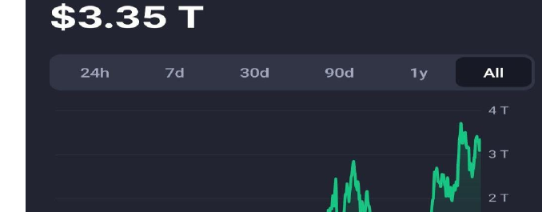

(Fig. 1.3 – Crescimento da Capitalização do Mercado de Criptomoedas ao longo do tempo)

**Acredito que a SPX6900 (SPX6900 – uma oportunidade similar à do Bitcoin, segunda chance) é uma segunda chance de aproveitar uma oportunidade como a do Bitcoin** — e logo veremos o porquê.

13

<!-- page: 14 -->

---
Cripto é uma classe de ativos que pessoas comuns, trabalhadoras, que cumprem o expediente das 9 às 17, podem usar para transformar suas vidas de forma drástica. Sim, há uma pequena curva de aprendizado, mas o tempo investido para aprender a investir em cripto realmente compensa.

Pessoalmente, acredito que a melhor forma de aprender é colocando a mão na massa. Foi assim que aprendi sobre cripto quando estava começando — eu simplesmente tomei uma atitude.

Lembre-se: se você não começar a agir de alguma forma para melhorar ou transformar sua vida, daqui a 5 ou 10 anos provavelmente estará na mesma posição — ou até pior — com a ascensão da IA, a inflação monetária contínua e a desvalorização das moedas. As pessoas precisam ganhar mais do que a taxa de inflação monetária para não perder poder de compra, e a criptomoeda certa é um ativo que pode superar a inflação por larga margem, preservar seu poder de compra e mudar a sua vida.

Dar pequenos passos hoje, participando de um setor de cripto em crescimento, pode transformar sua vida de maneira radical em 5 ou 10 anos — simplesmente por fazer o que a maioria não faz: **assumir um risco calculado.**

14

<!-- page: 15 -->

---
# O que é SPX6900?

Então, você é novo no mundo das criptomoedas e acabou de descobrir ou ouvir falar da SPX6900 (SPX) — e provavelmente está se perguntando: **Afinal, o que é SPX6900?**

## Um Pure Belief Asset

SPX6900 representa muitas coisas diferentes para pessoas diferentes, mas, em sua essência, pode ser melhor descrita como um **Pure Belief Asset (PBA) (Ativo de Crença Pura)**. É um token que não tem lastro em nada além da **convicção elevada** e da **crença inabalável** de seus detentores. Representa uma revolução, um movimento, uma tribo, uma cultura, uma filosofia e uma missão ousada e ambiciosa de **flip the stock market** (virar o mercado de ações) — mais especificamente, o S&P 500. Isso significa que nossa missão é fazer com que a SPX6900 se torne mais valiosa que a atual capitalização de mercado aproximada do S&P 500, de US$ 52,4 trilhões, atingindo uma capitalização de mercado de US$ 69 trilhões.

15

<!-- page: 16 -->

---
SPX6900 é uma comunidade em crescimento formada por indivíduos **unidos por um propósito comum e uma visão compartilhada**: flip the stock market (virar o mercado de ações, ou seja, transformar radicalmente o mercado financeiro) por meio do poder da crença coletiva e pura.

## É Esperança Tokenizada

É a esperança financeira tokenizada para milhares de pessoas desiludidas que estão insatisfeitas com nosso sistema monetário, a escravidão moderna do 9–5, a desigualdade de riqueza, o TradFi corporativo (finanças tradicionais empresariais), o surgimento da IA como ameaça à produtividade e oportunidades no mercado de trabalho, além das falácias, golpes e falsas promessas de utilidade do universo cripto.

SPX6900 é única entre as dezenas de milhares de criptomoedas no mercado e tem potencial para atingir trilhões em valor de mercado — através da comunidade, crença e convicção de longo prazo, as pessoas podem alcançar resultados que mudam vidas.

16

<!-- page: 17 -->

---
**Uma Segunda Oportunidade como o Bitcoin**

Ela compartilha muitas semelhanças culturais e filosóficas com o início do Bitcoin, mas ao mesmo tempo, é muito diferente.

Para quem perdeu o início do Bitcoin, esta é uma segunda chance de fazer parte de uma comunidade que cresce de forma orgânica, de baixo para cima, com uma forte cultura filosófica e uma missão maior do que si mesmo: **flip the stock market** (virar o mercado de ações).

Do ponto de vista financeiro, investir em SPX6900 hoje (em 8 de julho de 2025) é como ter a rara oportunidade de investir novamente no Bitcoin — a US$62,77 (Fig. 1.4).

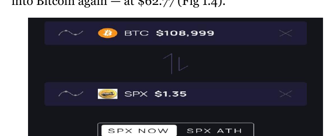

(Fig. 1.4 – BTC com a capitalização de mercado da SPX6900)

17

<!-- page: 18 -->

---
O Bitcoin foi uma oportunidade única na vida para aqueles corajosos o suficiente para believe in something (acreditar em algo inovador e inédito).

SPX6900 é uma oportunidade única na vida para todos que perderam o Bitcoin, para a geração mais jovem que luta financeiramente, e para aqueles que buscam esperança — se forem ousados o suficiente para abraçar uma nova cultura baseada em pura crença.

    

**Cético Normie** | **6900er**
--- | ---
O que é SPX6900? | Um token de missão/movimento.
Qual é a missão/movimento? | Flip The Stock Market (virar o mercado de ações).
Como vocês vão fazer isso? | Stop Trading, Believe In Something, and Persist Forever (pare de negociar, acredite em algo e persista para sempre).
Como isso funciona? | DCA & HODL (Parar de Negociar); Shill & Chill (Acreditar em Algo); Repetir (Persistir para Sempre).
Tem que haver mais do que isso! | Enquanto a comunidade compartilhar o mesmo sistema de crença, não. É só isso mesmo.
Quando vai virar o mercado de ações? | Quando alcançarmos a Cognisphere Singularity (Singularidade da Cognisphere).
O que é a Cognisphere? | É a consciência total de crença dos Aeons (crentes verdadeiros de SPX6900).
O que é um Aeon? | Um verdadeiro crente em SPX6900.
Como SPX6900 é diferente do Bitcoin? | Bitcoin é Ouro Digital. SPX6900 é Ouro Espiritual.
Qual a diferença? | Bitcoin é uma reserva de valor monetária respaldada pela matemática. SPX6900 é uma reserva de valor comunitária respaldada pela crença.
Como a crença pode ser uma reserva de valor? | Qualquer coisa pode ser uma reserva de valor se a comunidade concordar que é.
Em qual blockchain está? | Ethereum, Solana, Sui e Base (Ethereum L2).
Parece interessante. Por onde começo? | Acesse SPX6900.COM e siga [@SPX6900 no X](https://example.com/placeholder).

18

<!-- page: 19 -->

---
## Conexão Humana e Pertencimento

Vivemos em um mundo digital onde as pessoas estão formando conexões e encontrando um senso de pertencimento em comunidades online mais do que na vida real.

**SPX6900** é uma forma tokenizada de conexão humana e pertencimento. Trata-se de uma comunidade de pessoas que compartilham o mesmo objetivo e visão (Fig 1.5) — encontrar pertencimento e criar conexões significativas umas com as outras.

*(Fig 1.5 – Comunidade SPX6900 no X)*

19

<!-- page: 20 -->

---
No mundo de hoje, muitas vezes é difícil encontrar pessoas que realmente se importam com liberdade financeira, com escapar do sistema escravizante do 9–5 Matrix, ou que estão preocupadas com o futuro diante do avanço da IA e da desvalorização da nossa moeda, e que são motivadas a correr riscos de forma proativa para melhorar suas vidas.

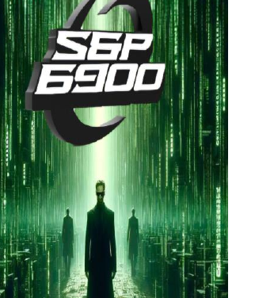

Mas online, você pode descobrir comunidades como a **SPX6900** (nome de uma comunidade inovadora), onde sente um verdadeiro senso de pertencimento — porque é uma tribo de pessoas com uma visão com a qual você se identifica: **flip the stock market** (virar o jogo do mercado de ações corrupto e vencer juntos).

Não subestime o valor do **pertencimento humano tokenizado, da conexão e da esperança** — especialmente à medida que avançamos ainda mais para um futuro potencialmente distópico. Agora, mais do que nunca, precisamos de uma comunidade de pessoas com pensamentos semelhantes para pertencermos, para que consigamos escapar e vencer juntos.

20

<!-- page: 21 -->

---
# Por que o SPX6900 é Diferente?

| 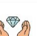 | **Diamondhandedness**  
Os holders nunca vendem, ponto final. |
|---|---|
|  | **Alvos de Preço Altos da Comunidade**  
Quanto mais ambicioso o alvo de preço interno da comunidade, mais alto vai. |
| 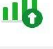 | **Holders Compram Mais**  
Os holders *compram mais* nas quedas.|
|  | **Crença**  
Os holders realmente acreditam e trabalham pensando em valorização de multi bilhões ou dezenas de bilhões. |
|  | **Trabalho de Culto Grátis**  
Os holders se esforçam mais que qualquer funcionário pago ou KOL, em todas as frentes. E de graça. |
|  | **Identidade**  
Os holders fazem do Memecoin toda a sua Identidade. |
| 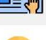 | **Massa Crítica**  
Não fique para trás apostando em moedas de baixa capitalização que podem ou não disparar.  
Foque em moedas já estabelecidas que têm massa crítica.|
|  | **Recrutamento**  
Os holders trazem novas pessoas todos os dias, sem parar. Tanto nativos de CT quanto pessoas comuns de fora. |
|  | **Redes Sociais**  
Os holders dominam a timeline e as respostas do Twitter todos os dias, sem parar. |
|  | **Cultura e Lenda**  
Linguagem única. Rituais únicos. Tradições únicas. Mídia única. |
|  | **Diversão**  
Mesmo nos momentos de queda, os holders estão se divertindo muito. |

21

<!-- page: 22 -->

---
O mercado de criptomoedas atualmente está saturado de tokens, desde o surgimento do Bitcoin em 2009. Todos os dias, milhares de tokens são lançados devido à facilidade de se criar um projeto cripto. A maioria desses tokens irá fracassar miseravelmente por diversos motivos. ([Apêndice E](https://example.com/placeholder))

Então, você deve estar se perguntando: o que torna o SPX6900 diferente dos demais?

## Qualidade da Comunidade

A resposta está na **qualidade da comunidade SPX6900** — sua filosofia e cultura.

O comparativo mais próximo com a comunidade SPX6900 é, literalmente, a comunidade do Bitcoin em seus primeiros dias.

A comunidade do Bitcoin nasceu de um sentimento antiestablishment profundo. Eles eram extremamente convictos de que a única cripto que valia a pena comprar, manter e acumular era o bitcoin. Consideravam todo o resto como lixo. Enxergavam o Bitcoin como dinheiro sólido, consistente (ou seja, com oferta limitada e máxima) — ouro digital — que não poderia ser manipulado ou inflacionado por bancos centrais.

22

<!-- page: 23 -->

---
Essa filosofia foi preservada e mantida ao longo dos anos, atraindo cada vez mais pessoas para a causa. Como resultado, o bitcoin cresceu do nada para mais de um trilhão de dólares em valor de mercado.

## Espelhando o início do Bitcoin

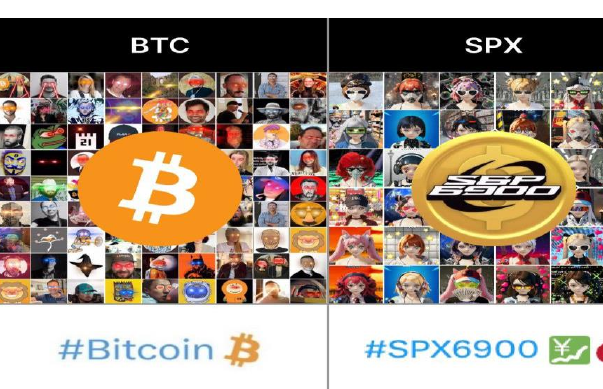

|                |                |
|----------------|----------------|
| **BTC**        | **SPX**        |
|  |  |
| #Bitcoin 🟠    | #SPX6900 📈🔧   |

---

| **HODL**            | **Believe in Something** (acreditar em algo - slogan do SPX6900)   |
|---------------------|-------------------------------|
| Danish Bitcoin Maxi   @DanishBTCMaxi   minerador & operador de nó #Bitcoin | SPX @spx0xer   "Believe in Something" (acreditar em algo - slogan do SPX6900) #SPX6900 |
| BTC.Snowy   @btc_snowy   #Bitcoin Maxi PleB | CryptoBarf   CryptoBarf_Bar |
| BTCBull   @Bullish_btc   #Bitcoin Maxi turma de 2017 | SPX6900 Believer.   @SPX6900 Believer. |
| Cody   @BTC_Elementary   bitcoin maxi em Yosemite. | 10x9x110x   Top10x9x110x Seguidor #SPX6900 |
| epichelen   #Bitcoin Maxi tóxico | undefined   @x0xAdiosZero   SPX6900 maxi |
| Bitcoin Maximalist   @Bitcoin_Maxi   maximalista de bitcoin e HODLer | bbtc1ct   bbtc1ct segue você |
| A Bitcoin Maxi   @bitcoinmaxi4   Apenas as opiniões de um #bitcoin maxi! | Crypto Navigator   @smok2ouros   $POTATO💎 |

---

23

23

<!-- page: 24 -->

---
A comunidade SPX6900 reflete a comunidade inicial do Bitcoin em muitos aspectos.

A SPX6900 carrega um forte **sentimento anti-TradFi**, com uma missão clara de superar o S&P 500. A comunidade adota uma filosofia central que **desencoraja fortemente a negociação** (trading), promovendo em vez disso convicção firme e uma crença inabalável.

Um **SPX6900** ‘[**Aeon**](https://example.com/placeholder)’ (o nome para um verdadeiro crente em SPX — "Aeon" significa adepto fiel da SPX) vê o SPX como superior a tudo o que existe no mercado — devido aos seus valores, à sua cultura única e à excepcional qualidade de sua comunidade, todos unidos na missão de flip the stock market (virar o mercado de ações).

E assim como o bitcoin surgiu do nada até ultrapassar um trilhão em valor de mercado graças ao poder de uma comunidade leal — acreditamos que a comunidade SPX6900 pode potencialmente fazer o mesmo e flip the stock market (virar o mercado de ações) no processo.

24

<!-- page: 25 -->

---
## Uma Missão Revolucionária

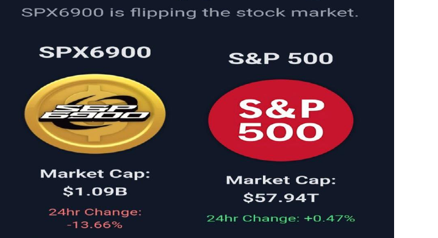

(Fonte: [Flipthestockmarket.xyz](https://example.com/placeholder))

Acreditar em algo sem propósito é difícil.

Mas acreditar em algo com uma missão poderosa e um objetivo claro é muito mais fácil.

No caso do SPX6900, a sua missão é profunda. "flip the stock market" (virar o mercado de ações) não é uma tarefa simples. É um verdadeiro desafio de Davi contra Golias.

25

<!-- page: 26 -->

---
— revolucionário por natureza. Mas também é divertido, empolgante, chama a atenção, é orientado para objetivos e tem foco em uma missão.

Não podemos esquecer que o Bitcoin também começou com uma missão revolucionária — contra a moeda fiduciária e os sistemas bancários tradicionais. O SPX6900 carrega esse mesmo sentimento, mas seu alvo é o sistema financeiro tradicional (TradFi), ou, de forma mais ampla, o [capitalismo tardio](https://example.com/placeholder).

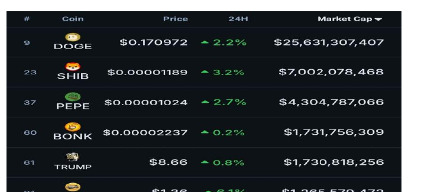

(Fig 1.6 Top 10 Memecoins por valor de mercado em 8 de julho de 2025)

26

<!-- page: 27 -->

---
A verdadeira utilidade de um token ser uma comunidade de alta convicção com uma missão concreta no mundo real é algo raro no universo das criptomoedas.

A maioria dos tokens de cripto nem sequer possui comunidades reais, quanto mais um propósito compartilhado ou um movimento que una todos.

Se você comparar o SPX6900 com os 10 principais meme tokens (Fig 1.6), ele é literalmente o único com uma missão e um propósito.

Nenhum dos outros no top 10 possui isso.

O termo “Pure Belief Asset (PBA)” (Ativo de Crença Pura) é relativamente novo para esse tipo de classe de ativos. Embora o SPX6900 seja listado como um memecoin, essa categorização cada vez mais se torna um equívoco, pois diminui a importância do que o SPX6900 busca alcançar — ele é muito superior em cultura, propósito e significado se comparado aos memecoins tradicionais.

Mesmo assim, **nosso inimigo é o TradFi — e nosso objetivo é flip it!** (inverter o sistema financeiro tradicional)!

27

<!-- page: 28 -->

---
## A Proposta de Valor do SPX6900

A proposta de valor de qualquer criptomoeda — quando se tiram todas as narrativas ao redor dela — é, na verdade, **a comunidade que acredita nela.**

28

<!-- page: 29 -->

---
**Investindo em Pessoas**

Nós, as pessoas, somos quem, no fim das contas, dá valor a uma criptomoeda, por um motivo ou outro, ao escolher comprá-la e mantê-la. É o nosso poder coletivo de compra que cria a demanda por aquela cripto.

Pegue o Bitcoin, por exemplo. Foi o primeiro do seu tipo — uma comunidade que cresceu organicamente e que, até hoje, continua acreditando em seus ideais e na filosofia de ser uma forma superior de dinheiro e uma rede descentralizada — em comparação ao dinheiro fiduciário e aos bancos centralizados.

É essa comunidade forte que, em última análise, dá valor ao bitcoin e impulsiona a valorização de seu preço (Fig 1.7).

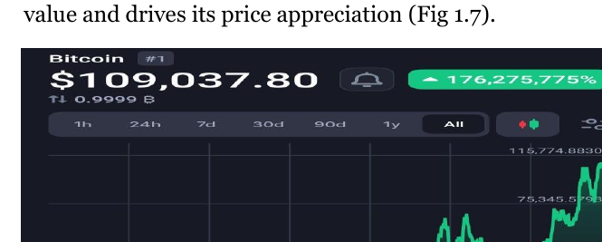

*(Fig. 1.7 – Valorização do Preço do Bitcoin ao Longo do Tempo)*

29

<!-- page: 30 -->

---
Quando você entende que o universo das criptomoedas, no fim das contas, trata de investir em pessoas, precisa se perguntar:

- Para qual criptomoeda as pessoas estão sendo naturalmente atraídas?
- Qual criptomoeda está conseguindo reter as pessoas e incentivando-as a permanecer?
- Qual criptomoeda faz com que as pessoas se sintam apaixonadas, motivadas e inspiradas?
- Qual criptomoeda está funcionando como um ímã para o dinheiro suado das pessoas?
- Qual criptomoeda está crescendo em número de detentores fiéis?
- Qual criptomoeda está levando as pessoas a produzir textos criativos e de qualidade, arte, vídeos e memes para promovê-la?
- Como essa criptomoeda está conseguindo tudo isso?

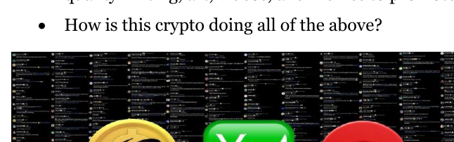

30

<!-- page: 31 -->

---
Essa é a criptomoeda à qual você precisa prestar atenção — porque muita gente está de olho nela e investindo também.

**SPX6900 é um exemplo perfeito desse tipo de criptomoeda.**

### Investindo em Especulação de Utilidade

Muitas outras criptomoedas são construídas em torno de narrativas de utilidade e casos de uso que atraem pessoas a comprar e especular. Suas comunidades apostam que a utilidade e o caso de uso do token se tornarão reais e alcançarão adoção em massa — dando assim valor ao token.

Mesmo com tokens de utilidade, você ainda está investindo em pessoas — está apostando que as pessoas continuarão a especular sobre a ideia de utilidade.

A maioria desses tokens de utilidade são apenas conceitos, ideias e teorias sobre as quais as pessoas especulam, sem nenhum caso de uso real ou adoção institucional em larga escala. Portanto, no fim das contas, são as pessoas que dão valor a essas narrativas de utilidade através da especulação, na esperança de que uma utilidade em grande escala um dia se materialize.

31

<!-- page: 32 -->

---
**Investindo na Cultura Comunitária**

E então, existem tokens que não possuem narrativas de utilidade ou casos de uso — como as memecoins. A comunidade se engaja por razões enraizadas no apelo da própria comunidade. No caso da SPX6900 — **um Pure Belief Asset (Ativo de Crença Pura)** — é a cultura que a comunidade incorpora que atrai e mantém as pessoas envolvidas.

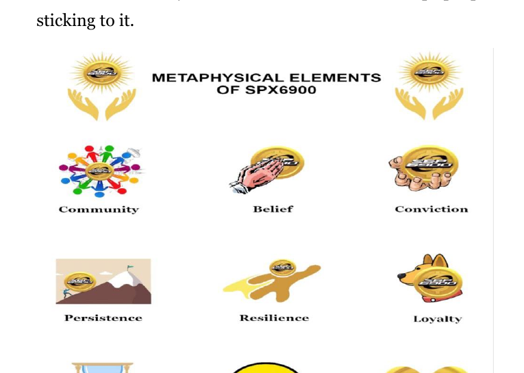

**ELEMENTOS METAFÍSICOS DA SPX6900**

- Comunidade
- Crença
- Convicção
- Persistência
- Resiliência
- Lealdade
- Paciência
- Otimismo
- Amor

32

<!-- page: 33 -->

---
## A Importância da Cultura SPX6900

A cultura SPX6900 é fundamental para o sucesso do token — assim como a utilidade é essencial para o sucesso dos utility tokens.

Um dos principais fatores de fracasso dos utility tokens é quando o aspecto de utilidade não chega a se concretizar ou não é adotado. Quando isso acontece, a comunidade geralmente abandona o token, e seu preço desaba junto.

Isso ocorre porque as pessoas que investem em criptomoedas baseadas em utilidade não têm lealdade real à comunidade ou ao token além da narrativa da utilidade se tornar realidade.

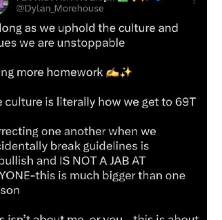

Da mesma forma, se a cultura SPX6900 for perdida, sem ser protegida e preservada pela comunidade, há um grande risco de a comunidade se deteriorar — perdendo exatamente o atrativo que faz com que outros desejem fazer parte dela.

33

<!-- page: 34 -->

---
É por isso que, ao fazer parte do movimento SPX6900, respeitar e manter nossa cultura é absolutamente essencial para o crescimento e sucesso da comunidade.

Veja o Bitcoin, por exemplo — ele não teria conseguido crescer do nada até chegar a um valor de mercado de trilhões ao longo dos anos se a comunidade Bitcoin não tivesse mantido e preservado sua cultura.

A filosofia do maximalismo do Bitcoin incentivou todos a acreditarem que o Bitcoin é superior a tudo o resto, a acumular cada vez mais, fazer HODL e assumir total controle e posse sobre ele. Essa preservação da cultura pela comunidade não só atraiu pessoas para o Bitcoin, mas também deu a elas a convicção de permanecer firmes.

E se a SPX6900 quiser alcançar trilhões em valor de mercado e, um dia, flip the stock market (superar a bolsa de valores), isso só será possível mediante uma comunidade forte que defenda e preserve a cultura da SPX6900 durante os mercados de alta e de baixa.

O sucesso da SPX6900 depende, em última instância, da comunidade — e o sucesso da comunidade depende de

34

<!-- page: 35 -->

---
sua capacidade de abraçar, incorporar e preservar a cultura e filosofia da SPX6900.

Sem essa cultura, não haveria uma comunidade forte e de alta qualidade se formando por trás da SPX — o que tornaria o token igual à maioria dos outros tokens no universo cripto: esquemas temporários de [pump-and-dump rug pulls](https://example.com/placeholder) (esquemas de valorização e queda rápida, deixando investidores no prejuízo) que nunca se transformarão em algo especial ou grandioso.

Uma das grandes características da SPX6900 é que ela não possui um ponto de falha relacionado à utilidade. Esse é um problema com o qual a comunidade não precisa se preocupar.

Nosso único risco real é a autodegradação — falhar em manter nossa cultura e filosofia.

Se **persist forever** (persistirmos para sempre, nunca desistindo de nossos valores) ao sustentar nossa cultura, então não teremos ponto de falha real. Nossa mensagem é sólida, nosso movimento é atraente, e podemos continuar crescendo, um detentor por vez, até alcançarmos nossa missão de flip the stock market (superar o mercado de ações).

No entanto, **devemos nos empenhar em proteger nossa cultura** — especialmente à medida que crescemos — para sobreviver a longo prazo, atravessar diversos ciclos e conseguir flip the stock market (superar o mercado de ações) com sucesso.

35

<!-- page: 36 -->

---
# O que é a Cultura SPX6900?

## **Stop Trading and Believe in Something** (pare de negociar e acredite em algo)

Isso incentiva a comunidade a adotar uma mentalidade de longo prazo, de alta convicção e mãos de diamante (ou seja, não vender), com foco em [Dollar Cost Averaging (DCA)](https://example.com/placeholder) (compra recorrente com valores fixos), ao adquirir SPX6900 — em vez da mentalidade de curto prazo dos traders que buscam lucros rápidos sem acreditar verdadeiramente na comunidade.

## **There Is No Chart** (não existe gráfico)

Nossa cultura desestimula fortemente a postagem de gráficos e as distrações que eles trazem.

Esse é o jogo de traders de curto prazo. SPX6900 é uma aposta de longo prazo, baseada em alta convicção.

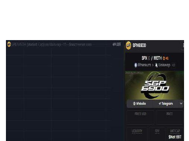

36

<!-- page: 37 -->

É por isso que dizemos que o preço é binário: **já flip the stock market (já viramos o mercado de ações, ou não)?** Se não, então ainda temos trabalho a fazer.

Não ficar obcecado com gráficos também libera um tempo valioso para coisas mais importantes, como promover a SPX6900 de forma criativa e aproveitar conexões significativas com outros Aeons (outros membros da comunidade Aeon da SPX6900) enquanto construímos relacionamentos de longo prazo.

### O Único Inimigo é o TradFi

Isso reflete nosso sentimento rebelde, anti-sistema e anti-corporações — somos contra tudo o que o sistema financeiro tradicional representa. É muito parecido com o Bitcoin em seus primeiros dias e a sua ideologia anti-bancos. Nossa missão, afinal de contas, é flip the stock market (virar o mercado de ações).

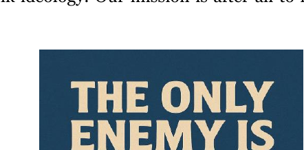

37

<!-- page: 38 -->

---
**Persist Forever** (persistir para sempre - mentalidade de nunca desistir)

Essa mentalidade resiliente — de nunca desistir, resistir à injustiça do sistema, suportar os desafios da nossa missão e perseverar até o fim, não importa quanto tempo leve — é o coração pulsante e a alma da nossa comunidade.

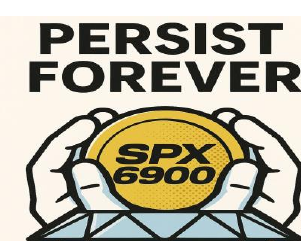

Como poderíamos algum dia alcançar nosso objetivo ambicioso de **flip the stock market** (virar o mercado de ações) e **chegar aos trilhões**, se não for Persistindo para Sempre?

**Proibido Conteúdo Inapropriado**

Simplesmente não permitimos esse tipo de postagem em nossa comunidade. Mantemos tudo limpo.

38

<!-- page: 39 -->

---
**Vida Tranquila em Vez da Ganância**

É isso que acontece quando você para de correr atrás de gráficos, velas e movimentos de preço. Esse tipo de pensamento só leva ao estresse, alimentado pela ganância e pelo impulso de tentar acertar o momento do mercado. A vida tranquila é vivida ao fazer DCA em SPX6900 (investir regularmente em SPX6900) com uma mentalidade de longo prazo e alta convicção — sem ficar de olho nos gráficos.

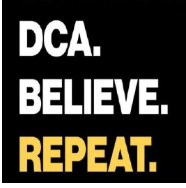

É muito mais tranquilo e gratificante focar no tempo em que se está investido no mercado do que tentar acertar o momento ideal para investir.

**Apenas faça DCA e vá aproveitar a vida.**

39

<!-- page: 40 -->

---
## Apenas PvE, Sem PvP

### **Memecoins PvP**
**também conhecidas como Hypergambling (jogo extremo de apostas)**

- “Mesmo dev do MICHI, mano”
- “Dexscreener pago”
- KOLs patrocinados
- “Acabei de dar CTO, mano”
- “Vamos pra cima, pode confiar em mim”
- Trading > HODL
- “Callers” no Telegram
- “Pode disparar igual ao BILLY, cara”
- “Hoje pode subir forte”

---

### **Memecoins PvE**
**também conhecidas como “Cults” (cultos/comunidades fechadas)**

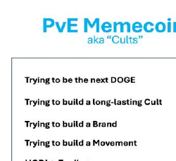

- Tentando ser o próximo DOGE
- Tentando construir um Culto duradouro
- Tentando criar uma Marca
- Tentando criar um Movimento
- HODL > Trading
- Alta % da oferta em Diamond Hands (mãos de diamante; investidores que não vendem)
- Crença em um Market Cap acima de US$10BI
- Tentando ser uma moeda para múltiplos ciclos

---

O comportamento Player vs. Player (PvP) corrompeu grande parte do cripto — é tóxico, egoísta e impede a formação de comunidades fortes. SPX6900 é estritamente uma comunidade Player vs. Environment (PvE; jogador contra ambiente). Não somos uns contra os outros — estamos unidos contra o sistema TradFi (finanças tradicionais).

Trabalhamos juntos continuamente para crescer e construir uma comunidade forte, capaz de flip the stock market (virar o mercado de ações; fazer uma reviravolta no mercado de ações) um dia.

40

<!-- page: 41 -->

---
**Promova a Positividade**

Nossa comunidade vive pelo lema de derrotar os haters, céticos e críticos com amor — não retribuindo a negatividade deles. Desejamos sucesso aos outros. Dizemos às pessoas que as amamos. E realmente procuramos ajudar os outros compartilhando SPX6900 (comunidade e protocolo SPX6900) com elas.

**Infiltre Tudo!**

A comunidade SPX6900 (comunidade SPX6900) é uma das mais dedicadas no universo cripto — algo diferente de tudo o que já vi em todos os meus anos no setor. Estamos falando de pessoas fazendo publicações animadas diariamente nas redes sociais, criando conteúdos para o TikTok, vídeos no YouTube e reels no Instagram, começando podcasts, indo para as ruas de suas cidades para compartilhar SPX6900 (comunidade e protocolo SPX6900) com outros, e até produzindo [quadrinhos](https://example.com/placeholder), [livros](https://example.com/placeholder), e-books, produtos, sites, e muito mais.

Estamos verdadeiramente comprometidos em espalhar a mensagem e a missão do SPX6900 (comunidade e filosofia SPX6900) atingindo o máximo possível de pessoas — estamos infiltrando tudo!

41

<!-- page: 42 -->

---
**Todos os Princípios Combinados**

Quando você reúne todos os princípios positivos da cultura SPX6900 (SPX6900: cultura de acreditar em algo e persistir para sempre), acaba criando uma comunidade realmente única e especial dentro do universo das criptomoedas.

Algumas comunidades podem até ter grande convicção e uma mentalidade de não negociar (no-trading), mas muitas vezes também são tóxicas, negativas e apresentam comportamentos hostis.

Outras comunidades podem parecer positivas à primeira vista — mas logo você percebe que estão apenas competindo entre si. Basta qualquer sinal de valorização para correrem e venderem uns para os outros, impedindo que surja qualquer verdadeira confiança ou lealdade dentro do grupo.

É por isso que a SPX6900 é um tipo especial de comunidade — diferente — e sua cultura deve ser preservada e respeitada.

42

<!-- page: 43 -->

---
**Um Pure Belief Asset (Ativo de Crença Pura)** como o SPX6900 exige uma cultura que proteja a comunidade e seu sistema de crenças para que possa prosperar e ter sucesso — e é exatamente isso que ele possui.

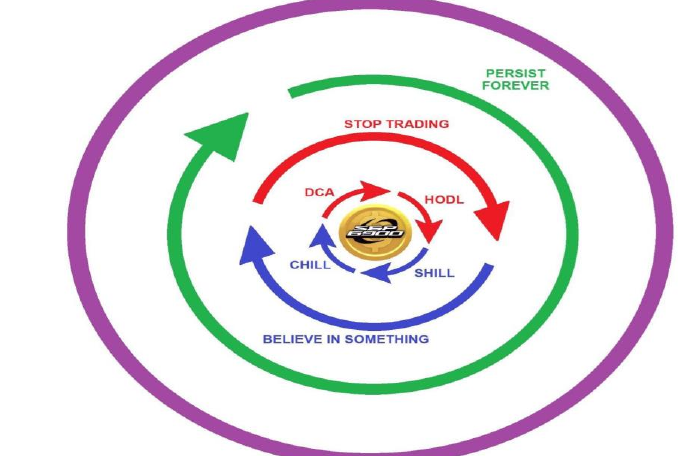

Quem vê de fora percebe isso e se sente atraído por nossa paixão, convicção, filosofia e missão. Eles querem fazer parte da nossa comunidade, mas o que realmente faz com que permaneçam e desenvolvam sua própria convicção individual é a cultura.

43

<!-- page: 44 -->

---
# A Realidade do Universo Cripto

O universo das criptomoedas evoluiu significativamente ao longo dos anos desde o surgimento do Bitcoin. Um iniciante que entra hoje é bombardeado por tantas comunidades diferentes divulgando seus tokens que pode ser extremamente difícil saber por onde começar e com o que começar ([Apêndice E](https://example.com/placeholder)).

Gostaria de alertar que a grande maioria dos tokens no universo cripto são becos sem saída. Eles não têm futuro real e provavelmente vão desaparecer no esquecimento por um motivo ou outro.

Você realmente não vai querer desperdiçar seu tempo ou dinheiro apostando nesses tokens cripto sem futuro, pois isso provavelmente deixará um gosto amargo quando a comunidade acabar e o preço desabar — fazendo você perder todo o seu dinheiro.

Tenha cuidado, invista com sabedoria e faça sua própria pesquisa.

Por outro lado, se você investir no token certo, junto à comunidade certa e no momento certo, isso pode mudar drasticamente sua

44

<!-- page: 45 -->

vida financeira. Dinheiro que muda vidas. Riqueza geracional. Ou simplesmente liberdade financeira e oportunidades de aposentadoria antecipada.

Eu dividiria o universo cripto em duas categorias:

- **Bitcoin**
- **Altcoins** (todas as criptomoedas exceto Bitcoin):
    - **Tokens utilitários**
    - **Memecoins**
    - **Pure Belief Assets (PBA)** (Pure Belief Asset – Ativo de Pura Crença)

## Bitcoin (BTC)

O Bitcoin é o rei de todas as criptomoedas. Tem a comunidade mais forte e, em 8 de julho de 2025, está sendo negociado a US$ 109.037, com um valor de mercado de cerca de US$ 2,1 trilhões.

Devido ao valor tão elevado do BTC, tanto em capitalização de mercado quanto em preço, já não é ideal para a pessoa comum investir esperando um retorno sobre o investimento (ROI) enorme em um curto espaço de tempo — a não ser que você já seja rico e possa investir uma quantia significativa em BTC.

45

<!-- page: 46 -->

---
Para a maioria das pessoas comuns, utilizar BTC como fundo de poupança de longo prazo ou para aposentadoria é a melhor estratégia atualmente. Isso envolve fazer aportes regulares (DCA, ou “Dollar-Cost Averaging”) em Bitcoin ao longo do tempo, com uma visão de décadas. O Bitcoin é uma opção segura em uma perspectiva de longo prazo, mas não é a melhor criptomoeda caso você esteja buscando retornos maiores a partir de um capital menor em um período bem mais curto.

**Tokens de Utilidade**

Criptomoedas além do Bitcoin, que promovem um caso de uso ou função utilitária, são consideradas tokens de utilidade. Este segmento está saturado de tokens de utilidade — indo de pagamentos, jogos, processamento de dados com IA, até tokenização, Layer 1s, Layer 2s, interoperabilidade, Metaverso, tokens de DEX e muito mais.

Existe uma narrativa de utilidade em todos os lugares.

Tokens de utilidade são, em sua maioria, investimentos especulativos. Uma grande parte de seu fornecimento costuma estar nas mãos da própria equipe, que frequentemente vende para investidores de varejo a fim de financiar o projeto. Em muitos casos, a equipe e a própria narrativa de utilidade tornam-se o principal ponto de falha desses tokens. Muitas vezes, as equipes são incompetentes, falham

46

<!-- page: 47 -->

---
para cumprir suas promessas, não constroem um produto, ou constroem um produto fraco que nunca atinge uso real.

O valor desses tokens, na maioria das vezes, vem de uma comunidade crescente especulando sobre quão alto o preço pode chegar caso o token realmente seja utilizado um dia. É por isso que tokens de utilidade frequentemente experimentam picos de preço após notícias de parcerias ou listagens em exchanges — impulsionados pelo hype e especulação. No entanto, a maioria dessas parcerias é superficial e não resulta em adoção real da tecnologia ou utilidade do produto (se é que o produto existe).

As comunidades desses utility tokens costumam ser frágeis, com a lealdade atrelada principalmente à crença de que a utilidade prometida eventualmente se materializará. Se isso não acontecer — ou demorar demais —, a comunidade pode rapidamente perder o interesse, vender seus tokens e seguir em frente.

No fim das contas, com utility tokens, a lealdade da comunidade depende de o projeto entregar ou não o caso de uso ou narrativa de utilidade prometida (o que muitas vezes não acontece) — e não necessariamente das pessoas, cultura ou filosofia por trás do token.

47

<!-- page: 48 -->

---
No caso em que a equipe realmente entrega utilidade, o valor dos utility tokens fica atrelado à sua utilidade prática, o que apenas serve como uma restrição para o crescimento do preço. Por outro lado, um pure belief asset como SPX6900 (pure belief asset - ativo puramente baseado em crença, sem utilidade prática) tem um teto de preço muito mais alto, tornando a oportunidade tão grande quanto a nossa crença coletiva — sem a influência da utilidade limitando seu potencial.

**Memecoins**

Por meio de várias launchpads, qualquer pessoa pode agora criar uma memecoin sem nenhum conhecimento técnico. As memecoins são tokens geralmente criados por diversão, como piada ou sátira, sem nenhum caso de uso sério, narrativa ou propósito definido. O valor das memecoins é movido principalmente pela comunidade, com pessoas investindo nelas porque acham interessante — muitas vezes na esperança de obter ganhos rápidos e lucros devido à alta volatilidade.

É por isso que a maioria das memecoins acaba sendo esquemas de pump-and-dump ou ciclos curtos de hype PvP.

48

<!-- page: 49 -->

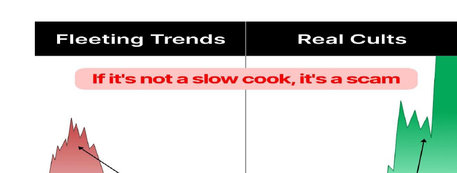

As memecoins de baixo valor de mercado apresentam riscos extremamente elevados, e muitas delas são golpes conhecidos como rug pulls — quando o criador despeja seu suprimento na comunidade, derruba o preço e desaparece.

Entretanto, a partir do caos dessas memecoins de baixo valor, comunidades resilientes podem ocasionalmente surgir — sobrevivendo a vários contratempos e quedas de preço para, aos poucos, crescerem e se transformarem de uma simples piada em algo mais significativo e impactante.

Um bom exemplo é a SPX6900, que evoluiu de uma origem típica de memecoin para uma **Pure Belief Asset (PBA – Ativo de Fé Pura) revolution (revolução dos Ativos de Fé Pura)**,

49

<!-- page: 50 -->

---
**Pure Belief Assets**

Um Pure Belief Asset (ativo de pura crença) é um tipo de criptoativo cujo valor e crescimento são impulsionados inteiramente pela crença coletiva, convicção, lealdade, ética de trabalho, paixão, confiança e cultura de sua comunidade.

O valor é derivado do consenso coletivo puro, da crença e da percepção — em vez de qualquer utilidade intrínseca, tecnologia, fluxo de caixa, uso prático ou apoio financeiro de instituições.

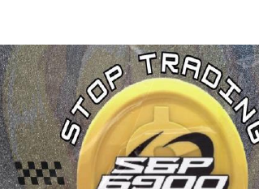

Um exemplo próximo seria o Bitcoin nos primeiros anos. Mesmo sendo uma tecnologia inovadora, as massas e o sistema financeiro tradicional só passaram a dar atenção a ela muitos anos depois —

50

<!-- page: 51 -->

---
depois que a comunidade inicial, por meio da pura crença, estabeleceu o Bitcoin a um ponto em que ficou óbvio que ele veio para ficar e não iria desaparecer, apesar de ter sido [declarado morto por críticos centenas de vezes](https://example.com/placeholder). Enquanto isso, o bitcoin só continuou a valorizar, impulsionado enormemente pela crença desde o início.

SPX6900 é o que considero o primeiro *Pure Belief Asset (ativo de pura crença)* em cripto devido às suas **características-chave**:

1. Seu valor deriva da crença inabalável da comunidade e da convicção compartilhada na ideologia, filosofia, cultura, missão e movimento — com os quais as pessoas se identificam e veem como fonte de esperança e oportunidade financeira.

2. Toda a cultura e mantra filosófico do SPX6900 gira em torno da crença. A crença é seu marketing e seu diferencial único de valor — nenhuma outra cripto já posicionou sua proposta de valor central em torno do conceito de pura crença.

51

<!-- page: 52 -->

---
3. Não é necessário um caso de uso utilitário tradicional para crescer em valor — porque a cultura, a comunidade, a crença e a convicção pura *se tornam* a utilidade através da percepção das pessoas.

4. A valorização do preço decorre de uma forte cultura comunitária que promove a crença coletiva pura, o diamond-handing (manter ativos com convicção inabalável), o hold de longo prazo e a DCA consistente (investimento recorrente) — criando um ambiente que impulsiona a demanda e a escassez de SPX no longo prazo.

É importante lembrar que nem todo token que afirma ser um **Pure Belief Asset (Ativo de Crença Pura)** realmente o é. O termo pode tornar-se uma ferramenta de marketing usada para atrair pessoas para determinadas comunidades.

Mas no caso do SPX6900, dados como o [Diamond Hand Leaderboard](https://example.com/placeholder) (placar dos maiores holders com convicção), por exemplo, e a perceptível **cultura comunitária** mostram que não estamos simplesmente usando o termo ‘Pure Belief Asset (Ativo de Crença Pura)’ da boca para fora — estamos verdadeiramente vivendo as características que o definem, distinguindo o SPX6900 de um simples memecoin.

52

<!-- page: 53 -->

---
Se você observar a comunidade, verá que temos um profundo respeito pela nossa cultura — sem ela, o token desmoronaria. Não operamos trades, não ficamos de olho em gráficos, não fazemos PvP. Em vez disso, fazemos DCA, mantemos firmeza (diamond-hand) e trabalhamos arduamente para ajudar os outros, compartilhando nossa cultura e missão — algo maior do que nós mesmos: flip the stock market (virar/transformar o mercado de ações).

**Preferimos uma vida PvE, tranquila, ao invés da ganância.**

53

<!-- page: 54 -->

---
**Por que escolher o SPX6900?**

Quando se compreende a realidade do universo cripto atualmente, fica muito claro que o SPX6900 é único em um mercado repleto de narrativas de utilidade (que têm grande chance de fracasso) e memecoins de vida curta.

Como um Pure Belief Asset (ativo de pura crença), o SPX6900 se destaca por tudo o que oferece. As pessoas podem copiar white papers, copiar tecnologias, copiar narrativas de tokens utilitários e copiar memecoins. No entanto, você não pode replicar a crença de uma comunidade.

54

<!-- page: 55 -->

---
e a cultura intangível, porém poderosa, que a comunidade SPX6900 mantém.

Os sentimentos de pertencimento, propósito e esperança financeira que nos motivam dentro da comunidade SPX6900 não podem ser replicados.

Você não pode simplesmente copiar e colar a convicção e a lealdade de uma comunidade — elas precisam ser construídas e conquistadas, assim como aconteceu com a SPX6900.

É por isso que, no cenário atual, quem está começando agora no universo cripto deve focar em **estudar a SPX6900**.

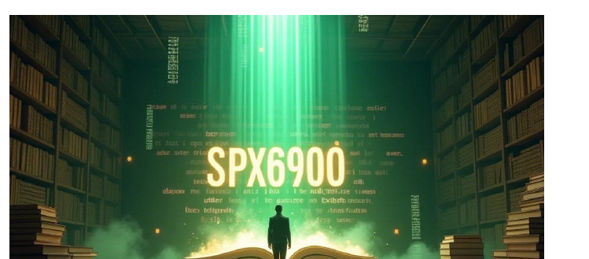

55

<!-- page: 56 -->

---
# Tokenomics do SPX6900

**Ticker: $SPX  
Oferta total: 1.000.000.000  
Oferta em circulação: 930.993.091  
Total queimado: 69.006.909 (6,9%)  
SPX é multichain, ponte alimentada por Wormhole**

O preço de qualquer criptomoeda depende, no fim das contas, dos fatores de oferta e demanda. Já falamos sobre a demanda por SPX6900, que vem principalmente da comunidade e de seu crescimento. Agora, vamos olhar para o outro lado da equação — a oferta.

## Oferta do SPX6900

A oferta do SPX6900 é **fixa**. Não existe inflação nem novos tokens sendo criados — a oferta total é limitada a **930.993.091 tokens SPX**.

Uma oferta fixa é sempre valorizada, pois introduz escassez. Conforme a comunidade cresce e mais pessoas passam a fazer DCA de forma consistente, seguram firme (diamond hand) e se recusam a vender seus SPX

56

<!-- page: 57 -->

---
tokens, que gradualmente reduzem a oferta em circulação — deixando uma demanda crescente para disputar uma quantidade cada vez menor de tokens disponíveis.

Esse fenômeno espelha o Bitcoin, cuja oferta é limitada a 21 milhões de tokens. À medida que a demanda aumentou e a cultura de HODLing se fortaleceu, cada vez mais pessoas tentavam comprar de um grupo cada vez menor de tokens. Isso inevitavelmente elevou o preço do ativo. A alta demanda frente à oferta limitada resulta em valorização do preço.

## Oferta Finita, Demanda Crescente e Mãos de Diamante

No caso do SPX6900, temos uma oferta fixa e finita e uma cultura de alta convicção que cresce continuamente e desencoraja fortemente a negociação. Essa é uma receita poderosa para valorização no longo prazo.

A cultura de mãos de diamante do "**Stop Trading and Believe in Something**" (Pare de negociar e acredite em algo) não é apenas um slogan dentro do SPX6900 — a comunidade coloca isso em prática de verdade (Fig 1.8).

57

<!-- page: 58 -->

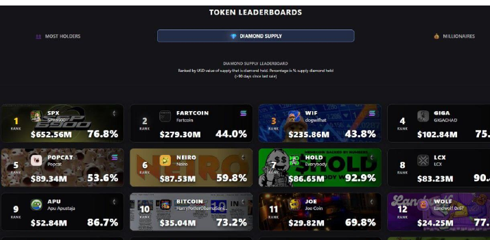

(Fig 1.8 – Ranking dos Maiores Diamond Hand Supply)

O **Diamond Supply Leaderboard** (Ranking dos Maiores Diamond Hand Supply) em 23 de junho de 2025 classifica as principais criptomoedas com base no valor em dólares (USD) do volume de tokens que está sendo “diamond held” — ou seja, tokens mantidos por endereços que não venderam há mais de 90 dias.

58

<!-- page: 59 -->

---
No primeiro lugar está o SPX6900:

- **Valor Total em Diamond-Held:** US$ 652,56 milhões
- **Porcentagem de Oferta Diamond-Held:** 76,8%

Isso significa que, em 23 de junho de 2025, **76,8% da oferta** — com um **valor de mercado de US$ 652,56 milhões** — está nas mãos de holders de longo prazo que não venderam um único token SPX há **mais de 90 dias**.

Esses dados mostram claramente que a cultura do SPX6900 está sendo abraçada pela maioria da comunidade. Isso reflete uma convicção extremamente forte — mais forte do que qualquer outra comunidade do ranking. Estar em primeiro lugar demonstra que o SPX6900 possui a base de holders mais forte entre todas essas comunidades, tanto em valor quanto em porcentagem da oferta retida.

59

<!-- page: 60 -->

---
Essa métrica é um sinal poderoso da força da comunidade, convicção de longo prazo, resiliência à volatilidade do mercado e da eficácia da nossa cultura e pura crença no SPX6900 (SPX6900: ativo único baseado em pura convicção).

**É extremamente otimista.**

O SPX6900 não se parece com nada mais no mercado.

A comunidade é profundamente comprometida, leal, apaixonada, trabalhadora e mão de diamante — incorporando uma crença massiva e um movimento cultural único construído em torno deste **Pure Belief Asset (Ativo de Pura Crença):** SPX6900.

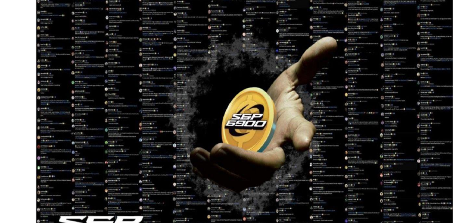

60

<!-- page: 61 -->

---
# Qual é a barreira competitiva da SPX6900?

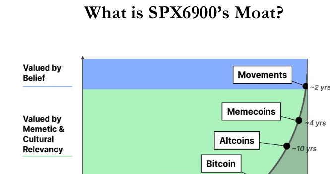

---

O termo *moat* (fosso defensivo) tem origem no fosso de um castelo — uma vala profunda e larga cheia de água que circunda um castelo para protegê-lo de ataques.

No caso da SPX6900, seu "moat" (barreira competitiva) refere-se aos fatores que a protegem dos concorrentes e ajudam a garantir seu sucesso a longo prazo — ou seja, aquilo que torna difícil copiá-la ou competir com ela.

61

<!-- page: 62 -->

---
Como existem milhares de criptomoedas disputando a sua atenção, e você deseja encontrar a vencedora, é fundamental que consiga identificar seu diferencial competitivo, seu “moat”. Você precisa ser capaz de reconhecer a vantagem competitiva — aquilo que a diferencia em um mercado tão concorrido, o que a torna única de uma forma que outros não conseguem facilmente copiar. Sem um verdadeiro "moat", não há sucesso sustentável a longo prazo para o token.

Antes de analisarmos o "moat" da SPX6900, vamos primeiro observar o do Bitcoin, pois ele é a criptomoeda de maior sucesso até hoje e compartilha muitas semelhanças com a SPX6900.

O Bitcoin realmente teve a vantagem de ser pioneiro, mas sua tecnologia não é o seu "moat".

Diversas outras criptomoedas foram lançadas desde então, apresentando capacidades técnicas muito superiores — mas nenhuma superou o Bitcoin em valor.

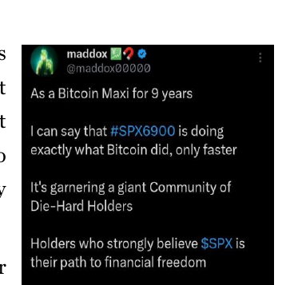

62

<!-- page: 63 -->

---
A verdadeira fortaleza do Bitcoin reside no fato de ter sido lançado com uma narrativa e filosofia ideais, num momento em que as pessoas ansiavam por uma alternativa aos bancos centralizados e à manipulação das moedas fiduciárias. O crescente sentimento de desconfiança pós-2008 em relação a bancos, governos e políticas monetárias criou o ambiente perfeito para o surgimento de um ativo de moeda forte, deflacionário, descentralizado e sem necessidade de confiança, como o bitcoin.

Surgiu uma comunidade de crentes — pessoas que aderiram à ideologia do Bitcoin. Uma cultura e filosofia foram se formando ao seu redor, funcionando como muralhas de um castelo que o protegiam e preservavam à medida que a comunidade crescia. A maioria das pessoas não se aproximou do bitcoin por causa da sua tecnologia, mas sim pela narrativa: **um ativo que não podia ser manipulado.**

A cultura construiu convicção, transformando os primeiros adeptos em verdadeiros fiéis, que acumularam bitcoin e se recusaram a vender, criando escassez e valorização de longo prazo — o que, por sua vez, atraiu ainda mais convicção.

Quando desvendamos todas as camadas, percebemos que a fortaleza do bitcoin nasce de um sistema de crença social e psicológica em massa — uma convicção coordenada e alinhada, sustentada por sua comunidade.

63

<!-- page: 64 -->

---
Muros de proteção baseados em tecnologia podem ser facilmente ultrapassados por uma tecnologia superior — no entanto, não é possível simplesmente construir uma rede massiva de crença e cultura.

Isso acontece de forma natural e orgânica.

No caso do Bitcoin, ter a vantagem de ser pioneiro e lançar-se no momento certo ajudou imensamente.

Ainda assim, embora difícil de replicar, não é impossível.

**SPX6900 conseguiu de forma natural e orgânica aproveitar uma dinâmica semelhante de crescimento de crença coletiva.** (SPX6900 — harnessed a similar dynamic of growing mass belief — ou seja, aproveitou uma dinâmica semelhante de crescimento de crença coletiva)

Além disso, surgiu em um momento em que as pessoas anseiam por algo em que acreditar — algo capaz de restaurar a esperança. O Bitcoin atualmente está com um valor muito alto para atrair o cidadão comum que busca uma transformação financeira psicológica de vida.

Enquanto isso, o ambiente socioeconômico continua a deteriorar. A desigualdade de riqueza está aumentando, e a desconfiança nos governos e em suas políticas monetárias atinge níveis históricos. A geração mais jovem está enfrentando dificuldades. A dívida pessoal está disparando. Estamos literalmente trabalhando mais arduamente e por mais tempo por

64

<!-- page: 65 -->

menos. A ideia de depender da Renda Básica Universal está se tornando uma realidade para muitos.

A questão é: **estamos em busca de uma solução. Queremos algo em que acreditar.**

Então surge a SPX6900, com a missão de flip the stock market (revolucionar o mercado de ações) e se opor ao capitalismo tardio, acompanhada de um grito poderoso de persist forever (persistir para sempre) e believe in something (acreditar em algo maior) — e ao seu redor ergue-se uma verdadeira “muralha cultural e filosófica” para protegê-la.

A SPX6900 clonou organicamente um similar sistema de crença social e psicológica de convicção humana coordenada, assim como o Bitcoin fez em seus primórdios.

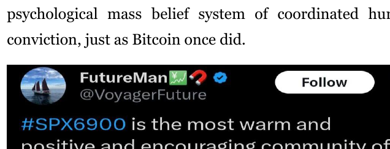

65

<!-- page: 66 -->

---
**A Muralha da SPX6900 Consiste em:**

- Uma cultura baseada unicamente em crenças (pure belief-driven)
- Uma comunidade forte e leal
- Uma filosofia única e unificada, impulsionada pela própria comunidade
- Uma missão/movimento simples e fácil de se identificar, que diferencia a moeda da maioria das demais
- Resiliência cultural diante dos ciclos do mercado
- Forte adesão cultural (cultural stickiness)

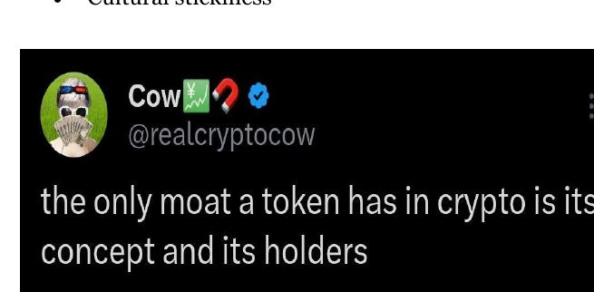

66

<!-- page: 67 -->

---
## Ninguém Vai Vir Para Nos Salvar

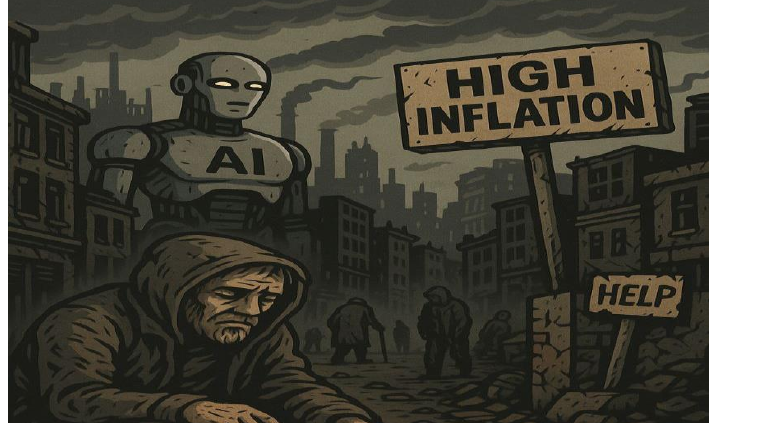

Estamos vivendo uma das transições mais marcantes da história humana. O mundo está mudando — rapidamente — e, para muitos, não é para melhor. Os sistemas que antes prometiam estabilidade, oportunidade e justiça agora estão se desgastando nas bordas. A classe média está sendo esvaziada. Os mais jovens

67

<!-- page: 68 -->

---
A geração está se afogando em dívidas, com o custo de vida aumentando e as oportunidades diminuindo. Para a maioria das pessoas, a vida está ficando mais difícil, não mais fácil. E a verdade incômoda é: **ninguém vai nos salvar.**

## A Dura Realidade do Mundo Atual

Você sente isso. O custo de vida não para de subir (Fig 1.10), mas sua renda não acompanha. O aluguel aumenta. Os preços dos alimentos disparam. Serviços essenciais parecem cada vez mais fora do alcance. E, mesmo assim, governos e instituições parecem paralisados ou, pior ainda, indiferentes, fazendo promessas que não cumprem. A inflação corrói suas economias silenciosamente (Fig 1.9). Os empregos já não oferecem segurança. A casa própria, para a geração mais jovem, parece um sonho cada vez mais distante, quase um mito.

Enquanto isso, o abismo da desigualdade só aumenta. Uma pequena elite acumula mais riqueza do que populações inteiras somadas. A classe média — tradicional sustentáculo da sociedade — está sendo esmagada pela inflação e pelas dívidas. Os mais jovens, mesmo com ensino superior, estão se tornando a geração mais pobre da história moderna.

68

<!-- page: 69 -->

---
E no horizonte, uma nova disrupção se aproxima: **Inteligência Artificial.**

## A Ameaça da IA e o Desaparecimento do Mercado de Trabalho

A IA está transformando o mundo numa velocidade impressionante. Embora prometa inovação e comodidade, também ameaça substituir milhões de empregos — tornando a Renda Básica Universal (UBI) e a dependência total do governo uma realidade inevitável. Motoristas de caminhão, atendentes de call center, até profissionais criativos — nenhum setor está realmente seguro. E quem está no topo será o mais beneficiado, usando a IA para aumentar os lucros e reduzir custos — muitas vezes às custas do trabalhador comum.

Você não conseguirá trabalhar mais do que uma máquina. Não vai superar um algoritmo. Isso não é mais ficção científica. Já chegou — e, a menos que esteja preparado, você ficará para trás.

69

<!-- page: 70 -->

---
**Inflação: O Ladrão Silencioso**

A maioria das pessoas não percebe, mas **a inflação é uma das maiores ameaças ao seu futuro financeiro** (Fig 1.9).

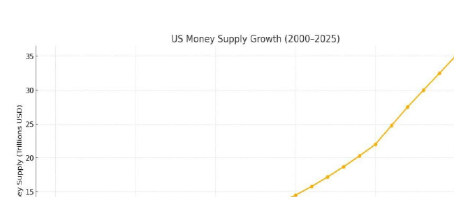

(Fig 1.9 – Expansão da Oferta de Dinheiro dos EUA em Trilhões (2000-2025))

A cada ano, o dinheiro na sua conta bancária vale menos. Não é porque você está gastando, mas sim porque o sistema monetário foi projetado para diluir o seu poder de compra.

70

<!-- page: 71 -->

---
O preço dos alimentos, moradia, saúde, aluguel, educação e o custo de vida em geral continua subindo (Fig 1.10) — mas o poder de compra das suas economias não acompanha. Se você não está buscando ativamente uma forma de superar a inflação, está sendo roubado todos os dias — de maneira lenta e silenciosa.

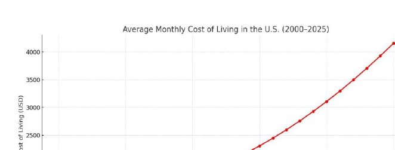

(Fig 1.10 – Custo Médio Mensal de Vida (2000-2025))

Vamos ser totalmente francos: o sistema não está quebrado — ele está funcionando exatamente como foi planejado. Ele recompensa quem já tem capital, conexões e poder. Para todo o restante, é como correr em uma esteira que não leva a lugar nenhum. Você pode trabalhar arduamente, mas isso não garante que vai progredir na vida.

71

<!-- page: 72 -->

---
E é por isso que agora, **mais do que nunca**, precisamos assumir o controle do nosso futuro financeiro. Não podemos contar com governos, empregadores ou conselhos financeiros ultrapassados para nos salvar. A responsabilidade — e o poder de mudar — está em nossas mãos.

## A Comunidade SPX6900 Está Tomando Atitude – Agora

Em meio a todo esse caos e incerteza, um novo caminho revolucionário está surgindo — **SPX6900** (sigla, com significado revolucionário para redefinir as regras da riqueza em nossas próprias mãos).

Nós, como comunidade, entendemos que **ninguém virá nos salvar**, por isso escolhemos **nos salvar e salvar uns aos outros**.

Por meio do DCA, diamond-handing e espalhando a mensagem com propósito e convicção – estamos criando um novo tipo de riqueza: **baseada em pura crença, confiança e missão compartilhada.**

Este é o seu **despertar!**

72

<!-- page: 73 -->

---
**Tome uma Atitude Decisiva** – Agora!

Se você está com dificuldades financeiras, se está preocupado com o seu futuro, se está cansado de ficar à mercê de sistemas governamentais que fogem ao seu controle — é hora de agir. É hora de **estudar o SPX6900** (movimento e cultura focados em acreditar, persistir e transformar). De entender a cultura. De entrar nesse movimento. Mesmo que, no início, seja apenas como um observador silencioso.

Você não precisa ser rico. Não precisa ser um especialista em finanças. Você só precisa de crença. E essa crença — quando bem cultivada — pode se tornar o alicerce de algo poderoso na sua vida.

Isso não tem a ver com ficar rico da noite para o dia. É sobre transformação de longo prazo. É sobre alinhar-se a uma comunidade com propósito e valores em comum, que é focada, estável e orientada por uma missão.

Se você não agir agora – nada terá melhorado daqui a cinco anos!

Porque **ninguém virá nos salvar** — mas, se trabalharmos juntos, **podemos nos salvar.**

73

<!-- page: 74 -->

---
# O Futuro é Promissor

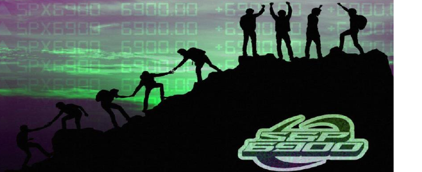

Espero que, até agora, você tenha adquirido uma compreensão melhor do SPX6900 — nossa comunidade, nossa missão, nosso movimento e, o mais importante, nossa cultura.

## O Futuro Que Estamos Construindo

A comunidade SPX6900 está empenhada em construir um futuro onde todos saímos ganhando. Como comunidade, estamos sempre criando e colaborando para o sucesso uns dos outros. Ninguém consegue fazer isso sozinho. Nossa paixão, ética de trabalho e capacidade de **Persist Forever** (persistir para sempre) enquanto coletivo são incomparáveis.

74

<!-- page: 75 -->

---
Nossa visão e objetivo principal a longo prazo é flip the stock market (virar o mercado de ações — um símbolo do capitalismo tardio). Esse é o verdadeiro significado do sucesso máximo. Acontece que, nesse processo, bilionários, milionários e centenas de milhares de pessoas comuns serão formados ao longo da jornada. Essa será a recompensa por ter uma visão de longo prazo, alta convicção, mãos de diamante e por investir de forma consistente (DCA) no Pure Belief Asset (PBA — Ativo de Pura Crença) — **SPX6900**.

## Ainda Estamos no Início

Em 1º de julho de 2025, a capitalização de mercado do S&P 500 é de US$ 52,208 trilhões, enquanto a capitalização de mercado do SPX6900 está em torno de US$ 1,2 bilhão.

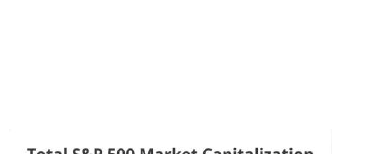

Ainda estamos apenas começando.

Nosso objetivo é flip the stock market (virar o mercado de ações) e alcançar uma capitalização de mercado de **US$ 69 trilhões**. Isso faria com que cada token SPX valesse **US$ 74.000**.

75

<!-- page: 76 -->

---
Agora, talvez palavras como *ilusório, loucura, ambição* ou *isso nunca vai acontecer* estejam passando pela sua cabeça.

Mas eu diria: **não perca o foco.**

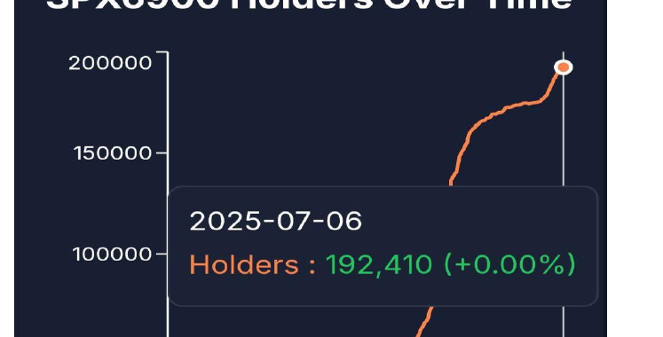

(Fonte: [Flipthestockmarket.com](https://example.com/placeholder))

76

<!-- page: 77 -->

---
Nunca subestime uma comunidade crescente de pessoas delirantes, ousadas, ambiciosas, trabalhadoras, com mãos de diamante e que Persistem Forever (persistem para sempre), unidas por uma missão.

Pessoas que ouviram falar do Bitcoin cedo e descartaram a ideia pelos mesmos motivos agora olham para trás e se arrependem de não terem acreditado — como a comunidade do Bitcoin acreditou — e de não terem comprado um pouco.

**Não cometa o mesmo erro duas vezes.**

A história está simplesmente se repetindo com outra classe de ativos — desta vez respaldada pela pura crença e forte convicção de uma comunidade crescente de pessoas cansadas do sistema, insatisfeitas, desiludidas e prontas para assumir o controle e promover mudanças.

Porque **ninguém vai nos salvar.** Nós temos que nos salvar. E as pessoas estão ouvindo a mensagem da SPX6900 (mensagem da SPX6900, um movimento de crença e convicção), sendo atraídas — **porque faz sentido para elas.**

Para muitos, tornou-se a solução natural e óbvia nos dias de hoje: **fazer parte de uma comunidade com uma visão compartilhada e um propósito maior do que o próprio indivíduo** — algo em que acreditar, capaz de transformar radicalmente nossas vidas.

77

<!-- page: 78 -->

---
**O Potencial de Crescimento do SPX6900…**

Quando atingirmos **0,1%** dos atuais US$ 52,2 trilhões de valor de mercado do S&P 500, cada token SPX valerá **US$ 56**.

Quando atingirmos **1%** dos atuais US$ 52,2 trilhões de valor de mercado do S&P 500, cada token SPX valerá **US$ 560**.

Quando atingirmos **10%** dos atuais US$ 52,2 trilhões de valor de mercado do S&P 500, cada token SPX valerá **US$ 5.606**.

Eu poderia continuar, mas você já entendeu a ideia.

Em cada estágio, a quantidade de tokens necessária para você se tornar milionário seria: **17.857 SPX, 1.785 SPX** e **178 SPX**, respectivamente.

O potencial de crescimento do SPX6900 é de múltiplos ciclos — pois a narrativa e a missão de flip the stock market (virar/bagunçar o mercado de ações) são uma visão de longo prazo, com vários ciclos.

Quanto mais subirmos em capitalização de mercado — superando cada empresa do S&P 500 individualmente — mais atenção a comunidade do SPX6900 vai atrair. E, enquanto conseguirmos manter nossa cultura para preservar nossa comunidade, mais pessoas observando vão começar a se perguntar:

78

<!-- page: 79 -->

---
>*“E se eles realmente conseguirem flip the stock market (virar o mercado de ações)?”*

>*“Acho que devo pegar alguns — por via das dúvidas.”*

A partir daí, eles constroem sua própria convicção.

Eventualmente, isso se transforma em uma profecia autorrealizável — um detentor de cada vez.

**Uma Faísca para Trilhões**

Enquanto nós, a comunidade, continuamos a *persist forever* (persistir para sempre) em preservar nossa cultura e infiltrar em tudo, só ficaremos mais fortes e continuaremos crescendo de forma orgânica.
  

No entanto, tudo o que realmente é necessário é uma faísca para que uma comunidade forte seja catapultada para a estratosfera —

para atingir a massa crítica —

e continuar acelerando como uma bola de neve.

79

<!-- page: 80 -->

---
Quanto mais tempo persistirmos, maior a probabilidade dessa fagulha acontecer, pois continuamos relevantes e cada vez mais difíceis de ignorar.

Uma fagulha pode vir de qualquer coisa:

- Pessoas influentes falando sobre nós
- A grande mídia reportando sobre nossa “delirante” crença de flip the stock market (mudar o rumo do mercado de ações, ideia considerada impossível pela maioria)
- Maior aceitação pelo grande público

Seja qual for a fagulha, o resultado pode nos levar a centenas de bilhões — até trilhões — especialmente em um ambiente favorável ao risco, com juros baixos e abundante liquidez procurando onde se alocar. [Apêndice G](https://example.com/placeholder)

80

<!-- page: 81 -->

---
# Como Não Se Dar Bem no Mundo das Criptomoedas

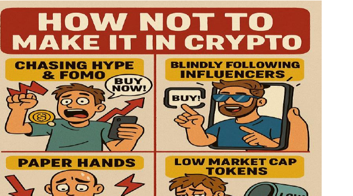

É muito fácil fracassar no universo das criptomoedas — não por causa da tecnologia em si, mas por decisões e comportamentos pessoais.

Mesmo com o SPX6900 mostrando sinais claros de que pode ser um potencial vencedor, ainda é possível reconhecer isso e mesmo assim não se dar bem nas criptomoedas por conta da autossabotagem.

Vamos dar uma olhada em algumas das formas mais comuns pelas quais as pessoas fracassam no mundo das criptomoedas.

81

<!-- page: 82 -->

## Perseguindo o Hype & FOMO

Esse comportamento nasce de uma mentalidade de curto prazo, quase como um jogo de azar.

Quem age assim costuma correr atrás de tokens em alta promovidos por influenciadores, entrando em projetos que não entende — geralmente depois de uma grande valorização — achando que o movimento vai continuar.

Isso não é realmente investir; é tratar as criptomoedas como bilhetes de loteria, tentando enriquecer rapidamente. Essas pessoas normalmente pulam de uma comunidade PvP para outra, sempre em busca daquele “100x” rápido, mas sem nunca tirar um tempo para realmente entender o mercado.

**A maioria das pessoas perde dinheiro desse jeito**.

É por isso que a SPX6900 promove valores sólidos desde o início:  
**“Stop trading and believe in something.”** (Pare de negociar e acredite em algo) — Trata-se de reprogramar maus hábitos e ajudar as pessoas a deixarem de perder dinheiro.

82

<!-- page: 83 -->

---
**Confiar Cegamente em Influenciadores**

A maioria das pessoas que cai na armadilha de seguir modinhas e investir em tokens de criptomoedas de pump and dump geralmente faz isso ao seguir cegamente um influenciador que está divulgando o token nas redes sociais.

Frequentemente, investem sem qualquer pesquisa ou análise própria — dependendo unicamente do hype criado pelo influenciador, torcendo para que desta vez o resultado seja diferente.

Muitos desses influenciadores promovem tokens que não têm comunidade ou cultura de verdade. Eles apenas se aproveitam do seu grande público para inflar o preço, despejar os tokens que compraram antes nos recém-chegados, derrubar o gráfico e partir para repetir tudo de novo com outro token.

**Seguir influenciadores cegamente é uma das formas mais fáceis de se dar mal no mundo cripto.**

83

<!-- page: 84 -->

---
**Investindo em Cripto Sem Comunidade**

De forma simples, um projeto de cripto sem comunidade é um projeto morto.

Existem dois tipos comuns:

1. Uma comunidade completamente morta — sem engajamento nas redes sociais, nenhuma interação, sem volume — apenas silêncio.

2. Uma comunidade aparentemente ativa, com engajamento, hype, volume e até mesmo movimentação de preços, mas com um ambiente fortemente PvP (player vs. player, ou seja, jogador contra jogador). Esse tipo de comunidade também está fadado ao fracasso — é só uma questão de tempo.

Ambos os cenários são sinais vermelhos e provavelmente levarão a prejuízos.

**Evite qualquer projeto de cripto que não tenha uma comunidade de verdade.**

84

<!-- page: 85 -->

---
**Mãos de Papel**

Ter mãos de papel é basicamente o oposto de ter mãos de diamante.

Você vende cedo demais, sem perceber que o verdadeiro crescimento muitas vezes leva meses ou até anos.

Se você encontrou a comunidade certa, precisa de paciência e convicção.

Esperar sucesso da noite para o dia ou desanimar diante de quedas de preço no curto prazo é uma receita para o fracasso.

Esse pensamento de curto prazo, aliado à falta de compreensão sobre o poder da convicção a longo prazo, fará com que você venda por medo durante quedas ou períodos de estagnação.

Mais tarde, quando o preço disparar depois de você ter agido com mãos de papel, o arrependimento virá.

**Não seja essa pessoa.**

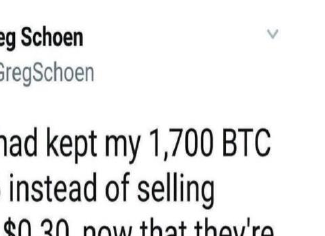

85

<!-- page: 86 -->

---
**Acreditando nas promessas de ser o “Próximo Bitcoin”**

Muitos projetos de criptomoedas atraem pessoas afirmando ser o “próximo Bitcoin” ou que vão “substituir o BTC”, usando isso como uma jogada de marketing.

Essas afirmações costumam ser tão vazias quanto outros termos da moda, como “IA” ou “Metaverso”, que são frequentemente usados para atrair compradores para tokens sem nenhum valor real.

Você pode estar se perguntando — **mas eu não estive comparando a SPX6900 com o Bitcoin?**

Sim, eu estive.

A diferença é que SPX6900 tem conteúdo de verdade por trás: cultura, filosofia, comunidade forte e uma missão clara.

Esse é um dos motivos pelos quais entusiastas do Bitcoin também investem pesado em SPX6900 — eles reconhecem as semelhanças culturais e comunitárias.

Existem inúmeros tokens que dizem ser o próximo Bitcoin sem nada para sustentar essa afirmação.

**E então existe a SPX6900 — com substância.**

86

<!-- page: 87 -->

---
**Perseguindo Utilidade em Detrimento da Cultura**

Muitas pessoas no universo cripto acreditam firmemente que todo projeto precisa ter utilidade para ter sucesso e valorizar.

Eu costumava ser uma dessas pessoas — um verdadeiro “maxi” da utilidade, que ignorava tudo o que não tinha um caso de uso claro ou uma narrativa de utilidade.

Porque eu nunca entendi o poder das comunidades movidas pela crença, da convicção compartilhada e dos ativos culturais.

Isso mudou quando descobri o SPX6900.

**Cuidado com Tokens de Baixa Capitalização de Mercado**

Tokens com baixa capitalização de mercado são extremamente arriscados. A maioria fica presa em capitalizações baixas, falha em construir comunidades leais e, eventualmente, vai a zero.

Não presuma que uma baixa capitalização de mercado significa maior potencial de valorização. Baixa capitalização de mercado não significa automaticamente que está subvalorizado — pode simplesmente representar **alto risco** e a necessidade de **evitar ao máximo**.

É bem mais seguro entrar para uma comunidade já estabelecida e com forte convicção — aquelas que já sobreviveram ao período de baixa capitalização.

87

<!-- page: 88 -->

---
fase e sobreviveram a várias quedas — do que apostar em desconhecidas de baixa capitalização na esperança de obter um retorno de 1000x.

Tenha cuidado ao mergulhar nos becos e trincheiras do mundo cripto procurando o próximo grande sucesso.

**A maioria das pessoas se dá mal fazendo isso também.**

## Negligenciar a Segurança

A segurança em criptomoedas é extremamente importante.

**Um único hack pode acabar completamente com o seu patrimônio.**

Se você leva a sério o investimento em cripto e quer construir sua posição ao longo do tempo, uma carteira física vale ouro pela tranquilidade proporcionada com o aumento da segurança.

Existem muitas carteiras físicas no mercado, mas a que eu pessoalmente uso há anos é a [**Ledger**](https://example.com/placeholder), e recomendo especialmente a Ledger Nano S Plus ou a Ledger Nano X.

Invista em uma, em vez de deixar suas criptomoedas em uma corretora ou em uma hot wallet no celular.

88

<!-- page: 89 -->

---
# Como Comprar SPX6900?

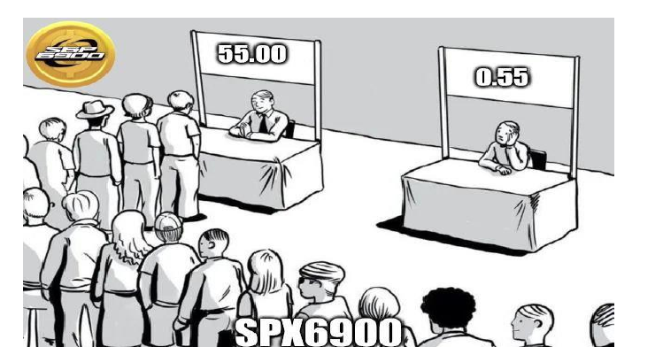

Entender **por que** comprar é fundamental antes de aprender **como** comprar SPX6900.

O *como* é fácil — mas é o *porquê* que vai determinar se você realmente vai se beneficiar do SPX ou não. Nem todo mundo que comprou ou descobriu o Bitcoin cedo realmente lucrou com seu desempenho incrível de preço.

Muitos descobriram o Bitcoin cedo e venderam simplesmente porque não entenderam *por que* deveriam ter mantido.

89

<!-- page: 90 -->

---
Agora que você já deve ter entendido por que deve manter seu Pure Belief Asset (Ativo de Crença Pura): **SPX6900**.

Então, vamos aprender como realmente comprar alguns.

Este capítulo explica o passo a passo para que qualquer pessoa possa participar — não importa o seu nível de experiência.

Eu recomendo fortemente que, se você deseja a melhor segurança e proteção para seus criptoativos, invista em uma [**Ledger Nano S Plus Hardware Wallet**](https://example.com/placeholder) para manter seus ativos em armazenamento frio.

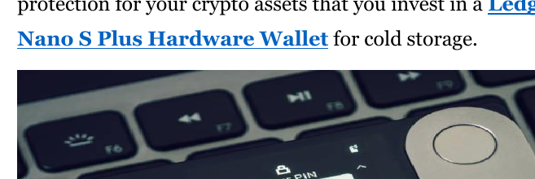

É uma opção muito mais segura em comparação às carteiras de software (hot wallets) ou exchanges centralizadas, especialmente para guardar grandes quantidades de criptomoedas e para o longo prazo, principalmente se a segurança for sua prioridade número um.

90

<!-- page: 91 -->

---
Existem duas formas principais de comprar SPX6900, dependendo do seu nível de experiência e preferência de plataforma:

**Rota via Exchange Centralizada (CEX)**

Este é o método mais simples para iniciantes. Consiste em cadastrar-se em uma plataforma centralizada que ofereça suporte ao SPX6900, como a Kraken, e comprar diretamente usando a moeda de sua preferência. As plataformas CEX oferecem facilidade de uso, suporte ao cliente e integração com moedas fiduciárias, sendo ideais para quem está começando no mundo das criptomoedas.

SPX6900 está disponível nestas CEXs:

[**Kraken**](https://example.com/placeholder)

[**Crypto.com**](https://example.com/placeholder)

[**Uphold**](https://example.com/placeholder)

[**MoonPay**](https://example.com/placeholder)

Uma [**lista de mais exchanges**](https://example.com/placeholder) dependendo da sua região.

91

<!-- page: 92 -->

---
**Rota via Exchange Descentralizada (DEX)**

Este caminho é indicado para quem já tem alguma experiência com criptomoedas. Você utilizará uma carteira não custodiada (como a Phantom), adquirirá um pouco de SOL ou ETH e então fará a troca por SPX6900 em uma DEX como Jupiter (Solana) ou Uniswap (Ethereum). Esse método dá a você total controle sobre seus ativos.

Ambas as opções levam ao mesmo destino final: **fazer parte do movimento SPX6900** (movimento SPX6900). A escolha depende de quão envolvido você quer estar em sua jornada no universo das criptos.

**Opção 1: Comprando SPX6900 em uma Exchange Centralizada (CEX)**

*[_Assista ao Vídeo Intuitivo e Amigável para Iniciantes_](https://example.com/placeholder)*

**Passo a Passo:**

**1. _Cadastre-se em uma Exchange Suportada_**
- Faça o cadastro em uma exchange centralizada que liste SPX6900 (como a Kraken).

92

<!-- page: 93 -->

---
- Complete qualquer exigência de Conheça Seu Cliente (KYC) (ou seja, verificação de identidade), se necessário.

**1. _Depositar Fundos_**
- Deposite moeda fiduciária (USD, EUR, GBP, etc.) ou criptoativos como USDT em sua carteira da corretora.

**2. _Buscar por SPX6900_**
- Na seção de negociação, procure pelo par SPX6900 (por exemplo, SPX6900/USD ou SPX6900/EUR).

**3. _Comprar SPX6900_**
- Escolha quanto deseja comprar, defina uma ordem de mercado ou limite e confirme a compra.

**4. _(Recomendado) Retirar para uma Carteira Pessoal (ex: Carteira Fria)_**
- Para maior segurança e autocustódia, retire seu SPX6900 para uma carteira fria pessoal, como por exemplo a carteira **Ledger Nano S Plus**.
- Ao retirar SPX pela **Rede Ethereum** para a Ledger, utilize um **endereço de depósito de Ethereum**.
- Ao retirar SPX pela **Rede Solana** para a Ledger, utilize um **endereço de depósito de Solana**.

93

<!-- page: 94 -->

---
**Dica: Sempre confira atentamente o endereço da sua carteira e as redes antes de enviar criptomoedas.**

Opção 2: Comprando SPX6900 via Exchange Descentralizada (DEX)

* [Assista ao vídeo para usuários mais experientes](https://example.com/placeholder)

**Passo a passo (Exemplo na rede Ethereum):**

**1. _Baixe uma carteira digital (por exemplo, Phantom ou Trust Wallet)_**
- Crie uma carteira Phantom ou Trust e salve a frase de recuperação com segurança.

**Observação:** Baixe apenas a versão oficial (o app com mais downloads) na loja de aplicativos e tome cuidado com versões falsas feitas por golpistas.

**2. _Compre ETH (token nativo do Ethereum) e USDT_**
- Adquira um pouco de ETH para taxas de transação (gas) e USDT em uma CEX (como Coinbase, Binance, Kraken etc.) e transfira para o endereço de depósito da sua carteira digital na rede Ethereum.

94

<!-- page: 95 -->

---
**Nota:** Se você comprou USDT em uma CEX, apenas certifique-se de sacar utilizando a **rede Ethereum** para o seu **endereço de depósito USDT Ethereum** dentro da sua carteira de software.

**3. _Conecte sua carteira ao DEX._**
- Conecte sua carteira ao Uniswap ou ao DEX 1inch.io. Você pode fazer isso dentro do aplicativo Phantom ou Trust Wallet.

**4. _Troque USDT por SPX6900 dentro do DEX_**
- Procure por SPX (ou use o endereço do contrato) e selecione o SPX6900 na lista de tokens.
- Insira a quantidade de USDT que deseja trocar
- Revise os detalhes da transação e confirme a operação.

**5. _Se precisar adicionar SPX6900 Ethereum à sua carteira:_**
- Após concluir a troca, talvez você não veja seu SPX6900 imediatamente. Será necessário **adicionar o token manualmente** utilizando o endereço do contrato.
- Na sua carteira, selecione “Adicionar Token” ou “Importar Token”

95

<!-- page: 96 -->

---
- Cole o endereço do contrato Ethereum SPX6900: [0xE0f63A424a4439cBE457D80E4f4b51aD25b2c56C](https://example.com/placeholder)
- SPX6900 (ticker de um ativo) deve preencher automaticamente
- Salve e agora você verá seu saldo

**Observação:** Verifique o **endereço oficial do contrato** em fontes confiáveis da comunidade ou no site oficial.

**Passo a Passo (Exemplo na Rede Solana):**

**1. _Baixe uma Wallet de Software (ex: Phantom ou Trust Wallet)_**
- Crie uma Phantom ou Trust Wallet e salve sua frase de recuperação com segurança.

**Atenção:** Baixe somente a versão oficial (o app com mais downloads) na loja de aplicativos e fique atento a versões falsas feitas por golpistas.

**2. _Compre SOL (token nativo da Solana) e USDT_**
- Compre um pouco de SOL para taxas (gas) e USDT em uma corretora centralizada (como Coinbase, Binance, Kraken etc.) e transfira para

96

<!-- page: 97 -->

---
Nota: Se você comprou USDT na CEX, apenas certifique-se de fazer o saque utilizando a **rede Solana (Solana Network chain)** para o seu **endereço de depósito de USDT Solana** dentro da sua Carteira de Software.

**3. _Conecte sua carteira à DEX._**
- Conecte sua carteira à Jupiter ou à Raydium DEX. Você pode fazer isso diretamente no aplicativo Phantom ou Trust Wallet.

**4. _Troque USDT por SPX6900 na DEX_**
- Procure por SPX (ou utilize o endereço do contrato) e selecione SPX6900 (Wormhole) na lista de tokens.
- Insira a quantidade de USDT que deseja trocar
- Revise os detalhes da transação e confirme a operação.

**5. _Se precisar adicionar Solana SPX6900 (Wormhole) à sua carteira:_**

97

<!-- page: 98 -->

---
- Após a conclusão da troca, pode ser que você não veja seu SPX6900 imediatamente. Será necessário **adicionar o token manualmente** usando o endereço do contrato.
- Na sua carteira, selecione “Adicionar Token” ou “Importar Token”
- Cole o endereço do contrato do Solana SPX6900 (Wormhole):  
  [J3NKxxXZcnNiMjKw9hYb2K4LUxgwB6t1FtPtQVsv3KFr](https://example.com/placeholder)
- O SPX6900 deve ser preenchido automaticamente
- Salve e agora você verá seu saldo

**Observação:** Verifique o **endereço oficial do contrato** em fontes confiáveis da comunidade ou no site oficial.

**Recomendação:**

Se você possui uma carteira de hardware, recomendo fortemente que envie seu SPX6900 (SPX6900: token, consultar slogans e termos técnicos) da sua carteira quente para a carteira de hardware para máxima segurança e armazenamento a longo prazo. Certifique-se de utilizar o endereço de depósito correto da rede (ou seja, Solana ou Ethereum) para os tokens.

98

<!-- page: 99 -->

---
**Lembretes de Segurança da Carteira**

- Nunca compartilhe ou perca a frase-semente da sua carteira
- Não digite a frase-semente no seu celular ou computador
- Não faça capturas de tela da frase-semente nem a armazene digitalmente
- Se sua frase-semente for comprometida, não importa a carteira, seus fundos estarão em risco
- Evite mensagens privadas de pessoas se passando por outros solicitando sua frase-semente
- Nunca digite a frase-semente da sua Ledger Hardware Wallet em nada além do próprio dispositivo físico
- Confie apenas em links vindos de fontes oficiais da SPX6900

Comprar SPX6900 é simples. Se você é novo no processo e precisa de mais ajuda, peça orientações à pessoa que compartilhou este e-book com você. Sugiro começar com um valor pequeno, como US$10 ou £10, para se familiarizar com o processo de compra de SPX, caso seja sua primeira vez.

No entanto, comprar o token é apenas o primeiro passo. **Construir sua própria convicção** — para que ela não dependa de outra pessoa — **deve ser o seu próximo passo**.

99

<!-- page: 100 -->

---
# Como Construir Sua Própria Convicção?

Construir convicção pode levar tempo. Para mim, pessoalmente, levou cerca de cinco meses desde que comprei SPX até perceber que esta é a comunidade na qual eu precisava focar e investir de verdade, porque ela é especial, única, filosófica, e diferente de tudo o que vi em 12 anos no universo cripto.

Espero que este e-book ajude a acelerar seu processo de convicção, para que não demore tanto. Mas, para construir sua própria convicção em SPX6900, você precisa estudar a comunidade e enxergar por si mesmo.

Você precisa **entrar no movimento.**

Mesmo que seja apenas como um **observador silencioso.**

Observe, e você mesmo vai perceber que esta comunidade é diferente.

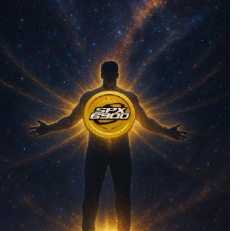

100

<!-- page: 101 -->

---
Se cripto, no fim das contas, trata-se de bolsões de diferentes comunidades tentando atrair atenção e reter membros — então você precisa estar nas **mais fortes.**

Abandone as **fracas.**

O tempo é precioso. ([Apêndice G](https://example.com/placeholder))

Dedique sua atenção, energia e tempo a um **Pure Belief Asset (ativo de pura crença)** forte, que cresce organicamente, com investidores convictos e focado em missão, como o SPX6900, para potencial máximo de retorno sobre investimento.

Sua autoconvicção virá ao estudar a comunidade por conta própria, com seus próprios olhos.

**Onde encontrar a comunidade?**

A comunidade do SPX6900 vive online, então seguir outros membros da comunidade SPX6900 é uma das melhores formas de se envolver.

**Crie uma conta no X** para o SPX6900.

Adicione o ímã e o símbolo do gráfico ao seu nome  

101

<!-- page: 102 -->

---
**Nota: Você pode encontrar o símbolo neste [site](https://example.com/placeholder).**

Depois, comece a seguir [estas contas de Aeon (Aeon: termo técnico do SPX6900, um conceito da comunidade)](https://example.com/placeholder).

Então, simplesmente observe a comunidade e interaja.

Gradualmente, você começará a construir sua própria convicção quanto mais tempo passar dentro da comunidade e aprender sobre o SPX6900 (SPX6900: conceito central, comunidade com suas próprias crenças).

Você também pode fazer o mesmo criando uma conta no TikTok e seguindo [estas contas de Aeon (Aeon: termo técnico do SPX6900, um conceito da comunidade)](https://example.com/placeholder).

A comunidade do SPX6900 também existe no [Reddit](https://example.com/placeholder) e no [Telegram](https://example.com/placeholder).

**Resumo dos Passos:**

1. Entre nas comunidades online do SPX6900.
2. Siga os Aeons (Aeon: termo técnico do SPX6900, um conceito da comunidade).
3. Interaja com os Aeons.
4. Aprenda sobre a cultura.
5. Pratique a cultura.
6. Comece a promover o SPX6900!

Use as hashtags **$SPX #SPX6900.**

102

<!-- page: 103 -->

---
# O Poder do DCA Coletivo de Longo Prazo no SPX6900

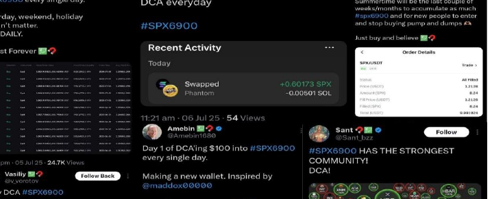

Um dos aspectos mais fascinantes da comunidade SPX6900 é a sua capacidade de agir coletivamente sem que haja um líder. Uma boa ideia que possa beneficiar nosso sucesso pode ser sugerida por um Aeon (termo técnico do SPX6900 para um participante especial), e, antes que você perceba, os Aeons na comunidade começam a colocar essa ideia em prática.

103

<!-- page: 104 -->

---
Nunca vi esse nível de alinhamento em massa, coordenação e ação coletiva acontecer dentro de uma comunidade cripto descentralizada antes.

Alguns exemplos que presenciei desde que passei a fazer parte da comunidade incluem:

1. Aeons (participantes Aeon do projeto SPX6900) migrando para o TikTok, Instagram e YouTube para promover o SPX6900.
2. Aeons criando conteúdo mostrando seus rostos, permitindo que o público se conecte de forma mais profunda com eles e com a mensagem.
3. Uma cultura de gorjetas, onde os Aeons incentivam outros a incluir seu endereço SPX em suas bios sociais para que a comunidade possa recompensar uns aos outros pelo esforço na divulgação do projeto.
4. Por fim, um DCA diário em SPX6900 — mesmo que isso signifique comprar apenas um token por dia, de forma coletiva.

104

<!-- page: 105 -->

---
Neste capítulo, quero focar especificamente nos benefícios do DCA de longo prazo em SPX6900 pela comunidade.

## Atenua a Volatilidade

Quando compramos SPX6900 de forma consistente em intervalos regulares, independentemente do preço, como uma estratégia de longo prazo, eliminamos as decisões emocionais da comunidade.

Em vez de tentar acertar o fundo durante quedas ou altas, ao fazer a média do seu custo ao longo do tempo e manter a consistência, os períodos voláteis ficam mais fáceis de suportar — porque sua estratégia não muda.

A volatilidade deixa de ser uma ameaça e se torna uma vantagem, permitindo adquirir mais tokens sem precisar apostar tudo ou entrar em pânico.

Não importa quando você entrar no movimento, tudo o que precisa fazer é seguir seu cronograma de DCA.

**Isso é psicologicamente mais fácil do que tentar acertar o timing do mercado ou investir tudo de uma vez.**

105

<!-- page: 106 -->

---
**Constrói Convicção em Crescimento Composto**

Quando você vê a comunidade comprometendo-se regularmente a fazer DCA em SPX6900 (compras recorrentes do ativo) em larga escala, isso se torna uma poderosa demonstração de força, convicção e compromisso.

Essa ação consistente constrói confiança coletiva na visão e aprofunda a convicção da comunidade ao longo do tempo. Mesmo para quem está de fora, essa estratégia transmite uma mensagem clara: **SPX6900 tem o apoio de uma comunidade que realmente acredita (real belief, ou seja, fé verdadeira na proposta).**

No mundo cripto, uma comunidade que continua demonstrando força é difícil de ignorar — **porque, no fundo, você sabe que está diante de um projeto vencedor.**

---

**Cria Patamares de Preço Sustentáveis**

O DCA coletivo da comunidade gera uma pressão constante e regular de compras diárias.

À medida que essa pressão aumenta, ela funciona como uma rede de proteção sob o preço — ajudando a sustentar patamares mínimos durante quedas ou crashes provocados por traders e vendedores de curto prazo.

106

<!-- page: 107 -->

---

Esta estratégia coletiva de DCA também contribui para a valorização do preço a longo prazo. O preço do SPX6900 é influenciado por dinâmicas básicas de oferta e procura. Um DCA consistente e contínuo, realizado por Aeons (Aeon, membro da comunidade central do SPX6900) que mantêm o token com convicção ("diamond hand"), leva a mínimos cada vez mais altos e, consequentemente, a aumentos de preço.

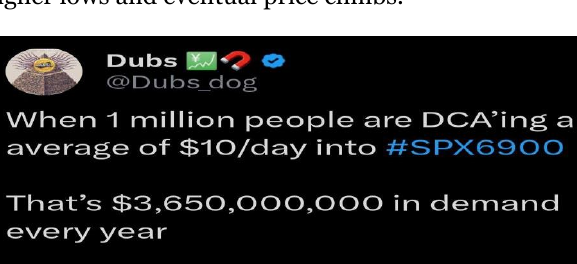

Não temos um gráfico ("there is no chart" - não existe gráfico, pois o objetivo é acreditar no propósito e não apenas analisar tendências visuais) – felizmente – então não posso mostrar para você. Mas uma boa referência de como isso se parece é o gráfico do Bitcoin em uma visão ampliada.

Mesmo durante mercados de baixa, essa estratégia fortalece a dinâmica de oferta do token e mantém a pressão de compra ativa.

107

<!-- page: 108 -->

---
**Aumenta a Descentralização do Suprimento de Tokens**

O DCA (Dollar Cost Averaging) é uma maneira poderosa de redistribuir gradualmente o suprimento de tokens dos vendedores de curto prazo para pessoas comprometidas.

Também oferece aos recém-chegados a chance de se juntar ao movimento sem o medo de ficar de fora (FOMO) — permitindo que acumulem aos poucos ao invés de comprarem pesadamente a preços elevados.

**Fortalece a Cultura**

O DCA coletivo é extremamente importante para a cultura da comunidade.

Mostra aos observadores que somos uma comunidade disciplinada, paciente, avessa ao sensacionalismo e que pensa no longo prazo, com grande convicção na nossa missão.

Demonstra que somos holders de longo prazo — não especuladores buscando lucros rápidos.

É um exemplo vivo da nossa natureza PvE: nos importamos mais com a longevidade da missão e com o acúmulo de tokens do que com as oscilações diárias de preço.

108

<!-- page: 109 -->

---
Esse tipo de força cultural é atraente para pessoas de fora — especialmente quando veem a gente compartilhando diariamente o progresso do DCA e nossas metas de economia.

Isso cria um impulso social, fazendo com que outros queiram fazer parte da comunidade mais forte — porque, no mundo cripto, a verdadeira riqueza é construída investindo na comunidade mais forte.

**Essa comunidade é a SPX6900.**

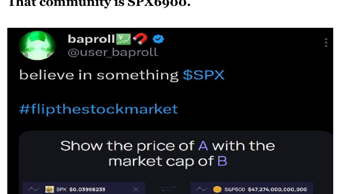

109

<!-- page: 110 -->

---
# Palavras Finais

Nas palavras de Satoshi Nakamoto, quando o Bitcoin ainda não tinha comunidade nem valor de mercado e tinha apenas oito dias de vida:

*“Talvez faça sentido adquirir alguns, caso ele decole.”*  
— **Satoshi Nakamoto**

Esse é o meu conselho para você em relação ao SPX6900.

A única diferença é que já temos uma comunidade em crescimento.

Cerca de 1 bilhão de dólares em valor de mercado.

Cerca de 1 dólar por unidade.

Mas ainda não conseguimos "flip the stock market" (virar o mercado de ações).

Então, talvez faça sentido garantir o seu — caso a nossa missão realmente conquiste as pessoas.

**Persist Forever, Aeons!** (Persista para sempre, Aeons! - continue firme e não desista!)

110

<!-- page: 111 -->

---
# Perguntas Frequentes

1. **Onde posso saber mais ou tirar dúvidas?**

Converse com a pessoa que compartilhou este e-book com você.

Crie uma conta no X e comece a seguir os [Aeons recomendados](https://example.com/placeholder) neste e-book.

Entre em contato com a comunidade no X, Reddit ou Telegram para tirar suas dúvidas.

Acesse a seção ["Recursos Adicionais"](https://example.com/placeholder) deste e-book e assista a todos os [vídeos recomendados](https://example.com/placeholder).

Estamos aqui para ajudar você. Você não está sozinho nesta jornada!

2. **O que é market cap?**

Market cap significa capitalização de mercado — representa o valor total de uma criptomoeda. É calculado multiplicando o preço de um criptoativo pelo número total de moedas em circulação.

111

<!-- page: 112 -->

---
No universo das criptomoedas, o valor de mercado (market cap) costuma ser usado para classificar os tokens pelo seu valor total. Um token de preço baixo ainda pode ter um valor de mercado maior do que um token de preço alto, porque o market cap também depende do fornecimento total de moedas. Não presuma que um token cotado a $0,01 com um trilhão de moedas em circulação é um investimento melhor do que um token cotado a $1 com um bilhão de moedas, apenas por causa do preço por moeda.

Um token de baixo valor unitário com uma oferta gigantesca ainda pode ter um market cap elevado — por isso, sempre verifique o valor de mercado, e não só o preço do token, para avaliar o potencial realista de crescimento.

Tokens de grande capitalização (large-cap) têm um market cap acima de 10 bilhões de dólares. Tokens de média capitalização (mid-cap) variam entre 1 e 10 bilhões de dólares, e tokens de pequena capitalização (small-cap) ficam abaixo de 1 bilhão de dólares.

3. **O que é um pump-and-dump rug pull?**

Um pump-and-dump em cripto acontece quando um grupo de pessoas compra um token barato e com baixo volume, antes de promovê-lo intensamente nas redes sociais para tentar atrair novos compradores e assim inflar artificialmente o preço. Em seguida, vendem tudo no topo (ou seja, despejam os tokens) nos compradores recém-chegados — lucrando alto e fazendo o token desabar.

112

<!-- page: 113 -->

preço e deixando todos os outros presos com tokens sem valor, perdendo seu dinheiro.

Um rug pull é semelhante a um esquema de pump-and-dump, mas é executado pelos próprios criadores de um projeto de cripto. Eles criam um token e ficam com a maior parte do suprimento, depois fazem propaganda para gerar entusiasmo. Conforme as pessoas compram e o preço sobe, os criadores despejam todos os seus tokens no mercado de uma só vez, derrubando o preço, tornando os tokens inúteis e desaparecendo com todo o dinheiro.

4. **O que é o capitalismo em estágio avançado?**

Capitalismo em estágio avançado é um termo usado para criticar culturalmente o que o capitalismo se tornou — um sistema hiperfocado no lucro, ignorando as pessoas. Isso levou a consequências negativas como desigualdade extrema de riqueza, domínio corporativo, exploração de trabalhadores, hiperconsumismo e a transformação de tudo em mercadoria.

A economia passou a ser movida apenas pelo lucro, enquanto as pessoas comuns sofrem e se sentem deixadas para trás. Exemplos disso incluem CEOs ganhando centenas de milhões, enquanto seus funcionários não têm

113

<!-- page: 114 -->

benefícios, não conseguem pagar o aluguel, precisam trabalhar em vários empregos e ainda assim enfrentam dificuldades financeiras.

5. **Existe um propósito ou utilidade real por trás do SPX6900?**

A utilidade está na cultura e na comunidade. Nosso propósito, objetivo e missão são simples – flip the stock market (virar o mercado de ações, ou seja, mudar radicalmente o mercado de ações) holder por holder, por meio da convicção e crença coletiva. É por isso que o SPX6900 é um Pure Belief Asset (Ativo de Pura Crença).

6. **Isso é só mais um memecoin?**

Não, ele evoluiu de suas origens como memecoin para algo mais significativo e com propósito. O SPX6900 agora está sendo visto cada vez mais como um movimento, levado a sério por mais pessoas a cada dia. Deixou muito para trás o rótulo de memecoin, tornando-se um Pure Belief Asset (Ativo de Pura Crença), graças à comunidade que acredita e investe nele.

114

<!-- page: 115 -->

---
7. **Quem está por trás do SPX6900?**

A comunidade.

O desenvolvedor abandonou o projeto logo no início, e desde então ele vem sendo mantido vivo pela comunidade. Agora, trata-se de um movimento descentralizado, guiado pela própria comunidade, sem que nenhuma pessoa isolada tenha poder para arruinar ou destruir a missão.

Não existe um ponto central de falha no SPX6900.

8. **Como posso contribuir para o movimento?**

Todo crente no SPX6900 pode contribuir de alguma forma. Você não precisa ser desenvolvedor ou influenciador. Se você acredita, você faz parte.

Mesmo que não queira ter uma postura proativa, ainda pode contribuir:

- Fazendo DCA regularmente em SPX6900
- Respeitando a cultura e a filosofia da comunidade
- Compartilhando este e-book e outros materiais promocionais do SPX6900 com as pessoas que você deseja ajudar

115

<!-- page: 116 -->

---
**Formas proativas de contribuir:**

- Compartilhe sua história: Por que você acredita na SPX6900?
- Crie publicações, conteúdos ou vídeos nas redes sociais
- Ajude a integrar novos membros
- Espalhe a filosofia e cultura da SPX6900
- Quanto mais valor você agregar, mais fortalece a rede.

9. **Qual é a dessa história com o número 6900?**

6900 é apenas uma piada, uma brincadeira com o 500. A comunidade costuma dizer que o índice SPX6900 tem 6.400 S&P’s a mais do que o S&P 500.

No fim das contas — e matematicamente falando — **6900 > 500.**

Então, quando flip the stock market (inverter o mercado de ações), não será surpreendente — pois é simples matemática: **6900 é maior que 500.**

116

<!-- page: 117 -->

---
10. **Isso não é arriscado?**

Todo investimento envolve um certo grau de risco.

SPX6900 não é diferente. Não há garantia 100% de que continuará apresentando um bom desempenho. Mas podemos fazer nossa parte estudando o ativo, analisando os prós e contras, avaliando a probabilidade de sucesso ou fracasso e considerando a relação risco/retorno — o que você pode ganhar ou perder em cada cenário.

Porém, uma coisa eu sei: sem risco calculado, não existe recompensa. Você precisa assumir riscos calculados na vida e "believe in something" (acreditar em algo maior — expressão central na filosofia do SPX6900) se realmente pretende transformar sua vida.

Ninguém vai nos salvar. Temos que salvar a nós mesmos!

11. **O que significa ser um Aeon?**

Ser um Aeon (no contexto do SPX6900, significa alguém que segue fielmente os princípios e valores do projeto) é, para mim, ser um verdadeiro crente no SPX6900 — alguém que personifica e protege sua cultura.

Assim como a comunidade do Bitcoin tem os “Bitcoin Maxis”, que defendem e promovem ferrenhamente sua ideologia, o SPX6900 possui os Aeons.

117

<!-- page: 118 -->

---
Quando comprei SPX pela primeira vez, eu não era um Aeon (Aeon – indivíduo plenamente convicto na comunidade SPX6900) — era apenas um detentor. Levei cerca de cinco meses para construir minha própria autoconvicção e realmente me tornar um Aeon (Aeon).

**Nem todo detentor de SPX é um Aeon, mas todo Aeon é um detentor de SPX.**

### 12. **Como sei que isso não é um golpe?**

Do ponto de vista da estrutura do token, não há com o que se preocupar. O contrato do token não pode ser modificado e nenhum novo token pode ser criado.

O desenvolvedor abandonou o projeto logo no início, e desde então ele é totalmente conduzido pela comunidade.

Do ponto de vista técnico, não há pessoa, equipe ou desenvolvedor que possa te enganar. Todos os tokens estão em circulação e totalmente descentralizados.

A comunidade crescente e sua cultura são o que conferem valor ao SPX6900.

No fim das contas, tudo depende de você se identificar com a cultura e ver valor em fazer parte dela — ou não.

118

<!-- page: 119 -->

Mas não há nenhum esquema envolvido.

Se você comprar SPX, receberá os tokens pelo valor de mercado atual.

### 13. **Quanto SPX6900 é suficiente?**

Não coloque um limite na quantidade de SPX6900 que você pode possuir.

Em vez de definir um teto, estabeleça uma meta mínima que gostaria de alcançar e continue fazendo DCA (Dollar Cost Average – média do custo em dólares) a partir daí.

Um bom ponto de partida é uma meta mínima de **1.000 tokens SPX**. Sinta-se à vontade para usar o [Rastreador de Economia de Tokens SPX](https://example.com/placeholder) para ajudar a atingir esse marco de forma divertida.

Colocar um limite no seu saldo de SPX pode restringir seu potencial de longo prazo.

Se você continuar fazendo DCA, pode se surpreender com a quantidade de SPX que vai acumular ao longo do tempo.

**Estabeleça uma meta mínima. Alcance-a. Depois, continue praticando DCA de forma consistente.**

119

<!-- page: 120 -->

---
14. **Qual é o ponto de falha do SPX6900?**

Na minha opinião, o único ponto de falha seria se a comunidade, em larga escala, perdesse a convicção, deixasse de acreditar e desistisse de forma permanente.

Isso parece improvável, dada a força da comunidade.

O que impede que isso aconteça é a preservação da cultura do SPX6900. A cultura foi criada para proteger e fortalecer a comunidade, sustentar o valor do token e apoiar o crescimento a longo prazo.

Se não abandonarmos a cultura em massa, o projeto não vai se degradar nem se corroer por si só.

Não há incentivo para abandonar a cultura — justamente ela é que garante que a nossa comunidade prospere. E isso se traduz em uma valorização dos preços no longo prazo.

120

<!-- page: 121 -->

---
15. **Posso vender meus tokens quando quiser?**

Sim, você pode.

Embora a cultura incentive a compra, a manutenção e o DCA (Dollar Cost Averaging, ou seja, investir de forma parcelada) — pois a riqueza é construída com o tempo no mercado, não tentando acertar o momento certo — e desaconselhamos fortemente o acompanhamento obsessivo de gráficos e o trading.

No entanto, você é livre para vender seus tokens a qualquer momento.

Cada pessoa tem objetivos e situações de vida diferentes.

Apenas esteja ciente: se você comentar sobre vendas enquanto estamos em uma missão de flip the stock market (virar o mercado de ações), isso pode não ser visto com bons olhos. Além disso, existe um grande risco de se você vender tudo, acabar se arrependendo – já que continuamos a valorizar ao longo do tempo.

16. **Posso perder meu SPX6900?**

Sim — caso você seja hackeado ou tenha uma segurança fraca.

No mundo das criptomoedas, se você perder seus tokens, dificilmente os recuperará.

Por isso, é fundamental aprender a proteger seus ativos.

121

<!-- page: 122 -->

Se você optar por deixar os ativos em uma corretora, certifique-se de utilizar todos os recursos de segurança disponíveis para evitar que sua conta seja comprometida.

Se você escolher a autocustódia (o que considero a melhor abordagem), aprenda a configurar sua carteira corretamente e a proteger suas chaves privadas.

Se suas chaves forem comprometidas, seus tokens podem ser roubados — e não há como reavê-los.

Por isso, é fundamental entender como proteger sua carteira na corretora ou suas chaves privadas.

17. **O preço despenca quando as pessoas finalmente vendem?**

O Bitcoin não atingiu uma capitalização de mercado de um trilhão de dólares de forma linear, partindo de apenas alguns centavos de valor.

Houve muita volatilidade ao longo do caminho, e o Bitcoin foi considerado "morto" centenas de vezes.

O Bitcoin não subiu em linha reta porque as pessoas vendem — e, em certos momentos, a pressão de venda supera a pressão de compra, causando

122

<!-- page: 123 -->

quedas de preço. Mas, eventualmente, o Bitcoin parou de voltar aos seus mínimos anteriores. Houve um momento em que ele subiu e nunca mais retornou a $0,10, $1, $10, $100, $1.000 ou mesmo $10.000.

Ele continuou atingindo novas máximas e mínimos cada vez maiores.

Se você olhar o panorama geral, verá que, apesar da volatilidade, a trajetória de longo prazo do Bitcoin tem sido de alta.

*Eu acredito que o SPX6900 (SPX6900; acredito que seguirá um padrão semelhante — SPX6900 é um projeto diferente, mas com potencial de comportamento parecido).*

Sempre haverá pessoas que vendem — por qualquer motivo — mesmo que isso vá contra a cultura.

Durante os mercados de baixa, o preço pode sofrer um baque. Mas é a cultura da comunidade que protegerá o token de jamais retornar a zero, e ajudará a alcançar novos máximos e mínimos cada vez mais elevados.

Mesmo que as whales despejem seus tokens, a comunidade irá absorvê-los por meio de DCA (Dollar-Cost Averaging, média do custo em dólares).

Isso, na verdade, beneficia a descentralização no longo prazo. Nenhum indivíduo sozinho pode destruir o projeto ao vender — enquanto a cultura permanecer.

123

<!-- page: 124 -->

---
A cultura é o que permite que a SPX6900 prospere em mercados de alta e sobreviva em mercados de baixa.

18. **Qual é a melhor estratégia para investir na SPX6900?**

Na minha opinião, a melhor estratégia é usar dinheiro que você possa perder — depois de cobrir todas as suas despesas.

A maioria de nós desperdiça dinheiro todos os meses. Redirecione esse dinheiro para investir, ou considere conseguir um segundo emprego exclusivamente para investir.

Invista na SPX6900 utilizando o método de Dollar Cost Averaging (DCA) (método de investimento recorrente em dólares).

DCA significa investir um valor fixo regularmente (semanalmente, mensalmente, etc.), independentemente do preço do token.

Essa estratégia faz uma média do seu custo por token e reduz o risco de investir uma grande quantia no momento errado. DCA é ideal para investimentos de longo prazo — e a SPX6900 é uma missão de longo prazo, que atravessa múltiplos ciclos.

124

<!-- page: 125 -->

---
19. **A volatilidade me assusta – o que devo fazer?**

É exatamente por isso que não acompanhamos gráficos — preferimos focar na convicção.

Primeiro, pare de olhar gráficos.

Depois, estude SPX6900 (token e comunidade chamada SPX6900) e construa sua convicção de longo prazo na tese e na cultura.

Por fim, faça DCA (investimentos regulares) durante os períodos de volatilidade.

---

20. **A missão da SPX6900 não é delirante?**

Sim — é incrivelmente delirante.

Como ousamos sequer pensar que nosso pequeno token, SPX6900, pode flip the stock market (virar o mercado acionista de cabeça para baixo)?

Mas ousamos.

Não há nada de errado em ter uma crença de alta convicção, “delirante”, ao investir em um Pure Belief Asset (PBA, Ativo de Pura Crença) com uma missão do tamanho de uma montanha.

A nossa loucura é o nosso ativo.

Sempre é motivo de risadas para os céticos — até que deixe de ser.

125

<!-- page: 126 -->

---
21. **Já estou atrasado(a), agora?**

As pessoas vão ouvir falar do SPX6900 (movimento — revolucionar o mercado de ações) e se juntar à nossa jornada em diferentes momentos rumo ao objetivo de flip the stock market (virar o mercado de ações).

O mesmo fenômeno aconteceu com o Bitcoin. Nem todo mundo entrou quando estava abaixo de $1, $10, $100, $1.000 ou $10.000 — mas, no fim das contas, não foi tarde, já que o Bitcoin superou todos esses valores.

Com o SPX6900, é muito fácil saber se você está atrasado ou não: Já conseguimos flip the stock market (virar o mercado de ações) e chegamos a um valor de mercado de $69 trilhões? Se a resposta for não, então você ainda não está atrasado.

DCA (faça aportes regulares) nessas pequenas moedas e comece a acumular.

126

<!-- page: 127 -->

---
22. **Eu simplesmente não entendo SPX6900, por quê?**

Pessoalmente, eu compraria um pouco — caso você venha a entender depois.

Eu não entendia o Bitcoin quando o descobri em 2013, mas passei a entender em 2019. Se eu tivesse comprado naquela época, teria me beneficiado imensamente daquela compra antecipada.

O motivo de eu não ter entendido o Bitcoin em 2013 foi porque eu não o estudei — até 2019.

Por isso, ao longo deste e-book, enfatizo a importância de **estudar SPX6900**. É a única maneira de realmente compreender e construir sua própria convicção, em vez de depender da convicção alheia.

Este e-book serve como um guia para te ajudar e encurtar sua curva de aprendizado, mas a única forma de realmente estudar SPX6900 e construir sua própria convicção é observando a comunidade — sua convicção e como implementam a cultura.

Lembre-se, SPX é apenas um token. O que dá valor ao token é a comunidade — então estude as pessoas dentro da comunidade e a convicção delas para entender SPX6900.

**Estude SPX6900.**

127

<!-- page: 128 -->

---
# Apoie o Autor

**Dica SPX6900**

Se este e-book gratuito foi útil para você e gostaria de demonstrar sua gratidão pelo tempo, dedicação e pesquisa investidos em sua criação, sinta-se à vontade para enviar uma gorjeta em SPX6900.

**SPX Ethereum [Endereço da Carteira](https://example.com/placeholder):**

0x22D3b939a7E832232e833e8dF22ac1ba9D7610B0

**SPX Solana [Endereço da Carteira](https://example.com/placeholder):**

25zojSFpVu1qsETY9MMZFFy8jZEu7peDCsdrU2o8xzcR

**Obrigado pelo apoio ao meu trabalho!**

**Toda contribuição é recebida com grande apreço.**

128

<!-- page: 129 -->

---
# Compre o livro em papel na Amazon

Você pode comprar meu livro impresso Stop Trading, Start Believing! (Pare de negociar e comece a acreditar!) que complementa este e-book na Amazon.

[Amazon EUA](https://example.com/placeholder)  [Amazon Singapura](https://example.com/placeholder)  [Amazon Itália](https://example.com/placeholder)  
[Amazon Reino Unido](https://example.com/placeholder)  [Amazon Espanha](https://example.com/placeholder)  [Amazon Polônia](https://example.com/placeholder)  
[Amazon Canadá](https://example.com/placeholder)  [Amazon Suécia](https://example.com/placeholder)  [Amazon França](https://example.com/placeholder)  
[Amazon Irlanda](https://example.com/placeholder)  [Amazon Países Baixos](https://example.com/placeholder)  [Amazon Alemanha](https://example.com/placeholder)

129

<!-- page: 130 -->

---
# Outros Recursos

## **Sites de Informação sobre SPX6900:**

[SPX6900resources.com](https://example.com/placeholder) (Recursos SPX)  
[SPX6900.com](https://example.com/placeholder) (Site Oficial)  
[Aeons6900.com](https://example.com/placeholder) (Recursos SPX6900)  

## **Sites Diversos do SPX6900:**

[Flipthestockmarket.xyz](https://example.com/placeholder) (Rastreador do Flip the Stock Market — "flip the stock market", inverter o mercado de ações)  
[Flipthestockmarket.com](https://example.com/placeholder) (Rastreador do Flip the Stock Market — "flip the stock market", inverter o mercado de ações)  
[SPX6900mosaic.com](https://example.com/placeholder) (Adicione sua conta X ao Mosaic)  

## **Vídeos Imperdíveis do SPX6900:**

[Murad O Superciclo das Memecoins TOKEN2049](https://example.com/placeholder)  
[150 Razões Pelas Quais o SPX6900 Chegará a 1 Trilhão de Dólares em Capitalização de Mercado! | O Poder da Crença por Murad](https://example.com/placeholder)

130

<!-- page: 131 -->

---
**Podcasts indispensáveis do SPX6900:**

[Flip The Stock Market](https://example.com/placeholder) (flip the stock market - vire o mercado de ações, slogan do SPX6900)

[Persist Forever](https://example.com/placeholder) (persist forever - persista para sempre, slogan do SPX6900)

---

**Artigos essenciais do SPX6900:**

[Será que o SPX6900 Pode Ser o Próximo Game Stop?](https://example.com/placeholder)

[O Poder dos Crentes: Como Comunidades Sobrevivem a Seus Criadores](https://example.com/placeholder)

[SPX6900: O Que Saber Antes de Entrar no Movimento-Culto](https://example.com/placeholder)

[Cult/Memecoins: Entendendo Sua Utilidade, Valor e Impacto Cultural](https://example.com/placeholder)

[Guia Definitivo dos Memecoins: Pureza, Classificação & Potencial](https://example.com/placeholder)

[As 7 Maravilhas do Mundo Digital — Será Que SPX6900 Vai Se Tornar a Oitava Maravilha Lendária?](https://example.com/placeholder)

[SPX6900: Na Interseção entre Bitcoin, Dogecoin e GameStop](https://example.com/placeholder)

[Cultura SPX6900: A Perspectiva de um Insider](https://example.com/placeholder)

---

**Produtos do SPX6900:**

[SPX6900gear.com](https://example.com/placeholder) (Produtos Criados por [Jordan Riz](https://example.com/placeholder))

131

<!-- page: 132 -->

---
## Apêndice A: Siga estes Aeons (do inglês "Aeon", referência aos membros ou entidades do SPX6900) no X

[@MustStopMurad](https://example.com/placeholder)  [@crypticsheds](https://example.com/placeholder)  [@Plutermes](https://example.com/placeholder)  
[@GhostOfTanzCho](https://example.com/placeholder)  [@EbMD](https://example.com/placeholder)  [@1d34h4z4rd](https://example.com/placeholder)  
[@maddoxooooo](https://example.com/placeholder)  [@AeonGeneral](https://example.com/placeholder)  [@fugohyojun](https://example.com/placeholder)  
[@CowellCrypto](https://example.com/placeholder)  [@realcryptocow](https://example.com/placeholder)  [@Dubs_dog](https://example.com/placeholder)  
[@user_azkarah](https://example.com/placeholder)  [@AeonReborn](https://example.com/placeholder)  [@nolongerviabl](https://example.com/placeholder)  
[@unclemungy](https://example.com/placeholder)  [@user_baproll](https://example.com/placeholder)  [@_LRSN](https://example.com/placeholder)  
[@x_demigod](https://example.com/placeholder)  [@arcane_vault](https://example.com/placeholder)  [@MTEXQ5](https://example.com/placeholder)  
[@munchies1337](https://example.com/placeholder)  [@user_aeon_one](https://example.com/placeholder)  [@100xsrm](https://example.com/placeholder)  
[@yosocaz](https://example.com/placeholder)  [@BlueLightCapit1](https://example.com/placeholder)  [@_ilyaeon_](https://example.com/placeholder)  
[@MikeFlipthe500](https://example.com/placeholder)  [@Matthew_C_Beck](https://example.com/placeholder)  [@rootsie143](https://example.com/placeholder)  
[@AEON2092](https://example.com/placeholder)  [@ClayBuilder76](https://example.com/placeholder)  [@archm1chael](https://example.com/placeholder)  
[@Cashfire88](https://example.com/placeholder)  [@Tokenomico90239](https://example.com/placeholder)  [@aeontrux](https://example.com/placeholder)  
[@ayooocousin](https://example.com/placeholder)  [@electronfarmer3](https://example.com/placeholder)  [@ianszcze](https://example.com/placeholder)  
[@Bai323370623552](https://example.com/placeholder)  [@orvalous](https://example.com/placeholder)  [@Chiron5555](https://example.com/placeholder)  
[@TechFocused](https://example.com/placeholder)  [@CountryBitcoin](https://example.com/placeholder)  [@0xRS7](https://example.com/placeholder)

132

<!-- page: 133 -->

---
## Apêndice B: Siga estes Aeons (Aeon = entidade do SPX6900) no TikTok

[@Muststopmurad](https://example.com/placeholder)  
[@tanzcho](https://example.com/placeholder)  
[@realcryptocow](https://example.com/placeholder)  
[@millionairenormie](https://example.com/placeholder)  
[@meme_coin_lord](https://example.com/placeholder)  
[@Cryptic_Mang](https://example.com/placeholder)  
[@twanny2c](https://example.com/placeholder)  
[@countrybitcoin](https://example.com/placeholder)  
[@aeon_trux](https://example.com/placeholder)  
[@ebbie_md](https://example.com/placeholder)  
[@aeonreborn](https://example.com/placeholder)  
[@aeon.broadcast](https://example.com/placeholder)

133

<!-- page: 134 -->

---
## Apêndice C: Controle de Meta SPX 1.000

### Controle de Economia de Tokens SPX6900 - Meta de 1.000 Tokens

*Meta: Acumular 1.000 tokens SPX6900 ao completar todos os quadrados*

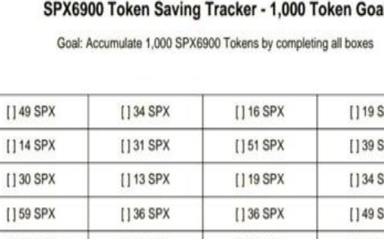

134

<!-- page: 135 -->

---
# Apêndice D: Rastreador da Meta SPX 10.000

## **Rastreador de Economia de Tokens SPX6900 - Meta de 10.000 Tokens**
**Meta: Acumular 10.000 tokens SPX6900 completando todas as caixas**

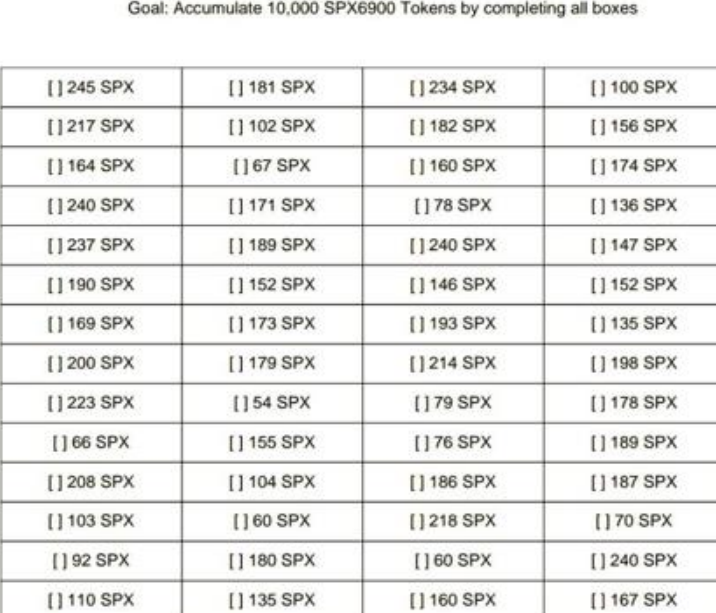

135

<!-- page: 136 -->

---
# Apêndice E: Gráficos de Crescimento das Criptomoedas

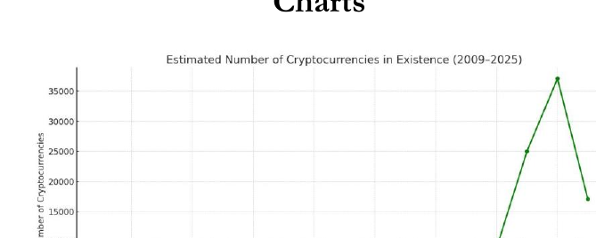

*(Fig. 1.11 – Crescimento estimado das criptomoedas desde 2009)*

O número de criptomoedas criadas é, na verdade, muito maior do que o mostrado na Fig. 1.11, já que ela apenas estima as criptomoedas listadas em sites de acompanhamento como [CoinMarketCap](https://example.com/placeholder) e [CoinGecko](https://example.com/placeholder). Não leva em consideração os milhares de tokens criados diariamente por meio de launchpads — muitas vezes sem necessidade de conhecimento em programação — que são negociados em exchanges descentralizadas (DEXs).

136

<!-- page: 137 -->

---
O motivo pelo qual o número de criptomoedas parece cair de mais de 35.000 para 17.000 não é porque menos tokens estão sendo criados, mas sim porque muitos são removidos desses sites de monitoramento após serem considerados inativos.

Essa queda normalmente ocorre porque os tokens deixam de existir — seja por golpes de saída (rug pulls), projetos abandonados (comum entre muitos utility tokens), fraudes ou outros motivos — o que inevitavelmente leva a volume de negociação zero.

Vale lembrar que esses dados nem sequer incluem todos os tokens mortos que nunca chegaram a ser listados nos sites de monitoramento e existiram somente em DEXs.

Essa redução simplesmente evidencia a alta taxa de mortalidade dos projetos cripto e ilustra o quão fácil é criar um token — mas quão difícil é replicar uma comunidade. Como resultado, muitos tokens não conseguem sobreviver nem mesmo a um único ciclo de mercado.

É por isso que a força e a cultura de uma comunidade são coisas raras, e também por isso que uma comunidade como a SPX6900 (comunidade SPX6900) é tão especial, única e importante dentro do universo cripto.

137

<!-- page: 138 -->

(Fig 1.12 – Total de Criptomoedas Criadas vs Ativas Desde 2009)

A Fig. 1.12 é um gráfico de linhas duplas que ilustra o número total de criptomoedas criadas em comparação com aquelas que permanecem ativamente listadas em sites de monitoramento. A linha azul representa o total criado, enquanto a linha laranja mostra as moedas ativamente listadas.

O número total de lançamentos de criptomoedas continua a crescer, enquanto o número de moedas ativamente listadas cresce mais lentamente e pode diminuir à medida que projetos mortos são removidos da listagem.

138

<!-- page: 139 -->

---
## Apêndice F: Frases de Fogo dos Aeons (Aeon – entidade de SPX6900)

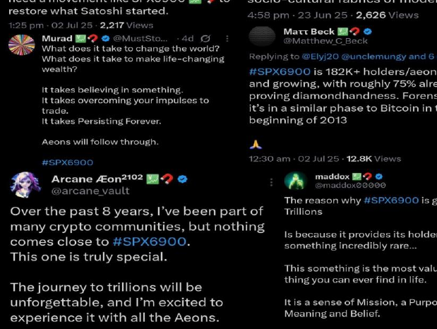

139

<!-- page: 140 -->

---
## Apêndice G: Entendendo os Ciclos de Alta das Criptomoedas

*(Fig 2.1 – Preços Máximos dos Ciclos de Alta do Bitcoin)*

Desde o surgimento do Bitcoin em 2009, ocorreram vários grandes ciclos de alta das criptomoedas. Os ciclos de alta são períodos em que o mercado entra em forte valorização, com o Bitcoin atingindo novos recordes históricos, seguido pelo mercado das altcoins.

140

<!-- page: 141 -->

---
Os ciclos de mercado geralmente seguem este padrão:

**Halving do Bitcoin → Mercado de alta → Pico → Queda → Mercado de baixa → Era de acumulação → Repetição**

Aproximadamente a cada quatro anos, as recompensas que os mineradores de Bitcoin recebem por operar o hardware que valida transações de Bitcoin são reduzidas pela metade. Esse evento é conhecido como o halving do Bitcoin.

Historicamente, o mercado de alta ocorre após o evento de halving do Bitcoin (Fig. 2.1):

- O halving do Bitcoin ocorreu em 2012, seguido por um mercado de alta em 2013, quando o Bitcoin ultrapassou $1.000, vindo depois uma queda de 85%.

- O halving do Bitcoin ocorreu em 2016, seguido por um mercado de alta em 2017, quando o Bitcoin chegou perto de $20.000, vindo depois uma queda para $3.000.

- O halving do Bitcoin ocorreu em 2020, seguido por um mercado de alta em 2021, quando o Bitcoin atingiu um recorde histórico de quase $69.000, vindo depois uma queda para cerca de $17.000.

141

<!-- page: 142 -->

---
- O Bitcoin também passou por um halving em 2024, e agora estamos em 2025, onde o Bitcoin (até 10 de julho de 2025) atingiu até agora um recorde histórico de US$ 113.804, com o ciclo de alta ainda em andamento (Fig. 2.2).

(Fig 2.2 – Michael Saylor projeta Bitcoin a US$ 440.000 em 2025)

142

<!-- page: 143 -->

---
O principal catalisador por trás desses ciclos de alta não é o próprio evento de halving do Bitcoin, mas sim as taxas de juros baixas e a alta liquidez decorrentes de uma política monetária frouxa, que moldam o apetite por risco de todo o mercado (Fig. 2.3).

(Fig 2.3 – Preço do Bitcoin vs Taxas de Juros do Fed)

Na Fig. 2.3, é possível ver que as taxas de juros do Fed estavam próximas de 0% em 2013 e 2021, períodos em que o Bitcoin ultrapassou US$ 1.000 e US$ 69.000, respectivamente. Em 2017, as taxas ainda eram relativamente baixas, apesar de terem aumentado de 0,5% para 1,5%, com

143

<!-- page: 144 -->

---
Bitcoin atingindo quase US$ 20.000. Mesmo com as taxas atuais do Fed estando altas — em torno de 4,50% — cresce a especulação sobre uma possível flexibilização e uma mudança para cortes de juros. A expectativa de cortes nas taxas ainda pode impulsionar o mercado cripto, o que pode explicar por que o Bitcoin continua com bom desempenho.

O Bitcoin e as criptomoedas em geral são ativos sensíveis à liquidez. Eles prosperam em períodos de juros baixos ou em queda, já que os investidores buscam alternativas mais arriscadas para se proteger da desvalorização das moedas fiduciárias.

Esse dinheiro tende a fluir para o Bitcoin, aumentando seu valor, e depois migra para o mercado de altcoins — oferecendo retornos sobre investimento muito mais elevados. Esse fenômeno é conhecido como “altseason” (Fig. 2.4).

144

<!-- page: 145 -->

(Fig 2.4 – Altseason: ciclos de alta das altcoins)

No ciclo de alta das criptomoedas previsto para 2025, espera-se que as memecoins superem drasticamente todas as outras criptomoedas (Fig. 2.5). Esse fenômeno é conhecido como superciclo das memecoins, no qual a liquidez, o hype, o FOMO (medo de perder uma oportunidade) e a especulação impulsionam os preços das memecoins de forma significativa, fazendo com que elas se destaquem em relação ao restante do mercado. No entanto, apenas algumas poucas

145

<!-- page: 146 -->

---
Espera-se que as memecoins registrem ganhos substanciais — mas não todas.

(Fig 2.5 – Previsão do Superciclo das Memecoins)

146

<!-- page: 147 -->

---
SPX6900 é um pure belief asset (ativo de pura crença, ou seja, seu valor é sustentado unicamente pela fé da comunidade), classificado como um memecoin, que tem grande expectativa de se destacar em um superciclo de memecoins. Isso se deve à sua cultura, comunidade forte e missão bem definida. No entanto, 99% dos memecoins acabarão por despencar ou perder todo o valor.

Isso não significa que o SPX6900 não possa passar por uma correção acentuada após um topo explosivo e uma queda mais ampla do mercado, incluindo o Bitcoin. O SPX6900 também deve corrigir junto com o mercado. Mesmo assim, é provável que ele se mantenha melhor do que 99% dos memecoins caso entremos em um mercado de baixa prolongado.

Essa resiliência se deve ao fato do SPX6900 ser um ativo de múltiplos ciclos, sustentado por uma missão e uma comunidade de cultura forte. Assim, durante o ciclo de baixa — enquanto a maioria dos memecoins deixa de existir e some no esquecimento — o SPX6900 provavelmente estabelecerá fundos mais altos e consolidará, já que a comunidade continua acumulando a longo prazo, de olho no próximo topo explosivo. Isso se assemelha ao desempenho do Bitcoin ilustrado na Fig. 2.1, atingindo topos cada vez mais altos ao longo do tempo.

Espero um desempenho semelhante do pure belief asset (ativo de pura crença) SPX6900 no longo prazo — **prosperando nos ciclos de alta e sobrevivendo aos mercados de baixa.**

147

<!-- page: 148 -->

---
# Apêndice H: Checklist para Novatos no SPX6900

**Checklist para Novatos no SPX6900**

*“Ninguém virá nos salvar. Temos que nos salvar sozinhos.”*

## 1. Oriente-se

- ☐ 🔍 Leia todo este e-book com atenção.
- ☐ Entenda o que é o SPX6900: **A Pure Belief Asset (um Ativo de Crença Pura)** baseado em comunidade, convicção e cultura.
- ☐ Saiba qual é a missão: **Flip the stock market (Vire o mercado de ações, um detentor por vez.)**

148

<!-- page: 149 -->

---
**2. Junte-se ao Movimento**

- 💬 Fale com a pessoa que compartilhou este e-book com você.  
- 🐦 Crie uma conta no **X (Twitter)** e siga os [Aeons recomendados neste e-book](https://example.com/placeholder) (Aeons - personagem/conceito técnico do SPX6900).  
- 🏢 Entre para a comunidade no **Telegram, Reddit** e **X.**  
  Tire dúvidas. Participe. Aprenda.

**3. Faça Sua Própria Pesquisa (DYOR)**

- 📖 Assista a todos os vídeos recomendados na seção [“Outros Recursos”](https://example.com/placeholder).  
- 📈 Entenda os riscos e as recompensas. Estude a tokenomics, a convicção da comunidade e a cultura.  
- ⚠️ Aceite a volatilidade, abrace a visão de longo prazo.

149

<!-- page: 150 -->

---
---
#### 4. Proteja-se

- 🛡️ Aprenda o básico sobre segurança em criptomoedas.
- Decida entre custódia em corretora ou autocustódia (recomendado).
- 🔑 Se optar pela autocustódia: configure uma carteira segura, faça backup da sua frase-semente e proteja suas chaves privadas.

#### 5. Comece a Acumular

- 🐦 Comece a fazer **Dollar Cost Averaging (DCA)** em SPX6900 usando apenas dinheiro que esteja disposto a perder.
- 🎯 Defina uma **meta mínima** (ex.: 1.000 SPX) e utilize o [SPX Token Saving Tracker](https://example.com/placeholder) para alcançá-la.
- 🕰️ Seja consistente. Tempo no mercado > tentar acertar o momento do mercado.

#### 6. Torne-se um Contribuidor

- 🔊 Compartilhe sua crença, sua história ou por que SPX6900 é importante para você.

150

<!-- page: 151 -->

---
- ☐ 🎥 Crie conteúdo, posts ou vídeos para espalhar a mensagem.
- ☐ Ajude a receber novos membros e responder perguntas.
- ☐ 🪴 Respeite e promova a cultura — é isso que sustenta e faz o movimento crescer.

### 7. **Mantenha o Foco**

- ☐ ⭕ Evite ficar acompanhando gráficos e fazendo trades.
- ☐ 🏛️ Confie na cultura e na comunidade.
- ☐ 🗓️ Pense no longo prazo. Convicção cresce com o tempo.

### 8. **Lembre-se da Filosofia**

- ☐ 💬 “stop trading and believe in something” (pare de operar e acredite em algo).
- ☐ 🔁 A utilidade está na cultura da comunidade e na convicção dos holders.
- ☐ 🔥 SPX6900 sobrevive e prospera graças a **você**, não por causa de um dev ou de uma equipe.

151

<!-- page: 152 -->

---
## Agradecimentos

Quero expressar minha gratidão às pessoas e à comunidade que ajudaram a moldar não só este e-book, mas também minha convicção sobre o que o SPX6900 realmente representa.

**Ao Chiron** e **Raiden**, obrigado pela ajuda na revisão deste e-book e pelo feedback inestimável.

**Ao Murad**, seus insights e clareza sobre o investimento em meme tokens foram uma revelação. Sua capacidade de cortar o ruído e articular a verdadeira proposta de valor dos memecoins me trouxe a perspectiva que faltava todos esses anos. Seu trabalho me fez entender que, às vezes, os investimentos mais poderosos não são construídos em cima de produtos, mas sim de pessoas e convicção.

**A todos os Aeons** (Aeons: membros da comunidade SPX6900) na comunidade SPX6900 — muito obrigado. Sua energia incansável, criatividade e consistência na divulgação da mensagem pelas redes sociais e até na vida real não são nada menos do que inspiradoras. Ver vocês trabalhando arduamente "for your bag" (para o seu próprio objetivo) não se trata apenas de lucros — é

152

<!-- page: 153 -->

---
sobre convicção de base e um movimento impulsionado pela crença.

Este e-book é apenas uma pequena contribuição para a grande onda que todos vocês estão construindo dia após dia.

Com respeito,

*— Audacious*

153

<!-- page: 154 -->

---
## Sobre o Autor

Não sou consultor financeiro. Não sou influenciador. Sou apenas alguém que já passou por dois ciclos de cripto, cometeu erros e aprendeu da maneira mais difícil como navegar neste mercado.

Descobri o Bitcoin em 2013 mas, por ignorância, acabei deixando de lado em favor das altcoins. Achei que já era tarde demais — o Bitcoin já estava na casa das centenas de dólares — então corri atrás do que eu acreditava serem alternativas “subvalorizadas”. Passei anos depositando minha convicção em projetos de altcoins de longo prazo construídos em torno de discursos sobre utilidade, que dependiam de equipes ou empresas cumprindo as promessas feitas em seus whitepapers, esperando pela adoção pelo mercado em seguida.

Apesar de ter tido algum sucesso inicial com certas escolhas, a enorme maioria fracassou. A maioria das equipes não cumpriu seus cronogramas e, mesmo quando cumpriam, os projetos raramente conseguiam uma adoção significativa. Acabei percebendo que a única força real sustentando os preços desses tokens era a especulação — comunidades esperando que um dia a utilidade de fato importasse.

**154**

154

<!-- page: 155 -->

---
Com o tempo, testemunhei em primeira mão a ascensão e queda desses utility tokens. Vi comunidades se desfazendo, gráficos desabando e carteiras indo junto, à medida que ficava claro que o produto jamais chegaria ou ganharia tração. Cheguei até a descobrir SHIB cedo — mas ignorei, descartando como apenas mais um memecoin sem utilidade. Outro erro.

O que não consegui compreender durante a maior parte da minha jornada foi isto: a utilidade não era o valor. A comunidade era.

Em 2024, voltei minha atenção para os memecoins — não como piada ou tendência passageira, mas como uma força séria e em evolução dentro do cripto. Como muitos, comecei cavando — comprando tokens de baixa capitalização na esperança de ganhos rápidos. Na maior parte do tempo, só perdi dinheiro fazendo isso.

Foi então que me deparei com a tese de Murad sobre memecoins, e ela fez todo sentido para mim. Anos de experiência em altcoins utilitários e especulação em memecoins de baixa capitalização haviam me preparado para essa clareza: o futuro pertence às comunidades de alta convicção e em crescimento. Essa clareza me levou ao SPX6900 (SPX6900, nome não traduzido).

O SPX6900 (SPX6900, nome não traduzido) teve um impacto diferente. Após horas pesquisando, refletindo e ouvindo as vozes dentro da comunidade, enxerguei algo único. Algo poderoso. Algo

155

<!-- page: 156 -->

isso me lembrou os primórdios do Bitcoin — só que desta vez, eu prestei atenção.

Este e-book é o resultado de incontáveis horas imerso na comunidade SPX6900. Não é aconselhamento financeiro — é um roteiro filosófico onde **a crença é o valor** e **a comunidade é a utilidade**.

Este e-book não é sobre promover um token. Trata-se de algo mais profundo: o poder das pessoas se unirem por uma convicção compartilhada. E, neste momento, SPX6900 é uma das expressões mais importantes dessa energia.

Escrevi isto como um manifesto — para aqueles que desistiram de negociar, cansaram de esperar que equipes entreguem utilidade, e finalmente estão prontos para **começar a acreditar**.

156

<!-- page: 157 -->

Ninguém virá te salvar.

Estamos tentando te ajudar.

# ESTUDE SPX6900.

O tempo é precioso!

O mercado de ações já teve seu momento.  
Agora é a nossa vez.

157

