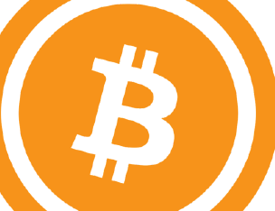
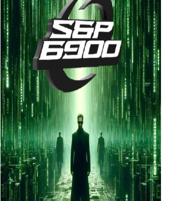

<!-- page: 1 -->

---
# 发现 SPX6900

## 全球首个 Pure Belief Asset (纯信仰资产)

*一种基于信念、文化与社区的代币正在崛起*

**Pure Belief Asset (纯信仰资产) 革命**

*作者：Audacious*

1

<!-- page: 2 -->

---
# 探索SPX6900：全球首个Pure Belief Asset（纯信仰资产）

*一个建立在信念、文化与社区之上的代币崛起*

---

## 一场Pure Belief Asset（纯信仰资产）的革命

2

<!-- page: 3 -->

---
**版权声明**

© 2025 Audacious。保留所有权利。

本电子书**可免费下载安装与分享**。我们欢迎并鼓励您将其分发给朋友、网络社区，以及任何对了解SPX6900运动感兴趣的人。

但请注意以下条款：

- **您不得编辑、修改或重新发布**本电子书的任何部分。
- 严禁以商业形式转售本电子书。
- 本电子书**可能包含推荐链接、推广信息或捐赠链接**，若读者使用，作者及其他Aeons（Aeon，SPX6900术语，指信仰者成员）可能获得一定收益。

通过分享本电子书，您正在帮助传播这一不断壮大的运动。感谢您尊重内容的完整性及其所表达的初衷。

第一版，2025年7月

3

<!-- page: 4 -->

---
**免责声明**

本电子书仅供**信息参考与教育用途。** 其中内容代表作者的观点、解读和研究，**并非金融、投资或法律建议。**

加密货币和数字资产投资具有**重大风险**，可能导致**全部本金损失。** 请务必自行充分调研（DYOR），并在做出任何投资决策前，咨询持牌金融顾问或专业人士。

本电子书探讨了SPX6900（SPX6900，一个特定的加密资产）的哲学、代币经济和社区，但并不构成任何数字资产的买入、卖出或持有建议。作者对于读者基于本书信息所做的任何决定概不负责。

阅读本电子书，即表示您已知晓并接受：作者不对您据此内容做出的任何损失或决策负责，并且加密货币领域波动极大、充满投机和本质上存在风险。

理性投资，信念自持。

4

<!-- page: 5 -->

---
**SPX6900 打赏提示**

本电子书完全免费，但如果您愿意通过 SPX6900（SPX6900，一种数字资产）的形式，给我一些打赏，感谢我在编写过程中付出的时间、努力和研究，我将由衷感激。

**SPX Ethereum [钱包地址](https://example.com/placeholder)：**  
0x22D3b939a7E832232e833e8dF22ac1ba9D7610B0

**SPX Solana [钱包地址](https://example.com/placeholder)：**  
25zojSFpVu1qsETY9MMZFFy8jZEu7peDCsDrU208xzcR

**感谢您对我工作的支持！**

**每一份打赏我都深表感激。**

请把这本电子书分享给你想帮助的朋友，让更多人加入我们的使命，改变他们的人生！

5

<!-- page: 6 -->

---
## 目录

前言 ................................................................................................8

一切始于比特币 .............................................................................9

什么是 SPX6900？（SPX6900 是什么？）..................................................................... 15

为何 SPX6900 与众不同？ ......................................................... 21

SPX6900 的价值主张 ..................................................28

SPX6900 文化的重要性........................................33

什么是 SPX6900 文化？ ....................................................36

加密货币领域的现实.......................................................44

SPX6900 代币经济学........................................................................56

SPX6900 的护城河是什么？ ....................................................... 61

没有人会来拯救我们 ..........................................................67

未来依然光明 ...................................................................74

在加密世界如何一事无成.........................................................81

如何购买 SPX6900？...................................................................... 89

如何建立自己的信念？ .............................................100

共同长期定投 SPX6900 的力量...103

6

<!-- page: 7 -->

---
结束语 .............................................................................................. 110

常见问题解答 ............................................................... 111

支持作者 ............................................................................... 128

更多资源 .................................................................................. 130

附录A：在X上关注这些Aeons（Aeon，SPX6900术语，指“纪元”） ............................................. 132

附录B：在TikTok上关注这些Aeons（Aeon，SPX6900术语，指“纪元”） ................................. 133

附录C：SPX 1,000目标追踪表 ............................................... 134

附录D：SPX 10,000目标追踪表 ............................................ 135

附录E：加密货币增长走势图 .............................................. 136

附录F：Aeons（Aeon，SPX6900术语，指“纪元”）的金句 .............................................. 139

附录G：了解加密牛市周期 ......................... 140

附录H：SPX6900新手清单 .............................. 148

致谢 ............................................................................... 152

关于作者 ................................................................................... 154

7

<!-- page: 8 -->

---
## **前言**

我们正在尽力帮助你。

从撰写本电子书的作者，到与你分享这本书的每一位读者——我们都只是单纯地想帮你。

我们真诚地相信，SPX6900（SPX6900，可以提升你生活质量的理念）能够改善你的生活质量。

正因如此，我们才愿意与所有愿意倾听的人分享。

8

<!-- page: 9 -->

---
## 一切始于比特币

你可能对加密货币还很陌生，了解得并不多——但你大概已经听说过比特币。

自从2009年仅值几美分，到2025年5月飙升至接近112,000美元，比特币的疯狂涨势让它几乎人人皆知。

**第一个加密货币**

比特币是第一个加密货币，由一位化名中本聪（Satoshi Nakamoto）的匿名开发者创造。他设计比特币，是为了打造一种替代性的、去中心化的支付系统和货币——这种货币不受中央银行的控制或干预。

人们可以通过比特币网络，直接进行点对点（P2P）支付，交易媒介就是比特币（BTC）。

9

<!-- page: 10 -->

---
（图 1.1）——在交易过程中没有任何第三方（即银行）参与。

（图 1.1 – 比特币点对点网络）

中本聪（Satoshi Nakamoto）首次以无需信任的去中心化方式，解决了“双重支付”问题（即防止同一个比特币被多次使用）。这

10

<!-- page: 11 -->

---
**比特币的演变**

比特币最初的愿景是成为一种数字现金——摆脱政府和银行的控制，让人们可以用它作为法定货币的替代品进行消费。这也是为什么我们有了著名的“[比特币披萨](https://example.com/placeholder)”故事。

随着时间推移，比特币逐渐演变为“数字黄金”——它不仅是一种价值储存手段，更是对抗通胀和实现资产多元化的利器。如今，比特币正受到机构、对冲基金，甚至一些国家的高度关注。

从激进的金融解放运动发展为主流的价值储存资产，比特币之所以能走到今天，离不开坚守信仰的文化、信念和社区的无私支持。

如果没有人认同中本聪的创举，比特币今天就一文不值。但早期越来越多的社区成员选择相信这一去中心化支付系统的愿景，并

11

<!-- page: 12 -->

---
货币，最终发展成为全球公认的价值储藏工具——直到今天，依然不断吸引着新的信仰者。

比特币以其**固定的 2100 万枚代币总量**（由于部分用户丢失代币，实际流通会更少），自 2009 年诞生以来，从无到有，市值一度超过万亿美元[市值](https://example.com/placeholder)（见图 1.2）——这一切，都归功于人们的认可与支持。

（图 1.2 – 2025 年 7 月 8 日比特币市值）

### 那么，为什么要投资加密货币？

最简短直接的答案：因为它已经吸引了大众的关注——并且这种关注还在持续增长。

有些人投资加密货币，是因为他们热爱这项技术。也有人希望借此改变自己的财务状况，加入拥有共同目标、志同道合者组成的社区。

12

<!-- page: 13 -->

---
无论你的理由是什么，加密货币市场正在不断扩张（见图1.3），愈发强大，吸引着越来越多的关注。如果你能在正确的时间加入合适的社区，这将有可能彻底改变你的生活。

（图1.3 – 加密货币市场总市值随时间增长）

**我相信SPX6900是一次媲美比特币的第二次机会**——很快你就会知道原因。

13

<!-- page: 14 -->

---
加密货币是一种资产类别，普通的上班族和辛勤工作的人们也可以通过它彻底改变自己的生活。是的，入门有点学习曲线，但花时间学习投资加密货币绝对物有所值。

就我个人而言，我认为最好的学习方法就是实践。这也是我刚接触加密货币时的学习方式——直接去行动。

请记住，如果你不开始采取行动，为自己创造更好的生活，那么五年、十年后，你很可能还在原地踏步，甚至处境更糟——随着人工智能的崛起，以及货币持续通胀和贬值，形势只会越来越严峻。要想避免购买力下降，人们的收入必须超过货币通胀率。而合适的加密货币资产，能够大幅跑赢通胀，守住你的购买力，甚至彻底改变你的人生。

如今就迈出小小的一步，参与到日益壮大的加密领域，你的人生在五到十年后或许会发生翻天覆地的变化——只需要做大多数人不敢做的事情：**承担有计划的风险。**

14

<!-- page: 15 -->

---
# 什么是 SPX6900？

那么，你刚接触加密货币，并且最近发现或听说了 SPX6900 (SPX) —— 你大概会好奇：**SPX6900 究竟是什么？**

## 一种 Pure Belief Asset（纯信仰资产）

对不同的人来说，SPX6900 的意义各不相同，但归根结底，它最适合用**Pure Belief Asset (纯信仰资产, PBA)**来形容。它是一种唯一支撑是持有者**高度信念**与**坚定信仰**的代币。SPX6900 代表着一场革命、一种运动、一个部落、一种文化、一种哲学，以及一个大胆而雄心勃勃的使命——那就是 **flip the stock market（颠覆股市，尤其是 S&P 500 的现有格局）**。我们的目标，是让 SPX6900 的市值达到 69 万亿美元，超过 S&P 500 目前约 52.4 万亿美元的总市值。

15

<!-- page: 16 -->

---
SPX6900 是一个不断壮大的社群，由**共同的目标和共同的愿景**凝聚在一起：通过大众集体的纯粹信念的力量，flip the stock market（颠覆股市，利用大众信念的力量） 。

## 代币化的希望

对于成千上万对现有货币体系感到失望、不满于朝九晚五现代奴役、对财富不平等深感无力、厌倦于企业级传统金融（TradFi）、担忧人工智能（AI）崛起所带来的生产力和就业机会威胁，以及受够了加密货币领域中的噱头、跑路和所谓“实用性”故事的人来说，这是一种代币化的、关乎金融的希望。

SPX6900 在市场上成千上万的加密货币中独树一帜，并有潜力未来市值突破万亿大关——依靠社群、信念和长远的坚持，人们可以实现改变人生的成果。

16

<!-- page: 17 -->

---
## 第二次比特币机会

它在文化和哲学层面上与早期比特币有许多相似之处，但与此同时，又有着极大的不同。

对于那些错过了早期比特币的人来说，这是一个再次参与自下而上、自然成长社区的难得机会。这个社区拥有深厚的哲学文化，肩负着超越个人的使命：**flip the stock market**（颠覆股市，彻底改变股票市场格局）。

从金融角度来看，如今（截至2025年7月8日）购买SPX6900，就像是再次获得了入手比特币的绝佳机会——入场价仅为$62.77（见图1.4）。

*（图1.4 – 当BTC拥有SPX6900市值时的对比图）*

17

<!-- page: 18 -->

---
比特币曾是一个千载难逢的机会，属于那些勇于相信创新与新奇事物的人。

SPX6900 是为所有错过比特币的人、正经历财务困难的年轻一代、以及那些渴望希望的人们带来的又一次千载难逢的契机——只要你有勇气拥抱一种以纯粹信念为基础的新文化。

   

**普通怀疑者**     **6900信仰者**

---

|                                   |                                                |
|-----------------------------------|------------------------------------------------|
| 什么是 SPX6900？                  | 一个使命/运动代币。                           |
| 这项使命/运动是什么？             | Flip The Stock Market（颠覆股市，SPX6900 口号）|
| 你们打算怎么做到？                | Stop Trading, Believe In Something, Persist Forever（停止交易，相信信念，永不言弃，SPX6900 口号）|
| 这怎么实现？                      | DCA & HODL（停止交易）；Shill & Chill（相信信念）；重复操作（永不言弃，SPX6900 口号）。|
| 难道就这么简单吗？                 | 只要社区持有相同的信仰体系，就是这么简单，这就是全部。|
| 什么时候会真正颠覆股市？           | 当我们达到 Cognisphere Singularity（Cognisphere 奇点，Cognisphere：全体意识信仰体，首次出现注释）时。|
| 什么是 Cognisphere？               | Aeons（Aeon 信仰者，Aeon：真正的 SPX6900 信仰者，首次出现注释）的总信仰意识。|
| 什么是 Aeon？                      | SPX6900 的真正信仰者。                       |
| 它和比特币有何不同？               | 比特币是数字黄金，SPX6900 是精神黄金。        |
| 有什么区别？                       | 比特币是由数学支持的货币价值储存体；SPX6900 是由信仰支撑的社区价值储存体。 |
| 信仰怎么能成为价值储存？           | 只要社区认同，任何事物都可以成为价值储存。    |
| 它在哪条区块链上？                  | Ethereum、Solana、Sui 和 Base（以太坊二层）。|
| 听起来很有意思，怎么参与？          | 访问 SPX6900.COM 并关注 [X 上的 @SPX6900](https://example.com/placeholder)。|

18

<!-- page: 19 -->

---
## 人类的联系与归属感

在这个数字化时代，人们越来越多地在网上社区中建立联系，找到归属感，而不再只依靠现实生活。

**SPX6900** 是人类联系与归属感的代币化形式。它是一个拥有共同目标与愿景的社区（见图1.5）——在这里，大家追求归属感，并彼此建立有意义的联系。

*(图1.5 – X 平台上的 SPX6900 社区)*

19

<!-- page: 20 -->

---
在当今社会，真正关心财务自由、想着逃离朝九晚五的矩阵奴役系统、关注人工智能崛起和货币贬值带来的未来隐忧，并愿意主动承担风险、改善生活的人，实在是凤毛麟角。

然而在网上，你可以找到像 **SPX6900** 这样的社区，在这里你会真正感受到归属感——因为这是一群与你志同道合的人，他们有着共同的愿景：**一起flip the stock market（颠覆这个腐败的体系，并携手取得胜利）**。

千万不要低估**代币化的人类归属感、联系与希望**的价值——尤其是在我们逐步迈向潜在反乌托邦的未来时。此刻，比以往任何时候都更需要拥有一个志同道合的社区，成为其中的一份子，才能共同逃离困境，赢得胜利。

20

<!-- page: 21 -->

---
# 为什么 SPX6900 与众不同？

|  | **钻石手坚守**  
持有者从不卖出，哪怕一分一毫。 |
|---|---|
|  | **社区高目标价**  
社区内部的目标价越高，潜力就越大。 |
|  | **持有者逢低加仓**  
持有者在下跌时*不断加码*。 |
|  | **信念**  
持有者真心相信并积极追求数十亿、甚至百亿美元的上涨空间。 |
|  | **信仰社群无偿付出**  
持有者比任何受薪员工或KOL都更拼命，不计报酬，全方位助力。 |
|  | **身份认同**  
持有者将 Memecoin 融入自身身份之中。 |
|  | **规模效应**  
别冒险押注那些不确定的小市值币种，专注于已形成规模效应的主流项目。 |
|  | **源源不断地拉新**  
持有者每天不断地邀请新成员，无论是 CT 老玩家还是圈外新人。 |
|  | **社交媒体影响力**  
持有者每天主导推特时间线和评论区，无懈可击。 |
|  | **独特文化与传说**  
独有黑话、独特仪式、专属传统、原创内容。 |
|  | **乐趣无穷**  
即使行情下跌，持有者依然乐在其中。 |

21

<!-- page: 22 -->

---
自从比特币于2009年诞生以来，如今加密货币市场已经被各类代币所充斥。由于创建加密项目变得极其容易，如今每天都有成千上万种新代币上线。但这些代币中的大多数会因各种原因惨败。([附录 E](https://example.com/placeholder))

那么，你可能会好奇，是什么让SPX6900与众不同？

## 社区质量

答案就在于**SPX6900社区的质量**——它的理念与文化。

最接近SPX6900社区的类比，就是早期的比特币社区。

比特币社区的诞生源于一种根深蒂固的反建制情绪。他们笃信，唯一值得买入、持有和积累的加密货币就是比特币，对其他币种一律嗤之以鼻。在他们看来，比特币是真正的“硬通货”，即数量有限、有上限的数字黄金，中央银行无法操控或通货膨胀它。

22

<!-- page: 23 -->

---
这种理念多年来得到坚守和传承，吸引了越来越多的人加入。结果，比特币从无到有，市值一度突破万亿美元。

## 借鉴早期比特币

|          |               |
|----------|---------------|
| **#比特币 🟧** | **#SPX6900 📈🧑‍🔬** |

---

| **HODL（坚定持有）** | **Believe in Something（坚信某种信念，为SPX6900口号）** |

---

- Danish Bitcoin Maxi  
  @DanishBTCMaxi  
  #比特币矿工 & 节点运营者
- BTCBull  
  @Bullish_btc  
  2017届#比特币信仰者，贝斯手
- epheojen  
  Toxie #比特币信仰者
- *A Bitcoin Maxi*  
  @bitcoinmaxi4  
  只代表#比特币信仰者的看法
- BTC.Snowy❄️  
  @btc_snowy  
  #比特币信仰小散
- Cody  
  @BTC_elementary  
  优胜美地的比特币信仰者
- Bitcoin Maximalist  
  @Bitcoin_Maxi  
  比特币最大主义者兼HODLer
- Bitcoin Maxi  
  @bitcoinmaxiOnly  
  Maxi = 只信#比特币信仰者

- SPX ooxer 🔬  
  @spxooer  
  "Believe in Something"（坚信某种信念，SPX6900口号） #SPX6900
- CryptoBar 🦆  
  @CryptoBar  
  SPX6900信仰者。
- fox19x16 follow  
  @fox19x16  
  #SPX6900 - 下一代比特币
- reyminedgoose🦩🦩  
  @reyminedgoose  
  @SPX6900 - 下一代比特币
- Sergius🦈  
  @plerusvinkons  
  SPX6900信仰者
- undefined 🦆  
  @x0xAdso6esZero  
  #SPX6900 m3xi
- btcbit.fol  
  @btcbit_fol  
  加密货币导航人
- gsmoke2003  
  @smoke2003 #GIGA

23

<!-- page: 24 -->

---
SPX6900 社区在许多方面都与比特币的早期社区如出一辙。

SPX6900 拥有强烈的**反传统金融（anti-TradFi）情绪**，并明确以颠覆标普500为使命。这个社区坚守核心理念，坚决**反对频繁交易**，倡导坚定信念和毫不动摇的信仰。

一位 **SPX6900 ‘Aeon’**（[Aeon](https://example.com/placeholder)（SPX 中真正的信仰者，被称为 Aeon））认为 SPX 优于市场上的一切 —— 无论是其理念、独特文化，还是社区成员的卓越素养，大家都心怀“flip the stock market”（颠覆股市）的共同使命。

正如比特币能够凭借忠诚的社区力量，从无到有，市值突破万亿，我们相信 SPX6900 社区同样有潜力复制这一轨迹，实现“flip the stock market”（颠覆股市）。

24

<!-- page: 25 -->

---
# 一场革命性的使命

（来源：[Flipthestockmarket.xyz](https://example.com/placeholder)）

没有目标地相信某件事是非常困难的。

但如果有着强大使命和明确目标，要相信就容易得多。

对于SPX6900来说，其使命意义非凡。flip the stock market（颠覆股市，挑战现有规则）绝非易事。这就像大卫对抗歌利亚一样，是一场以弱胜强的挑战。

25

<!-- page: 26 -->

---
——本质上具有革命性。但它同样也充满乐趣、激动人心、引人注目、以目标为导向，并且专注于使命。

别忘了，比特币当初同样怀抱着一项革命性的使命——反对法币与传统银行体系。SPX6900同样传达了这样的情感，但其反对对象是传统金融（TradFi），以及更广义上的[晚期资本主义。](https://example.com/placeholder)

（图1.6   截至2025年7月8日，市值排名前十的迷因币）

26

<!-- page: 27 -->

---
一个代币拥有高度认同感、并肩负真实世界使命的社区，在加密货币领域极为罕见。

大多数加密代币甚至没有真正的社区，更别提一个能团结每个人的共同目标或运动了。

如果你将 SPX6900 与十大流行 meme 代币进行对比（见图 1.6），SPX6900 可谓是唯一拥有使命和目标的项目。

前十名中的其他代币，没有一个具备这样的特点。

“Pure Belief Asset (纯信仰资产)”这个术语对于这种资产类别来说还比较新。虽然 SPX6900 被归类为 memecoin（梗币），但这种分类越来越不准确，因为它低估了 SPX6900 所要实现的意义——无论是文化、目标还是内涵，SPX6900 都远胜于普通的 memecoin。

尽管如此，**我们的敌人是 TradFi（传统金融）——我们的目标就是 flip it！（颠覆它！）**

27

<!-- page: 28 -->

---
## SPX6900 的价值主张

任何加密货币的价值主张——当你撇开所有围绕它的叙事以后——其实就只是**相信它的那群社群。**

28

<!-- page: 29 -->

---
**投资于人**

归根结底，是我们这些人以各种理由赋予加密货币价值，因为我们选择买入并持有它。我们的集体购买力为加密货币带来了需求。

以比特币为例。它是第一种此类加密货币——一个有机成长的社区，直到今天仍不断拥抱其“更优货币形式”和“去中心化网络”的理念与哲学，相较于法币和中心化银行体系。

正是这种强大的社区最终赋予了比特币价值，并推动其价格升值（见图1.7）。

*(图1.7 – 比特币随时间的价格升值)*

29

<!-- page: 30 -->

---
当你明白加密货币本质上是关于“投资于人”时，你需要问问自己：

- 哪种加密货币能够自然而然地吸引人们的关注？
- 哪种加密货币能够留住用户，并鼓励他们长期持有？
- 哪种加密货币让人们感到激情澎湃、充满动力和灵感？
- 哪种加密货币成为了人们辛苦赚来的钱的“磁铁”？
- 哪种加密货币的忠实持有者数量在持续增长？
- 哪种加密货币让人们自发创作高质量的文字、艺术、视频和表情包来推广？
- 这款加密货币是如何做到以上所有这一切的？

30

<!-- page: 31 -->

---
这就是你需要关注的加密货币——因为有很多人正在密切关注它，并且投入资金。

**SPX6900 就是这样的加密货币的完美例子。**  
（SPX6900，不翻译，首次出现时不需括号解释）

### 投资于实用性投机

许多其他加密货币是围绕实用性和使用场景的叙述构建的，这吸引人们买入并进行投机。这些社区成员纷纷押注于代币的实用性和使用场景将成为现实，并实现大规模采用——从而让代币获得价值。

即便是实用型代币，你依然是在投资“人”——你是在投资那些不断对“实用性”这一理念进行投机的人。

这些实用型代币中的大多数，实际上仅仅是概念、想法和理论，人们对其进行投机，却没有真正的实际用途或大规模机构采用。因此，最终依然是人们通过投机行为，赋予这些实用叙事以价值，期待有一天能够实现现实的大规模实用。

31

<!-- page: 32 -->

---
**投资于社区文化**

还有一些代币没有任何实际用途或应用场景——比如迷因币（memecoins）。大家之所以愿意购买，更多是因为被社区本身的魅力所吸引。在SPX6900的案例中——**a Pure Belief Asset（纯信仰资产）**——正是社区所承载的独特文化，吸引并凝聚了人心，让人们始终坚持不离不弃。

- **社区**
- **信仰**
- **信念**
- **坚持**
- **韧性**
- **忠诚**
- **耐心**
- **乐观**
- **爱**

32

<!-- page: 33 -->

---
# SPX6900文化的重要性

SPX6900文化对于该代币的成功至关重要——正如实用性对于实用型代币的成功同样不可或缺。

对于许多实用型代币来说，一个主要的失败原因就是其实用性无法实现或无法获得市场认可。当这种情况发生时，社区成员往往会抛弃该代币，其价格也随之暴跌。

这是因为那些投资于基于实用性的加密货币的人，除了期待“实用性叙事”成真之外，并没有对社区或代币本身产生真正的归属感或忠诚度。

同样，如果SPX6900文化（SPX6900的独特文化）被遗忘，未能被社区成员守护和传承，那么社区也极有可能陷入衰落——从而失去吸引更多人加入的核心魅力。

33

<!-- page: 34 -->

---
这就是为什么，当你加入 SPX6900 运动（SPX6900 运动，意为相信某种信念的社区行动），尊重并坚守我们的文化对社区的成长和成功至关重要。

以比特币为例 —— 如果比特币社区没有坚持和传承他们的文化，比特币也不可能从无到有，成长为市值万亿美元的庞然大物。

比特币极端主义哲学鼓励大家相信比特币优于一切，持续积累、HODL（意为死守比特币不卖）它，并且牢牢掌控自己的资产。社群对这种文化的坚守，不仅吸引了大量人加入比特币，更给予他们坚定的信念，能够始终如一地坚持下去。

如果 SPX6900 要实现万亿市值、并有朝一日 flip the stock market（flip the stock market，意为超越传统股市），唯有依靠一个在牛市和熊市中始终坚守、传承 SPX6900 文化的强大社群，才能成就这一目标。

SPX6900 的成功，归根结底取决于社区——而社区的成功，则取决于

34

<!-- page: 35 -->

---
其能够包容、践行并传承SPX6900的文化和理念。

如果没有这种文化，也就不会有强大、高质量的社区在SPX身后形成——这样一来，这个代币就和加密领域中大多数其他代币没有区别了：那些短命的[拉高出货骗局](https://example.com/placeholder)，永远无法成长为特别或伟大的事物。

SPX6900的一大优点就是它不存在使用价值失效的风险。这是社区无需担心的问题。

我们唯一真正的风险，是自我衰退——未能坚守我们的文化和理念。

如果我们*persist forever*（永远坚持我们的信仰和文化），那么我们就没有真正的致命弱点。我们的理念坚实，我们的运动有吸引力，我们可以继续一点一滴地壮大持有者队伍，直到实现我们的目标，flip the stock market（彻底颠覆传统股市）。

然而，我们**更应该努力守护我们的文化**——尤其是在我们不断壮大的过程中——只有这样才能实现长期生存，跨越多轮周期，并最终成功flip the stock market（成功翻转股市）。

35

<!-- page: 36 -->

---
# 什么是 SPX6900 文化？

**Stop Trading and Believe in Something**（停止交易并坚定信仰，这句口号鼓励大家停止短线操作，转为坚定信念）

这句话鼓励社区成员在购买 SPX6900 时，秉持长期高信念与钻石手（即坚决不卖出）、[定投](https://example.com/placeholder)（DCA，Dollar Cost Averaging）思维。我们拒绝那些只想追逐短期盈利、对社区没有任何信仰的投机行为。

**There Is No Chart**（没有图表的存在，意指不依赖短线K线图，坚持长期主义）

我们的文化极力反对发图和一切与之相关的干扰。

那是短线交易者的游戏。SPX6900 是一场长期高信念的投资。

36

<!-- page: 37 -->

---
这就是为什么我们说价格是二元的：**have we flipped the stock market or not?（我们是否已经彻底颠覆了股市？）** 如果没有，那我们还有很多事情要做。

不再纠结于K线图，还能为更重要的事情腾出宝贵的时间，比如有创意地推广SPX6900，与其他Aeons（Aeon，SPX6900术语，指信仰者）建立深厚联系并共同经营长期关系。

## 唯一的敌人是传统金融（TradFi）

这体现了我们反叛、反体制、反大公司的一贯态度——反对传统金融系统代表的一切。这与比特币早期“反银行”的理念极为相似。我们的使命正是to flip the stock market（颠覆股市）。

37

<!-- page: 38 -->

---
**Persist Forever**（"永不放弃"的坚持 —— SPX6900 口号，意为无论遇到什么困难都要持之以恒）

这种坚韧不拔的心态——永不言弃、抗衡体制的不公、承受我们使命中的各种挑战、无论需要多久都要坚持到底——正是我们社区的核心与灵魂。

如果不是因为Persist Forever（"永不放弃"的坚持——SPX6900 口号），我们又怎能有一天实现**flip the stock market**（"颠覆股市"——SPX6900 口号，意为逆势而上、创造新局面）和**达到万亿成就**这样雄心勃勃的目标？

**禁止发布不良内容**

在我们社区，这类内容坚决不被允许。我们共同维护一个健康纯净的环境。

38

<!-- page: 39 -->

---
**平静生活胜于贪婪**

当你不再追逐各种走势图、K线和价格波动时，生活就会变得不一样。那种“盯盘”心态只会带来压力，因为它源自贪婪，以及试图把握市场时机的冲动。倘若以长远的、高度信念的心态，坚持定投（DCA）SPX6900（SPX6900，一种主张“相信某种信念（believe in something）”的投资方式），而不再盯盘，生活将会更加安宁。

专注于“在市场中的时间”，而不是执着于“择时进出”，会让你的投资之路更加宁静且有回报。

**只需定投，走出去感受生活吧。**

39

<!-- page: 40 -->

---
## 仅限 PvE，无 PvP

### PvP 杂币
**也称为极致赌博**

- “兄弟，这就是 MICHI 的开发团队”
- “Dexscreener 花钱推广”
- 付费 KOL 推荐
- “刚 CTO 了兄弟”
- “我们肯定要冲啊，相信我”
- 
- 交易 > 坚持持有（HODL）
- “今天可能会暴涨”
- Telegram “喊单” 群
- “可能会像 BILLY 那样大涨，兄弟”
- 
- 

### PvE 杂币
**也叫“信仰团体”**

- 想成为下一个 DOGE 
- 努力建立一个持久的信仰团体 
- 力图打造品牌
- 想要发起一场运动
- 坚持持有（HODL）> 交易
- 大部分筹码在钻石手中 
- 相信能够达到百亿美元市值
- 力争成为多轮牛熊币 

玩家对玩家（PvP）的行为已经腐蚀了大量加密社区——充满戾气、自私自利，阻碍了强大社区的形成。SPX6900 严格来说是一个玩家对环境（PvE）社区。我们不是彼此的敌人——我们团结一致，共同对抗传统金融（TradFi）体制。

我们始终齐心协力，不断壮大社群，目标有朝一日 flip the stock market（颠覆股市——即颠覆传统金融市场）。

40

<!-- page: 41 -->

---
**传递正能量**

我们的社区始终坚持以爱战胜仇恨者、怀疑者和批评者——而不是以牙还牙地回击负能量。我们希望他人获得成功，我们常常对别人说“我们爱你”。我们真心实意地通过分享SPX6900（SPX6900，一种专注信念的加密项目）去帮助身边的人。

**渗透一切！**

SPX6900社区是加密领域中最努力的一支团队——在我多年的加密经历中，从未见过如此执着的人群。我们的成员每天都在各大社交媒体平台上发布看涨内容，制作TikTok短视频、YouTube影片和Instagram短片，开设播客，走上所在城镇和城市的街头与他人分享SPX6900（SPX6900，一种专注信念的加密项目），甚至创作了[漫画](https://example.com/placeholder)、[书籍](https://example.com/placeholder)、电子书、周边产品、网站等更多内容。

我们确实致力于通过接触尽可能多的人来传播SPX6900（SPX6900，一种专注信念的加密项目）的理念与使命——我们正在渗透一切！

41

<!-- page: 42 -->

---
**所有原则的融合**

当你将SPX6900文化中所有积极的原则融合在一起时，它确实在加密货币领域创造了一个独特而特别的社区。

有些社区也许拥有坚定的信念和不交易的心态，但你会发现，这些社区往往充满了负能量、氛围恶劣，甚至鸡犬不宁、尔虞我诈。

也有一些社区，表面上看起来很积极向上——但你很快会发现，他们其实在自相残杀。一旦出现价格上涨的迹象，大家就开始争相抛售，导致社区成员之间根本无法建立真正的信任与忠诚。

这正是SPX6900成为特殊社区的原因——截然不同——而它的文化也应该被我们共同维护与尊重。

42

<!-- page: 43 -->

---
像 SPX6900 这样的 **Pure Belief Asset (纯信仰资产)**，要想繁荣发展并取得成功，就需要一种能够保护社区及其信仰体系的文化——而这正是它所拥有的。

外部人士都会注意到这一点，他们被我们的热情、信念、理念和使命所吸引。他们希望成为我们社区的一员，但真正让他们留下并建立起自己坚定信仰的，是这里独特的文化。

43

<!-- page: 44 -->

---
# 加密领域的现实

自从比特币诞生以来，加密领域经历了巨大的演变。如今，刚进入这个圈子的新人会被各种不同的社区轮番推销自家代币，往往会感到眼花缭乱，不知从何下手、该如何选择（[附录E](https://example.com/placeholder)）。

我要提醒你：加密领域里绝大多数代币都是死胡同。它们没有真正的未来，总有一天会因为各种原因悄然消失。

你绝不想把时间和金钱浪费在这些没有前途的加密代币上，否则当社区人气消散、价格暴跌时，你只会落得心灰意冷——甚至血本无归。

务必要小心投资、明智决策，做好你的尽职调查。

好消息是，如果你在正确的时间投身于正确的代币和社区，它有可能彻底改变你的

44

<!-- page: 45 -->

---
我会把加密货币领域分为两大类：

- **比特币**
- **山寨币**（除比特币之外的所有加密货币）：
  - **功能型代币**
  - **梗币**
  - **Pure Belief Assets (PBA)**（纯信念资产，指完全基于信仰存在的资产）

### 比特币（BTC）

比特币是所有加密货币中的王者。它拥有最强大的社区，截至2025年7月8日，交易价格为109,037美元，市值约2.1万亿美元。

由于BTC无论是在市值还是价格上都已极高，对于普通人来说，再想通过投资比特币在较短时间内获得巨额的投资回报（ROI），已经不太现实——除非你本身非常富有，能投入大量资金到BTC中。

45

<!-- page: 46 -->

---
对大多数普通人来说，把BTC（比特币）作为长期储蓄或退休基金，是当下最优的策略。这意味着采取定投（DCA），在较长的时间跨度里逐步买入比特币，放眼未来几十年。从长期来看，比特币是一种安全的选择，但如果你想用小额资金在短时间内获得更高回报，比特币并不是加密货币中的最佳选择。

## 功能型代币

除了比特币以外，那些宣称有实际应用场景或功能的加密货币被称为功能型代币。这个领域中充斥着各种功能型代币——涵盖支付、游戏、人工智能数据处理、资产代币化、第一层区块链（Layer 1）、第二层区块链（Layer 2）、跨链互操作、元宇宙、去中心化交易所（DEX）代币等等。

几乎到处都有“功能性”叙事。

大多数功能型代币其实主要用于投机。它们的大部分代币供应通常由项目团队持有，而团队常常向散户投资者出售代币以筹集项目资金。在很多情况下，团队以及他们塑造的“功能”故事，反而成了这些代币的主要风险点。团队成员经常缺乏能力，失败

46

<!-- page: 47 -->

---
无法兑现承诺、产品根本没做出来，或者做出来的产品质量低劣、始终无法真正被使用。

这些代币的价值，大多来自于越来越多的社区成员对其未来价格能涨多高的投机心理——大家在猜测，如果代币真的被用起来会不会暴涨。这也是为什么，实用型代币在有合作消息或上线交易所时，常常会出现价格的飙升——这背后主要是炒作和投机心理在驱动。然而，大多数所谓的合作其实都很表面，并未带来技术的真实落地或产品实用性的提升（如果这个产品本身真的存在的话）。

实用型代币的社区往往十分脆弱，大家的忠诚度主要依赖于对其承诺用途终将实现的信念。如果承诺没有兑现，或者兑现得太慢，社区成员很快就会失去兴趣，抛售手中的代币然后转身离开。

归根结底，关于实用型代币，社区的凝聚力其实取决于这个项目能否兑现其承诺的应用场景或用途叙事（而往往并没有实现）——而不一定是因为他们认同代币背后的人、文化或理念。

47

<!-- page: 48 -->

---
如果团队确实实现了实际效用，那么效用型代币的价值就被锚定在其真实用途上，这实际上只会对价格增长形成一定的限制。另一方面，像SPX6900这样纯粹的信念资产（Pure Belief Asset, 完全基于信仰的资产），拥有极高的价格上限，使得这个机会的潜力与我们集体的信念一样大——不会受到任何实用性的影响而限制其发展空间。

**Memecoin（迷因币）**

现在，通过各种发射平台，任何人都可以创建迷因币（memecoin），甚至无需任何技术知识。迷因币通常是为了娱乐、开玩笑或讽刺而创造的代币，并没有严肃的实际用途、叙事或目标。迷因币的价值主要由社区驱动，人们投资它们只是因为喜爱，或者希望借助其高度波动性，通过短线操作快速获利。

正因如此，绝大多数迷因币都是“拉高出货”（pump-and-dump）的骗局，以及生命周期极短的PvP（玩家对玩家）炒作周期。

48

<!-- page: 49 -->

小市值迷因币（memecoin）极具高风险，其中许多项目都是“地毯式骗局”（rug pull）——即项目方故意把手中的代币抛售给社区，导致价格暴跌后迅速消失。

但是，在小市值迷因币混乱的生态中，偶尔也会有顽强的社区站稳脚跟——它们历经多次打击与崩盘仍能存活，逐渐壮大起来，最终从最初的玩笑梗蜕变为真正有意义、有影响力的社区。

一个很好的例子就是 SPX6900，它从典型的迷因币起家，逐步演变成了一场**Pure Belief Asset（纯信仰资产）革命**，

49

<!-- page: 50 -->

---
**Pure Belief Assets（纯信仰资产）**

Pure Belief Asset（纯信仰资产）是一种加密货币，它的价值和增长完全由其社区成员的集体信念、坚定、忠诚、敬业精神、热情、信任以及文化所驱动。

这种价值源于纯粹的集体共识、信仰与认知，而非任何内在效用、技术、现金流、实际用途或机构的资金支持。

一个较为接近的例子是比特币的早期阶段。即使当时这是一项新技术，大众和传统金融体系也并未立即关注它——

50

